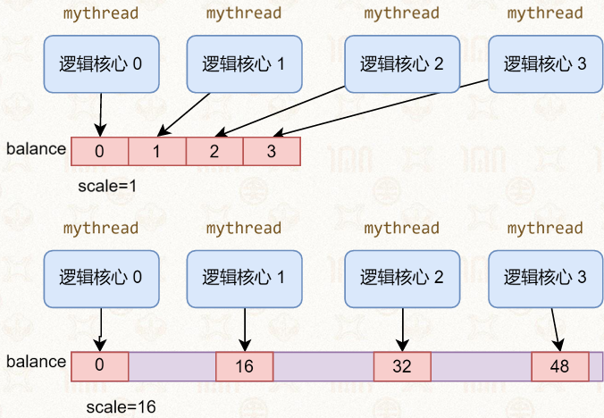

# 半程回顾：操作系统与冯·诺依曼架构的对应
### 第一层对应（基础原理）
| 冯·诺依曼组件 | 对应操作系统知识点 |
|--------------|--------------------|
| 计算（CPU） | 进程管理、同步原语 |
| 存储（存储器） | 内存管理 |
| 通讯（数据交换） | 进程间通信 |

### 第二层对应（更准确的划分）
| 冯·诺依曼组件 | 对应操作系统知识点 |
|--------------|--------------------|
| 计算 | 操作系统调度、进程间通信 |
| 存储 | 文件系统（持久化存储） |
| 通讯 | 进程间通信 |

### 第三层对应（进阶内容，期末不出大题）
| 冯·诺依曼组件 | 对应操作系统知识点 |
|--------------|--------------------|
| 计算 | 多核与多处理器、网络协议栈、轻量级虚拟化、系统调测 |
| 存储 | 文件系统崩溃一致性、系统虚拟化 |
| 通讯 | 设备管理、系统虚拟化、网络协议栈、操作系统安全、系统调测 |

# 进程虚拟地址空间隔离与内存管理核心机制的区分
**多个进程在内存中互不干扰的环境下运行，操作系统是通过（）来实现的**
- A 内存分配
- B 内存保护
- C 内存扩充
- D 地址映射
> 答案：D
> 原因：地址映射是实现进程独立虚拟地址空间的根本机制，从底层彻底隔离了不同进程的内存访问，这是 “互不干扰” 的本质

# CPU缓存行与伪共享对多线程写入性能的影响
**题目：多线程代码中每个线程对balance数组对应下标的元素循环自增，在scale分别为1和16时，程序运行时间有没有很大差别，为什么？**
```c
int num_threads = 4;
int scale = 1;
int size = 200000000;
int* balance;

void *mythread(void *arg) {
    int tid = *(int *)(arg);
    // tid = 0,1,2,3...
    tid *= scale;

    for (int i = 0; i < size; i++) {
        balance[tid]++;
    }

    printf("Balance is % d\n", balance[tid]);
    return NULL;
}

int main(int argc, char *argv[]) {
    balance = (int*) malloc(num_threads * sizeof(int) * scale);
    // 以下代码是启动num_threads个线程运行mythread，然后记录整体运行时间
}
```


> 答案：有很大差别，scale=1时运行更慢，scale=16时运行更快
> 原因：CPU缓存以固定大小的缓存行（通常64字节）为最小管理单位。scale=1时，4个线程操作的数组元素在内存中紧密相邻，会落在同一个缓存行内；多核心同时写入同一缓存行的不同数据会触发伪共享，缓存一致性协议会导致缓存行频繁失效与来回同步，产生大量性能开销。scale=16时，每个线程操作的元素间隔16个int（共64字节），各自独占一个缓存行，彻底消除了伪共享，缓存无需频繁同步，因此运行速度显著更快。


# 结构体内存布局与伪共享的写入性能对比
**题目：左右两段代码均为两个线程分别写入结构体的a、b变量，右侧结构体在a和b之间插入64字节填充数组，两段代码谁跑得更快？**
- A 左边快
- B 都差不多
- C 右边快
#### 左侧代码
```c
int size = 200000000;
struct {
    int a; // thread_0
    int b; // thread_1
    char c[64];
} data;

void *thread_0(void *arg) {
    for(int i = 0; i < size; i++) {
        data.a = 0;
    }
}
void *thread_1(void *arg) {
    for(int i = 0; i < size; i++) {
        data.b = 1;
    }
}
```

#### 右侧代码
```c
int size = 200000000;
struct {
    int a; // thread_0
    char c[64];
    int b; // thread_1
} data;

void *thread_0(void *arg) {
    for(int i = 0; i < size; i++) {
        data.a = 0;
    }
}
void *thread_1(void *arg) {
    for(int i = 0; i < size; i++) {
        data.b = 1;
    }
}
```
> 答案：C 右边快
> 原因：左侧结构体中a、b两个变量内存相邻，会被加载到同一个CPU缓存行。两个线程在不同核心分别写入两个变量时，会产生伪共享，缓存行频繁失效同步，性能下降。右侧通过64字节填充让a、b分属不同缓存行，避免了伪共享问题，因此右侧代码运行更快。

# 主题：伪共享场景下的多线程读取性能对比
**题目：左右两段代码均为两个线程分别读取结构体的a、b变量，右侧结构体在a和b之间插入64字节填充数组，两段代码谁跑得更快？**
- A 左边快
- B 都差不多
- C 右边快
#### 左侧代码
```c
struct {
    int a; // thread_0
    int b; // thread_1
    char c[64];
} data;

void *thread_0(void *arg) {
    int result;
    for(int i = 0; i < size; i++) {
        result = data.a;
    }
}
void *thread_1(void *arg) {
    int result;
    for(int i = 0; i < size; i++) {
        result = data.b;
    }
}
```

#### 右侧代码
```c
struct {
    int a; // thread_0
    char c[64];
    int b; // thread_1
} data;

void *thread_0(void *arg) {
    int result;
    for(int i = 0; i < size; i++) {
        result = data.a;
    }
}
void *thread_1(void *arg) {
    int result;
    for(int i = 0; i < size; i++) {
        result = data.b;
    }
}
```
> 答案：A 左边快//实际运行差不多
> 原因：伪共享仅在存在写操作时才会触发性能损耗，两个线程均为只读操作时，缓存行处于共享状态，不会触发缓存失效。左侧结构体中a、b位于同一缓存行，一次缓存加载即可获取两个数据，空间局部性更好、缓存利用率更高。右侧填充后两个变量分属不同缓存行，占用更多缓存资源，反而降低了缓存效率，因此左边代码运行更快

