# 10章 多核与多处理器
[TOC]

## 10.1 多核性能问题

单核性能提升遭遇物理瓶颈后，多核架构成为提升系统算力的主流方案。但多核并非“免费的午餐”，核心数的增加并不意味着性能线性增长，反而会引入一系列性能可扩展性问题

本节从多核架构的背景出发，分析多核性能的理论上限、实际表现，以及多核环境下典型的性能陷阱。

### 10.1.1 多核系统的两类核心挑战

#### **正确性保证**

*   多个核心并行访问共享资源会产生竞争条件
*   需要同步原语保证数据一致性
*   同步原语本身又会引入死锁、活锁、优先级反转等新问题。

#### **性能保证**

*   多核硬件存在缓存一致性、非一致内存访问等特性
*   同步原语与数据布局的设计直接影响系统可扩展性
*   糟糕的实现会导致性能随核心数增加出现断崖式下跌
*   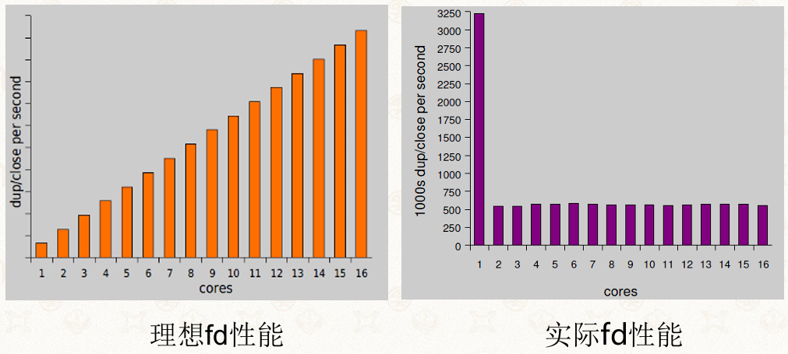

前面章节已详细讨论正确性问题，本章聚焦多核环境下的性能与可扩展性问题

### 10.1.2 并行加速比的理论上限：阿姆达尔定律

阿姆达尔定律是并行计算的基础理论，用于衡量多核并行的理论加速比上限，揭示了串行代码对整体性能的决定性作用。

#### 核心公式

$$
加速比 S = \frac{1}{(1-p) + \frac{p}{n}}
$$

其中：

*   $p$  ：程序中可以并行执行的代码占比

*   $n$  ：同时执行的CPU核心数量

*   极限情况：当核心数 $n$ 趋近于无穷大时，加速比上限为 $S_{max} = \frac{1}{1-p}$

    *   程序的串行部分决定了性能的绝对天花板
    *   可以并行部分占比越多，这个程序理论上最大加速比越大

#### 场景示例

*   **高并行场景**：对数组每个元素独立执行计算，串行部分少，加速比接近核心数

```c
// 几乎完全并行：每个元素的计算互不依赖
for(int i = 0; i < 100; i++) {
    a[i] = func(a[i], i);
}
```

*   **低并行场景**：递推计算，每个元素依赖前一个结果，几乎无法并行，加速比接近1

```c
// 串行程度高：每个元素依赖前一个的计算结果
for(int i = 1; i < 100; i++) {
    a[i] = func(a[i - 1], i);
}
```

### 10.1.3 自旋锁的可扩展性断崖

#### 概念

同步原语是影响多核性能可扩展性的最关键因素，其中普通自旋锁的表现最为极端，会出现**可扩展性断崖**：核心数增加到一定程度后，系统吞吐量不升反降，性能急剧恶化

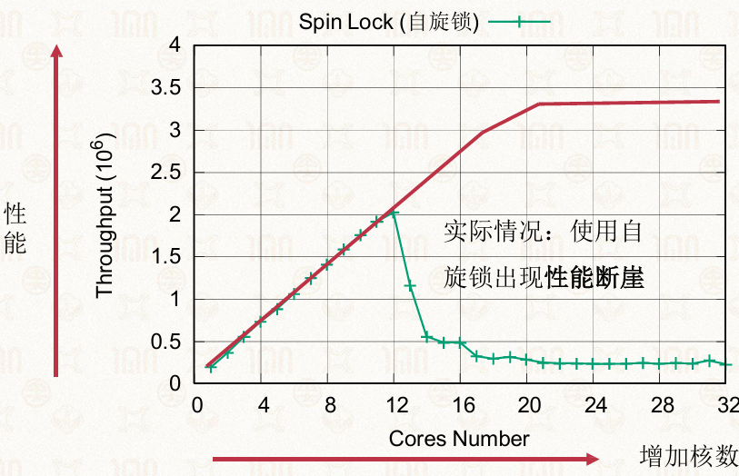

#### 微基准测试场景

测试代码：多个线程竞争同一把全局自旋锁，每次加锁后对共享计数器执行加1操作，随后解锁。

```c
unsigned long gcnt = 0;
struct lock *glock;
char shared_data[CACHE_LINE_SIZE];

void *thread_routine(void *arg) {
    while (1) {
        lock(glock);
        gcnt = gcnt + 1;
        visit_shared_data(shared_data, 1);
        unlock(glock);
        interval();
    }
}
```

#### 问题本质

普通自旋锁的性能断崖根源在于**对单一缓存行的高频竞争**：

*   所有核心都需要访问锁变量所在的同一个缓存行
*   每个核心的CAS原子操作都会触发缓存一致性协议，导致其他核心的对应缓存行失效
*   大量核心同时自旋等待时，会持续产生缓存失效请求，占用大量总线带宽
*   核心越多，竞争越激烈，总线通信开销呈指数级增长，最终整体性能不升反降

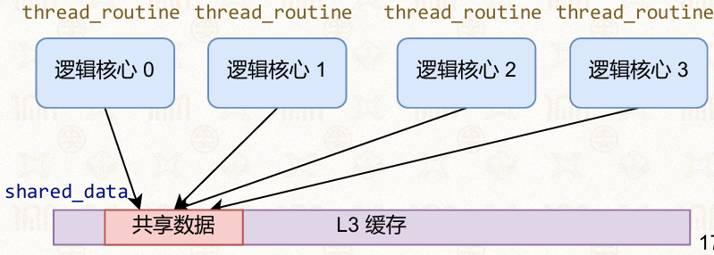

## 10.2 缓存一致性

多核架构下，每个CPU核心都拥有私有高速缓存，同一份物理内存数据会在多个核心的缓存中存在副本。当某个核心修改了本地缓存中的数据后，其他核心的对应副本就会变成过期数据，引发数据不一致问题。缓存一致性机制是多核硬件提供的基础保证，其目标是让不同核心对同一内存地址的数据达成共识，从硬件层面保障共享数据的正确性。

### 10.2.1 多核缓存架构与一致性挑战

#### 多核多级缓存结构

现代多核CPU普遍采用分层缓存设计

*   距离CPU越近速度越快、容量越小

*   读操作

    *   逐层向下找
    *   没找到从内存中读取，放到缓存中

*   写操作

    *   直写/写回策略
    *   写入高速缓存，替换时写回

#### 多核的简单解决方案和问题

**简单的解决方案**： 将多核当成一个核心，共享缓存设 计

**面临的问题**

*   高速缓存成为瓶颈，单点竞争
*   硬件不好分布，离核心远，速度减慢

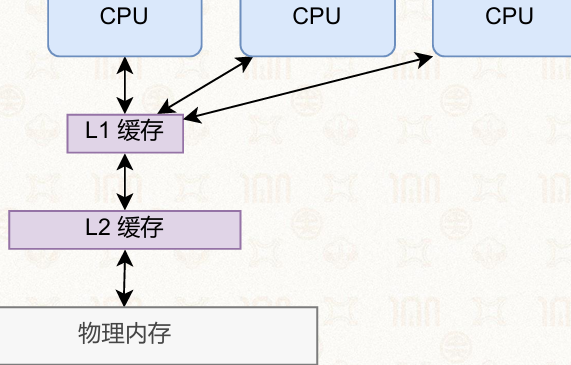

#### 多级缓存的结构

*   每个核心有自己的私有 高速缓存（L1 Cache）
*   多个核心共享一个二级 高速缓存（L2 Cache）
*   所有核心共享一个最末 级高速缓存（Last Level Cache, LLC）


#### 非一致缓存访问（NUCA）

在多核芯片中，不同核心访问同一 LLC 的不同物理区域延迟不同

*   离得近的快，离得远的慢

#### 缓存一致性问题的产生

同一个内存地址的数据可能被多个核心的私有缓存同时缓存，当某个核心修改该地址时，其他核心缓存中的旧值便失效

如果没有一致性保证，不同核心读取同一地址会得到不同的值，引发严重的数据错误

#### 缓存一致性协议核心思路

*   为每个缓存行标记状态
*   核心间通过通信协调状态迁移
*   所有读写操作严格遵循协议流程

#### 主流的缓存一致性协议

**窥探式协议**：所有核心监听总线广播

**目录式协议**：通过全局目录统一管理

### 10.2.2 MSI缓存一致性协议

#### 原理

以缓存行的三种核心状态命名，通过状态的动态迁移保证多核心间的数据一致性


#### 独占修改（Modified, M）

*   **含义**：该核心独占拥有此缓存行，且数据已被修改，与物理内存中的数据不一致

*   **本地权限**：可读可写，无需通知其他核心

*   **外部操作触发的状态迁移**：

    *   其他cpu读：本核心将数据写回内存，自身状态转为共享
    *   其他cpu写：本核心缓存行直接转为失效状态

#### 共享（Shared, S）

*   **含义**：可能有多个核心同时拥有此缓存行的有效副本，数据与物理内存一致

*   **本地权限**：仅可读，不可直接写入

*   **状态迁移**：

    *   本地cpu写：通知其他所有持有该缓存行的核心将副本置为失效，自身状态转为独占修改
    *   其他cpu写：本核心缓存行直接转为失效状态

#### 失效（Invalid, I）

*   **含义**：本地缓存行已失效，内容不可信，不能直接访问

*   **本地权限**：不可直接读写，必须先从内存或其他核心获取最新数据

*   **状态迁移**：

    *   本地cpu读：从内存或其他核心获取最新数据，状态转为共享

        *   需要迁移到共享，并使其他核的该缓存行迁移到共享

    *   本地cpu写：获取最新数据并通知其他核心失效副本，状态转为独占修改

#### **关键点**

*   M 状态是唯一允许写且不通知其他核的状态
*   从 M 迁移到 S 时需要将修改写回内存
*   从 S 写升级到 M 时必须先让所有其他核的拷贝失效

### 10.2.3 目录式缓存一致性

#### 概念

窥探式协议依赖所有核心监听总线广播，核心数量增多时总线通信开销会急剧上升

目录式协议通过全局共享目录统一管理所有缓存行的状态，是大规模多核系统的主流实现方案

**全局目录项**：记录缓存行在不同核上的状态，通过总线通讯

#### 全局目录项结构

系统为物理内存中的每一个缓存行维护一个目录项，存放在全局共享目录中，每个目录项包含两部分核心信息：

*   **脏位**：1位，标记该缓存行是否被修改过（是否处于独占修改状态）

*   **向量位（Bit Vector）**：二进制位向量

    *   记录缓存行的拥有者
    *   每一位对应一个CPU核心
    *   标记该核心是否拥有此缓存行的有效副本

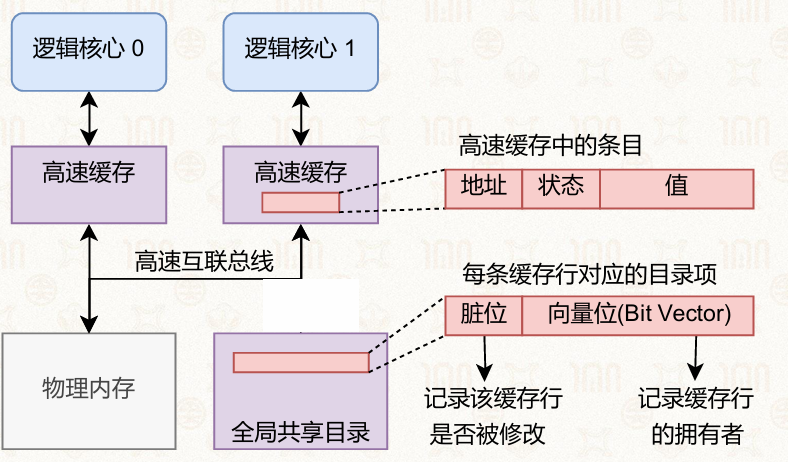

#### 写操作完整流程（示例：3个CPU，CPU0修改变量X）

**初始状态**：CPU0、CPU1、CPU2都缓存了X，状态均为共享；目录项脏位为0，向量位为`111`（三个CPU都持有副本）。

1.  CPU0发起写请求，向全局目录申请该缓存行的独占权限
2.  目录收到所有失效确认后，将脏位置为1，更新向量位为`100`（仅CPU0持有）
3.  目录收到请求后，查询向量位，得知CPU1、CPU2也持有该缓存行
4.  目录向CPU1、CPU2发送失效指令，要求它们将X对应的缓存行置为失效状态
5.  CPU1、CPU2执行失效操作，向目录回复确认，目录收到所有失效确认后，回复CPU0通知其可以独占修改
6.  CPU0收到授权后，将缓存行状态改为独占修改，执行写入操作

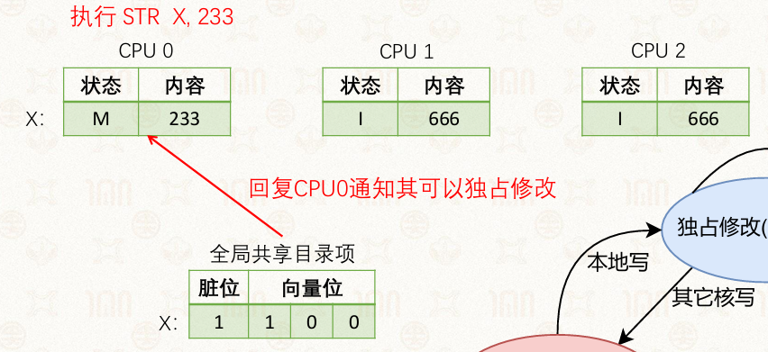

#### 读操作完整流程（示例：3个CPU，CPU0读取变量X，本地缓存已失效）

**初始状态**：CPU1独占持有X，状态为独占修改；CPU0、CPU2的缓存行已失效；目录项脏位为1，向量位为`010`

1.  CPU0发起读请求，向全局目录申请该缓存行的数据
2.  目录收到请求后，查询向量位，得知CPU1是当前唯一的持有者，且数据为脏
3.  目录向CPU1发送降级指令，要求其将缓存行从独占修改转为共享，并将最新数据发送给目录
4.  更新目录，并让拥有者给cpu0发送最新的值，迁移状态，向量位为`110`，脏位清零
5.  CPU1收到指令后，将最新数据发送给CPU0，自身缓存行状态改为共享，向目录回复确认，CPU0转共享

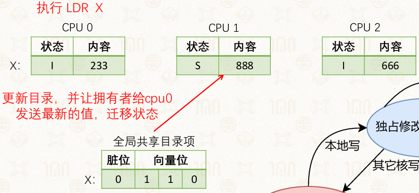

#### 目录式协议的特点

*   相比窥探式协议，避免了全总线广播，核心数量越多，通信效率优势越明显
*   全局目录本身会成为性能瓶颈，高并发下目录访问竞争会限制扩展性
*   整个一致性过程对上层软件完全透明，开发者感知不到协议的存在，但缓存行竞争带来的性能开销是真实存在的——这正是自旋锁出现可扩展性断崖的硬件根源

## 10.3 多核性能可扩展性

性能可扩展性指系统吞吐量随CPU核心数增长的提升能力，是衡量多核系统效率的核心指标

### 10.3.1 可扩展性低下的硬件根源

[10.1.3 自旋锁的可扩展性断崖](#1013-自旋锁的可扩展性断崖)

普通自旋锁的所有操作都围绕同一个全局锁变量展开，所有竞争线程都持续对该变量所在的缓存行执行写操作，这是导致性能崩溃的核心原因

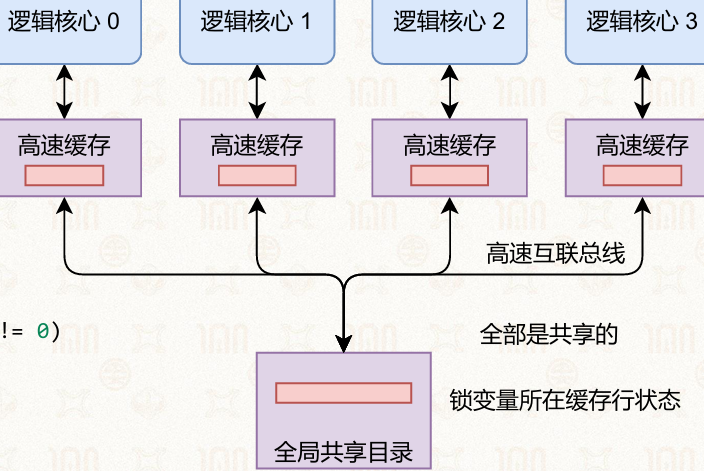

#### 自旋锁的竞争模型

```c
// 普通自旋锁实现
void lock(int *lock) {
    while (atomic_CAS(lock, 0, 1) != 0) ;// 原子比较并交换
     // 忙等（Busy-looping）
}

void unlock(int *lock) {
    *lock = 0;
}
```

*   所有核心都需要访问 `lock` 变量所在的缓存行

*   对单一缓存行的竞争导致严重的性能开销，产生大量的数据同步通讯

    *   每次CAS原子写操作都会触发缓存一致性协议，使其他所有核心的对应缓存行失效

*   等待线程持续循环执行CAS，相当于持续向总线发送缓存失效请求，将系统互联网络（总线/网状网络）塞满

### 10.3.2 回退锁（Back-off Lock）

#### 核心思路：降低锁的竞争频率

当线程获取锁失败后，主动等待一段时间再重试，减少单位时间内的CAS操作次数，缓解缓存一致性压力

#### 基础实现

```c
// 忙等待指定时间，cpu_relax降低功耗并提示CPU处于自旋状态
void back_off(int time) {
    for (volatile int i = 0; i < time; i++) {
        cpu_relax();
    }
}

void lock(int *lock) {
    while (atomic_CAS(lock, 0, 1) != 0) {
        back_off(DEFAULT_TIME); // 获取失败，回退等待
    }
}
```

#### 固定回退的缺陷

如果所有线程都使用固定的等待时间，会出现“同步重试”问题：

*   一批线程同时获取锁失败，同时开始等待，同时结束等待
*   等待结束后所有线程同时发起CAS请求，再次引发集中竞争，优化效果非常有限

#### 优化的回退策略

为了分散重试峰值，衍生出两种改进方案：

1.  **随机回退**：每次等待时间在一定范围内随机取值，避免线程同步重试，打散竞争峰值
2.  **指数回退**：每次失败后将等待时间翻倍，竞争越激烈等待越久，自适应地降低竞争频率

#### 优缺点

*   优点：实现简单，无需修改锁的核心结构，低竞争场景下开销极小。
*   局限性：没有从根本上解决问题，所有线程最终还是要竞争同一个全局缓存行，高并发下优化效果会逐渐饱和。

### 10.3.3 MCS锁

MCS锁是可扩展同步原语的经典里程碑，由Mellor-Crummey和Scott于1991年提出

#### 核心设计思想：将全局单点竞争转化为分布式队列等待

**思路**：在关键路径上避免对单一缓存行的高度竞争，从根本上消除单一缓存行的高频自旋竞争

#### 核心设计思路

*   每个申请锁的线程维护一个私有的队列节点，节点按缓存行对齐，各自占据独立的缓存行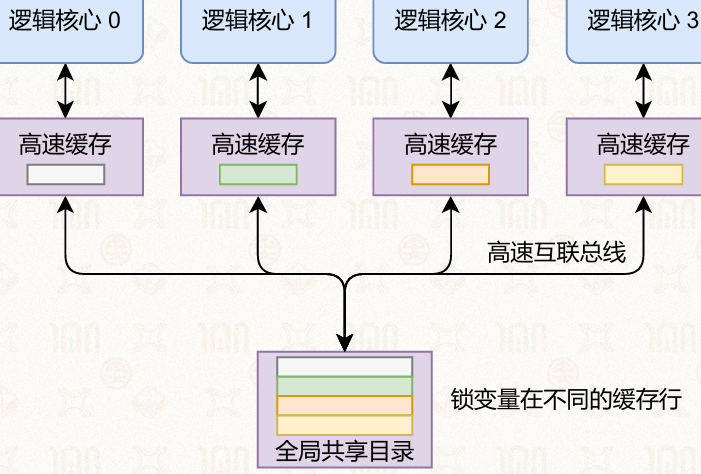

*   所有等待节点通过链表组成FIFO等待队列，全局锁仅维护一个队尾指针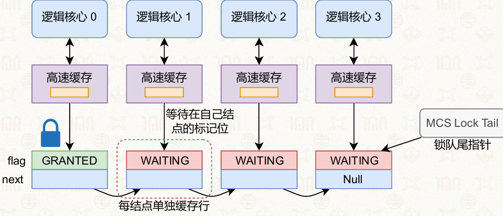

*   等待线程不再自旋全局锁变量，而是自旋在自己本地节点的标志位上，等待前一个线程释放锁时唤醒自己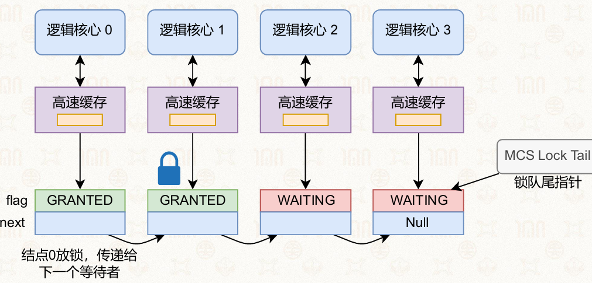

*   锁的传递沿队列依次进行，全程仅涉及两个节点的缓存行操作，不会触发全局缓存失效

#### 数据结构定义

```c
// 线程私有等待节点，按缓存行大小对齐，避免虚假共享
struct MCS_node {
    volatile struct MCS_node *next; // 指向后继节点
    volatile int flag;              // 锁授权标志
} __attribute__((aligned(CACHELINE_SZ)));

// 全局锁结构，仅维护队尾指针
struct MCS_lock {
    struct MCS_node *tail;
};

// 标志位常量
#define WAITING   0  // 等待中
#define GRANTED   1  // 已获得锁授权
```

#### 加锁操作

加锁通过原子交换指令`atomic_XCHG`实现，该指令原子地将新值写入目标地址，并返回旧值，一步完成队尾更新。

```c
void lock(struct MCS_lock *lock, struct MCS_node *me) {
    me->next = NULL;
    me->flag = WAITING;
    
    // 原子交换：将自己设为新队尾，获取旧队尾节点
    struct MCS_node *old_tail = atomic_XCHG(&lock->tail, me);
    
    if (old_tail != NULL) {
        // 队列非空：将自己链接到旧队尾之后
        old_tail->next = me;
        // 自旋等待本地flag被置为授权状态
        while (me->flag != GRANTED);
    }
    // 队列为空：直接获取锁成功
}
```

#### 解锁操作

解锁时将锁传递给队列中的下一个等待者，若没有后继则清空队尾。

```c
void unlock(struct MCS_lock *lock, struct MCS_node *me) {
    if (me->next == NULL) {
        // 暂无后继节点，尝试将队尾从自己置为空
        if (atomic_CAS(&lock->tail, me, NULL) == me) {
            return; // 队列已空，直接返回
        }
        // CAS失败：有新节点正在加入，等待后继指针设置完成
        while (me->next == NULL);
    }
    // 有后继节点：将锁授权传递给下一个节点
    me->next->flag = GRANTED;
}
```

#### 执行流程示例

1.  **新竞争者加入**：线程初始化本地节点，通过原子交换加入队列尾部，链接到前一个节点后，自旋等待本地标志位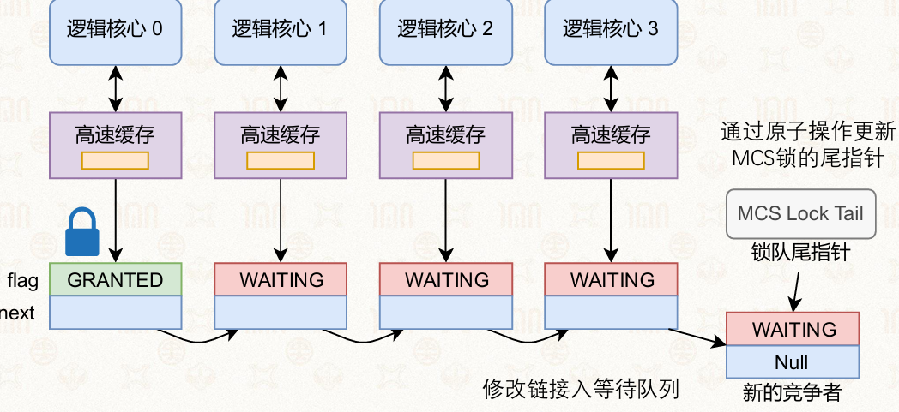

2.  **锁的传递**：持有锁的线程释放时，找到后继节点，将其标志位置为GRANTED，后继线程结束自旋，获得锁

#### 性能分析

*   **核心优势**：等待线程绝大多数时间仅读写自己本地的节点变量，各自在独立缓存行上自旋，不会触发全局缓存失效，消除了缓存失效风暴
*   **仅存的竞争点**：仅加入队列时的`atomic_XCHG`操作会竞争全局队尾指针的缓存行，且每个线程仅执行一次，竞争频率远低于普通自旋锁
*   **可扩展性表现**：核心数增长时，吞吐量下降平缓，不会出现断崖式下跌，在32核及以上的大规模系统中，性能远超普通自旋锁

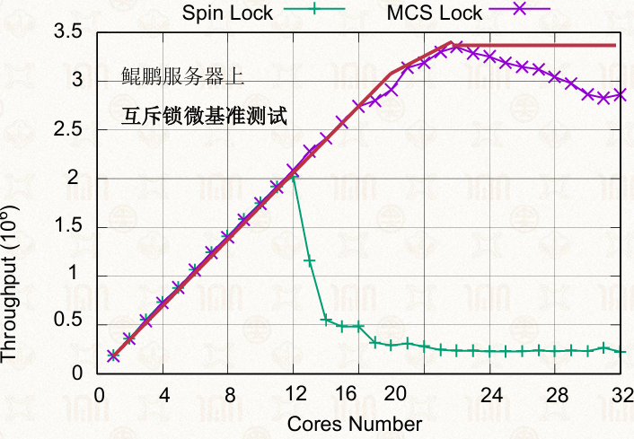

### 10.3.4 工业界实践：Linux QSpinlock

Linux内核中的队列自旋锁（Queue Spinlock, QSpinlock）是MCS思想的工业级优化，采用双路径设计兼顾低延迟与高可扩展性：

*   **快速路径**：锁竞争程度低时，使用类似普通自旋锁的设计，加锁解锁流程极简，延迟极低。
*   **慢速路径**：当检测到锁竞争激烈时，自动切换为类MCS的队列等待模式，保证高并发下的可扩展性

**优点**

*   **低延迟**：保留了轻量级锁的低延迟优势
*   **可扩展**：具备可扩展锁的高并发能力

### 10.3.5 对程序员的启发

1.  **避免单一缓存行的高频写入竞争**：尽量减少全局共享变量的写操作频率，将集中式竞争拆解为分布式、本地化的数据结构。
2.  **主动规避虚假共享**：多线程的私有数据、频繁修改的字段要注意缓存行对齐，避免无关变量落在同一缓存行中互相拖累。
3.  **数据结构设计适配硬件特性**：面对私有高速缓存硬件提供的正确性设计，设计并发数据结构时，将频繁写入的字段分散到不同缓存行，充分利用CPU缓存的本地性提升性能。
4.  **同步原语按需选择**：低竞争、临界区极短的场景适合普通自旋锁；高并发、核心数多的场景应优先选择可扩展锁。
5.  **对软件开发者透明**

## 10.4 虚假共享

### 10.4.1 基本定义

**虚假共享（False Sharing）** 是指多个CPU核心分别修改看似相互独立、逻辑上无关的变量，但由于这些变量被分配在**同一条缓存行（Cache Line，通常为64字节）** 内，导致缓存一致性协议频繁介入，引发缓存行不断失效和重载，从而造成严重的性能损耗和总线拥堵的现象

**核心矛盾**：共享的不是变量本身，而是变量所在的缓存行存储空间

### 10.4.2 产生原因

#### 硬件基础

*   **缓存行大小**：现代CPU缓存以缓存行（Cache Line）为最小传输单位，通常为 **64字节**
*   **内存分配特性**：程序在同一个页表内，经常连续分配内存空间，导致逻辑上独立的变量在物理地址上相邻

#### 典型场景示意

```c
double num[8];   // 8个double共64字节，正好占满一个缓存行
int a;
int b;
int c;           // 连续定义的整型变量极可能位于同一缓存行
```

*   `num[1]` 和 `num[7]` **必定位于同一个缓存行**（数组连续占用64字节）
*   全局或栈上连续定义的 `a`、`b`、`c` 也可能被编译器分配在同一缓存行内

当核心0修改 `num[1]`（或 `a`），而核心1修改 `num[7]`（或 `b`）时，尽管操作的是不同地址，但由于同属一个缓存行，缓存一致性协议（如MESI）会认为该缓存行已“变脏”，触发同步开销

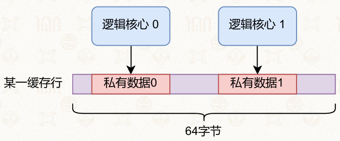

### 10.4.3 致命危害

**虚假共享在多核环境下是致命的**，具体表现为：

#### **无谓的缓存一致性同步通讯**

*   大量CPU时间浪费在总线仲裁和缓存同步的“内耗”上，而非有效计算

#### **可能发生写覆盖（数据竞争）**

*   虽然硬件保证最终一致性，但在并发编程中缺乏原子操作或锁保护时，频繁的缓存行失效会导致数据更新的可见性问题，甚至出现逻辑上的“写覆盖”异常

## 10.5 内存一致性铺垫：乱序执行（超纲）🌶

### 10.5.0 并行程序题

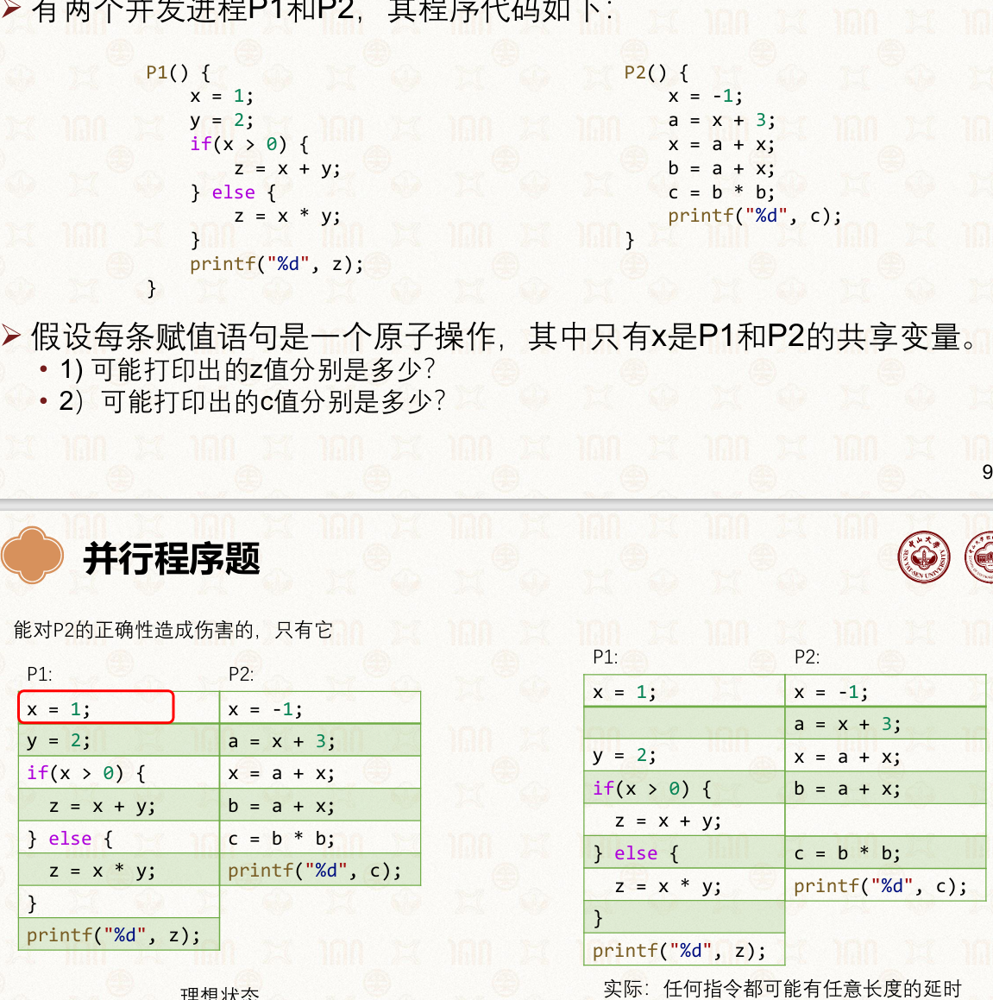

### 10.5.1 理想指令执行过程

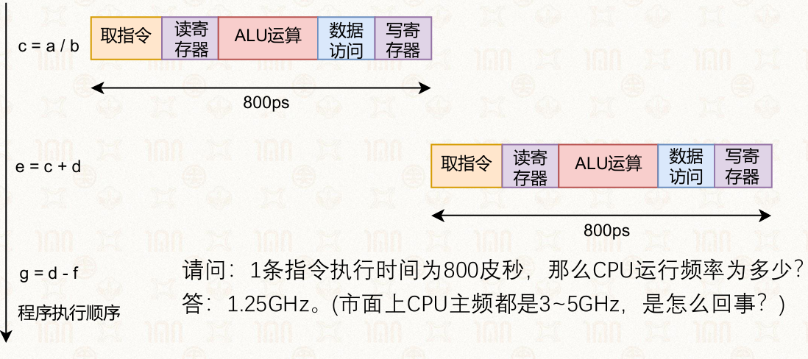

### 10.5.2 流水线执行（Pipelining）

#### 基本思想

将一条指令的执行过程拆分为多个阶段（如取指、译码、读寄存器、ALU运算、访存、写回），每个阶段由独立的硬件单元并行处理，形成流水线

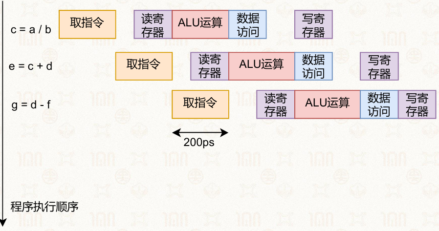

#### 流水线带来的问题

*   **指令间存在数据依赖**时，维持正确性面临新挑战

    *   不同指令运算时间不同
    *   在流水线中所处位置不同

*   **只能靠等待（流水线停顿/气泡）来解决依赖冲突**

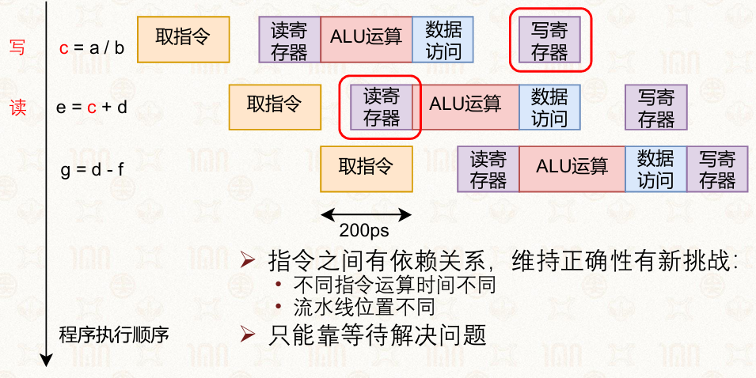

### 10.5.3 乱序执行（Out-of-Order Execution）

#### 定义

指令的完成顺序与指令加载（取指）顺序并不一致

CPU根据指令操作数的就绪情况动态安排执行顺序，而非严格按程序顺序执行

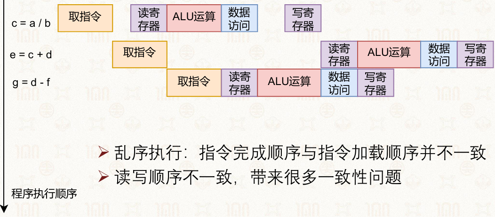

#### 核心机制：Tomasulo算法

**思路**

*   利用缓存、重命名方式减少 “写后读”冲突
*   未完成的“写读”，存取“读”的 目标地址

**核心组件**

| 组件                               | 作用                                              |
| -------------------------------- | ----------------------------------------------- |
| **指令队列**                         | 缓存待发射的指令                                        |
| **保留站（Reservation Stations）**    | 每个功能单元（如浮点加法器、乘法器）配有自己的保留站，用于缓冲指令和操作数，检测操作数就绪情况 |
| **寄存器重命名（Register Renaming）**    | 消除虚假的“写后读”（WAR）和“写后写”（WAW）冲突，用物理寄存器替代逻辑寄存器      |
| **公共数据总线（CDB, Common Data Bus）** | 计算结果通过CDB广播给所有需要的保留站和寄存器，实现数据转发                 |
| **载入/存储缓冲区（Load/Store Buffer）**  | 缓存内存读写操作，维护访存顺序                                 |
| **重排序缓冲区（ROB, Reorder Buffer）**  | 确保指令提交（Commit）时按程序顺序完成，维护精确中断                   |


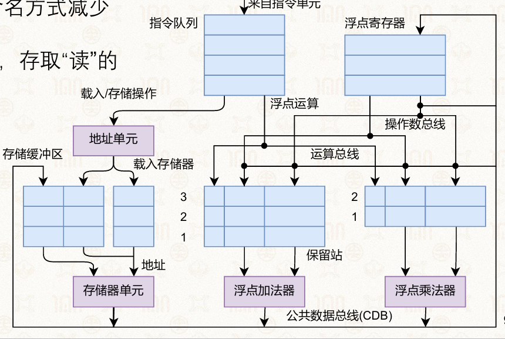

#### 乱序执行的冲突类型

| 冲突类型                            | 含义             | 乱序执行的处理方式       |
| ------------------------------- | -------------- | --------------- |
| **写后读（WAR, Write After Read）**  | 先读后写，但乱序后先写了   | 通过**寄存器重命名**消除  |
| **读后写（RAW, Write After Read）**  | 先写后读，真正的数据依赖   | 必须等待（通过CDB转发数据） |
| **写后写（WAW, Write After Write）** | 两次写入同一寄存器，顺序颠倒 | 通过**寄存器重命名**消除  |


#### 乱序执行带来的新问题

*   **读写顺序不一致**：指令执行（完成）顺序与程序加载顺序不同，访存操作的顺序也可能被打乱
*   **多核缓存一致性问题**：在单核中，ROB保证了最终顺序提交；但在**多核场景**下，每个核心独立乱序执行，不同核心观察到的内存操作顺序可能不一致，导致**缓存一致性**和**内存一致性模型**问题

## 10.6 内存一致性模型

### 10.6.1 问题引入：纯软件互斥算法的失效

以LockOne算法（皮特森算法的前身）为例，从逻辑上看，两个线程分别设置自己的flag，再循环检查对方的flag，应当能实现互斥访问：

```c
// 线程0
while (TRUE) {
    flag[0] = TRUE;
    while (flag[1] == TRUE); // 等待对方释放
    // 临界区
    flag[0] = FALSE;
}

// 线程1
while (TRUE) {
    flag[1] = TRUE;
    while (flag[0] == TRUE); // 等待对方释放
    // 临界区
    flag[1] = FALSE;
}
```

在严格按程序顺序执行的理想模型中，两个线程不可能同时进入临界区。但在真实硬件中，该算法会失效：

*   CPU允许无依赖的访存操作乱序执行，线程可能先执行读flag的循环检查，再执行写自己flag的操作

*   最终两个线程都先读到对方flag为FALSE，同时进入临界区，互斥性完全被破坏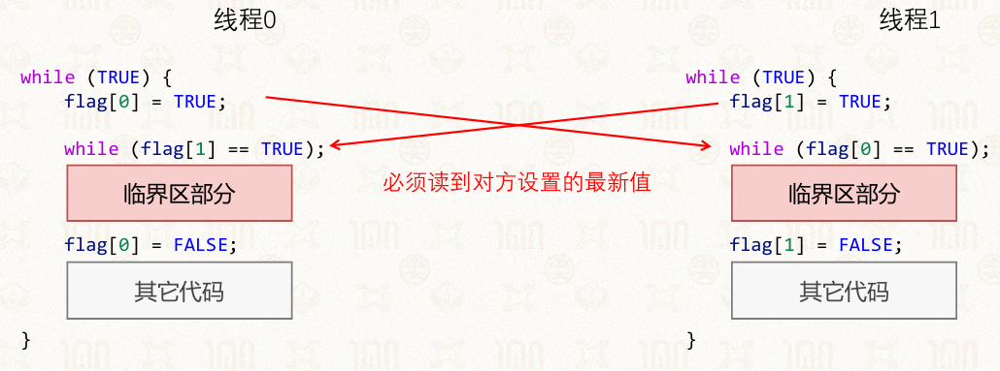

解决：处理器允许部分访存操作乱序执行，从而提供更好的并行性

**缓存一致性（保证同一地址的共识）并不等同于内存一致性（保证不同地址的访存顺序）** 内存一致性模型正是描述多核系统中访存操作顺序规则的规范

### 10.6.2 内存一致性模型的分类

按照保证强度从强到弱，主流内存一致性模型分为四类：

| 模型         | 保证强度 | 典型硬件              |
| ---------- | ---- | ----------------- |
| 严格一致性      | 最强   | 理想化，实际不存在         |
| 顺序一致性      | 强    | 理论基准，部分早期多核       |
| TSO（总存储顺序） | 中等   | x86/64（Intel/AMD） |
| 弱序一致性      | 最弱   | ARM、PowerPC、移动端   |


#### 性能与实现复杂度

*   保证越强，硬件实现成本越高、性能越低
*   保证越弱，硬件越简单、性能越高，但编程复杂度也随之上升

#### ※注意：

这些都是保证不同地址的执行顺序

### 10.6.3 严格一致性模型

#### **核心规则**

*   对任意内存地址的读操作，都能读到该地址最近一次写入的值
*   所有访存操作的全局执行顺序与真实物理时间（全局时钟）完全一致。

#### **行为特点**

所有核心对所有写操作的可见性完全同步，不存在任何延迟

#### **示例**

两个线程分别写入各自的flag，再读取对方的flag

```c
// 初始 flag[0] = flag[1] = 0
void proc_A(void) {
    flag[0] = 1;   // T1
    A = flag[1];   // T3
}

void proc_B(void) {
    flag[1] = 1;   // T2
    B = flag[0];   // T4
}
```

严格一致性下，唯一可能的结果是 `A=1, B=1`

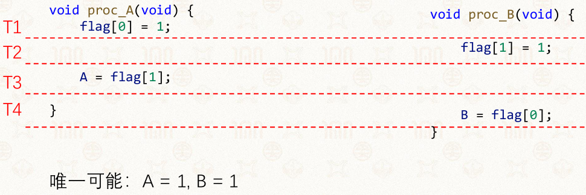

#### 优缺点

严格一致性的硬件实现代价极高，需要所有核心完全同步访存操作，会彻底抵消乱序执行带来的性能收益，现实中没有商用CPU采用该模型

### 10.6.4 顺序一致性模型（Sequential Consistency）

是兼顾直觉与可行性的强内存模型，也是并发理论的经典基准

#### **核心规则**

*   不要求操作按真实发生的时间顺序（全局时钟）全局可见

    *   即对于某个线程，以它的视角来说，可能与全局一致，也可能不一致

*   但所有核心的执行结果必须等价于某个全局顺序执行的结果

*   在该全局顺序中，每个核心自身的读写操作顺序必须与其程序顺序保持一致

    *   读写顺序不可颠倒

#### **特点**

*   不要求操作按照真实发生的时间顺序（全局时钟）全局可见
*   不要求全局全序与真实物理时间对应，只要存在至少一个合法的全序即可

#### 读写顺序保证

*   保证所有地址的读-读、读-写、写-写、写-读顺序

#### **示例**

```c
// 初始 flag[0] = flag[1] = 0
void proc_A(void) {
    flag[0] = 1;   // T1
    A = flag[1];   // T3
}

void proc_B(void) {
    flag[1] = 1;   // T2
    B = flag[0];   // T4
}
```

**实际的时钟序（上帝视角）**

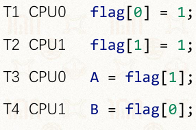

**从线程自身的视角来看，存在的三种可能**

*   全局顺序：A写flag0 → A读flag1 → B写flag1 → B读flag0

    *   结果：`A=0, B=1`

*   全局顺序：A写flag0 → B写flag1 → A读flag1 → B读flag0

    *   结果：`A=1, B=1`

*   全局顺序：B写flag1 → B读flag0 → A写flag0 → A读flag1

    *   结果：`A=1, B=0`

**禁止的结果**：`A=0, B=0`

*   B读flag0 →A写flag0 → A读flag1 → B写flag1

*   B的读写顺序被打破；

    *   因为每个核心内部都是“先写自己的flag，再读对方的flag”，程序序不允许读操作越过写操作，因此不可能出现两边都读到0的情况

#### 优缺点

**优点**

*   保证全局所有核心看到的访存顺序完全一致，且严格遵循程序顺序
*   保证所有地址的读-读、读-写、写-写、写-读顺序
*   顺序一致性的编程模型简单直观

**缺点**

*   限制CPU的乱序优化能力，实际主流CPU都没有采用该模型

### 10.6.5 TSO 一致性模型（Total Store Ordering，全存储排序）

是x86/64架构采用的内存模型，是性能与易用性的工业级权衡。

#### **核心规则**

*   针对不同地址，保证读读、读写、写写三类操作的顺序与程序一致
*   仅允许**写-读**操作重排：写操作可以延迟提交，后续的读操作可以越过前面的写操作提前执行

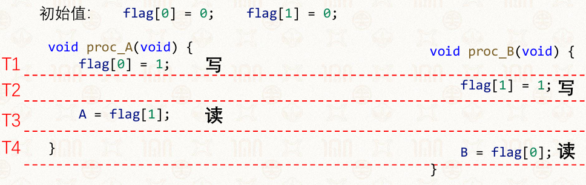

#### 读写顺序保证

*   针对不同地址，保证读读、读写、写写
*   不保证：写读

#### 内存保序缓存（原生保证顺序）

我们假设一个如下图的指令读取顺序，那么

1.  我们希望整体上，实际执行顺序和读取指令数据相同
2.  绿色需要等待其他的数据导致红色先于它执行完毕，则红色会在存储缓冲区中等待绿色执行完毕

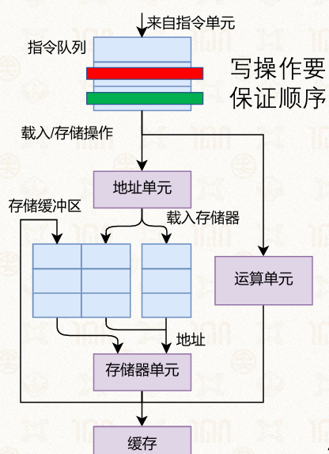

#### TSO写读重排的硬件原理

TSO的写读重排来源于CPU的存储缓冲区（Store Buffer）：

*   写操作不会直接写入缓存，而是先写入存储缓冲区，异步刷入缓存系统
*   读操作可以绕过存储缓冲区，直接从缓存读取数据，因此会出现“后面的读先完成，前面的写后提交”的现象
*   所有写操作在缓冲区内部仍保持顺序，因此写写顺序能得到保证

※这是硬件复杂度、性能、 软件使用场景权衡的结果

#### 示例：写读重排的效果

同样的flag读写示例，TSO模型下允许出现`A=0, B=0`的结果

*   两个线程的写flag操作都先进入存储缓冲区，尚未刷入缓存
*   两个线程的读flag操作都越过写操作，直接从缓存读到初始值0
*   最终两个线程都认为对方未设置flag，同时进入临界区，互斥失效

#### 典型应用

Intel、AMD的x86/64架构均采用TSO模型，在提供不错性能的同时，保留了大部分顺序保证，降低了底层编程的复杂度。

### 10.6.6 弱序一致性模型

最弱的主流内存模型，以ARM、PowerPC架构为代表。

#### **核心规则**

不保证任何不同地址访存操作的执行顺序，所有读写操作都可能被硬件乱序重排。只有显式的内存屏障指令才能强制保证访存顺序。

#### 设计逻辑

弱序模型将顺序保证的成本从硬件转移到软件：

*   硬件层面：逻辑大幅简化，CPU复杂度、功耗、制造成本更低，能实现更高的并行性能。
*   软件层面：程序员需要手动识别需要保证顺序的位置，插入内存屏障，编程负担显著上升。

#### 典型失效场景：数据与标志位分离

```c
// 初始值：data = 0, flag = NOT_READY
void proc_A(void) {
    data = 666;      // 先写数据
    flag = READY;    // 再写就绪标志
}

void proc_B(void) {
    while (flag != READY); // 等待就绪标志
    handle(data);          // 读取数据
}
```

在弱序模型下，proc_A的两次写操作可能被重排：flag先被置为READY，而data的修改还未提交。此时proc_B读到flag=READY后读取data，会得到过期的0值，引发逻辑错误。

> 注意：该场景在TSO模型下是安全的，因为TSO保证写写顺序，data的写一定会在flag的写之前提交

#### 为什么要弱序一致性模型

与TSO相比：

*   硬件逻辑更加简单
*   处理器复杂度下降
*   工艺/成本/功耗下降
*   并行程序性能受到影响（需要手动保证顺序）
*   ARM硬件复杂度、性能、成本、功耗、软件使用场景权衡的结果

### 10.6.7 内存屏障（Memory Barrier / Fence）

#### 概念与作用

**定义**：是解决弱内存模型下顺序问题的硬件原语

**作用**：屏障之前的所有访存操作必须全部完成并全局可见后，屏障之后的访存操作才能开始执行，任何操作都不能越过屏障。

#### 常见类型与适用场景

1.  **写屏障**：保证屏障前后的写操作顺序，确保之前的所有写都提交后，后面的写才能执行。
2.  **读屏障**：保证屏障前后的读操作顺序，确保之前的所有读都完成后，后面的读才能执行。
3.  **全屏障**：同时保证所有读写操作的顺序，是最强的屏障。

#### 修复示例

针对上述data-flag场景，通过内存屏障保证顺序：

```c
void proc_A(void) {
    data = 666;
    barrier();   // 写屏障：保证data写入完成后再写flag
    flag = READY;
}

void proc_B(void) {
    while (flag != READY);
    barrier();    // 读屏障：保证读到flag后再读data
    handle(data);
}
```

#### 补充说明

*   内存屏障仅针对**没有显式依赖**的访存操作
*   对于有依赖的操作，硬件会自动保证顺序，无需额外屏障
*   内存屏障的性能开销很大，必须仅在必要的同步点使用，滥用会抵消弱内存模型带来的性能收益

### 10.6.8 系统软件开发者视角

1.  **内存模型不透明**：硬件的访存重排行为对上层软件不是透明的，不了解内存模型编写的并发代码，会出现难以复现、难以调试的偶发错误。

2.  **同步原语的保序语义**：操作系统提供的互斥锁、信号量等同步原语，内部已经正确实现了内存屏障：

    *   加锁操作相当于进入屏障：临界区内的所有访存操作，不会被重排到加锁操作之前。
    *   解锁操作相当于退出屏障：临界区内的所有访存操作，不会被重排到解锁操作之后。 因此使用标准同步原语编写的程序，无需开发者手动处理内存序。

3.  **实践原则**

    *   常规业务开发应优先使用封装完善的同步原语
    *   只有在实现底层同步原语、高性能无锁数据结构时，才需要手动处理内存一致性问题

## 10.7 非一致内存访问

### 10.7.1 NUMA 的起源与定义

#### 问题

随着多核（尤其是多处理器/多插槽）系统核心数量的激增，传统的 UMA（统一内存访问，Uniform Memory Access） 架构暴露出严重的瓶颈：

*   **单内存控制器瓶颈**：所有核心通过一条总线访问同一个内存控制器，核数越多，竞争越激烈。
*   **物理距离差异**：在多插槽服务器中，CPU插槽之间的物理距离不同，离本地内存近的访问快，离远程内存远的访问慢。

#### **NUMA（非一致内存访问，Non-Uniform Memory Access）**

**核心思想**

*   节点：将物理内存划分为多个节点（Node），每个节点包含一组 CPU 核心和本地内存控制器
*   距离：CPU 访问本地内存（直连本节点的内存）速度最快，访问远程内存（其他节点的内存）速度较慢，且跳数（Hop）越多，延迟越高、带宽越低

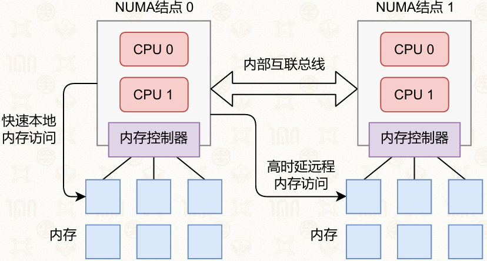

**常见场景**：多处理器（多插槽）服务器（如鲲鹏、Intel Xeon、AMD Opteron）；部分单处理器众核系统（如 Intel Xeon Phi）也采用 NUMA 架构。

### 10.7.2 NUMA 访存时延差异

#### 跳数（Hop）

在多插槽 NUMA 系统中，内存访问延迟以跳数（Hop） 来衡量：

| 访问类型    | Intel Xeon（80 核）延迟（Cycles） | AMD Opteron（64 核）延迟（Cycles） |
| ------- | -------------------------- | --------------------------- |
| 0 跳（本地） | Load: 117 / Store: 108     | Load: 228 / Store: 256      |
| 1 跳（远程） | Load: 271 / Store: 304     | Load: 419 / Store: 463      |
| 2 跳（更远） | Load: 372 / Store: 409     | Load: 498 / Store: 544      |


**结论**：跳数（Hop）越多，内存访问延迟越高远程内存访问的延迟可能是本地访问的 2\~3 倍甚至更高，严重时成为系统性能的瓶颈

下图展示了 Intel NUMA 架构的复杂互联拓扑

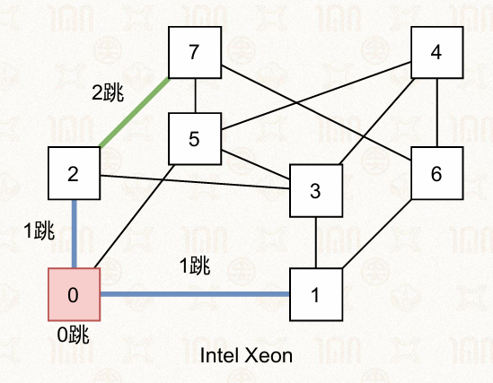

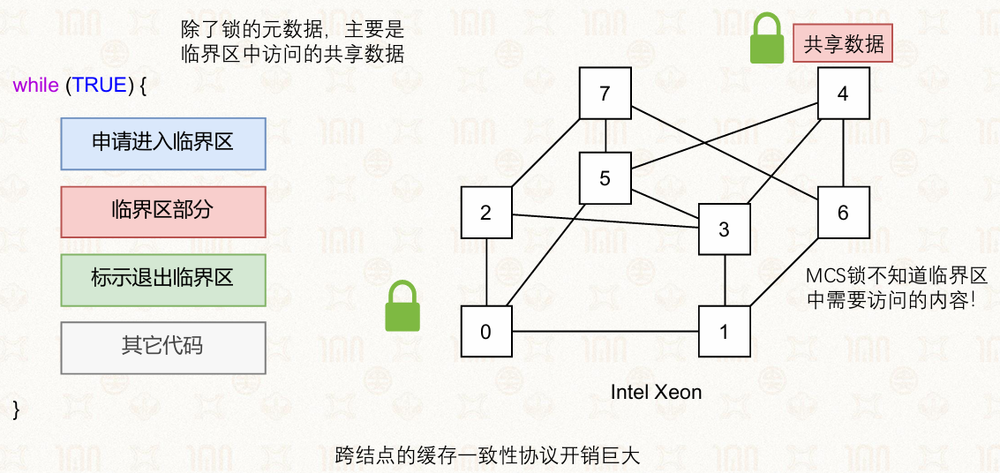

### 10.7.3 系统视角下的 NUMA 拓扑

操作系统可以感知 NUMA 拓扑结构，并将信息暴露给用户态软件。以华为鲲鹏服务器为例，通过 `numactl --hardware` 命令可以查看：

```text
available: 4 nodes (0-3)
node 0 cpus: 0 1 2 ... 15
node 1 cpus: 16 17 ... 31
node 2 cpus: 32 33 ... 47
node 3 cpus: 48 49 ... 63

node distances:
node   0   1   2   3
  0:  10  15  20  20
  1:  15  10  20  20
  2:  20  20  10  15
  3:  20  20  15  10
```

*   **CPU 分配**：每个节点包含 16 个核心，共 64 核心。
*   **距离矩阵（Distance Matrix）**：数值越小代表访问延迟越低（通常 10 为本地，15 为相邻节点，20 为远程节点）。如上所示，节点 0 访问节点 3 的距离为 20，远高于访问自身的 10。

> **对性能的影响**：在多核微基准测试中（例如临界区访问 10 个共享缓存行，扩展到 64 核心），由于 NUMA 远程访问开销，性能曲线在跨节点后出现明显波动甚至下降。

### 10.7.4 NUMA 感知的锁设计（以cohort锁为例）

在多插槽 NUMA 系统中，简单的 MCS 锁仍然可能导致严重的远程内存访问（因为等待队列中的节点可能分布在不同的 NUMA 节点上，锁传递时需要跨节点访问内存）。为此，提出了两级层级锁（Hierarchical Lock） 或 NUMA 感知锁 的设计思路。

#### **核心思路**

在一段时间内将锁的竞争和传递限制在同一个 NUMA 节点内部，减少跨节点（远程）的缓存一致性流量和访存延迟。

#### **工作流程**

1.  **获取本地锁**：线程首先尝试获取所在 NUMA 节点的**本地锁**（该节点内所有核心共享的锁）

2.  **获取全局锁**：成功获取本地锁后，线程才能去竞争**全局锁**

    *   全局锁限制了如果全局锁不在线程的numa节点上，它们即使有本地锁也停止，不竞争全局，降低消耗

3.  **锁持有与传递**：

    *   成功获取全局锁的线程进入临界区执行
    *   释放锁时，全局锁不是直接传递给任意等待者，而是**先传递给当前节点内的下一个本地**等待者
    *   只有当前 NUMA 节点内没有等待者时，才将全局锁传递给其他节点的等待者

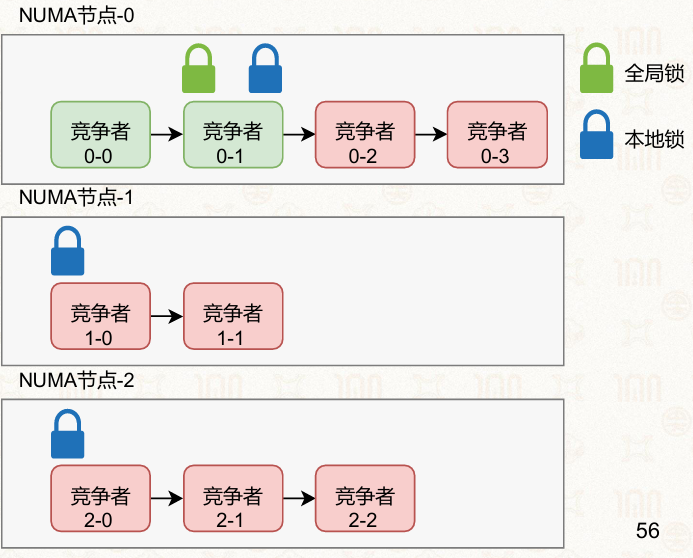

**策略优势**：

*   **局部性优先**：全局锁一旦被某个节点“捕获”，会在该节点内部循环传递一段时间，所有相关的缓存一致性消息和锁变量访问都局限在节点内部（本地内存），避免频繁的跨节点通信。
*   **减少远程访问**：大幅减少对全局锁变量所在缓存行的远程访问，有效规避跨 NUMA 节点的昂贵时延。

**性能效果**：在 64 核鲲鹏服务器上，采用 NUMA 感知锁后，吞吐量曲线在核心数增加时保持平稳上升，不再出现因跨节点通信导致的剧烈波动或断崖下跌。

### 10.7.5 系统软件开发者视角下的 NUMA

NUMA 架构对系统软件开发者提出了新的挑战和要求：

*   NUMA会暴露给操作系统，操作系统可以选择暴露给软件
*   软件可以用接口来分配本地的内存，也可不用直接分配，如（libnuma）
*   访问远程内存会带来严重时延/带宽问题造成性能瓶颈
*   对于所有进程：调度时避免跨NUMA结点迁移
*   对于没有NUMA感知的应用：尽可能保证其分配的内存的本地性
