# 11章 文件系统

## 11.1 块设备

### 11.1.1 块设备的基本概念

#### 定义

**块设备：**是以固定大小的数据块（Block）为单位进行数据读写的存储设备，与字符设备（以字节流为单位）相对

#### 常见块设备类型

*   **机械硬盘（HDD）**：内部包含多个磁盘片，数据存储在同心圆轨道（磁道）上，读写头一次读取一整块数据，**无法单字节读取**
*   **固态硬盘（SSD）**：基于闪存（Flash）技术，工作原理同样以"块"为单位读写多位数据

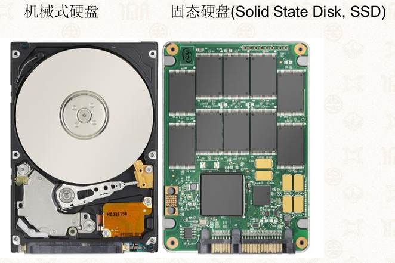

#### 块的大小

*   不同硬件设备的物理块大小差异很大
*   文件系统对存储块进行统一抽象，常见大小为 **512字节** 或 **4KB**

#### 日常现象解释

**为什么复制大量小文件比复制单个大压缩包慢得多？**

*   复制大量小文件时，每个文件都需要单独创建inode、更新目录项、分配数据块，伴随大量元数据操作
*   复制单个压缩包只需处理一个文件，元数据操作极少
*   硬盘磁头需要在不同位置反复寻道，机械延迟累积显著

### 11.1.2 Linux存储软件栈

从底层到顶层，Linux存储子系统包含以下层次：

| 层次              | 功能                    |
| --------------- | --------------------- |
| **设备驱动**        | 与具体硬件设备通讯，控制读写操作      |
| **I/O调度层**      | 对I/O请求进行合并与重排序，优化磁头寻道 |
| **块层**          | 提供统一的块设备抽象，管理块设备      |
| **文件系统**        | 管理存储上的文件系统格式和数据组织     |
| **虚拟文件系统（VFS）** | 管理多个文件系统，为上层提供统一抽象    |
| **页缓存**         | 缓存文件数据，加速读写操作         |

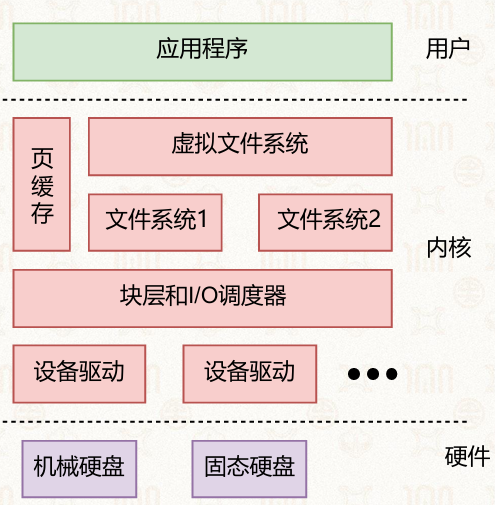

## 11.2 基于inode的文件系统

### 11.2.1 文件的基本概念

#### **文件是有名字的字符序列（字节序列）**

*   所有文件本质上都是字符序列，不同类型的文件仅仅是字符的组织方式不同
*   文本文件、PPT、PDF、PNG图片都可以用`cat`命令查看其原始字节内容（虽然部分内容不可读）

#### **文件的核心属性**：

*   文件名：给人看的标识符
*   inode编号：给操作系统看的唯一标识
*   文件内容：存储在数据块中的字节序列

### 11.2.2 inode结构

#### 概念

**定义**：是文件系统管理文件的核心数据结构，每个文件对应且仅对应一个inode

*   一个连续的之战数组
*   和多级页表类似，用分级减少组织管理代价

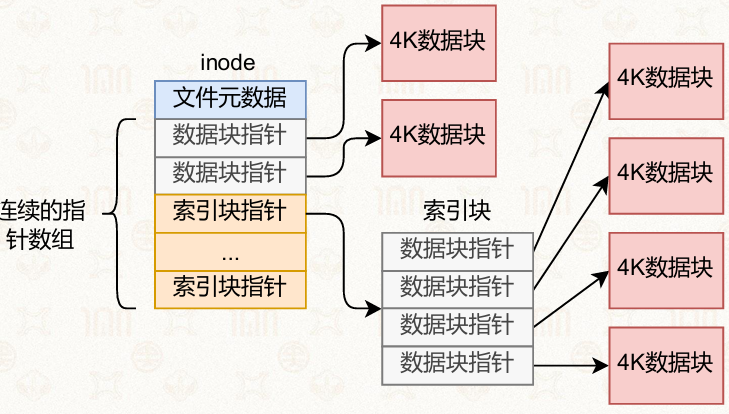

#### inode的组成部分

**元数据区域**：存储文件的属性信息

*   文件类型：普通文件、目录、符号链接等
*   文件大小
*   文件权限：读/写/执行
*   拥有者：uid, gid
*   时间戳：创建、修改、访问时间

**指针区域**：存储指向数据块的指针

*   **直接指针**：直接指向数据块，用于小文件
*   **间接指针**：指向一个索引块，索引块再指向数据块
*   **二级间接指针**：指向二级索引块，用于大文件

**※注意**：一个文件对应一个inode，用inode编号即可找到文件

*   inode编号是给操作系统看的，而文件名是给人看的
*   所以inode的元数据里没有文件名，文件名是存在目录里的

##### 元数据内容举例，以及文件大小与占用空间

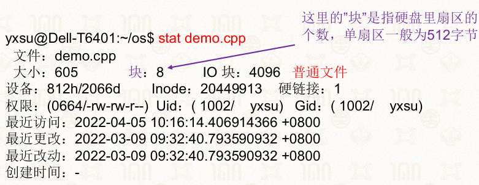

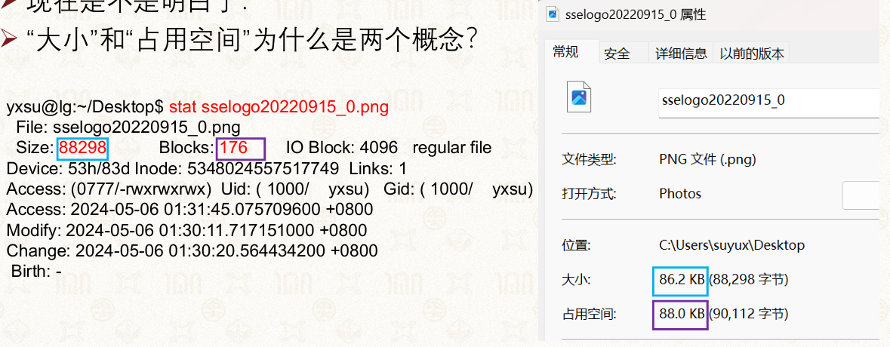

*   IO块就是逻辑块大小，就是每次操作时必须要读到的块大小
*   大小是实际的数据量
*   占用大小是必须要分配的块的大小

#### inode的大小示例

```bash
$ sudo dumpe2fs -h /dev/sda | grep Inode
Inode count: 366256128
Inodes per group: 2048
Inode blocks per group: 128
Inode size: 256
```

*   不同文件系统inode大小可配置（常见128/256/512字节）

#### 计算inode最大可表示的文件大小

假设：

*   块大小 = 4KB
*   指针大小 = 8字节
*   每个索引块可存放指针数 = 4KB / 8B = 512个

| 指针类型     | 计算方式                | 可表示数据量 |
| -------- | ------------------- | ------ |
| 12个直接指针  | 12 × 4KB            | 48KB   |
| 3个间接指针   | 3 × 512 × 4KB       | 6MB    |
| 1个二级间接指针 | 1 × 512 × 512 × 4KB | 1GB    |

**总计：48KB + 6MB + 1GB ≈ 1.006GB**

> 注意：不同文件系统的指针数量配比可调，上述为典型配置

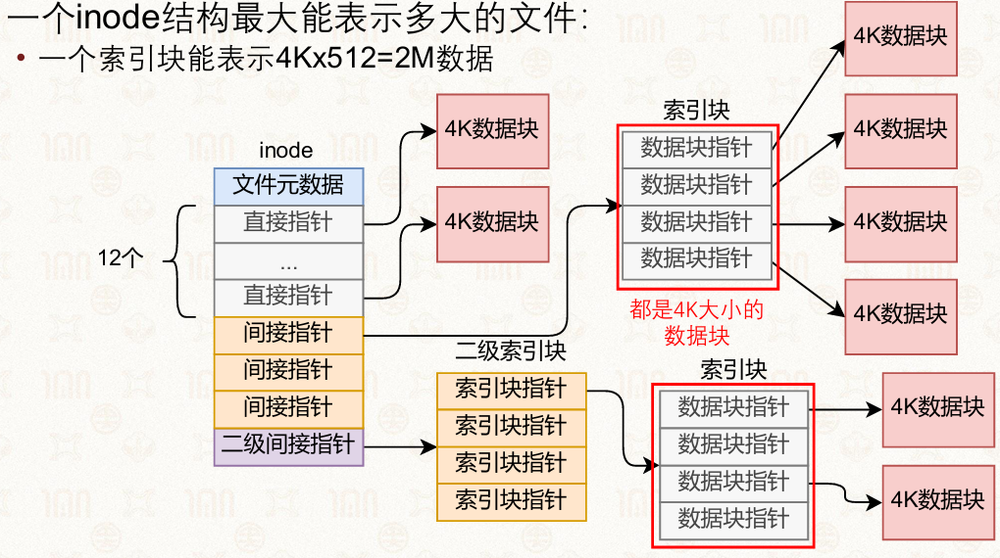

### 11.2.3 目录文件与文件名

#### 概念

目录本质上也是一个文件，其内容是"文件名 → inode编号"的映射表


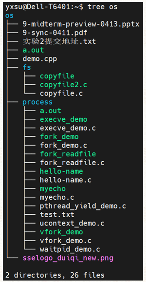

#### 目录项结构

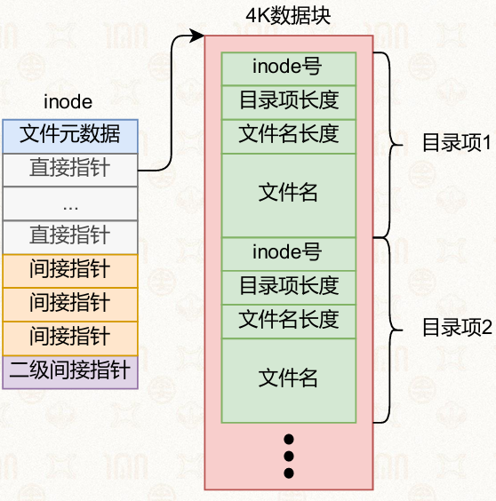

#### 目录操作

*   **查找文件**：遍历目录项，匹配文件名，获取对应inode编号
*   **删除文件**：将目录项中的inode号置为0，标记为无效
*   **合并优化**：如果连续两个目录项均为无效，可合并释放空间

#### **关键结论：文件名存储在目录文件中，而非inode中**

*   一个文件可以有多个文件名（硬链接）
*   只要inode编号相同，就是同一个文件

#### 思考题

10个电影文件（movie1.mp4 \~ movie10.mp4）和100个笔记文件（note1.md \~ note100.md）的目录，哪个占用空间更大？

*   目录大小取决于目录项数量，而非文件内容大小
*   100个笔记文件的目录需要100个目录项，空间更大

### 11.2.4 文件系统的存储布局

#### 概念

文件系统在格式化时创建统一的存储布局

*   在整块硬盘上统一分配inode 节点信息、数据块信息
*   管理数据空间大小

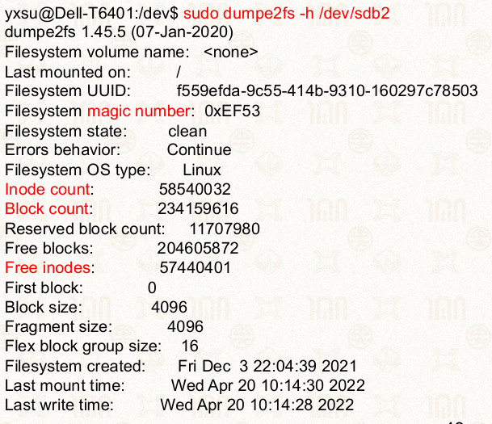

#### 布局组成

*   **超级块**(super block) ：作为文件系统的元数据，存储基本信息
*   **魔法数字**(magic number): 识别文件系统类型
*   **inode节点数量**：决定最多能存多少个文件
    
    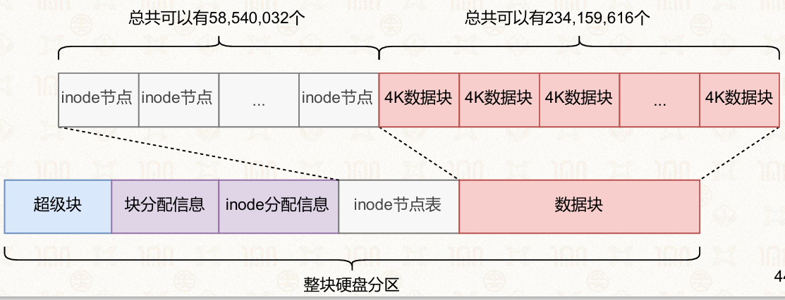
*   **inode分配信息**：用位图表示对应的节点是否使用(1表示使用)
    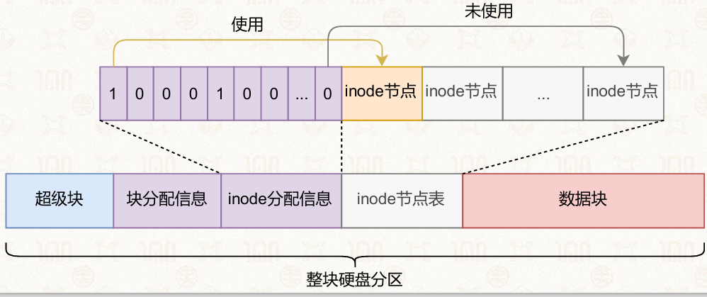
*   **块分配信息**：用位图表示对应的节点是否使用(1表示使用)
    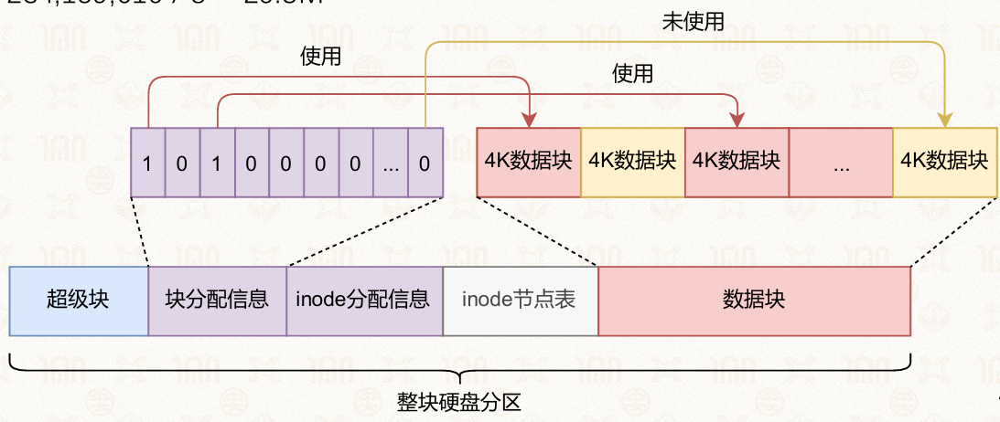

#### 空间计算示例（/dev/sdb2分区）

| 项目       | 计算                | 大小     |
| -------- | ----------------- | ------ |
| 数据区容量    | 234,159,616 × 4KB | 937GB  |
| inode表空间 | 58,540,032 × 256B | 15GB   |
| inode位图  | 58,540,032 / 8    | 7.3MB  |
| 数据块位图    | 234,159,616 / 8   | 29.3MB |

※GB和MB的B都是byte，所以我们从位bit换算时要除8

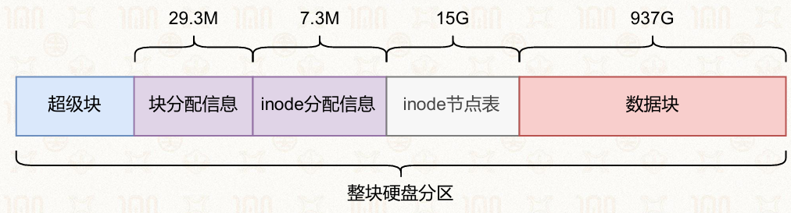

#### 日常现象解释：为什么1TB硬盘实际可用只有约931GB？

*   厂商按1TB = 10¹²字节计算
*   操作系统按1GB = 2³⁰字节计算
*   1TB = 10¹² / 2³⁰ ≈ 931.3GB
*   加上文件系统元数据（inode表、位图等）的额外开销，实际可用空间更少

## 11.3 基于表的文件系统

### 11.3.1 FAT（文件分配表）

FAT（File Allocation Table）是微软自1985年起使用至今的文件系统，常见于U盘、SD卡等可移动存储设备

#### 核心数据结构

**FAT表**：一个数组，每个表项对应一个簇，存储的内容是"下一个簇的编号"，文件通过链表形式组织

**引导记录区**：与超级块相似


#### 文件读取流程

1.  从目录项获取文件的起始簇号
2.  读取该簇的数据
3.  查询FAT表中该簇对应的表项，获取下一个簇号
4.  重复步骤2-3，直到FAT表项值为`FFFF`（结束标记）

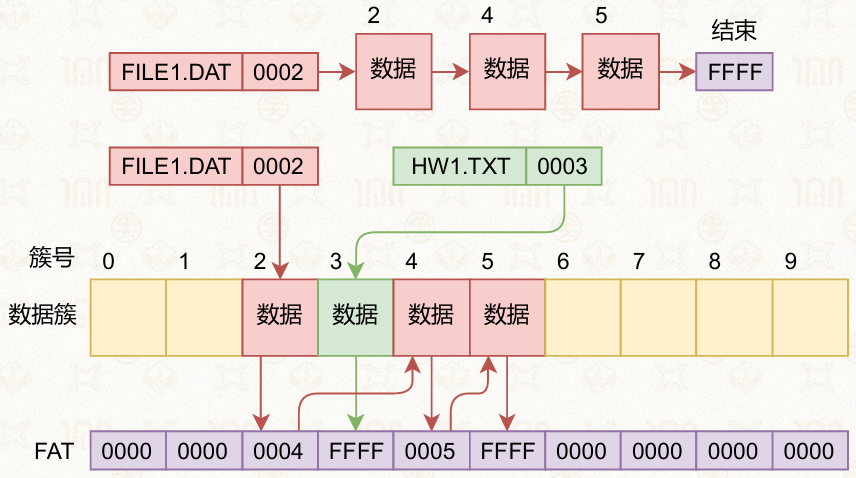

#### FAT的优缺点

**优点**：

*   实现简单，广泛应用于各类存储设备
*   兼容性好，几乎所有操作系统都支持

**缺点**：

*   链表结构导致大文件随机访问慢（需遍历链表）
*   链表容易损坏，因此维护两份FAT表（FAT1和FAT2互为备份）
*   FAT32中文件大小用32位整数表示，**最大文件仅4GB**
*   无权限控制、无日志等高级特性

#### exFAT：U盘常用格式

*   与FAT32并不兼容
*   使用位图加快空间分配
*   Unicode保存长文件名
*   目录查找文件时使用哈希对比
*   允许4GB以上文件(文件大小用8字节)
*   使用校验码保证元数据完整性

### 11.3.2 NTFS（新技术文件系统）

NTFS是Windows现代版本的主流文件系统，与FAT32不兼容。

#### 核心特性

*   **位图管理空间分配**：使用位图快速查找空闲空间
*   **Unicode长文件名**：支持国际化文件名
*   **哈希查找**：目录中查找文件使用哈希对比，提升查找速度
*   **大文件支持**：文件大小用8字节表示，支持超过4GB的文件
*   **元数据校验码**：保证元数据完整性

#### NTFS存储布局

*   **MFT（主文件表）**：类似于inode表，存储文件和目录的记录
*   **MFT镜像**：MFT的备份，提高容错性
*   **日志文件**：支持事务和恢复
*   **B+树索引**：目录查找使用B+树结构，查找效率高

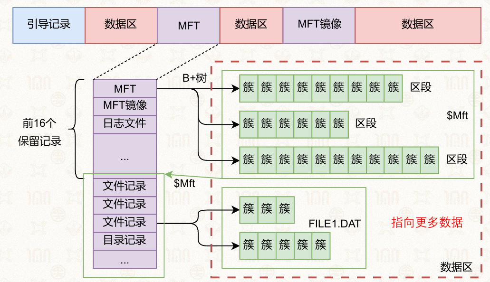

**MFT中的文件记录**：

*   小文件：数据直接存储在MFT记录中（称为常驻属性）
*   大文件：数据存储在数据区，MFT记录存储指向数据区段的指针

#### B+树的优势

文件系统喜欢用B+树/B树的原因：

*   查找、插入、删除的时间复杂度稳定为O(log n)
*   磁盘I/O次数少（树的高度低）
*   适合按范围查找和顺序遍历

## 11.4 使用文件系统

### 11.4.1 硬链接与符号链接

#### 硬链接（Hard Link）

**原理**：两个目录项指向同一个inode编号，共享同一份文件数据

```bash
$ ln test.txt test2.txt
```

**特点**：

*   两个文件名地位完全相同
*   删除其中一个不影响另一个
    *   只有inode引用计数降为0时才真正删除数据
*   不能跨文件系统
*   不能链接目录
    *   防止循环引用

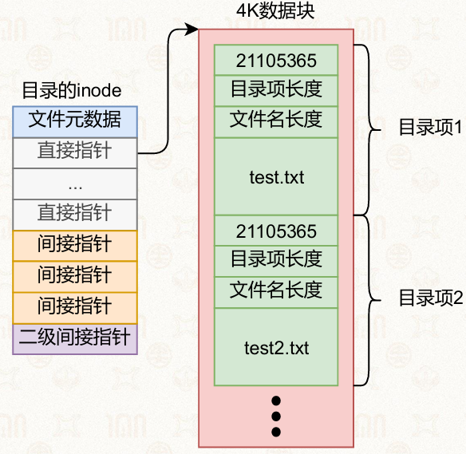

#### 符号链接（Symbolic Link）

**原理**：一个特殊的文件，其内容存储的是目标文件的路径

```bash
$ ln -s test.txt test3.txt
```

**特点**：

*   独立于目标文件存在
*   目标文件路径改变后链接失效（悬空链接）
*   可跨文件系统
*   可链接目录

**作用**

*   提供更加多元的文件读取方式

**常见用途**：动态库版本管理

```bash
$ file libstdc++.so
libstdc++.so: symbolic link to ../../x86_64-linux-gnu/libstdc++.so.6
```

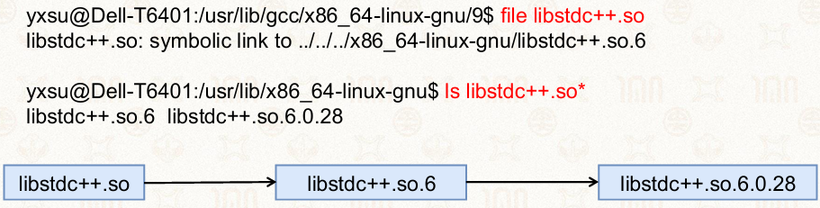

※Windows：环境变量（类似）

### 11.4.2 文件操作的基本接口

#### 复制文件

```c
// 所需系统头文件
#include <sys/types.h>   // 基础系统数据类型（文件描述符、size_t等）
#include <fcntl.h>       // open/creat 函数、文件打开标志、权限宏定义
#include <stdlib.h>      // exit() 进程退出函数
#include <unistd.h>      // read/write/close 系统调用

// 缓冲区大小：每次读写4096字节（文件系统友好）
#define BUF_SIZE 4096
#define OUTPUT_MODE 0700// 目标文件权限

int main(int argc, char* argv[]) {
    int in_fd, out_fd;    // in_fd：源文件描述符；out_fd：目标文件描述符
    int rd_count;         // read() 实际读到的字节数
    int wt_count;         // write() 实际写入的字节数
    char buffer[BUF_SIZE];// 读写缓冲区，存放单次读取的文件数据

    // 参数校验：程序必须传入2个参数（源文件 目标文件），总参数个数为3
    if (argc != 3)
        exit(1); // 参数错误，退出码1

    // 以只读模式打开源文件 argv[1]
    in_fd = open(argv[1], O_RDONLY);
    // 打开失败返回-1，异常退出码2
    if (in_fd < 0)
        exit(2);

    // 创建目标文件 argv[2]，权限0700；文件存在则清空截断
    out_fd = creat(argv[2], OUTPUT_MODE);
    // 创建文件失败，异常退出码3
    if (out_fd < 0)
        exit(3);

    // 循环读写拷贝文件
    while(1) {
        rd_count = read(in_fd, buffer, BUF_SIZE);// 从源文件读取最多BUF_SIZE字节到buffer
        if (rd_count < 0) // read返回负数：读取出错，跳出循环
            break;
        wt_count = write(out_fd, buffer, rd_count);// 将本次读到的rd_count字节写入目标文件
        if (wt_count <= 0)// 写入失败，异常退出码4
            exit(4);
        // rd_count == 0 代表读到文件末尾，循环自动结束
    }

    // 关闭两个文件描述符，释放资源
    close(in_fd);
    close(out_fd);
    // 正常退出，退出码0
    exit(0);
}
```

*   ./copyfile copyfile.c copyfile2.c：将copyfile.c复制成copyfile2.c

#### 打开文件

```c
int open(const char *path, int oflag, ...);
int openat(int fd, const char *path, int oflag, ...);
```

*   `oflag`
    *   O_RDONLY：只读
    *   O_WRONLY：只写
    *   O_RDWR：读写
    *   O_CREAT：创建
    *   O_TRUNC：截断

#### 读写文件

```c
ssize_t read(int fildes, void *buf, size_t nbyte);
ssize_t write(int fildes, const void *buf, size_t nbyte);
```

#### 移动读写位置

```c
off_t lseek(int fildes, off_t offset, int whence);
```

*   `whence`：SEEK_SET（从头）、SEEK_CUR（当前位置）、SEEK_END（从末尾）

#### 获取文件属性

```c
int stat(const char *restrict path, struct stat *restrict buf);
int fstat(int fildes, struct stat *buf);
int lstat(const char *restrict path, struct stat *restrict buf);
```

*   `stat`：跟随符号链接
*   `lstat`：不跟随符号链接（获取链接本身的信息）

#### 关闭文件

```c
int close(int fildes);
```

#### fork与文件描述符的共享

当进程调用`fork()`创建子进程时，子进程会复制父进程的文件描述符表，父子进程共享相同的文件偏移量。

**示例**：test.txt内容为"abcdefghijklmnopqrst"

```c
int fd = open("test.txt", O_RDWR);
if (fork() == 0) {
    read(fd, str, 10);   // 子进程读取前10个字符
    printf("Child: %s\n", str);
} else {
    read(fd, str, 10);   // 父进程读取接下来的10个字符
    printf("Parent: %s\n", str);
}
```

**执行结果**：

*   子进程读到"abcdefghij"，父进程读到"klmnopqrst"（偏移量共享）
*   或父进程先读"abcdefghij"，子进程再读"klmnopqrst"
*   两种结果取决于调度顺序，但**不会出现**两个进程都读到相同内容

**原因**：fork时文件描述符复制了文件偏移量，父子进程共享同一文件表项（对应的inode相同）

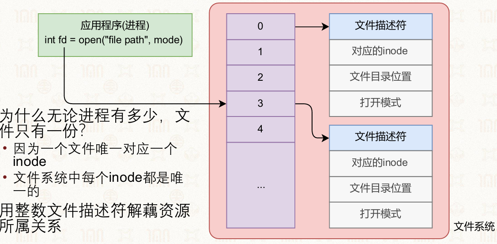

### 11.4.3 页缓存与脏页

#### 页缓存机制

为提高文件读写效率，操作系统会设置文件缓存

*   不用每次read/write都去读写硬盘
*   数据没有真的写在硬盘中， 而是写在内存中缓存

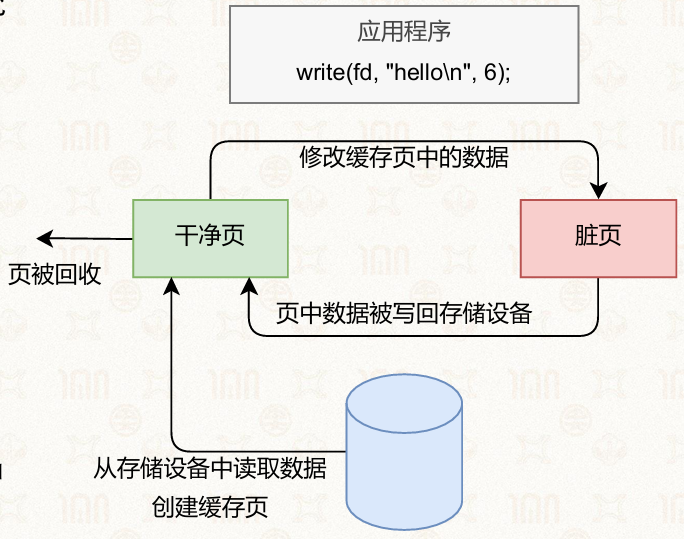

#### 脏页回写：防止死机、断电等

脏页（Dirty Page）指内存中已被修改但尚未写回硬盘的缓存页

*   内核定期将脏页刷回磁盘（通过flush线程）
*   内存压力大时也会触发回写回收

#### 强制同步

```c
int fsync(int fildes);   // 强制将指定文件的所有脏页写入磁盘
```

`fsync()`用于保证数据持久化，防止断电或系统崩溃导致数据丢失。

### 11.4.4 内存映射（mmap）

#### 核心思想

将文件内容直接映射到进程的虚拟地址空间，使文件读写退化为内存操作

*   既然内存可以当作缓存，不如把文件一次性全部加载入内存中
*   mmap可将文件映射到虚拟内存空间中

#### mmap接口

```c
void *mmap(void *addr, size_t len, int prot, int flags, int fildes, off_t off);
int msync(void *addr, size_t len, int flags);
int munmap(void *addr, size_t len);
```

**参数说明**：

*   `prot`：权限
    *   PROT_READ：可读
    *   PROT_WRITE：可写
    *   PROT_EXEC：可执行
*   `flags`
    *   MAP_SHARED：共享映射，修改写回文件
    *   MAP_PRIVATE：私有映射，修改不写回

**使用实例**

```c
fd = open("/home/yxsu/os_file", O_RDWR);
addr = mmap(NULL, length, PROT_WRITE, MAP_SHARED, fd, 0);
memset(addr, 0, length);
```

#### mmap的实现原理

1.  调用`mmap`时，操作系统在进程虚拟地址空间中分配一段地址
2.  记录该段地址与文件inode的映射关系
3.  访问映射地址时触发**缺页中断**
4.  缺页中断处理函数通过虚拟地址找到对应inode
5.  从磁盘将数据读入物理内存页
6.  建立虚拟地址与物理页的映射，进程继续执行

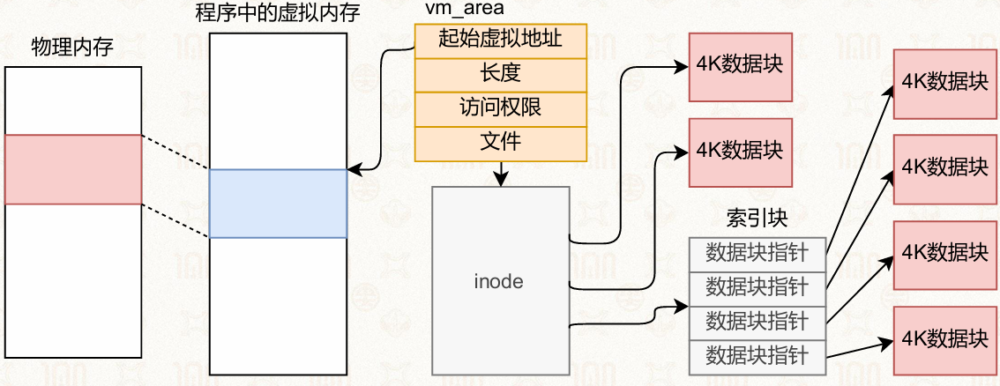

#### mmap的优势

*   **随机访问高效**：无需频繁调用`lseek`
*   **减少系统调用次数**：一次映射后续访问均为内存操作
*   **减少数据拷贝**：如文件复制，数据无需经过用户态中间buffer
*   **访问局部性好**：利用预读机制提升性能
*   **可配合**`madvise`：为内核提供访问模式提示（顺序/随机/预读等）

### 11.4.5 文件系统的高级功能

#### 基于mmap的文件复制实现

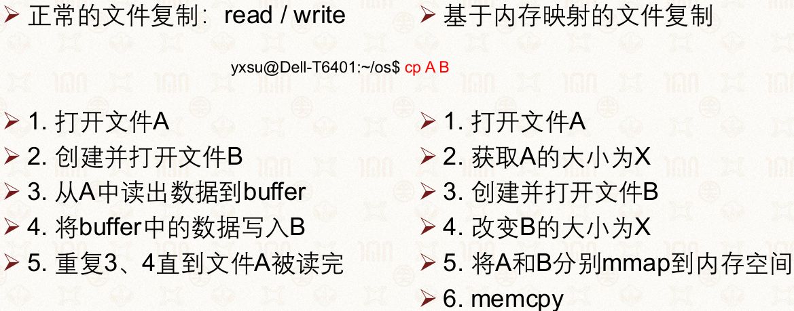

```c
#include <stdio.h>
#include <fcntl.h>
#include <unistd.h>
#include <sys/mman.h>

int main(int argc, char *argv[]) {
    int input, output;
    size_t filesize;
    void *source, *target;

    // 只读打开源文件
    input = open(argv[1], O_RDONLY);
    // 读写模式创建/清空目标文件，权限0666
    output = open(argv[2], O_RDWR | O_CREAT | O_TRUNC, 0666);

    // 获取源文件总大小：将文件偏移移到文件末尾
    filesize = lseek(input, 0, SEEK_END);
    // 将目标文件偏移定位到文件末尾前1字节
    lseek(output, filesize - 1, SEEK_SET);
    // 在目标文件末尾写入一个空字节，扩充文件至源文件大小
    write(output, '\0', 1);

    // 映射源文件到内存，只读共享映射
    if ((source = mmap(0, filesize, PROT_READ, MAP_SHARED, input, 0)) == (void *)-1)
    {
        fprintf(stderr, "Error mapping input file: %s\n", argv[1]);
        exit(1);
    }
    // 映射目标文件到内存，只写共享映射
    if ((target = mmap(0, filesize, PROT_WRITE, MAP_SHARED, output, 0)) == (void *)-1)
    {
        fprintf(stderr, "Error mapping output file: %s\n", argv[2]);
        exit(1);
    }

    // 内存拷贝，直接复制映射区数据完成文件复制
    memcpy(target, source, filesize);

    // 解除两块内存映射
    munmap(source, filesize);
    munmap(target, filesize);
    // 关闭文件描述符，正常退出
    close(input);
    close(output);
    return 0;
}
```

#### 文件克隆（写时复制）（快照）

文件克隆利用写时复制（Copy-on-Write）实现快速复制：

*   仅复制inode元数据，原始数据块共享
*   修改时触发复制，修改部分才分配新块
*   文件系统快照也基于同样的原理

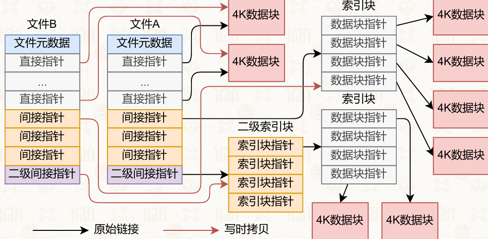

**实现方式**：

*   **基于inode表的文件系统**：复制inode表作为快照，标记数据区为写时拷贝
*   **树状结构的文件系统**：复制树根作为快照，标记树根以下节点为写时拷贝

#### 其他高级功能

现代文件系统（如Btrfs、ZFS、XFS）提供丰富的扩展功能：

| 功能         | 说明              |
| ---------- | --------------- |
| **加密**     | 数据落盘自动加密        |
| **压缩**     | 透明压缩存储，节省空间     |
| **去重**     | 重复数据块只存一份       |
| **校验**     | 数据和元数据校验和，保证完整性 |
| **配额管理**   | 限制用户/组可用空间      |
| **软件RAID** | 多设备管理，提供冗余或条带   |
| **子卷**     | 独立的文件系统命名空间     |
| **事务**     | 原子操作，保证一致性      |

## 11.5 虚拟文件系统（VFS）🌶

### 11.5.1 VFS的作用

#### 背景\原因

每种文件系统都有： 超级块(元数据)、根目录、树状结构

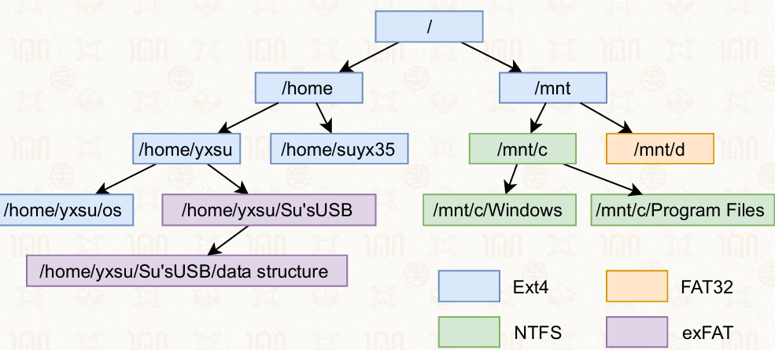

#### 作用

Linux支持多种文件系统（ext4、FAT、NTFS、NFS等），VFS提供统一的抽象层，使上层应用无需关心底层文件系统类型

#### **核心功能**：

*   管理已挂载的文件系统
*   定义标准接口：具体的文件系统实现这些接口
    *   如在读取一个inode的文件时
        *   VFS先找到该inode所属文件系统
        *   再调用该文件系统的读取接口

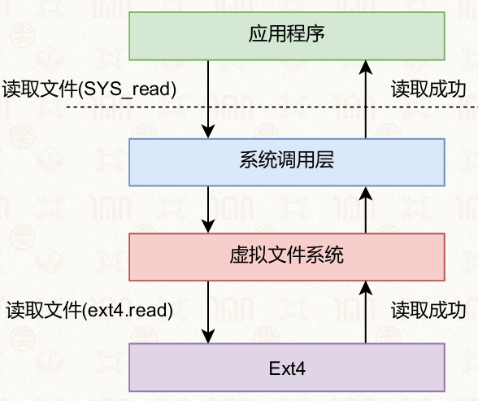

### 11.5.2 VFS的核心数据结构

#### struct vfsmount（挂载结构）

```c
struct vfsmount {
    struct dentry *mnt_root;    // 挂载树的根目录
    struct super_block *mnt_sb; // 指向超级块的指针
    int mnt_flags;
    // ...
};
```

#### struct mountpoint（挂载点）

```c
// 挂载点结构体：描述单一挂载点信息
struct mountpoint {
    struct hlist_node m_hash;
    struct dentry *m_dentry;    // 挂载点所在的目录项
    struct hlist_head m_list;
    int m_count;
};
```

#### struct mount （挂载实例）

```c
// mount 结构体：完整描述一次挂载行为实例
struct mount {
    struct hlist_node mnt_hash;
    struct mount *mnt_parent;
    struct dentry *mnt_mountpoint;
    struct vfsmount mnt;        // 关联的文件系统实例
    // ... 其他省略成员

    struct list_head mnt_mounts;    /* list of children, anchored here */
    struct list_head mnt_child;     /* and going through their mnt_child */
    struct list_head mnt_instance;  /* mount instance on sb->s_mounts */
    const char *mnt_devname;        /* Name of device e.g. /dev/dsk/hda1 */
    struct list_head mnt_list;
    struct list_head mnt_expire;    /* link in fs-specific expiry list */
    struct list_head mnt_share;     /* circular list of shared mounts */
    struct list_head mnt_slave_list;/* list of slave mounts */
    struct list_head mnt_slave;     /* slave list entry */
    struct mount *mnt_master;       /* slave is on master->mnt_slave_list */
    struct mnt_namespace *mnt_ns;  /* containing namespace */
    struct mountpoint *mnt_mp;      /* 该挂载对应的挂载点目录项 */
    union {
        struct hlist_node mnt_mp_list;  /* 同一挂载点上的其他挂载链表 */
        struct hlist_node mnt_umount;
    };
    // ... 其他省略成员
};
```

### 11.5.3 VFS的接口抽象

#### struct inode_operations

Linux的VFS定义的一些inode上的操作接口

```c
struct inode_operations {
    int (*create)(struct user_namespace *, struct inode *,
                  struct dentry *, umode_t, bool);
    int (*link)(struct dentry *, struct inode *, struct dentry *);
    int (*unlink)(struct inode *, struct dentry *);
    int (*mkdir)(struct user_namespace *, struct inode *,
                 struct dentry *, umode_t);
    int (*rmdir)(struct inode *, struct dentry *);
    int (*rename)(struct user_namespace *, struct inode *,
                  struct dentry *, struct inode *, struct dentry *,
                  unsigned int);
    int (*setattr)(struct user_namespace *, struct dentry *, struct iattr *);
    int (*getattr)(struct user_namespace *, const struct path *,
                   struct kstat *, u32, unsigned int);
    // ...
};
```

具体文件系统（如ext4）实现这些接口，VFS负责在合适的时机调用。

#### ext4对目录操作的实现

```c
const struct inode_operations ext4_dir_inode_operations = {
    .create = ext4_create,
    .lookup = ext4_lookup,
    .link = ext4_link,
    .unlink = ext4_unlink,
    .mkdir = ext4_mkdir,
    .rmdir = ext4_rmdir,
    .rename = ext4_rename2,
    .setattr = ext4_setattr,
    .getattr = ext4_getattr,
    // ...
};
```

create的实现： <https://elixir.bootlin.com/linux/v5.16.14/source/fs/ext4/namei.c#L2732>

mkdir的实现： <https://elixir.bootlin.com/linux/v5.16.14/source/fs/ext4/namei.c#L2912>

### 11.5.4 文件系统在内存中的优化

文件系统在内存中维护多种数据结构以加速操作：

*   **红黑树**：快速查找inode
*   **基数树（字典树）**：高效管理页缓存

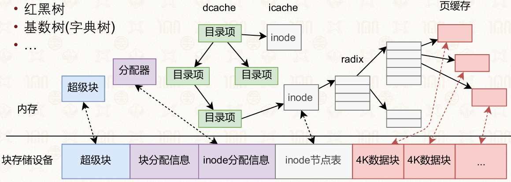

## 11.6 用户态文件系统（FUSE）

### 11.6.1 FUSE的设计动机

在内核中开发文件系统存在诸多困难：

*   内核开发复杂，调试困难
*   出错可能导致整个系统崩溃
*   迭代周期长

FUSE（Filesystem in Userspace）允许在用户态实现文件系统，大幅降低开发门槛

#### **优势**：

*   快速试验文件系统新设计
*   可用大量用户态第三方库
*   方便调试（gdb可用）
*   无需担心把内核搞崩溃
*   快速实现新功能（网盘同步、SSH远程挂载等）

### 11.6.2 FUSE的工作流程

1.  FUSE文件系统向FUSE驱动注册（挂载）
2.  应用程序发起文件请求
3.  VFS 根据挂载点将请求转发给FUSE驱动
4.  FUSE驱动通过共享内存/中断将请求发给用户态FUSE文件系统
5.  FUSE文件系统处理请求
6.  FUSE文件系统通知FUSE驱动请求结果
7.  FUSE驱动通过VFS返回结果给应用程序

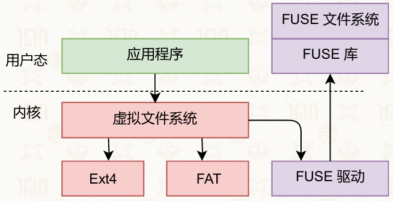

#### FUSE的瓶颈

*   用户态与内核态的上下文切换开销
*   消息传递的延迟
*   不适合对性能要求极高的场景

### 11.6.3 FUSE的应用

| 应用              | 说明                |
| --------------- | ----------------- |
| **SSHFS**       | 通过SSH挂载远程目录到本地    |
| **NTFS-3G**     | Linux下读写NTFS分区    |
| **GMailFS**     | 以文件接口收发邮件         |
| **WikipediaFS** | 用文件查看和编辑Wikipedia |
| **网盘同步**        | Dropbox、百度网盘等     |
| **分布式文件系统**     | Lustre、GlusterFS  |

### 11.6.4 FUSE示例：Hello World文件系统

```c
static int hello_read(const char *path, char *buf, size_t size,
                      off_t offset, struct fuse_file_info *fi) {
    size_t len;
    if (strcmp(path + 1, options.filename) != 0)
        return -ENOENT;
    
    len = strlen(options.contents);
    if (offset < len) {
        if (offset + size > len)
            size = len - offset;
        memcpy(buf, options.contents + offset, size);
    } else {
        size = 0;
    }
    return size;
}

int main(int argc, char *argv[]) {
    // ...
    ret = fuse_main(args.argc, args.argv, &hello_oper, NULL);
    return ret;
}
```

## 11.7 大模型生成文件系统

### 11.7.1 背景与挑战

文件系统开发面临复杂挑战：

*   代码模块间有复杂的依赖关系
*   大模型存在幻觉，生成代码不稳定
*   语言过于简单会导致语义歧义

### 11.7.2 规约驱动的文件系统生成

使用**规约（Specification）** 描述文件系统的行为，由大模型生成对应的代码实现。

#### 功能规约示例（霍尔三元组）

```c
{ Precondition }
atomfs_ins(...)
{ Postcondition }
```

#### 并发规约

描述并发场景下的行为要求，确保线程安全。

#### 模块化规约

```c
[Rely]   // 模块依赖的外部接口
struct inode *root_inum;
void lock(struct inode *);
void unlock(struct inode *);
struct inode *locate(struct inode *cur, char *path[]);
void insert(struct inode *, struct inode *, char *);

[Guarantee]  // 模块保证的行为
int atomfs_ins(char *path[], char *, int, unsigned, unsigned);
```

### 11.7.3 实验结果

大模型生成的AtomFS通过功能正确性测试：

| 模型                 | 功能性测试通过率      | 并发测试通过率       |
| ------------------ | ------------- | ------------- |
| Gemini-2.5/3.0-pro | 100% (45/45)  | 100% (70/70)  |
| Deepseek-V3.1      | 100% (45/45)  | 100% (70/70)  |
| GPT-5-minimal      | 100% (45/45)  | 100% (70/70)  |
| Qwen3.5-397B-A17B  | 100% (45/45)  | 100% (70/70)  |
| Qwen3-32B          | 82.2% (37/45) | 92.9% (65/70) |

## 11.8 思考题

### FAT文件系统为什么不支持硬链接？如何修改？

**困难**：

*   FAT用簇链表组织文件，inode编号并非文件的唯一标识
*   FAT目录项中直接存储起始簇号，多个目录项指向同一簇链会破坏链表结构
*   删除一个硬链接时难以判断是否应释放数据

**修改方案**：

*   引入引用计数：在FAT表中增加引用计数字段
*   目录项存储inode编号（而非直接存簇号），建立统一inode表
*   删除时减少引用计数，仅当计数为0时才释放簇链
*   本质上是向inode式文件系统靠拢，这解释了为什么FAT设计选择不支持硬链