# 12章 文件系统崩溃一致性
[TOC]
## 12.1 崩溃一致性基础概念

### 12.1.1 什么是文件系统崩溃

#### 常见崩溃场景：

*   台式机/笔记本突然断电
*   U盘热拔
*   数据线故障
*   硬件老化死机
*   系统蓝屏重启

#### 崩溃本质

内存中的页缓存、inode缓存、目录缓存脏数据来不及同步到磁盘，磁盘上各类文件系统元数据结构出现割裂、不匹配，破坏系统内部不变量，造成文件丢失、损坏、分区无法挂载

### 12.1.2 文件系统一致性约束

#### 背景

文件系统由统中保存了多种数据结构，各种数据结构之间存在依赖关系与一 致性要求，必须满足不变量，否则一致性被破坏

**示例一致性要求**

*   inode内部记录文件大小，必须与它指向的所有数据块总容量匹配
*   inode硬链接计数，必须和所有目录里指向该inode的目录项总数完全相等
*   超级块记录分区总块、总inode数量，和磁盘实际分配总量一致
*   inode位图标记为已占用的inode，一定能通过目录遍历访问；标记空闲inode无任何文件引用
*   任意磁盘块不能同时处于“空闲”和“文件占用”两种状态

#### 崩溃破坏机制

文件修改由多步磁盘写入组成，崩溃发生在任意中间步骤，只会持久部分修改，打破上述约束

### 12.1.3 崩溃一致性用户预期

#### 结构完整不变

磁盘元数据不破坏，重启后分区可正常挂载，不会出现块双重占用、无效指针

#### 数据尽力持久

长期写入的大文件完整保留，仅崩溃前少量未刷缓存修改丢失

#### 操作有序可见

操作遵循前缀有序，没有顺序的异常

### 12.1.4 磁盘故障模型：失效即停（fail-stop）

简化硬件假设：

*   磁盘正常工作时，严格执行下发的读写指令，不会篡改数据
*   崩溃失效时，仅停止执行后续操作
*   无论是否失效：不会出现“乱写磁盘（wild writes）”，不存在随机覆盖旧数据

### 12.1.5 恢复方式分类

#### 离线恢复

系统完全关机后执行磁盘扫描修复

**代表工具**：Windows `chkdsk`、Linux `fsck/e2fsck`

**缺点**：挂载前完整扫描全部分区，大磁盘修复耗时极长；挂载状态下禁止执行fs

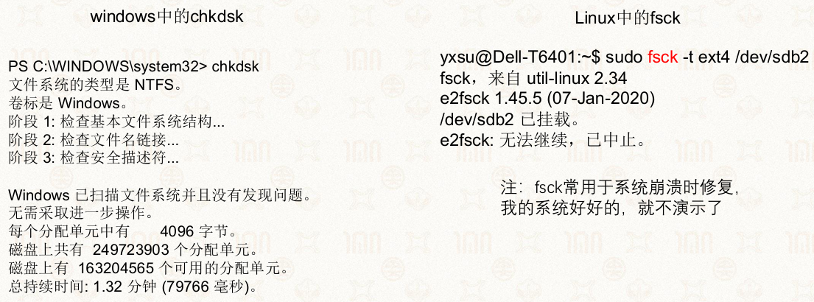

#### 在线恢复

系统运行时实时检测轻度不一致并修复，无需卸载分区，性能损耗更低

### 12.1.6 文件操作三大核心属性

```c
creat(“a”);
fd = creat(“b”);
write(fd,…);
//crash崩溃
```

#### 持久化Durable

操作完成后写入磁盘，重启后数据仍存在

*   a和b都可以

#### 原子性Atomic

一组关联修改要么全部落地磁盘，要么完全不落地，无中间残缺状态

*   要么a和b都可见，要么都不可见

#### 有序性Ordered

操作按前缀可见，若操作B持久，则它依赖的前置操作A一定已持久

*   如果b可见，那么a也应该可见

## 12.2 三类主流崩溃一致性保障技术

文件系统实现原子更新、防止崩溃损坏的三大方案：日志机制、写时复制CoW、Soft Updates

#### 原子更新技术

日志、写时复制

### 12.2.1 日志机制（Journaling）

#### 核心思路

*   修改磁盘真实元数据前，先在磁盘独立日志区完整记录本次事务所有修改
*   日志完整写入提交标记后，再执行真实磁盘修改

#### 崩溃恢复逻辑：

1.  崩溃发生在**日志提交写入前**：日志不完整，直接丢弃，本次所有修改作废
2.  崩溃发生在**日志提交写入后**：重启读取日志，复现全部修改，保证事务原子性

※不是追求不丢数据，而是尽量保证文件系统结构不被损坏(一致性)

#### 原始日志缺陷

1.  每次修改需要两次磁盘写入（日志+真实数据），抵消页缓存提速优势
2.  每个修改需要拷贝新数据到日志
3.  频繁同步磁盘IO，随机写性能差

#### 优化：内存日志+批量提交

*   日志先写入内存页缓存，异步批量刷盘，减少单次IO

    *   仅需保证日志提交在磁盘数据修改之前

*   合并多个文件操作到同一事务，同一块仅记录一次

*   触发提交时机

    1.  定时（5秒）
    2.  日志容量达阈值
    3.  应用主动调用`fsync()`

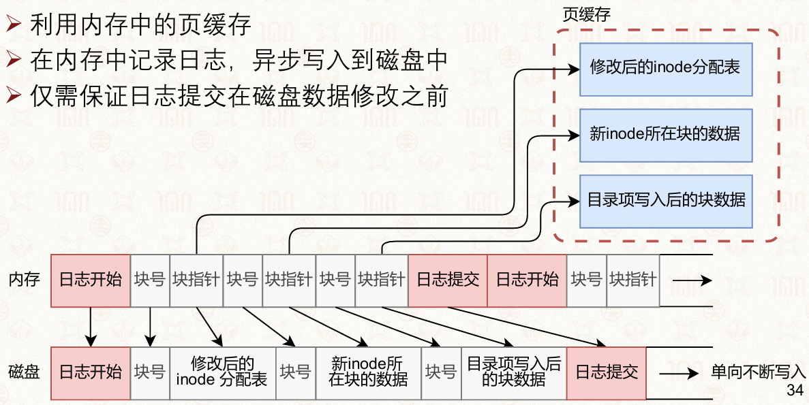

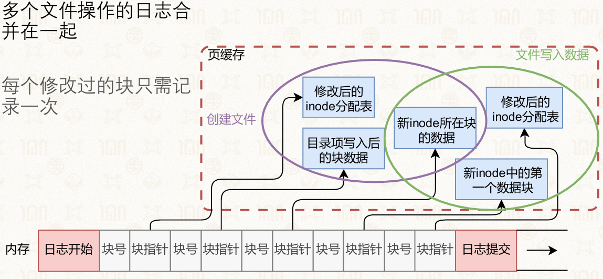

#### Linux JBD2日志子系统

JBD2是Ext3/Ext4通用日志驱动，负责管理磁盘事务

*   日志可以以文件形式保存
*   日志也可以直接写入存储设备块

##### 核心概念

*   Journal：磁盘独立日志分区/文件，存储所有事务记录
*   Handle：单次原子操作（如新建文件）对应的修改集合
*   Transaction：批量合并多个Handle，统一提交磁盘

##### JBD2事务状态流转

1.  **运行**：新的原子操作可以加入到事务中
2.  **锁定**：停止接收新操作，已接收原子操作不一定全部完成
3.  **写入**：事务数据写入存储设备
4.  **提交**：事务内容写入存储设备
5.  **完成**：事务生效，后台回收日志空间

##### JBD2基础接口

**挂载阶段**：初始化日志、加载历史事务用于恢复

```c
journal_t journal;
// 初始化日志系统（日志存在文件中）
journal = jbd2_journal_init_inode(inode)
// 读取并恢复已有日志（如果存在）
jbd2_journal_load(journal)
```

**系统调用处理**：系统调用生成handle，标记待修改buffer为日志脏页

```c
handle_t handle;
// 原子操作：创建新文件
handle = jbd2_journal_start(journal, nblocks=8)
```

**后台线程**：定时自动提交事务

```c
while (sleep_5s()) {
    // 提交事务和回收日志空间（并开始新的事务）
    jbd2_journal_commit_transaction(journal)
}
```

**卸载阶段**：销毁日志资源，清空未完成事务

```c
// 释放日志系统
jbd2_journal_destroy(journal)
```

**示例**

```c
handle_t handle;
// 原子操作：创建新文件
handle = jbd2_journal_start(journal, nblocks=8)

// 1. 标记inode为占用
// bh: buffer_head 对应存储设备中的最小访问单元
bitmap_bh = read_inode_bitmap(sb, group)
jbd2_journal_get_write_access(handle, bitmap_bh)
set_bit(ino, bitmap_bh->b_data)
jbd2_journal_dirty_metadata(handle, bitmap_bh)

// 2. 初始化inode
inode_bh = get_inode_bh(sb, ino)
jbd2_journal_get_write_access(handle, inode_bh)
init_inode(inode_bh)
jbd2_journal_dirty_metadata(handle, inode_bh)//通知jbd2，修改bh完毕

// 3. 将目录项写入目录中
data_bh = get_data_page(dir_inode)
jbd2_journal_get_write_access(handle, data_bh)
add_dentry_to_data(page, filename, ino)
jbd2_journal_dirty_metadata(handle, data_bh)

jbd2_journal_stop(handle) // 结束原子操作
```

##### 磁盘结构

**日志超级块**

*   魔法数字

*   块的类型

*   块序号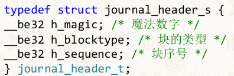

**事务**

*   描述块：tag数组，每个tag对应后面日志快的信息

    *   恢复时，根据描述块中记录的tag信息，将后面日志块中的数据写入到对应的磁盘块中
    *   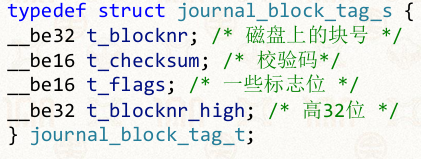

*   日志块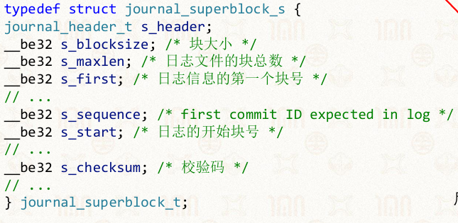

##### JBD2日志使用过程

*   记录日志并提交，从内存中写入存储设备

*   将修改写回文件系统中原位置

    *   按照日志记录的命令忠实执行

*   删除日志

    *   将事务设置为失效

*   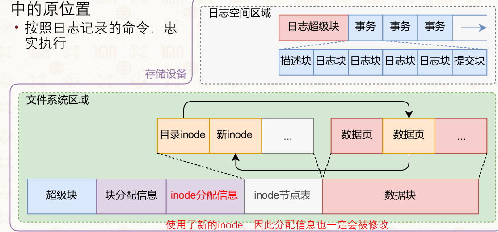

##### Ext4三种日志模式（JBD2实现）

**Journal 完整日志模式**：元数据+文件数据全部写入日志

*   一致性最强，崩溃无数据丢失

*   但所有数据写两次，写放大严重，性能最低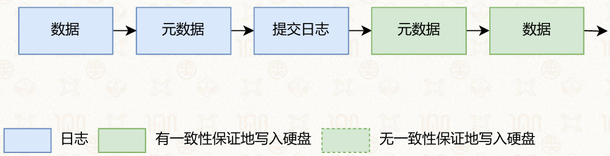

**Ordered 顺序模式（Ext4默认）**：仅日志记录元数据；文件数据必须先刷入磁盘，再提交元数据事务

*   保证元数据不会指向未写入脏数据

*   平衡性能与一致性，兼顾速度与安全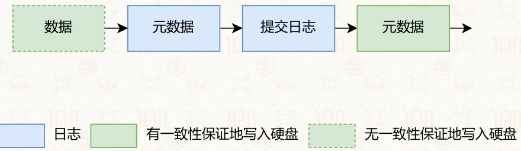

**Writeback 写回模式**：只记录元数据日志，文件数据不做任何日志约束

*   速度最快

*   但一致性最差，崩溃可能出现元数据存在、数据丢失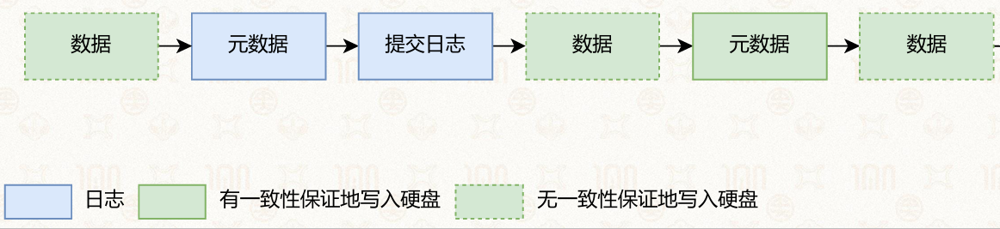

### 12.2.2 写时复制 Copy-on-Write CoW

#### 核心原理

在修改多个数据时，不直接修改数据，而是将数据复制一份，在副本上进行修改，并通过递归的方法向上更新所有上层索引、inode指针，直到根节点（inode）

*   多用于树结构

#### 崩溃恢复性

*   仅当完整根指针原子写入磁盘，本次修改才算生效
*   旧数据块保持不变，崩溃不会破坏原始文件结构

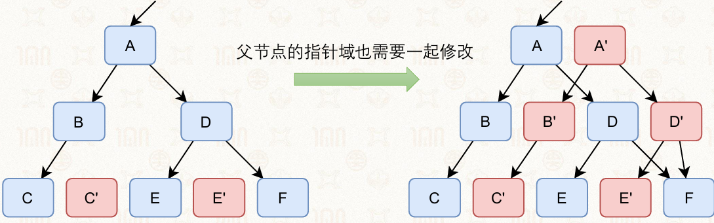

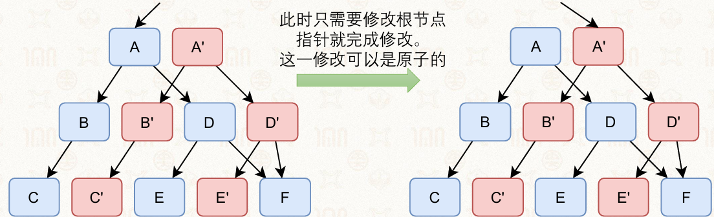

#### 文件多级索引CoW完整流程

以4K块、多级inode索引结构为例：

1.  需要修改某一个数据块 → 分配新数据块，拷贝旧内容、写入新数据
2.  指向该数据块的一级索引块失效，分配新索引块，更新指针为新数据块
3.  递归向上，依次复制二级索引、inode块，逐层替换指针
4.  最后原子写入新inode，修改正式生效
5.  回收资源
6.  崩溃时新inode未落地，磁盘全部为旧结构，无损坏；后台空闲时回收旧无效块

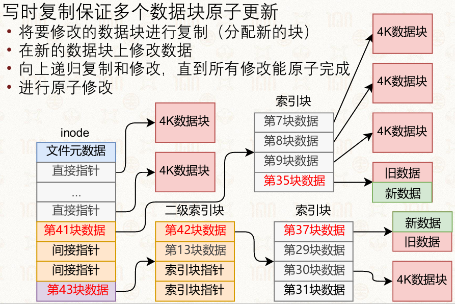

#### CoW优缺点

**优点**

*   天然支持原子更新，无需独立日志分区，崩溃不会撕裂文件结构
*   原生支持快照、文件克隆

**缺点**：存在写放大，微小修改会复制整条索引链多个磁盘块，随机写开销大；

代表文件系统：Btrfs。

#### CoW与日志对比（主观题考点）

1.  日志：需要独立日志区，数据双写，恢复靠日志重放；随机写损耗适中，适合机械硬盘；
2.  CoW：无日志分区，修改全部分配新块，写放大更高；崩溃恢复简单，天然快照，适合SSD。

### 12.2.3 Soft Updates🌶

#### 核心思想

不在磁盘额外存储日志，仅在内存维护所有元数据修改的依赖DAG有向无环图；控制脏元数据刷入磁盘的先后顺序，强制遵循安全写入规则，杜绝恶性不一致。 崩溃后磁盘元数据天然合法，**无需fsck离线扫描即可直接挂载**。

#### 三条强制写入次序规则

1.  禁止目录项先落地、对应inode未初始化：inode必须先刷盘，再写入指向它的目录项；
2.  已被指针引用的块不能回收分配：数据块被inode引用时，绝不标记为空闲；
3.  不提前删除唯一指向资源的指针：rename/删除操作，新目录项落地前，旧目录项不能抹除。

#### 优缺点

**优点**：无额外磁盘IO开销，无日志写放大，挂载无需恢复

**缺点**：内核内存依赖图实现极度复杂，主流Linux文件系统未大规模采用。

## 12.3 日志结构文件系统 LFS（Log-structured FS）

### 12.3.1 设计背景与设计

#### 背景

*   假设：文件被缓存在内存中，文件读请求可以被很好的处理

    *   文件写成为瓶颈

*   机械硬盘随机寻道延迟极高，顺序写性能远高于随机写

→将文件系统的修改以日志的方式顺序写入存储设备

#### 核心设计

整个磁盘仅作为连续日志，所有inode、目录、数据、位图全部追加写入磁盘尾部，无原地覆盖修改

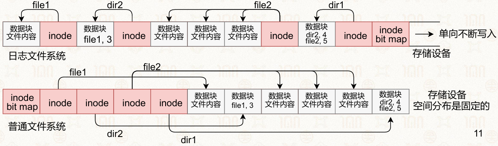

### 12.3.2 LFS数据结构

#### 固定位置的结构

*   **超级块、检查点**（checkpoint）区域

#### 以日志形式保存的结构

*   **inode、间接块（索引块）、数据块**
*   **inode map**：记录每个inode的当前位置
*   **段概要**：记录段中有效块
*   **段使用表**：段中有效字节数、段的最后修改时间
*   **目录修改日志**

### 12.3.3 LFS使用举例（以创建文件为例）

**前提**

一个日志文件系统

*   有4个inode，位置记录在inode map中
*   对应4个文件分别为：/，/dir2，/file2，/dir2/file1

**创建文件**

*   创建一个文件：/file3

*   修改文件内容为：hello

*   日志系统只能以追加(append)模式向后写

    *   后面有新内容，前面旧的就自动失效了
    *   最后一组inode和数据库类似于根目录

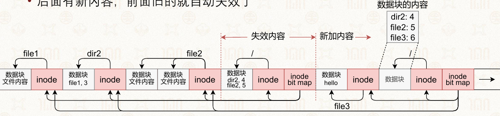

新建/修改文件不会覆盖旧块，仅在日志尾部追加全新inode、数据块、更新目录、更新inode map；磁盘上旧版本数据自动失效，保留完整历史快照。

### 12.3.4 段式垃圾回收（空间回收）

#### 问题背景：日志空间耗尽与无效数据堆积

*   存储设备的物理容量是有限的，日志不断向后追加，最终会触及设备末端。
*   文件数据被修改或删除后，旧版本的块在日志中变为无效数据，但这些块仍然占用物理空间
*   需要一种机制来回收无效数据占用的空间，使其能被重新利用，否则日志文件系统无法持续运行

#### 空间回收的两种朴素方案及其局限

##### 方案一：串联空闲块（Free List / Linked List）

将所有无效数据释放出的空闲块用链表串联起来，需要空间时从链表中分配

*   **优点**：实现简单，无需额外数据结构。
*   **缺陷**：经过反复分配与释放后，空闲块会散布在整个存储设备的不同位置，形成大量碎片，破坏了日志文件系统的核心设计前提，写性能急剧退化


##### 方案二：整体拷贝压缩（Copy Compaction）

将存储设备中所有仍有效的文件数据整体读取出来，整理后拷贝到一个全新的存储区域（或设备），原有区域整体标记为可重用。

*   **优点**：完全消除碎片，恢复大块连续空闲空间。
*   **缺陷**：需要搬运大量有效数据，涉及巨大的I/O开销，且要求额外的存储空间暂存整理后的数据，成本高昂、时效性差，不适合在线持续运行的系统

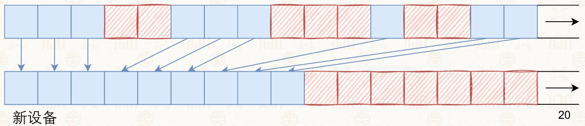

#### 段式回收：两种方案的融合

日志文件系统采用 “和稀泥”的经典工程思维，将上述两种方案结合，取长补短，提出了**段（Segment）** 为核心的空间回收机制

#### 段的基本设计

*   一个设备被拆分为定长的区域，称为段

    *   段大小需要足以发挥出顺序写的优势，512KB、1MB等

*   每段内只能顺序写入

    *   只有当段内全都是无效数据之后，才能被重新使用

*   干净段用链表维护（对应串联方法）

#### 段使用表（Segment Usage Table）

为了高效管理各个段的状态，日志文件系统维护**段使用表**这一核心元数据结构，为每个段记录关键统计信息：

| 字段         | 作用                                                    |
| ---------- | ----------------------------------------------------- |
| **有效字节数**  | 记录该段中仍然被文件引用的有效数据总量。当该值归零时，段变为“干净段”，可加入空闲链表。          |
| **最近写入时间** | 记录该段最后一次被写入的时间戳。用于将非干净段按时间顺序组织，形成逻辑上的连续空间视图，辅助清理策略决策。 |


#### 段清理（Segment Cleaning）的完整流程

1.  将一些段读入内存中准备清理
2.  识别出有效数据
3.  将有效数据整理后写入到干净段中（对应拷贝方法）
4.  标记被清理的段为干净

#### 段概要（识别有效数据）

**作用和结构**

每个段在写入时，会附带一个段概要区域，记录该段中每一个数据块的元信息：

*   块所属的 **inode 编号**
*   该块在文件内的**数据块序号**（即这是文件的第几个数据块）
*   块类型（数据块 / 索引块 / inode 块等）

**有效性判定逻辑**

系统根据段概要中记录的 `(inode号, 逻辑块序号)` 二元组，去查询该 inode 当前的最新指针：

*   若该 inode 当前的最新指针**仍然指向**这个物理块地址 → 该块为**有效数据**。
*   若该 inode 的最新指针已经指向其他位置（或该 inode 已被删除） → 该块为**无效数据**，可被丢弃。

**示例判定**：

*   某块记录为“属于 8 号 inode 的第 2 个数据块”。
*   查询 8 号 inode 的当前元数据，发现其第 2 个数据块**不再指向**当前这个物理位置 → 该块无效，不搬运

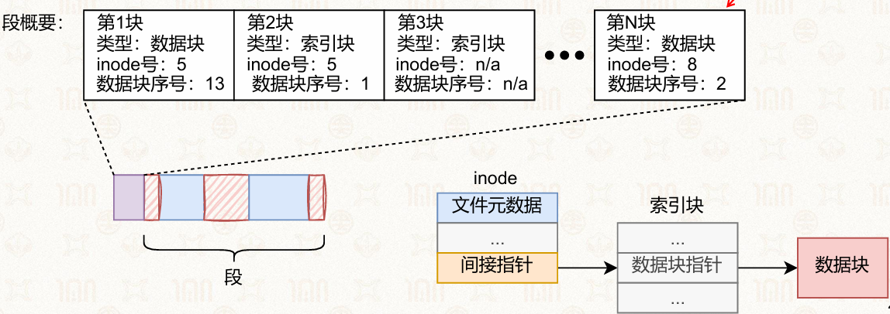

### 12.3.5 检查点Checkpoint机制

#### 背景

扫描所有日志，重建出整个文件系统的内存结构，大量无效数据也被扫描

#### 内容

*   inode map的位置（可找到所有文件的内容）
*   段使用表
*   当前时间
*   最后写入的段的指针

#### 用法

*   定期将Inode Map、段使用表等全局元数据写入双份检查点分区

    *   双检查点：避免写入检查点时崩溃导致元数据全部丢失

*   写入前的有效数据可以通过检查点找到，只需扫描检查点之后写入的日志

    *   减少挂载/恢复时间
    *   检查点是一份全局稳定元数据快照

*   崩溃恢复仅需扫描最后一次检查点之后的日志段，无需全盘扫描，大幅缩短挂载时间

### 12.3.6 崩溃恢复流程（前滚roll-forward）

#### 步骤

1.  读取最新有效检查点，加载全局inode映射

2.  遍历检查点之后所有日志段，依据段概要重建文件结构

3.  目录修改日志修复inode硬链接计数

    *   解决段概要无法处理的链接不一致问题

4.  丢弃未被任何inode引用的孤立失效块

#### 目录修改日志

*   目录修改日志

    *   记录了每个目录操作的信息

        *   create、link、rename、unlink

    *   以及操作的具体信息

        *   目录项位置、内容、inode的链接数

*   目录修改日志的持久化在目录修改之前

    *   恢复时根据目录修改日志保证inode的链接数是一致的

### 12.3.7 典型LFS衍生文件系统

<https://en.wikipedia.org/wiki/List_of_log-structured_file_systems>

机械硬盘：WAFL； 闪存设备：JFFS2、UBIFS、F2FS； 非易失内存：NOVA

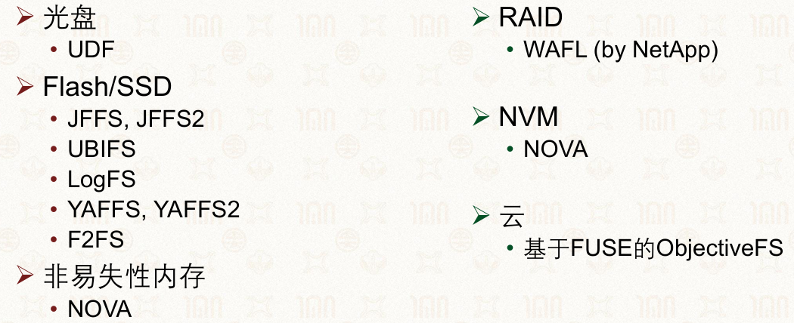

## 12.4 闪存友好型文件系统（F2FS）

### 12.4.0 闪存盘的组织

*   通道（Channel）

    *   控制器可以同时访问的闪存芯片数量

*   多通道（Multi-channel）

    *   低端盘有2或4个通道
    *   高端盘有8或10个通道

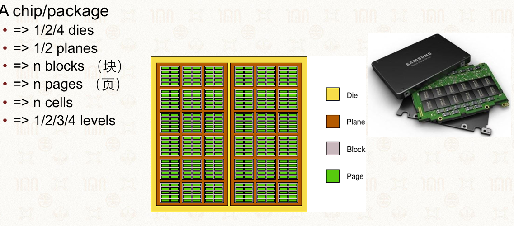

#### FTL闪存转换层

*   对外使用逻辑地址
*   内部使用物理地址

→可以软件\硬件实现

**作用**

用于垃圾回收、数据迁移、磨损均衡（wear-levelling）等

### 12.4.1 NAND闪存硬件特性

#### 读写擦除非对称

*   最小读写单位Page（8\~16KB）
*   擦除单位Block（4\~8MB），

#### 随机访问性能

*   无机械寻道
*   随机读速度优秀，但随机写仍弱于顺序写

#### 擦除循环

*   写入前需要先擦除
*   每个块被擦除的次数是有限的

#### 通道

*   多通道
*   高并行性

#### 异质Cell

存储1到4个比特：SLC 、MLC、TLC、 QLC

#### 磨损均衡

*   频繁写入同一个块会造成写穿问题
*   将写入操作均匀的分摊在整个设备
*

### 12.4.2 传统LFS在闪存的缺陷

1.  单点日志写入，无法利用闪存多通道并行带宽；
2.  修改元数据触发多层递归更新，严重写放大，加速闪存磨损。

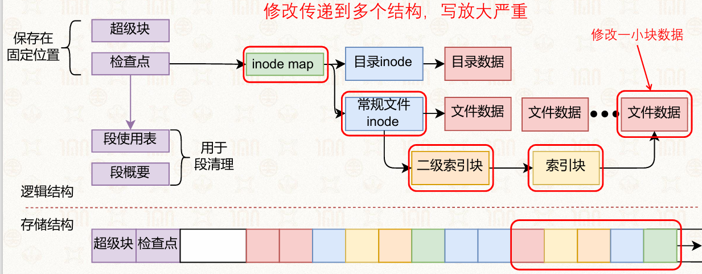

### 12.4.3 F2FS核心优化：NAT节点地址转换表

新增NAT层隔离inode与物理磁盘块：

1.  文件inode仅记录Node逻辑编号，真实物理地址保存在NAT映射表；
2.  修改文件数据时，仅更新少量NAT条目，无需递归复制整条索引链；
3.  磁盘划分多组独立日志段，支持多流并行写入，充分利用闪存多通道

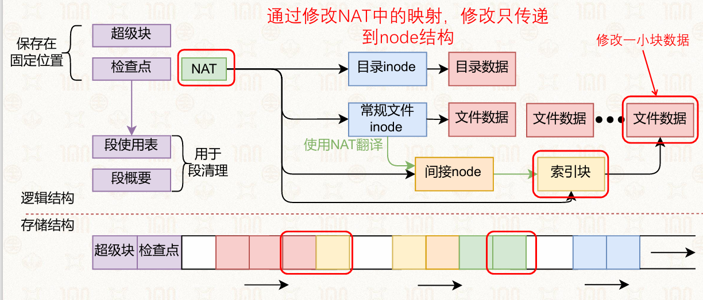

### 12.4.4 F2FS磁盘分区布局

#### 组织层级

**Block（块）**

*   大小：4KB
*   定位：文件系统最小读写单位

**Segment（段）**

*   大小：2MB
*   定位：日志追加写入的基础单位

**Section（区）**

*   组成：由多个Segment合并而成

*   关键特性：F2FS垃圾回收GC的操作粒度

    *   GC清理时不会单独回收单个段，而是一次性处理一整个Section内所有段，批量迁移有效数据，减少GC调度次数，提升回收效率。

**Zone（分区/通道区）**

*   组成：由多个Section合并而成

*   定位：适配闪存多通道硬件的大粒度分区

    *   一个Zone对应闪存一条独立通道，不同Zone可并行写入，充分发挥多通道并发性能。

#### 系统元数据（随机写入）

*   存放在一起：局部性更好
*   CP：检查点
*   SIT：段信息表
*   NAT：node地址转换表
*   SSA：段概要区域

#### 数据区（多Log顺序写入）

*   区分冷/温/热数据
*   区分文件数据（data segment）与元数据（node segment）

## 12.5 相关函数效果

### fsync

强制将当前文件页缓存内所有脏元数据、脏数据同步刷入磁盘，阻塞等待磁盘写入完成； 用途：数据库、日志等业务，要求修改持久化、规避断电丢失。

### close

关闭文件描述符，仅标记缓存可回收，**不保证数据立刻落盘**，无持久化强保证。

### lseek

仅修改进程内文件读写偏移，不操作磁盘持久化。

### mmap

内存映射，仅建立虚拟地址与文件映射关系，无同步刷盘能力，需搭配msync。

## 12.6 核心主观题考点

### 题目1：日志与写时复制各自优缺点

#### 日志机制

优点：

1.  事务粒度可控，机械硬盘随机写性能损耗更小；
2.  崩溃恢复流程简单，扫描日志即可重放事务；
3.  实现成熟，Ext4等主流系统广泛使用。 缺点：
4.  存在双重写入（日志+真实数据），写放大；
5.  独立日志分区占用固定磁盘空间；
6.  Writeback模式下文件数据无崩溃保护。

#### 写时复制CoW

优点：

1.  天然原子修改，无日志分区开销；
2.  原生支持快照、增量克隆；
3.  崩溃不会破坏原有文件数据，无残缺中间状态。 缺点：
4.  微小修改递归复制整条索引链，写放大更严重；
5.  大量随机修改场景性能差，更适配SSD而非机械盘。

### 题目3 JBD2三种日志模式区别

1.  Journal：元数据+数据全写日志，安全、性能最差；
2.  Ordered（默认）：仅日志存元数据，数据先落盘再提交事务，平衡安全性能；
3.  Writeback：仅元数据日志，数据无保护，速度最快、断电易丢数据。

### 题目4 新建文件崩溃8种场景分析

创建文件三步：标记inode占用→初始化inode→写入目录项，任意子集落地都会产生不一致，完整8种故障状态见12.1.2。

## 12.7 单选题核心知识点汇总

1.  保证缓存数据写入磁盘：`fsync()`；
2.  崩溃一致性核心手段：事务原子更新；
3.  违反一致性：同一块既空闲又被文件占用；
4.  Ext4最快日志模式：writeback写回模式；
5.  LFS核心优化：全部追加顺序写入磁盘；
6.  闪存核心限制：擦除有寿命，读写擦除单位不同；
7.  Soft Updates最大优势：崩溃无需fsck，直接挂载。
