以下是为所有代码块补充对应渲染语法后的完整内容：

# 13章 设备管理
[TOC]
## 13.1 设备连接

### 13.1.1 外设多样性的挑战

#### 背景

根据不同需求和场景，人们发明了大量专用设备：通信设备、存储设备、智能计算设备、安全协处理器等。

#### 核心挑战

*   每种设备有自己的协议和规范——**如何标准化外设接口？**
*   设备可能产生错误——**如何得知外设状态并修复错误？**

**操作系统的担当**：把复杂留给自己，把简单留给他人。

### 13.1.2 外设的认知维度

认识外设需要从三个维度理解：

1.  **基本用途**：设备能提供什么功能
2.  **共同特征**：能否分门别类做简化抽象
3.  **编程接口**：设备的可编程接口长什么样

### 13.1.3 硬件接口的物理基础

#### GPIO（通用输入输出）

**矛盾：**硬件接口的电线/管脚数目有限，而外接设备可以非常多

**作用：**低成本拓展硬件控制能力的通用管脚，解决接口数量不足的问题

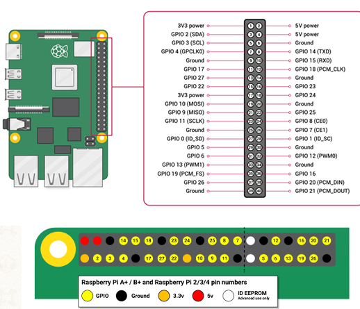

**结构（GPIO LED）**

*   通过专门的INPUT/OUTPUT管脚进行控制

*   每个01组合表示一种状态
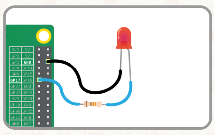

#### Intel 8042（PS/2键盘控制器）

*   电信号 → 数字信号 → 编码（Scan Code）
*   每次只能键入一个字符
*   长按时会重复产生按键事件

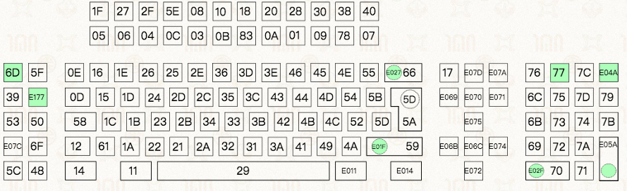

#### UART（串口）

*   通用异步收发传输器

    *   Universal Asynchronous Receiver/Transmitter

*   半双工通信

    *   通信双方都能发、也都能收，但同一时刻只能单向

*   每次只能传输一个字符

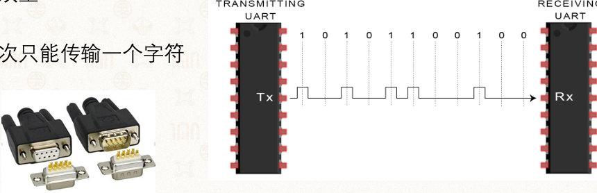

#### Flash闪存

*   以页/块为粒度进行读写/擦除
*   支持页/块随机访问

#### Ethernet网卡

*   每次传输一块数据（以太网帧）

    *   每一块有严格的结构定义

*   WiFi、蓝牙与此类似

#### 其他设备

显示器、传感器、陀螺仪、磁力计、协处理器（GPU、TPU）等。

**统一管理的方式：抽象**

## 13.2 设备类型抽象

### 13.2.1 抽象的复用：文件系统接口

操作系统将外设细节和协议封装在接口内部，为应用程序提供统一的抽象接口。

```c
char buffer[256];
int read_num = -1;
int fd = open("/dev/something", O_RDWR);
write(fd, "something to device", 19);
while (read_num == -1) {
    read_num = read(fd, buffer, 256);
}
close(fd);
```

上述代码可以运行在不同设备上，底层驱动负责处理具体设备的差异。

### 13.2.2 设备抽象：以Linux为例

| 设备类型                     | 代表设备         | 访问模式       | 抽象方式                        |
| ------------------------ | ------------ | ---------- | --------------------------- |
| **字符设备（Char Device）**    | 键盘、鼠标、串口、打印机 | 顺序访问，逐字符读写 | 文件抽象（open/read/write/close） |
| **块设备（Block Device）**    | 磁盘、U盘、闪存     | 随机访问，以块为粒度 | 内存抽象（mmap）、文件抽象             |
| **网络设备（Network Device）** | 以太网、WiFi、蓝牙  | 格式化报文收发    | 套接字（Socket）抽象               |


### 13.2.3 字符设备（Char Device）

#### 例子

鼠标、键盘、串口、打印机、etc

#### 访问模式：

*   顺序访问，每次读取一个字符
*   调用驱动程序和设备直接交互

#### 抽象

**通常使用文件抽象**

*   `open()`
*   `read()`
*   `write()`
*   `close()`

#### 示例：通过字符设备实现终端间通信

终端1向`/dev/pts/15`写入"hello world"：

```bash
$ echo "hello world" > /dev/pts/15
```

终端2接收到消息：

```bash
$ hello world
```

### 13.2.4 块设备（Block Device）

#### 例子

磁盘、U盘、闪存等（以存储设备为主）

#### 访问模式

*   随机访问，以块粒度进行读写
*   在驱动程序之上增加一层缓冲，避免与慢设备频繁交互

#### 抽象

**通常使用内存抽象（更受欢迎）**

*   内存映射文件（Memory‑Mapped File）：直接访问数据
*   同样也可使用文件抽象，但内存抽象灵活性更好

#### 示例：查看系统中的块设备

查看已注册的块设备（主设备号）：

```bash
$ cat /proc/devices
Block devices:
  7 loop
  8 sd
  9 md
 11 sr
 65 sd
 ...
```

列出所有块设备及其挂载点：

```bash
$ lsblk
NAME    MAJ:MIN RM   SIZE RO TYPE MOUNTPOINT
sda       8:0    0  21.9T  0 disk /data
sdb       8:16   0 893.8G  0 disk
├─sdb1    8:17   0   512M  0 part /boot/efi
└─sdb2    8:18   0 893.3G  0 part /
sr0      11:0    1  1024M  0 rom
```

查看磁盘分区信息（如 `/dev/sdb`）：

```bash
$ sudo fdisk /dev/sdb
命令(输入 m 获取帮助): p
Disk /dev/sdb: 893.77 GiB, 959656755200 字节, 1874329600 个扇区
...
设备       起点      末尾      扇区   大小 类型
/dev/sdb1  2048  1050623  1048576  512M EFI 系统
/dev/sdb2  1050624 1874327551 1873276928 893.3G Linux 文件系统
```

### 13.2.5 网络设备（Network Device）

#### 例子

以太网、WiFi、蓝牙等（以通信设备为主）

#### 访问模式

*   面向格式化报文的收发（如以太网帧）
*   在驱动层之上维护多种协议栈，支持不同策略（如 TCP/IP、UDP 等）

#### 抽象

**通常使用套接字（Socket）抽象**

*   提供 `socket`、`bind`、`listen`、`accept`、`send`/`recv` 等接口
*   部分系统也兼容文件系统抽象（可通过 `read`/`write` 操作 socket，但非主要方式）

### 13.2.6 设备类型判断示例

树莓派上的外设归类：

| 外设             | 设备类型              |
| -------------- | ----------------- |
| UART串口         | 字符设备              |
| SD卡            | 块设备               |
| RTC实时时钟        | 字符设备              |
| DS18B20温度传感器   | 字符设备              |
| USB            | 字符设备/块设备（取决于具体设备） |
| 以太网            | 网络设备              |
| HDMI（视频音频输出接口） | 字符设备/显示设备         |
| GPIO           | 字符设备              |
| CSI摄像头         | 字符设备              |


## 13.3 设备与操作系统的交互

### 13.3.0 两种交互模式

#### 可编程 I/O（Programmable I/O）

*   通过CPU in/out 或 load/store 指令
*   消耗CPU时钟周期和数据量成正比
*   适合于简单小型的设备

#### 直接内存访问（Direct Memory Access, DMA）

*   外设可直接访问总线
*   DMA与内存互相传输数据，传输不需要CPU参与
*   适合于高吞吐量I/O

### 13.3.1 PIO

#### PIO的两种实现方式

| 方式                          | 说明          | 指令                          |
| --------------------------- | ----------- | --------------------------- |
| **Port I/O**                | 设备具有独立地址空间  | x86的`in`/`out`指令            |
| **MMIO（Memory-mapped I/O）** | 设备映射到连续物理内存 | 普通内存访问指令（因为行为与内存不一样，读写有副作用） |


#### MMIO代码示例（ARM汇编）：

```c
void early_uart_init(void) {
    unsigned int ra;

    ra = early_get32(GPFSEL1);
    ra &= ~(7 << 12);
    ra |= 2 << 12;
    ra &= ~(7 << 15);
    ra |= 2 << 15;
    early_put32(GPFSEL1, ra);

    early_put32(GPPUD, 0);
    delay(150);
    early_put32(GPPUDCLK0, (1 << 14) | (1 << 15));
    delay(150);
    early_put32(GPPUDCLK0, 0);
}
```

```nasm
BEGIN_FUNC(early_put32)
    str w1, [x0]        ; 写入设备寄存器
    ret
END_FUNC(early_put32)

BEGIN_FUNC(early_get32)
    ldr w0, [x0]        ; 读取设备寄存器
    ret
END_FUNC(early_get32)
```

#### CPU与外设的数据交互

**通信**：外设通过PCI总线通信

**标识**：每个设备都有唯一标识：总线号:设备号.功能号

**查看**PCI设备：

```bash
$ lspci
00:00.0 Host bridge: Intel Corporation Sky Lake-E DMI3 Registers
00:14.0 USB controller: Intel Corporation C620 Series Chipset Family USB 3.0
00:17.0 SATA controller: Intel Corporation C620 Series Chipset Family SATA Controller
02:00.0 PCI bridge: PLDA PCI Express Bridge
03:00.0 VGA compatible controller: Matrox Integrated G200eW3
```

#### PIO的**设备交互的三种数据流动方向**

*   数据**从内存中读到寄存器**中
    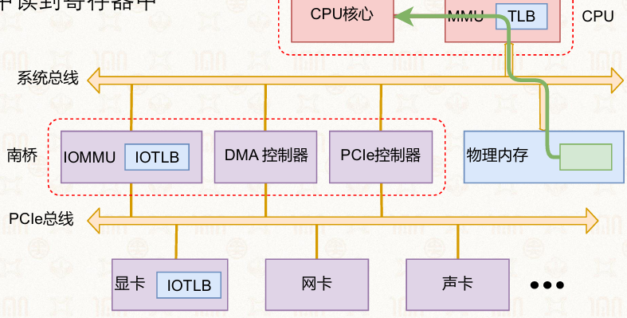

*   数据**从CPU中写到外设**中
    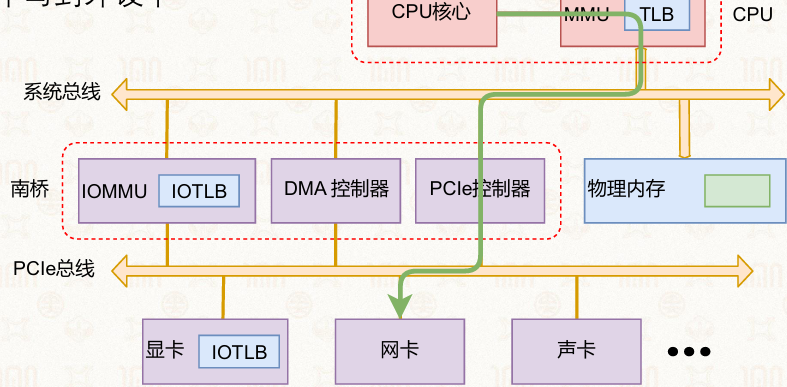

*   数据**从外设写入CPU**中
    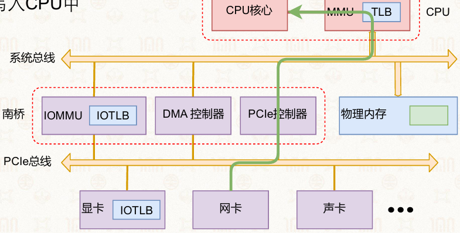

**问题**：对于需要频繁访问的场景，CPU太累且无意义 → 引出DMA。

### 13.3.2 直接内存访问（DMA）

#### 核心思想

现代计算机系统支持外设**绕开处理器**直接存取物理内存，CPU可以做更有价值的事

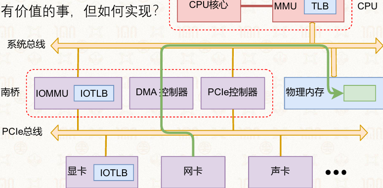

#### DMA工作流程

1.  CPU向DMA控制器发送DMA请求（方向、物理内存位置、大小）
2.  外设直接与内存进行数据传输（无需CPU参与）
3.  DMA 控制器传输完成后通知CPU数据通信过程已结束

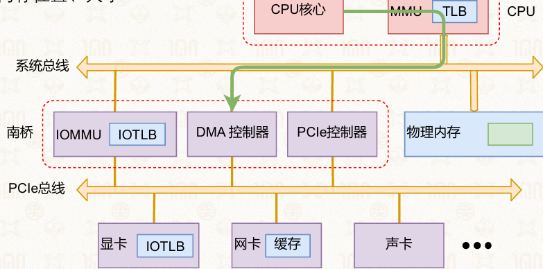

#### DMA的特点

*   设备地址空间特殊、多样，可能比物理内存小，需要再做一次地址转换
*   数据传输无需CPU参与，释放CPU处理其他任务
*   适合高吞吐量I/O场景（如磁盘读写、网络传输）

#### DMA的传输顺序示例

将数据从硬盘读到内存的DMA操作顺序：

1.  ② 初始化DMA控制器并启动硬盘
2.  ③ 从硬盘传输一块数据到内存缓冲区（DMA自动完成）
3.  ① DMA控制器发出中断请求（通知CPU传输完成）
4.  ④ 执行"DMA结束"中断服务程序

正确答案：B（②→③→①→④）

## 13.4 操作系统如何响应设备：中断

### 13.4.1 中断的分类（AArch64）

#### IRQ (Interrupt Request)

*   普通中断，优先级低，处理慢

#### FIQ (Fast Interrupt Request)

*   一次只能有一个FIQ
*   快速中断，优先级高，处理快
*   常为可信任的中断源预留

#### SError (System Error)

*   原因难以定位、较难处理的异常，多由异步中止（Abort）导致
*   如从缓存行（Cacheline）写回至内存时发生的异常

> FIQ和IRQ连接CPU的不同针脚，可在中断控制器中配置

### 13.4.2 中断控制器

#### 主要功能：

*   **分发**：管理所有中断、决定优先级、路由
*   **CPU接口**：给每个CPU核心提供对应的接口

#### 需要考虑的问题：

*   如何指定不同中断的优先级
*   低优先级中断处理中出现了高优先级中断 → 嵌套中断
*   中断交给谁处理
*   如何与软件协同

### 13.4.3 查看中断状态

#### 命令

```bash
$ cat /proc/interrupts
```

**单核系统输出**：

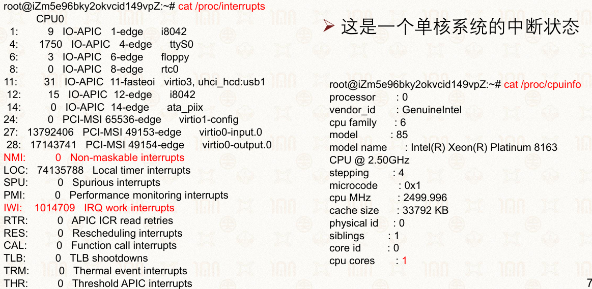

**双核系统输出**（每个逻辑核心接受的中断类型和次数不同）

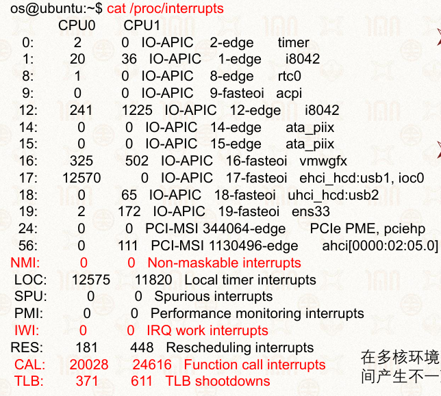

> 查看中断信息是了解系统运行细节的好途径。

### 13.4.4 中断优先级

#### 规则

当多个中断同时发生时（NMI、软中断、异常），CPU首先响应**高优先级**的中断

#### 分类

| 类型                       | 优先级（值越低，优先级越高） |
| ------------------------ | -------------- |
| 复位（Reset）                | -3             |
| 不可屏蔽中断（NMI）              | -2             |
| 硬件故障（Hard Fault）         | -1             |
| 系统服务调用（SvCall）           | 可配置            |
| 调试监控（Debug Monitor）      | 可配置            |
| 系统定时器（SysTick）           | 可配置            |
| 外部中断（External Interrupt） | 可配置            |


### 13.4.5 中断嵌套

#### 中断也能被"中断"

在处理当前中断（ISR）时：

*   更高优先级的中断产生 → 允许高优先级**抢占**
*   相同优先级的中断产生 → **同级中断无法抢占**

> ARM的FIQ可以抢占任意IRQ，但FIQ本身不可被抢占。

### 13.4.6 硬中断

#### 中断的问题

*   抢占用户任务，影响实时性
*   处理中断时必须屏蔽当前号IRQ， 设备缓冲区不够时会导致中断丢失
*   ※中断的处理必须尽可能短

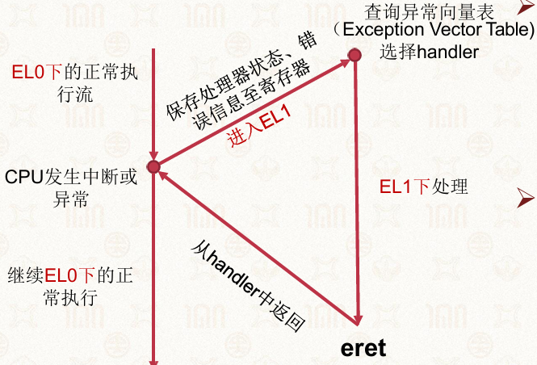

#### 中断处理程函数ISR：

```c
static inline int __must_check
request_irq(unsigned int irq, irq_handler_t handler,
            unsigned long flags, const char *name, void *dev)
{
    return request_threaded_irq(irq, handler, NULL, flags, name, dev);
}
```

#### 处理

因此，中断处理应该越快越好：

*   ISR只做很小的一部分：将某些数据移出缓冲区、标记flag
*   将更多非关键操作推迟到后期完成

#### Linux中断的上下半部（Top Half / Bottom Half）

**设计思想**

将中断处理分为两部分，平衡响应速度和系统开销

##### 上半部（Top Half）：马上做（硬）

*   调用硬件驱动提供的硬中断处理函数handler

    *   处理硬中断

*   因为中断被屏蔽，不要做太多事情（时间、空间受限）

*   快速响应，最小化中断屏蔽时间

##### 下半部（Bottom Half）：延迟完成（软）

*   每个硬中断都可再注册下半部任务

*   处理繁重、非关键操作

*   提供推迟完成任务的机制（都可以被中断）

    *   软中断（Softirqs）：静态分配，内核编译时确定
    *   Tasklet：建立在 Softirqs 之上，可动态创建/销毁
    *   工作队列（Work Queue）：使用进程上下文，可以睡眠

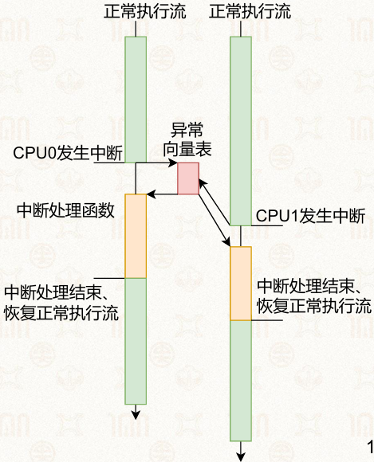

### 13.4.7 软中断（Softirqs）

#### 静态分配

在内核编译时期确定，数量有限。

| 优先级 | 名称                 | 含义                  |
| --- | ------------------ | ------------------- |
| 0   | HI\_SOFTIRQ        | 处理TASKLET\_HI，优先级最高 |
| 1   | TIMER\_SOFTIRQ     | 定时器软中断              |
| 2   | NET\_TX\_SOFTIRQ   | 发送网卡数据包             |
| 3   | NET\_RX\_SOFTIRQ   | 接收网卡数据包             |
| 4   | BLOCK\_SOFTIRQ     | 块设备中断               |
| 5   | IRQ\_POLL\_SOFTIRQ | I/O轮询回调             |
| 6   | TASKLET\_SOFTIRQ   | Tasklet             |
| 7   | SCHED\_SOFTIRQ     | 调度负载均衡              |
| 8   | HRTIMER\_SOFTIRQ   | 高精度定时器              |
| 9   | RCU\_SOFTIRQ       | RCU锁，优先级最低          |


#### Softirqs的特点

*   **执行时间点**

    *   中断之后（上半部之后）
    *   系统调用或异常之后
    *   调度器显式执行`ksoftirqd`

*   **并发性**

    *   可在多核上同时执行
    *   必须是**可重入的**
    *   或根据需要加锁

*   **可中断性**：Softirq运行时可以被中断抢占

#### 可重入函数

**不可重入函数**：使用全局变量，多线程调用可能结果不一致。

```c
int i;
int fun1() { return i * 5; }        // 依赖全局变量，不可重入
int fun2() { return fun1() * 5; } // 调用不可重入函数
```

**可重入函数**：多线程调用均保持一致。

```c
int fun1(int i) { return i * 5; } // 参数传入，可重入
int fun2(int i) { return fun1(i) * 5; }
```

#### Tasklet

**动机**：Softirq是静态的，无法动态创建和销毁。

**Tasklet的特点**：

*   基于Softirqs实现
*   可以被**动态**创建和销毁
*   **同一**类型的Tasklet一次只能运行**一**个（避免并发复杂性）
*   不同类型的Tasklet可以同时运行在不同CPU上

**示例**

```c
struct tasklet_struct {
    struct tasklet_struct *next;
    unsigned long state;
    atomic_t count;
    bool use_callback;
    union {
        void (*func)(unsigned long data);
        void (*callback)(struct tasklet_struct *t);
    };
    unsigned long data;
};
```

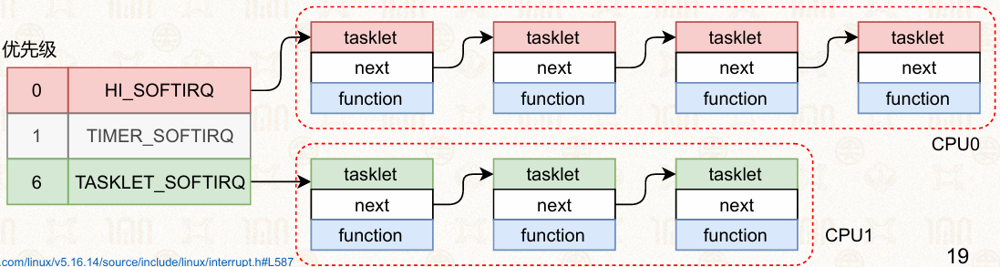

#### 工作队列（Work Queue）

**特点**：使用**进程上下文**，**可以睡眠**！

> Softirq和Tasklet使用中断上下文

**工作方式**：

*   在内核空间维护FIFO队列，`workqueue`内核进程不断轮询队列
*   中断负责`enqueue(fn, args)`
*   workqueue负责`dequeue`并执行`fn(args)`

**优势**：

*   只在内核空间运行
*   不和任何用户进程关联
*   没有跨模式切换和数据拷贝

## 13.5 操作系统如何管理设备

### 13.5.1 驱动程序（Driver）

#### 定义

使操作系统和设备间能相互通信的特殊程序

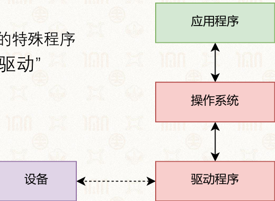

#### 宏内核 vs. 微内核的驱动

| 架构                   | 驱动位置 | 优势   | 劣势                |
| -------------------- | ---- | ---- | ----------------- |
| **宏内核（Monolithic）**  | 内核态  | 性能更好 | 容错性差，驱动崩溃导致整个系统崩溃 |
| **微内核（Microkernel）** | 用户态  | 可靠性好 | 性能开销（IPC通信）       |


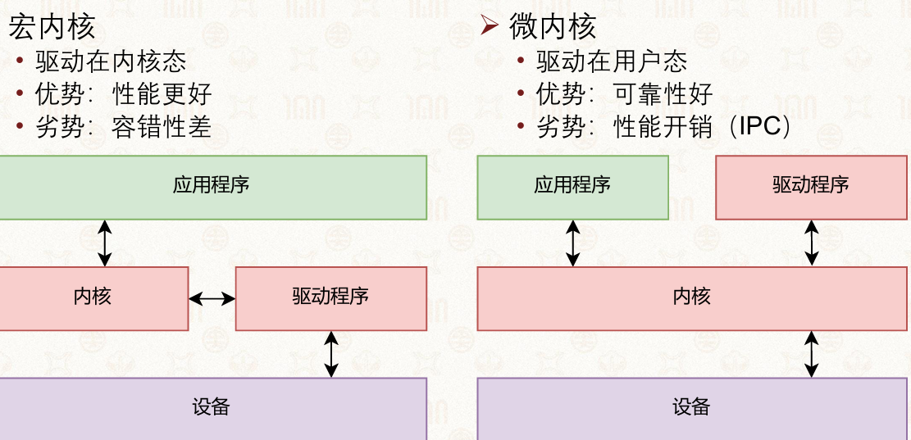

#### 驱动的系统接口：ioctl

`ioctl`让用户空间的应用通过驱动间接与设备交互：

```c
static int ioctl(struct tty_struct *tty, unsigned int cmd, unsigned long arg) {
    struct slgt_info *info = tty->driver_data;
    void __user *argp = (void __user *)arg;
    int ret;

    if (sanity_check(info, tty->name, "ioctl"))
        return -ENODEV;

    DBGINFO(("%s ioctl() cmd=%08X\n", info->device_name, cmd));

    switch (cmd) {
    case MGSL_IOCWAITEVENT:
        return wait_mgsl_event(info, argp);
    case TIOCMIWAIT:
        return modem_input_wait(info, (int)arg);
    case MGSL_IOCSGPIO:
        return set_gpio(info, argp);
    case MGSL_IOCGGPIO:
        return get_gpio(info, argp);
    case MGSL_IOCWAITGPIO:
        return wait_gpio(info, argp);
    case MGSL_IOCGXSYNC:
        return get_xsync(info, argp);
    // ... 其他命令分支
    }

    mutex_lock(&info->port.mutex);
    // ... 剩余逻辑
}
```

#### 驱动模型

让驱动程序可以在系统统一安排下和设备交互

#### 交互链

应用程序 → 系统接口 → 驱动模型 → 驱动程序 → 设备

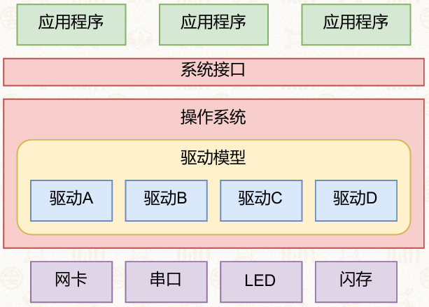

### 13.5.2 驱动模型（LDDM）

#### 为什么需要驱动模型？

Linux在2.4以前没有驱动模型（一样可以用），但：

*   设备的整体趋势

    *   设备的数量和规模越来越大
    *   更新速度越来越快，驱动代码量快速增长

*   驱动开发者的要求

    *   需要标准化的数据结构和接口
    *   将驱动开发简化为对数据结构的填充和实现

#### LDDM的核心功能

*   支持电源管理与设备的热拔插

*   利用**sysfs**向用户空间提供系统信息

*   维护驱动对象的依赖关系与生命周期

    *   驱动人员只需告诉内核对象间的依赖关系
    *   LDDM自动初始化依赖对象，直到条件满足

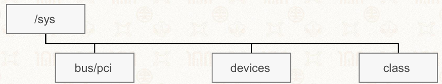

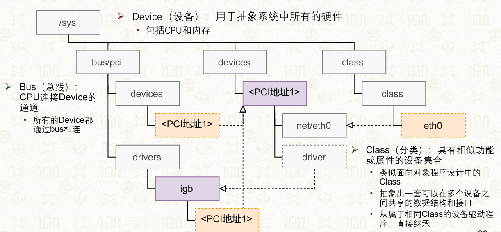

#### LDDM的三层抽象

| 抽象                     | **抽象内容**   | 表示什么   |
| ---------------------- | ---------- | ------ |
| `struct bus_type`      | 对设备连接关系的抽象 | 设备怎么连接 |
| `struct device`        | 对硬件设备的抽象   | 有什么设备  |
| `struct device_driver` | 对设备驱动的抽象   | 怎么使用设备 |


#### struct bus_type

```c
struct bus_type {
    const char *name;               // 总线名称: PCI、USB、I2C、SPI
    const char *dev_name;
    struct device *dev_root;
    const struct attribute_group **bus_groups;  // 总线属性
    const struct attribute_group **dev_groups;
    const struct attribute_group **drv_groups;

    // 添加设备或驱动到该总线时被调用，匹配设备与驱动
    int (*match)(struct device *dev, struct device_driver *drv);
    // 任何属于该bus的device发生变化时被调用，上报热插拔事件
    int (*uevent)(struct device *dev, struct kobj_uevent_env *env);
    // 设备与驱动匹配成功后执行，初始化设备，保证device所属的bus已被初始化
    int (*probe)(struct device *dev);
    void (*sync_state)(struct device *dev);
    // 设备卸载移除回调函数
    void (*remove)(struct device *dev);
    void (*shutdown)(struct device *dev);

    int (*online)(struct device *dev);
    int (*offline)(struct device *dev);
    int (*suspend)(struct device *dev, pm_message_t state);
    int (*resume)(struct device *dev);
    int (*dma_configure)(struct device *dev);

    const struct dev_pm_ops *pm;
    const struct iommu_ops *iommu_ops;
    struct subsys_private *p;
    struct lock_class_key lock_key;
    bool need_parent_lock;
};
// 总线注册函数：若注册成功，新的总线将被添加进系统，可在 /sys/bus 下看到
```

总线的注册

```c
extern int __must_check bus_register(struct bus_type *bus);
```

设备的注册

```c
extern void bus_unregister(struct bus_type *bus);
```

#### struct device

```c
struct device {
    struct device *parent;                // 父设备
    const char *init_name;                // 设备名
    const struct device_type *type;       // 设备类型
    struct bus_type *bus;                 // 所属总线
    struct device_driver *driver;         // 对应的驱动
    dev_t devt;                           // 设备号
    void *driver_data;                    // 驱动私有数据
    struct dev_pm_info power;             // 电源管理
    const struct dma_map_ops *dma_ops;    // DMA操作
    struct class *class;                  // 设备类型集合
    // ...
};
```

设备的注册：

```c
int device_register(struct device *dev)
```

设备的注销：

```c
void device_unregister(struct device *dev)
```

#### struct device_driver

```c
struct device_driver {
    const char *name;                      // 驱动名称
    struct bus_type *bus;                  // 所属总线
    struct module *owner;
    bool suppress_bind_attrs;
    enum probe_type probe_type;
    const struct of_device_id *of_match_table;
    const struct acpi_device_id *acpi_match_table;
    
    int (*probe)(struct device *dev);      // 热插: 检测到设备
    void (*sync_state)(struct device *dev);
    int (*remove)(struct device *dev);     // 热拔: 移除设备
    
    // 电源管理接口
    void (*shutdown)(struct device *dev);
    int (*suspend)(struct device *dev, pm_message_t state);
    int (*resume)(struct device *dev);
    // ...
};
```

驱动的注册：
```c
int driver_register(struct device_driver *drv)
```

驱动的注销：
```c
void driver_unregister(struct device_driver *drv)
```

#### LDDM的工作流程

1.  device_driver和device都注册到bus上
2.  bus_type的match()匹配设备和驱动
3.  匹配成功后，调用device_driver的probe()
4.  probe()成功后内核生成设备实例
5.  驱动注册的file_operations可被应用程序访问

*   device为bus_type 、device_driver父类的多继承

    *   要实例化一个device，先实例化父类driver和bus

## 13.6 设备树（Device Tree）

### 13.6.1 设备树的由来

#### 问题：如何描述一个设备？

例如串口：

```c
struct uart_struct {
    const char *name;
    unsigned baudrate;
};

uart = {
    .name = "uart0",
    .baudrate = 115200,
};
```

#### 设备树（Device Tree）的解决方案：

*   **定义**：描述硬件的数据结构

*   硬件信息通过 Device Tree Source（DTS）传递给内核

    *   避免在内核中编码大量硬件细节
    *   冗余的硬件信息可以包含和引用

#### 模型

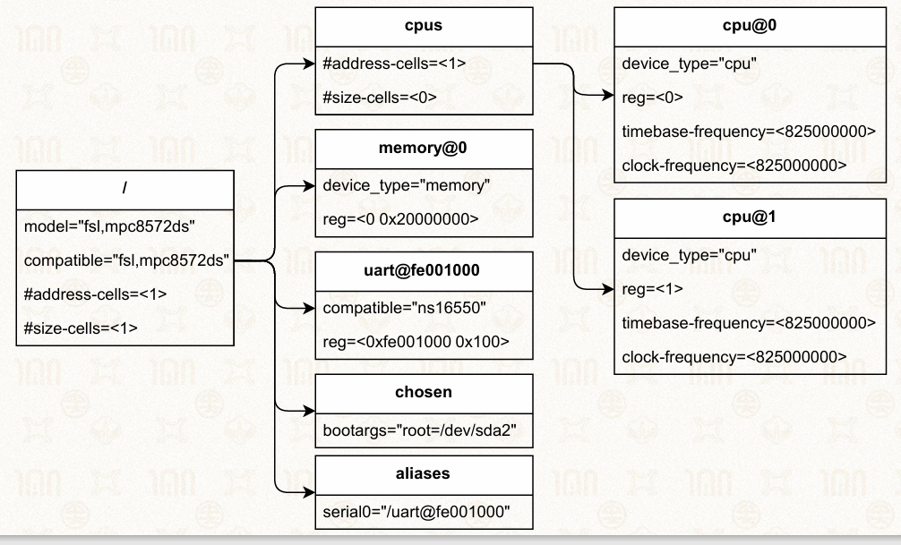

### 13.6.2 DTS语法

```dts
/ {//根节点
    node@40000000 {//节点名@地址
        a-string-property = "a string";
        a-string-list-property = "first string", "second string";//数组属性
        a-byte-data-property = [0x01 0x02 0x03];//二进制值
        
        child-node@0 {
            first-child-property;
            second-child-property;
            a-string-property = "child string";
            a-reference-to-some = <node1>;//节点引用
        };
        
        child-node@1 { };
    };
    
    //标签
    node1: node@1 {
        an-empty-property;
        a-cell-property = <1 2 3>;//多值属性
        child-node1 { };
    };
};
```

#### DTS语法要点：

| 语法                            | 说明          |
| ----------------------------- | ----------- |
| `节点名@地址`                      | 设备节点定义      |
| `property = "string"`         | 字符串属性       |
| `property = <1 2 3>`          | 数值/引用属性（多值） |
| `property = [0x01 0x02 0x03]` | 二进制数据属性     |
| `&node1`                      | 节点引用        |
| `node1: node@1`               | 带标签的节点      |


### 13.6.3 驱动对DTS的使用

#### 匹配

通过`compatible`属性进行设备与驱动的匹配：

```c
static const struct of_device_id stm32_match[] = {
    { .compatible = "st,stm32-uart", .data = &stm32f4_info },
    { .compatible = "st,stm32f7-uart", .data = &stm32f7_info },
    { .compatible = "st,stm32h7-uart", .data = &stm32h7_info },
    { },
};

static struct platform_driver stm32_serial_driver = {
    .probe = stm32_usart_serial_probe,
    .remove = stm32_usart_serial_remove,
    .driver = {
        .name = DRIVER_NAME,
        .pm = &stm32_serial_pm_ops,
        .of_match_table = of_match_ptr(stm32_match),
    },
};
```

#### 加载加载

驱动是以模块的形式动态加载

```c
static int __init stm32_usart_init(void)
{
    int ret;
    pr_info("STM32 USART driver initialized\n");
    
    ret = uart_register_driver(&stm32_usart_driver);
    if (ret)
        return ret;
        
    ret = platform_driver_register(&stm32_serial_driver);
    if (ret)
        uart_unregister_driver(&stm32_usart_driver);
        
    return ret;
}

module_init(stm32_usart_init);
module_exit(stm32_usart_exit);
```
