# 14章 系统虚拟化

## 14.1 虚拟化概述

### 14.1.1 虚拟化发展历史

1.  **大型机时代（70年代）**：计算资源集中，多用户分时共享大型机，虚拟化技术诞生；
2.  **PC单机时代（80-90年代）**：计算资源分散，单用户独占PC，虚拟化需求低、技术沉寂；
3.  **云计算时代（21世纪至今）**：业务峰值差异大、服务器资源利用率低，虚拟化成为云底层核心支撑技术。

### 14.1.2 业务痛点：日常与峰值资源矛盾

线上业务流量存在巨大潮汐差：

*   示例1：微博日常仅需1万台服务器，明星热点峰值需要10万台；
*   示例2：淘宝双11、12306春运抢票瞬时流量暴涨； 若按峰值采购硬件，平时大量服务器闲置，资源成本极高。 虚拟化通过**资源时分复用、弹性伸缩**解决闲置浪费，支撑云按需租赁。

### 14.1.3 虚拟化核心优势

#### 服务器整合，提升资源利用率

*   物理机空载时CPU利用率普遍不足20%
*   一台物理机运行多台虚拟机
*   提升物理机资源利用率
*   降低成本，云厂商可通过资源超售盈利。

#### 方便程序开发

*   虚拟机可单步调试完整操作系统

    *   查看当前虚拟硬件的状态：寄存器值\内存映射etc
    *   随时修改虚拟硬件的状态

*   测试应用程序的兼容性

    *   一台物理机同时运行Windows、Linux等多系统
    *   快速测试软件跨平台兼容性

#### 简化运维，支持热迁移

*   通过API（接口）管理虚拟机

    *   创建/开机/关机/销毁虚拟机

    *   方便高效

*   支持虚拟机热迁移

    *   物理机硬件升级、故障维护时不中断业务

### 14.1.4 分层接口基础概念

#### ISA（指令集架构）

*   区分软硬件的边界

*   分为用户ISA

    *   通用运算指令，用户/内核态均可执行

*   系统ISA

    *   特权指令，仅内核可执行
    *   操作寄存器、内存、中断
    *   和CPU状态相关PSTATE

#### ABI（应用二进制接口）

*   提供操作系统服务或硬件功能
*   包含用户ISA和系统调用

#### API（应用编程接口）

*   高级库提供函数接口（C标准库等）
*   面向开发者，底层封装ABI系统调用
*   包含库的接口和用户ISA

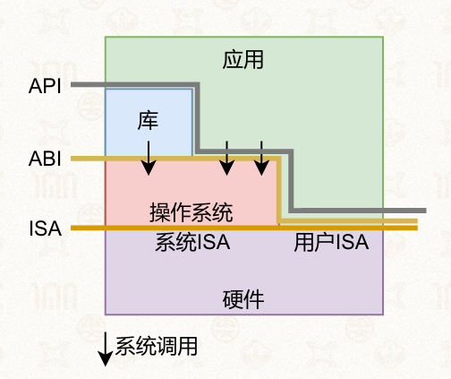

## 14.2 系统虚拟化基础概念

### 14.2.1 虚拟机与VMM（Hypervisor）

#### 概念

**虚拟机（VM）**：完整虚拟计算机，包含虚拟CPU、内存、磁盘、网卡，内部可独立安装操作系统与应用

**虚拟机监控器VMM/Hypervisor**：介于物理硬件与虚拟机之间的中间软件层，

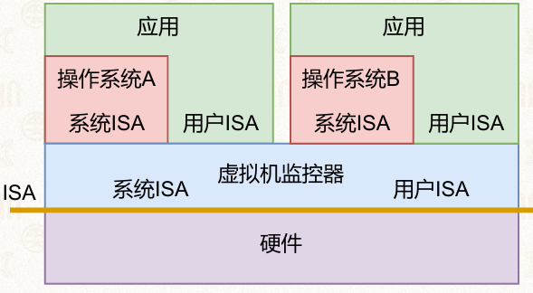

#### VMM的职责

*   向上为虚拟机完整暴露标准ISA指令集；
*   统一调度、隔离所有物理CPU/内存/IO硬件资源；
*   捕获虚拟机特权操作并模拟执行，实现资源虚拟化

> 从操作系统看Machine，ISA提供了操作系统和Machine之间的界限

#### 高效虚拟化三大标准特性：

1.  **等价性**：虚拟机内程序运行行为与真实物理硬件完全一致；
2.  **性能损耗极小**：虚拟机只比在无虚拟化的情况下性能略差一点
3.  **资源受控**：VMM拥有所有物理资源最高管控权，虚拟机无法越权访问硬件

### 14.2.2 VMM两大分类

#### Type 1 裸金属型Hypervisor

*   直接运行在物理硬件之上

    *   本身充当底层操作系统；
    *   直接管理CPU、内存、驱动，无宿主OS中间层
    *   实现调度、内存管理、驱动等功能

*   性能损耗低；

*   代表产品：Xen、VMware ESXi。 架构：物理硬件 → Type1 VMM → 多台虚拟机

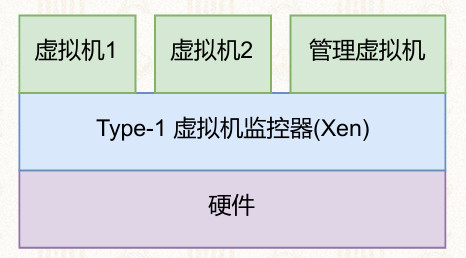

#### Type 2 宿主型Hypervisor

*   依赖底层宿主操作系统，在已有的操作系统之上将虚拟机当做应用运行

*   复用复用主机操作系统的大部分功能

    *   文件系统
    *   调度器
    *   驱动
    *   物理内存管理

*   部署简单，普通PC即可使用；

*   代表产品：QEMU/KVM、VirtualBox、VMware Workstation。 架构：物理硬件 → 宿主OS → Type2 VMM → 多台虚拟机

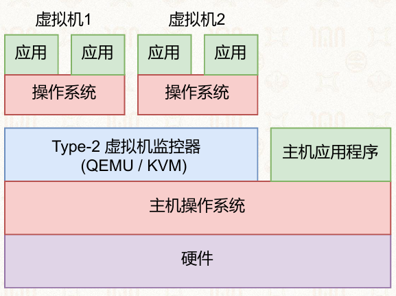

### 14.2.3 虚拟化核心难点：管好系统ISA

#### 难点（理想可虚拟化架构）

系统ISA中特权指令（读写系统寄存器、页表、中断控制WFI/CPS等）是虚拟化核心难点：

*   **理想可虚拟化架构**：**所有敏感指令都是特权指令**，虚拟机用户态执行会自动触发下陷（Trap），交由VMM模拟；
*   ARM架构缺陷：存在非特权敏感指令（如CPSID/CPSIE开关中断，用户态执行仅空操作，不会下陷），原生无法直接虚拟化，必须额外处理

#### 系统虚拟化的流程

*   第一步

    *   捕捉所有系统ISA并下陷(Trap)

*   第二步

    *   由具体指令实现相应虚拟化

        *   控制虚拟处理器行为
        *   控制虚拟内存行为
        *   控制虚拟设备行为

*   第三步

    *   回到虚拟机继续执行

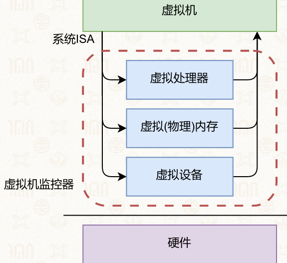

#### 系统虚拟化技术

*   处理器虚拟化

    *   捕捉系统ISA
    *   控制虚拟处理器的行为

*   内存虚拟化

    *   提供“假”物理内存的抽象

*   设备虚拟化

    *   提供虚拟的I/O设备

## 14.3 CPU虚拟化四种实现方案

### 14.3.0 下陷(Trap)与模拟(Emulate)

#### 下陷Trap

*   虚拟机内核在非特权级执行敏感特权指令，CPU触发异常，自动切换到VMM

    *   VM操作系统不知道自己在用户态
    *   当操作系统执行系统ISA指令时下陷

#### 模拟Emulate

*   VMM捕获下陷后，执行对应软件逻辑模拟硬件行为，完成指令功能；

#### 一套完整虚拟化流程

虚拟机执行敏感指令 → 下陷进入VMM → VMM模拟操作 → 切回虚拟机继续运行

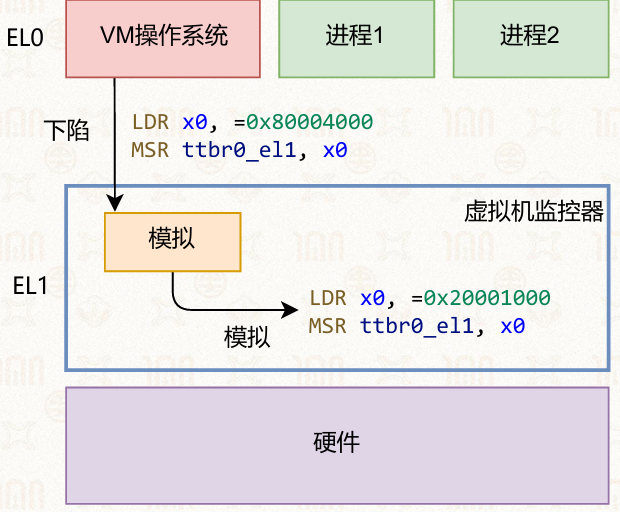

### 14.3.1 解释执行

#### 原理

*   逐条读取虚拟机指令，完全用软件模拟CPU行为

    *   不区分敏感指令还是其他指令
    *   不直接在物理CPU执行虚拟机任何指令。

*   使用内存维护虚拟机状态

    *   例如：使用uint64\_t x\[30]数组保存 所有通用寄存器的值

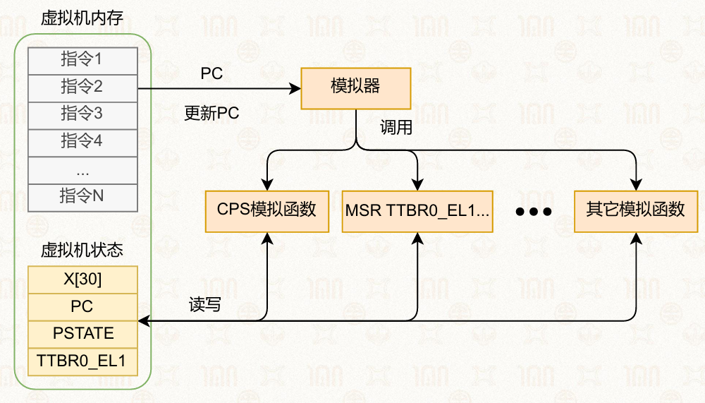

#### 优点

*   兼容任意异构ISA
*   解决了敏感函数不下陷的问题
*   实现简单

#### 缺点

性能极差，每条虚拟机指令需要多条宿主CPU指令模拟，几乎无生产使用场景。

### 14.3.2 二进制翻译

#### 原理

以基本块为单位批量翻译虚拟机指令为宿主原生指令，缓存翻译后的代码块，重复执行时直接复用缓存，减少重复模拟开销

*   每一个基本块被翻译完后叫代码补丁

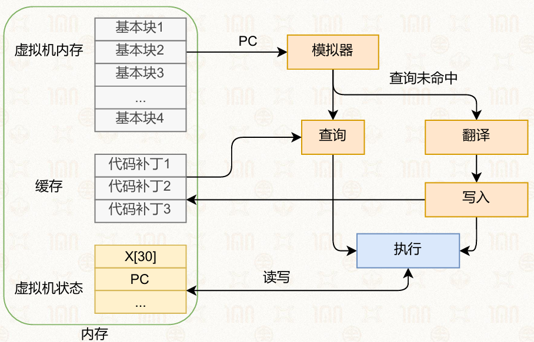

#### 缺陷

1.  无法处理自修改代码（运行时动态修改指令块）
2.  中断只能在基本块边界注入，中断响应延迟高

### 14.3.3 半虚拟化（Para-virtualization）

#### 原理

协同设计，修改虚拟机操作系统内核，移除不下陷的敏感指令，替换为VMM专属超级调用HVC（Hypercall，虚拟机专属系统调用），主动向VMM申请硬件操作。

#### 优点

无需逐条捕获指令，I/O场景性能提升明显

#### 缺点

必须修改客户机内核，无法适配Windows等闭源商用操作系统

### 14.3.4 硬件虚拟化（主流工业方案）

#### x86 Intel VT-x架构

**两套特权模式**：

1.  **Root根模式**：VMM运行，最高权限，管理全部物理资源；

2.  **Non-root非根模式**：虚拟机运行，虚拟机内核、应用均在此模式

    *   配套VMCS（4KB内存页）：存储虚拟机与VMM全部CPU状态

        *   VM Entry：硬件自动加载VM状态，进入虚拟机运行
        *   VM Exit：虚拟机触发敏感操作/中断，硬件保存VM状态，切回VMM

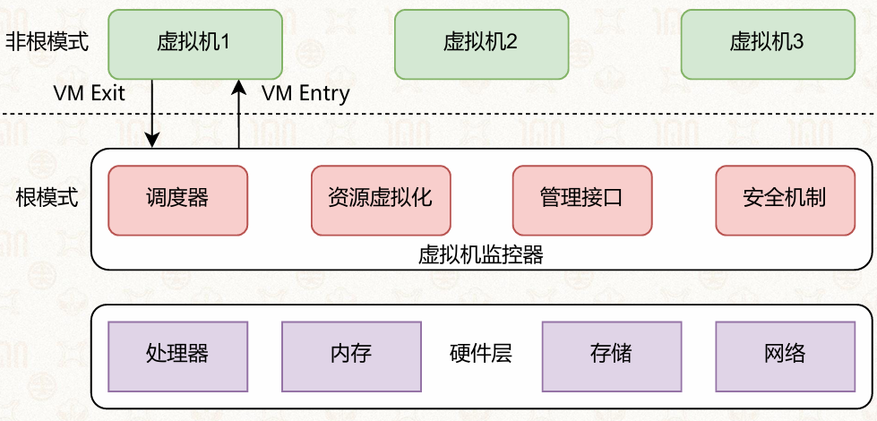

#### ARM EL2虚拟化扩展

ARMv8架构新增EL2特权层作为VMM运行层：

*   EL0：虚拟机用户进程；
*   EL1：虚拟机操作系统内核；
*   EL2：Hypervisor VMM；
*   HCR\_EL2寄存器：控制各类指令是否触发VM Exit下陷； ARMv8.1引入VHE扩展，EL2可直接运行未修改Linux宿主OS，简化Type2 KVM实现

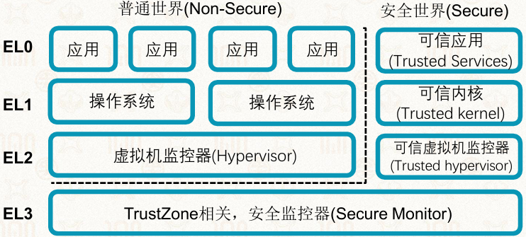

**type-2**

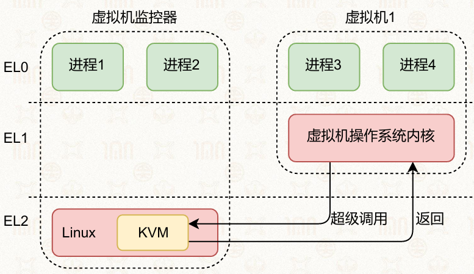

## 14.4 内存虚拟化

### 14.4.1 三层地址模型

1.  **GVA 客户虚拟地址**：虚拟机内进程使用的虚拟地址
2.  **GPA 客户物理地址**：虚拟机内部“虚拟物理内存”，VMM管理
3.  **HPA 主机物理地址**：真实服务器物理内存地址，VMM管理

### 14.4.2 内存虚拟化三种实现

#### 影子页表 Shadow Page Table

VMM为每台虚拟机维护一套影子页表，同步虚拟机页表映射，直接完成GVA→HPA翻译，早期纯软件虚拟化方案，维护开销巨大。

#### 直接页表

虚拟机直接感知自己运行在虚拟化环境，主动向VMM申请物理内存，放弃“虚拟物理内存连续0地址”的隔离，兼容性差，极少使用。

#### 硬件两级页表（工业标准）

*   Intel：EPT扩展；ARM：Stage-2第二阶段页表 翻译流程：

1.  虚拟机第一级页表：GVA → GPA

2.  VMM维护第二阶段页表：GPA → HPA； 单次内存访问最差需要24次物理内存查表，TLB缓存至关重要

    *   一级缺页：虚拟机内部缺页，虚拟机内核处理
    *   二级缺页：GPA无对应HPA，触发VM Exit交由VMM分配内存

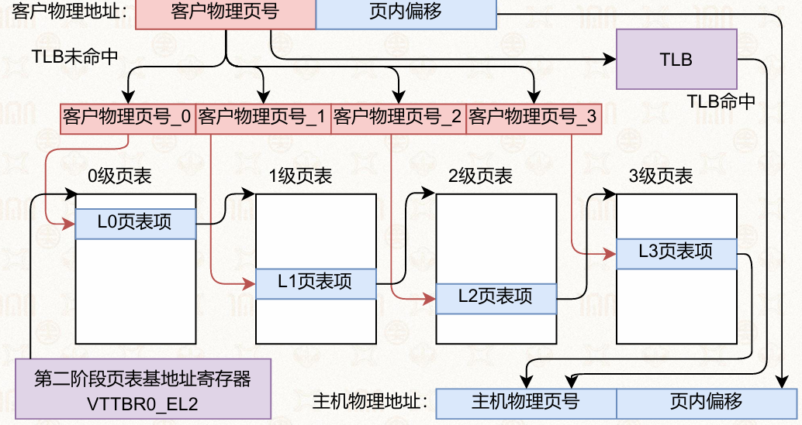

## 14.5 I/O虚拟化

### 14.5.1 I/O虚拟化必要性

#### 问题

若虚拟机直接访问物理网卡、磁盘

1.  多台虚拟机共享硬件会出现MAC/IP冲突、数据串扰；
2.  恶意虚拟机可通过DMA读取其他虚拟机内存，存在安全隔离漏洞

#### 目标

*   提供独立虚拟设备
*   隔离各虚拟机硬件访问
*   提高物理设备利用率

### 14.5.2 设备模拟（QEMU纯模拟）

VMM软件完整模拟真实硬件寄存器、中断、DMA行为，捕获虚拟机MMIO/PIO访问并模拟响应

#### 优点

*   可以模拟任意设备（无论老旧）
*   不需要修改硬件
*   支持流量拦截、快照

#### 缺点

大量下陷模拟，I/O性能损耗极大

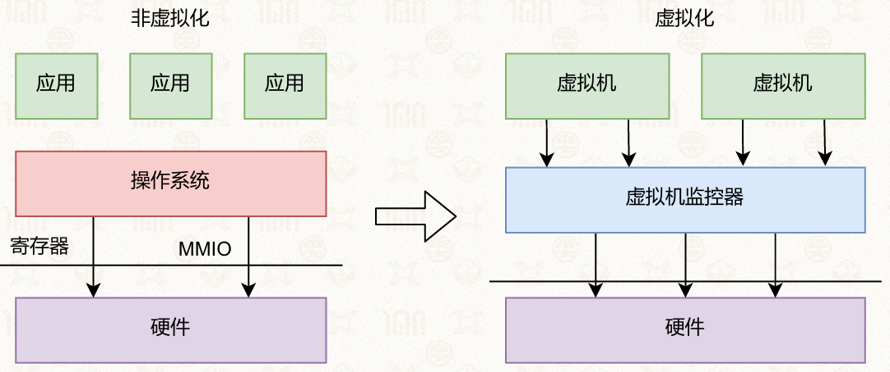

### 14.5.3 半虚拟化 VirtIO（云主流）

#### 设计

*   协同设计

    *   虚拟机知道自己在虚拟化中
    *   虚拟机内运行前端、虚拟机监控器内运行后端

*   虚拟机监控器主动提供超级调用

*   通过共享内存传递指令和命令

#### 架构

1.  客户机前端VirtIO驱动；
2.  VMM后端驱动；
3.  Virtqueue共享环形队列传递I/O请求，通过Hypercall批量提交操作，减少下陷次数

#### 优点

*   I/O性能接近物理硬件
*   实现简单

#### 缺点

*   需要修改虚拟机操作系统内核

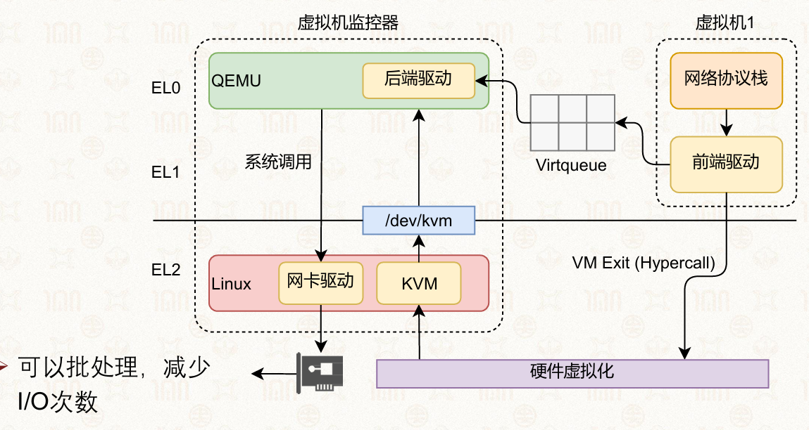

### 14.5.4 设备直通Passthrough

硬件虚拟化IOMMU支持，将完整物理设备直接分配给单台虚拟机，VMM仅转发中断，无模拟损耗。

*   优点
*   性能和裸金属一致；
*   缺点：一台设备同一时间只能给一个虚拟机，无法共享。
