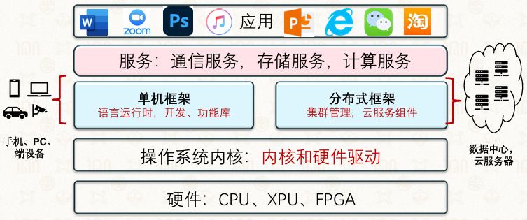
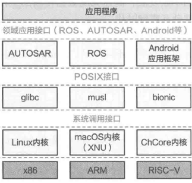
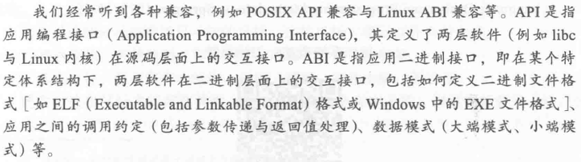

# 第一章 操作系统概述

## 1.2什么是操作系统

*   是管理硬件资源、控制程序运行、改善人机界 面和为应用软件提供支持的一种系统软件

*   对下管理硬件，对上构筑应用生态

*   从硬件角度

    *   管理硬件：将复杂的、具备不同功能的硬件资源纳入统一管理
    *   对硬件进行抽象：负责将硬件抽象为应用程序更容易使用的资源

*   从应用角度

    *   服务应用：为应用提供了不同层次、不同功能的接口提供不同类型的服务

        *   为应用提供计算资源的抽象
        *   为应用提供线程间的同步
        *   为应用提供进程间的通信

    *   管理应用：负责对应用的生命周期进行管理

        *   生命周期的管理
        *   计算资源的分配
        *   安全与隔离

    *   管理和服务的目标有可能存在冲突

        *   服务的目标：单个应用的运行效率最大化
        *   管理的目标：系统的资源整体利用率最大化

### **定义**

#### 1. 核心功能

*   资源转化：将有限、离散的硬件资源，抽象为无限、连续的可用资源。

#### 2. 软件角度定义

*   硬件资源虚拟化：对底层硬件进行抽象和封装，向上提供统一接口。

*   管理功能可编程：提供可编程的系统管理能力，支持应用程序调用。

#### 3. 结构角度定义

*   操作系统内核：负责核心的资源管理和调度。

*   系统框架：提供支撑应用运行的基础环境。

*   整体 = 操作系统内核 + 系统框架。

## 1.3操作系统简史

### 1.3.1批处理操作系统：GM-NAA I/O

*   诞生：1956 年，Robert L. Patrick & Owen Mock，运行在 IBM 704 上

*   功能：实现输入 / 输出自动化，将任务成批处理，无需人工值守

*   历史地位：是世界上**第一个实际使用的操作系统**，标志着批处理时代的开始

### 1.3.2通用操作系统：OS/360

*   **诞生**：1964 年，IBM System/360 配套系统

*   **核心突破**：

    *   首次将操作系统与计算机硬件分离，进入通用操作系统时代
    *   定义指令集架构（ISA），实现软硬件解耦
    *   总架构师 Gene Amdahl 提出阿姆达尔定律
    *   项目经理 Fred Brooks 著《人月神话》，开创软件工程学科

### 1.3.3分时与多任务：Multics → UNIX → Linux

*   **Multics（1964，MIT/GE）**：

    *   提出分时、文件系统、动态链接等开创性概念
    *   由 Fernando Corbato 主导，1990 年图灵奖

*   **UNIX（1969，贝尔实验室）**：

    *   Ken Thompson &#x26; Dennis Ritchie 开发，简化 Multics
    *   引入 shell、管道；1973 年用 C 语言重写，可移植性大幅提升

*   **Linux（1991，Linus Torvalds）**：

    *   开源，基于 MINIX 启发，成为最流行的开源操作系统

### 1.3.4图形化人机交互：Xerox Alto → macOS → Windows

以人为本的人机交互

*   **Xerox Alto（1973）**：首个图形化操作系统，引入桌面、鼠标（Chuck Thacker，2009 年图灵奖）
*   **macOS（Apple）**：1979 年 Jobs 访问 Xerox PARC，1983 年发布 Apple Lisa，后演变为 Macintosh
*   **Windows（Microsoft）**：1985 年发布 Windows 1.0，基于图形界面，开启与苹果的竞争

### 1.3.5移动互联网时代：iOS → Android

*   **iOS（2007，Apple）**：

    *   随 iPhone 发布，多点触控交互
    *   基于 macOS 内核（Mach + BSD），应用框架 Cocoa Touch
    *   衍生 watchOS、tvOS、iPadOS，iCloud 统一服务

*   **Android（2008，Google）**：

    *   基于 Linux 内核，开源模式，OHA 联盟主导
    *   主导移动市场，Google Mobile Services 成为生态核心

## 1.4操作系统接口

*   **系统调用接口**：应用程序通过操作系统内核提供的接口向内核申请服务

*   **POSIX接口**：可移植操作系统接口，用于实现同一应用程序在不同操作系统上的可移植性

    *   Portable Operating System Interface for uniX

    *   继承自UNIX API，由IEEE提出

    *   通过c语言库（libc）在用户地址空间实现

    *   优点：

        *   应用程序只需要调用libc接口就可以实现对操作系统功能的调用
        *   可支持应用在类UNIX系统（包括Linux）上的可移植性
        *   使新操作系统可以通过移植libc支持现有的应用生态

*   **领域应用接口**：在POSIX或操作系统调用的基础上，封装面向不同领域的应用接口

