# 2章 操作系统结构

复杂系统的构建必须考虑其内部结构

*   不同目标之间往往存在冲突
*   不同需求之间需要进行权衡

**操作系统需要满足的目标**

*   **用户**

    *   方便使用
    *   容易学习
    *   功能齐全
    *   安全
    *   流畅

*   **系统**

    *   容易设计、实现
    *   容易维护
    *   灵活性
    *   可靠性
    *   不易出错
    *   高效性

## 2.1操作系统的机制与策略

**重要设计原则**：将策略与机制相分离

*   策略（Policy）：要做什么 —— 相对动态
*   机制（Mechanism）：怎么做 —— 相对静态

**好处**

*   可仅通过调整策略来适应不同应用的需求
*   可通过持续优化具体的机制来不断完善对具体策略的支持

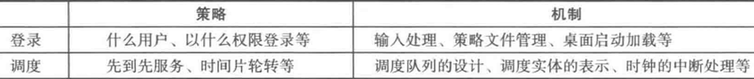

## 2.2操作系统复杂性的管理方法——M.A.L.H方法（原则）

**意义**：是降低复杂性和组织各种功能模块的有效方法

*   **模块化 (Modularity)**

    *   分治法

        *   将一个复杂系统分解为一系列通过明确定义的接口进行交互的模块

    *   高内聚和低耦合

*   **抽象 (Abstract)**

    *   将接口与内部实现分离
    *   像 C++ 类一样
    *   尽可能减少模块间的交互， 从而减少错误在模块间传递，提升效率、质量、性能

*   **分层 (Layering)**

    *   模块化 + 抽象，强调层内完整性

    *   将模块划分，约束每层内模块间与跨层次模块间的交互方式

    *   通常原则：只能与同层即相邻上下层交互，不能跨层

    *   不同类模块之间的层次化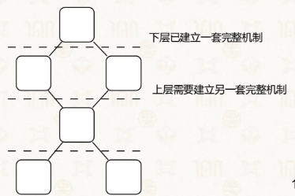

*   **层级 (Hierarchy)**

    *   天然的包含关系

    *   强调包含

    *   把功能相近的模块组成一个具有清晰接口的自包含子系统

    *   同类模块之间的分层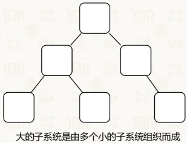

## 2.3操作系统内核架构

**内核的重要性**：多个应用程序需要共享硬件设备，需要有一个能控制所有硬件的“主理人”

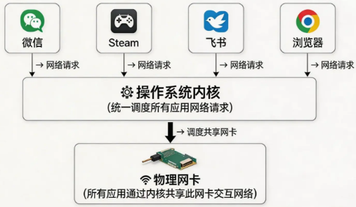

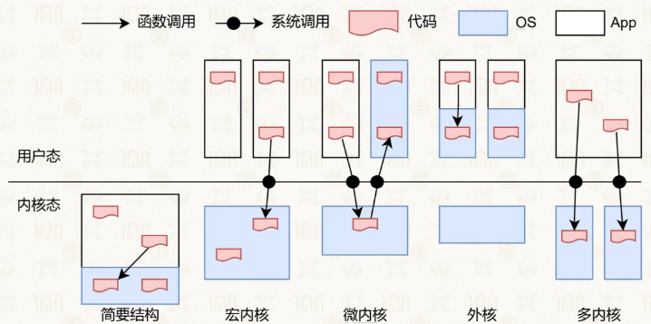

### 2.3.1简要结构

*   应用程序与操作系统在同一个地址空间中
*   没有内存管理
*   没有特权级隔离
*   就是一个大程序
*   用在微控制单元等相对简单的硬件上
*   优点：快
*   缺点：容易整个系统崩溃，没有良好的隔离能力

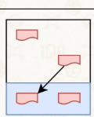

典型的简要结构系统：MS-DOS

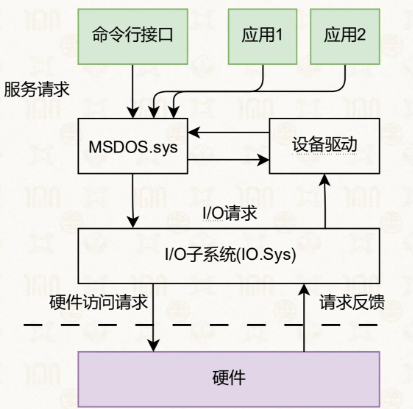

### 2.3.2宏内核

Linux

**宏内核基本架构**

*   分层结构：整个系统分为内核层与应用层两层

    *   内核：运行在特权级，集中控制所有计算资源（整合文件系统、内存管理、设备驱动、进程调度、同步原语、IPC 等）
    *   应用：运行在非特权级，受内核管理，通过系统调用使用内核服务

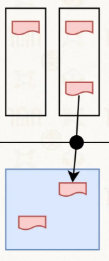

**宏内核的优缺点**

*   优点

    *   拥有丰富的社区沉淀与生态
    *   经过 30 年优化，适配不同场景

*   结构性缺陷

    *   安全性与可靠性问题：模块间无强隔离机制，单点故障易扩散
    *   实时性支持问题：系统过于复杂，无法完成最坏情况时延分析
    *   系统庞大阻碍创新：Linux 内核代码量超 2000 万行，维护与迭代成本高

**宏内核难以满足的场景**

*   向上 / 向下扩展：难以从 KB 级到 TB 级灵活裁剪与扩展
*   硬件异构性：难以长期支持定制化解决方案
*   功能安全：Linux 无法通过汽车安全完整性认证（ASIL-D）
*   信息安全：单点错误会导致系统崩溃，存在大量已知安全漏洞（CVE）
*   确定性时延：Linux 耗时 10 + 年合并实时补丁，仍无法稳定支持确定性时延要求

### 2.3.3微内核

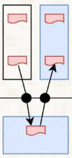

**设计原则：最小化内核功能**

*   将操作系统功能移到用户态，称为"服务"（Server）

*   在用户模块之间，使用消息传递机制通信

    *   进程间通信：Inter-Process Communication, IPC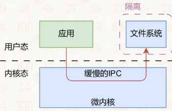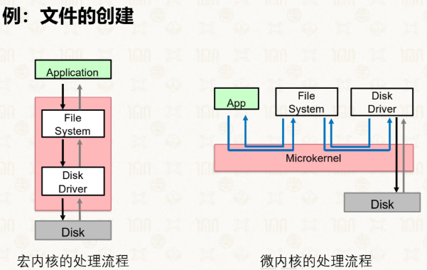

微内核的发展

*   第一代：Mach

    *   1985年卡内基梅隆大学开发
    *   IPC过于通用，且Mach自身资源占用过大
    *   虚拟内存，用户态多进程，分布式支持

*   第二代：L3/L4

    *   微内核最小化原则：尽可能将操作系统的功能放置在内核态以外
    *   性能极高
    *   可能导致DoS攻击

*   第三代：seL4

    *   Capability：能力机制，更精确、更细粒度地授予不同应用程序对内核对象的调用权
    *   引入形式化证明方法
    *   微核上的服务满足互不干扰等属性

**优点**

*   易于扩展：直接添加一个用户进程即可为操作系统增加服务
*   易于移植：大部分模块与底层硬件无关
*   更加可靠：在内核模式运行的代码量大大减少
*   更加安全：即使存在漏洞，服务与服务之间存在进程粒度隔离
*   更加健壮：单个模块出现问题不会影响到系统整体

**缺点**

*   性能较差：内核中的模块交互由函数调用变成了进程间通信
*   生态欠缺：尚未形成像Linux一样具有广泛开发者的社区
*   重用问题：重用宏内核操作系统提供兼容性，带来新问题

### 2.3.4混合内核

比如宏内核与微内核的结合

*   将需要性能的模块重新放回内核态

    *   macOS / iOS：Mach微内核 + BSD 4.3 + 系统框架
    *   Windows NT：微内核+ 内核态的系统服务+ 系统框

### 2.3.5外核

外核架构（Exokernel）+库（LibOS）

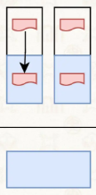

*   **Exokernel 不提供硬件抽象**

    *   "只要内核提供抽象，就不能实现性能最大化"
    *   只有应用才知道最适合的抽象（end-to-end原则）

*   **Exokernel 不管理资源，只管理应用**

    *   负责将计算资源与应用的绑定，以及资源的回收
    *   保证多个应用之间的隔离-

*   **Exokernel 把时间切片**

    *   在一个切片内，系统只服务一个应用，该应用可以访问所有硬件资源

*   **库OS（LibOS）**

    *   **策略与机制分离**：将对硬件的抽象以库的形式提供
    *   **高度定制化**：不同应用可使用不同的LibOS，或完全自定
    *   **更高性能**：LibOS 与应用其他代码之间通过函数调用直接交互
    *   **更安全可靠**：拥有特权的内核可以做到非常小，同时多个LibOS强哥里，提升安全性和可靠性

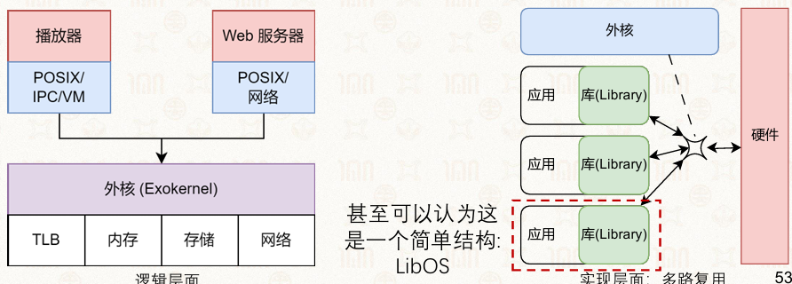

**Exokernel 架构设计**

*   **设计原则**：“将管理与保护分离”

*   **Exokernel 的功能**

    *   追踪计算资源的拥有权
    *   保证资源的保护
    *   回收对资源的访问权

*   **Exokernel 对应的技术**

    *   安全绑定

        *   将LibOS与计算资源绑定

            *   可用性：允许某个LibOS访问某些计算资源（如物理内存）
            *   隔离性：防止这些计算资源被其他LibOS访问

    *   显式回收（Visible revocation）

        *   Exokernel 与应用之间的协议

            *   Exokernel 显式告知应用资源的分配情况
            *   应用在租期结束之前主动归还资源

    *   终止协议（Abort protocol）

        *   若应用不归还资源，则强制中止

            *   Exokernel 拥有对资源的控制权
            *   主动解除资源与应用间的绑定关系

**优点**

*   OS无抽象，能在理论上提供最优性能
*   应用对计算有更精确的实时等控制
*   LibOS 在用户态更易调试，调试周期更短

**缺点**

*   对计算资源的利用效率主要由应用决定
*   定制化过多，导致维护难度增加
*   可能不知道正在运行哪一种操作系统

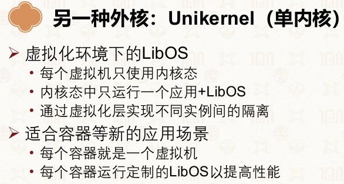

### 2.3.6多内核

*   实验型的操作系统内核架构（OS内核架构）
*   将一个众核系统看作由多个独立处理器核通过网络互联而成的分布式系统
*   节点间的交互由OS节点之上的进程间通信来完成

**设计思路**

*   每个核上运行独立小内核（OS node）
*   应用运行在 OS node 之上
*   节点间通过高速互连通信

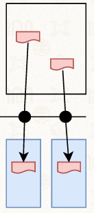

**优点**

*   可以避免传统操作系统架构中复杂的隐式共享带来的性能可扩展性瓶颈
*   易于支持异构处理器架构，因为不同处理器核上运行的节点是独立的且可不同

**缺点**

*   不同节点之间的状态存在冗余，导致一定的资源开销
*   上层应用必须使用多内核提供的线程间通信接口才能交互，需移植现有应用才能适应多内核架构
*   绝对性能不一定存在优势

**典型案例**

*   Barrelfish

    *   ETH/Zurich 研发
    *   多 OS node 架构，支持 CPU/ARM/GPU
    *   核心：Dispatcher + Domain 机制

*   Popsicle Linux

    *   多 ARM 核异构架构
    *   各核运行独立内核实例
    *   上层统一接口屏蔽差异

### 2.3.7操作系统的架构及演进

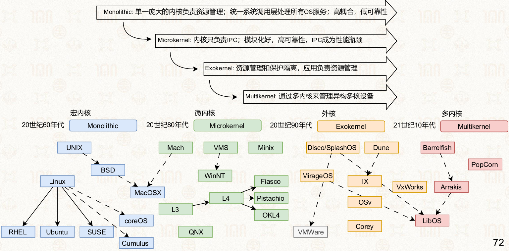系统软件需要一条演进之路

*   尽可能集成现有的POSIX API/Linux ABI
*   避免棘手的系统调用（如fork）
*   避免不可扩展的POSIX AP

## 2.4操作系统框架结构

Android 的架构设计极具特色，总结为一句话：**“身体是宏内核（Linux），思想是微内核（服务化）。”**

### 分层架构设计 (The Layered Stack)

Android 系统自下而上分为四个主要层次：

*   **Linux 内核层 (Linux Kernel)：** 系统的基础，负责硬件驱动、进程管理、内存管理等核心功能。

*   **硬件抽象层 (HAL - Hardware Abstract Layer)：**

    *   **核心作用：** 在 Linux 内核之上封装硬件实现细节，解耦内核与上层框架。
    *   **商业意义：** 规避 GPL 协议的限制。由于 Linux 内核驱动必须开源，HAL 允许厂商在用户空间提供驱动框架，从而无需公开硬件的核心源代码。

*   **Android 系统框架层：**

    *   **Android 库 (Libraries)：** 提供自定义开发库并重新实现标准库（如 `glibc`），优化性能。
    *   **Android 运行时 (ART/Dalvik)：** Android 应用主要用 Java 编写。早期使用 **Dalvik**（JIT 编译），Android 5.0 后引入 **ART**（AOT 预编译），将 Java 字节码预先转为机器码，大幅提升运行效率。

*   **应用框架层 (Application Framework)：** 提供 Activity Manager（活动管理）、Window Manager（窗口管理）、Service Manager（服务管理）等基础服务。

### 服务化架构与 Binder IPC

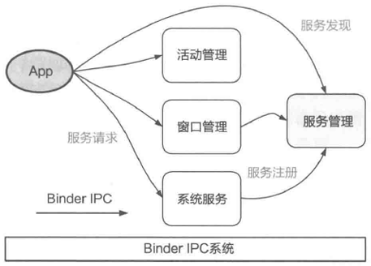

这是 Android 架构的“灵魂”所在，体现了**微内核**的设计思想。

*   **解耦机制：** 系统框架组件通过“服务化”运行。应用（App）并不直接操控系统功能，而是通过 **Binder IPC（进程间通信）** 发起请求。

*   **交互流程：**

    1.  **服务注册：** 各系统服务（如窗口管理、系统服务）在 **Service Manager（服务管理）** 中注册。
    2.  **服务发现：** 应用通过 Service Manager 查找所需服务的句柄。
    3.  **服务请求：** 应用通过 **Binder IPC** 向特定服务发送请求并获取响应。

*   **优势：** 这种设计提高了系统的**可扩展性**和**可维护性**。如果某个服务崩溃，通常不会导致整个内核瘫痪。

### 对比：Dalvik vs ART

| <!-- --> | <!-- --> | <!-- --> |
| -------- | ------------------------------ | ------------------------------ |
| **特性**   | **Dalvik (旧)**                 | **ART (新)**                    |
| **编译时机** | **JIT (Just-in-Time)**：运行时即时编译 | **AOT (Ahead-of-Time)**：安装时预编译 |
| **运行速度** | 较慢，存在运行时开销                     | 较快，直接执行二进制代码                   |
| **系统能耗** | 较高（编译消耗 CPU）                   | 较低（减少了重复编译）                    |
