# 3章 硬件环境与软件抽象

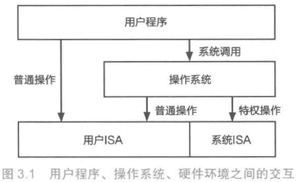

## 3.1应用程序的硬件运行环境

### 3.1.1程序的运行：用指令序列控制处理器（ISA）

**机器指令（指令）**

*   一套相对格式固定、功能简单、通常采用二进制编码
*   通过指令的有机组合实现高级语言的复杂的语义和功能

**汇编指令**：对应机器指令，以文本格式便于程序员阅读和修改

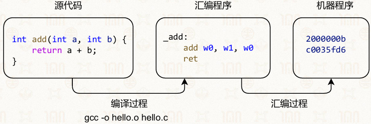

#### 指令集架构 (ISA) 的本质

*   **定义：** ISA 是计算机硬件与底层软件（如编译器、操作系统）之间的**抽象层**（或接口）。

*   **核心作用：** \* 规定了 CPU 能执行的**指令格式**、**寻址方式**和**寄存器结构**。

    *   软件开发者（或编译器）根据 ISA 编写机器代码，硬件开发者根据 ISA 设计电路实现。
    *   **比喻：** ISA 就像是硬件与软件沟通的“共同语言”或“契约”。

#### ARM 架构的特点：RISC 的胜利

ARM 属于典型的 **RISC (精简指令集计算机)** 架构，其核心设计理念是“简单高效”。

*   **指令特征：** \* **等长指令：** 指令长度固定（通常为 32 位），方便硬件解码。

    *   **单周期执行：** 大多数指令在一个时钟周期内完成。
    *   **Load/Store 结构：** 只有专门的加载/存储指令能访问内存，其他运算指令只能在寄存器间进行。

*   **优势：** 功耗极低、发热量小、芯片面积小。这正是它成为手机、平板等移动设备核心的原因。

#### ARM 架构的状态与指令集

ARM 并不是只有一种指令模式，它会根据场景切换状态：

| <!-- --> | <!-- --> | <!-- --> |
| --------------- | ------------- | ---------------------------- |
| **状态**          | **指令集**       | **特点**                       |
| **ARM 状态**      | **ARM 指令集**   | 32 位定长，功能全面，性能最强。            |
| **Thumb 状态**    | **Thumb 指令集** | 16 位定长，代码密度高（省空间），适合内存受限的设备。 |
| **A64 (ARMv8)** | **AArch64**   | 64 位指令集，支持更大的内存寻址和现代高性能计算。   |


**关键概念：硬件抽象的意义**

*   **向上解耦：** 无论底层硬件如何翻新（只要符合 ARM 规范），旧的软件代码经过编译器处理后都能运行。
*   **向下规范：** 给硬件设计者明确的目标，比如必须包含哪些通用寄存器（如 R0-R15）

### 3.1.2冯诺依曼架构

#### 基本冯诺依曼架构

*   计算

*   存储器

    *   内存

*   输入输出

    *   镜像加载
    *   外设

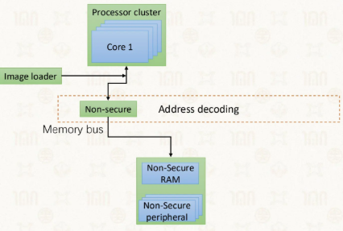

#### 冯诺依曼架构

*   输入/输出：和设备之间交互数据
*   CPU：包括处理单元和控制单元，解析指令
*   存储器：内存：存储指令和数据

缺陷：数据与指令不区分，指令或数据会发生错乱


### 3.1.3程序是怎样运行的

**操作系统也是程序**

*   大量CPU指令
*   拥有一些特权指令

**指令集架构**

*   与硬件绑定
*   用户ISA：mov x0, sp
*   系统ISA：msr\_el1, x0

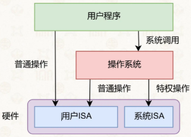

#### 程序运行

1.  程序启动，将机器码从硬盘中复制到内存中

2.  CPU中的特殊寄存器（程序计数器），记录下一条指令在内存中的位置

    *   顺序执行
    *   跳转执行：（控制流跳转）将PC值设置为程序指定的位置

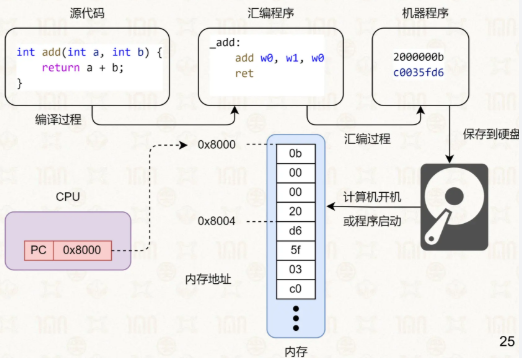

### 3.1.4寄存器，内存，运算与访存

#### **寄存器**

处理器内部的存储单元，访问快、容量小

*   通用寄存器：可以存储任意数据

    *   共31个64位通用寄存器，为 $X_0$ \~ $X_{30}$

    *   常用寄存器： $X_0, X_1, X_8, X_{29}, X_{30}$

        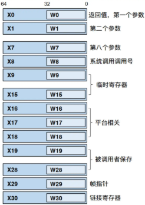

    *   **多模态**

        *   寄存器对应的32位为 $W_0 \sim W_{30}$ ，访问时仅操作 $X_n$ 的低32位，高位清零（由系统决定）
        
            

        *   $V_n$：额外的寄存器表

            *   用于浮点计算、SIMD和加密操作

            *   32个128位寄存器

            *   32位： $S_n$

            *   64位： $D_n$


            *   好处：便于指令级并行
                

*   特殊寄存器：用来保存一些特定的数据

#### **处理器（数据处理指令即汇编语言）**

汇编指令把表达式拆解成移位等基本运算

**数据处理指令**：基本运算由数据处理指令完成


*   AArch64数据处理指令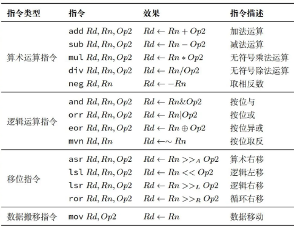

    *   **移位指令** (Shift Instructions)

        *   **asr（算术右移）：** 保持数字的“正负号”不变。向右移动时，左边空出来的格子用**符号位**填充。这相当于对有符号数做除法。
        *   **lsl（逻辑左移）：** 全体向左移动。右边空出来的格子统一**补 0**，最左边溢出的部分直接丢弃。这通常用于做乘法（左移 1 位等于乘 2）。
        *   **lsr（逻辑右移）：** 全体向右移动。左边空出来的格子统一**补 0**，最右边溢出的部分直接丢弃。这适用于无符号数的除法。
        *   **ror（循环右移）：** 像转轮盘一样。右边移出去的那位数，不会被丢弃，而是**绕回到左边**填满空位。数据总量没变，只是位置循环了。

*   数据搬移指令

    *   **mov（数据移动）：** 这是最基础的指令。它的作用就是**复制粘贴**。把右边的值复制一份，存入左边（目标寄存器 `Rd`）里。原来的值会被覆盖，但来源处的值保持不变。

**例子**：哈希函数

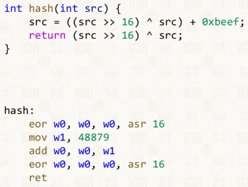

#### CPU视角下的内存

程序运行：内存→寄存器→CPU→寄存器→内存

→ISA提供内存的**加载指令**与**存储指令**，合称**访存指令   **（存取指令）

**访存指令**

*   两个基本指令

    *   取：LDR（load）
    *   存：STR（store）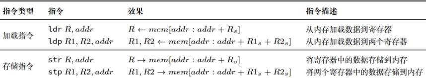

*   寄存器类型、名字决定存取数据长度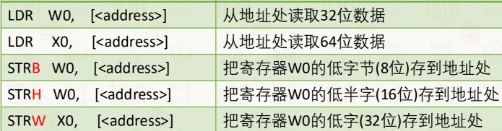

**例子**：交换函数

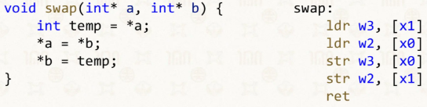

**寻址**

**定义**：CPU解析指令得到地址，并根据地址在内存中找到对应的数据的过程

**方式**（AArch64）

*   基址寻址（base）： $[Xn]$ ，直接用寄存器值当内存地址，无任何偏移计算

*   偏移寻址（offset）（变址寻址）：$[Xn, \#偏移量]$，地址=Xn+偏移量，指令形如$LDR    W0, [Xn, \#12]$

    *   前变址寻址： $[Xn, \#偏移量]!$ ，将地址存入Xn再寻址，地址=Xn+偏移量

    *   后变址寻址： $[Xn], \#偏移量$ ，先寻址再将地址存入Xn，地址=Xn+偏移量

### 3.1.5条件结构：分支与条件码

分支：实现跳转到目标代码位置

条件码：根据条件判断决定是否跳转

**例子**：

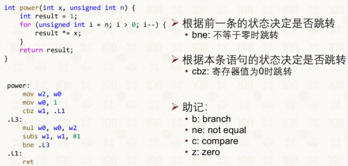

#### **标签**

用于定位某处汇编代码或数据的地址，对它们的引用会在汇编程序到可执行程序的转变中被翻译为真实的地址

如例子中

*   .L3：指示的是mul w0，w0，w2指令的地址
*   .L1：指示的是ret指令的地址

#### **分支指令**

能够跳转到标签位置的分支指令，共有三大类

*   无条件跳转

*   条件分支 Bxx (依赖PSTATE，根据前一条的状态决定是否跳转）

    *   状态寄存器（PSTATE）：状态保存在特殊寄存器的条件码中

    *   **条件码**：减少条件计算的开销

        *   N: Negative

        *   Z: Zero

        *   C: Carry

        *   V: Overflow

        *   常见分支条件及对应的条件码

            | <!-- --> | <!-- --> | <!-- --> |
            | -- | ------- | ----------- |
            | 条件 | 含义      | 对应条件码（NZCV） |
            | EQ | 相等      | $Z=1$       |
            | NE | 不等      | $Z=0$       |
            | MI | 负数      | $N=1$       |
            | PL | 非负数     | $N=0$       |
            | HI | 无符号大于   | $C=1且Z=0$   |
            | LO | 无符号小于   | $C=0$       |
            | LS | 无符号小于等于 | $C=0或Z=1$   |
            | GE | 有符号大于等于 | $N=V$       |
            | LT | 有符号小于   | $N!=V$      |
            | GT | 有符号大于   | $Z=0且N=V$   |
            | LE | 有符号小于等于 | $Z=1或N!=V$  |


    *   bne：不等于0/两数不等时跳转

        *   b: branch
        *   ne: not equal
        *   ```
            subs w1, w1, #1  ;    w1 = w1 - 1，结果若=0则Z=1，否则Z=0 
            bne .L3          ;    若Z=0（w1-1≠0 → w1≠1），跳转到.L3
            ```
        *   ```
            cmp w0, w2       ;    等价于w0 - w2，结果若=0则Z=1（w0=w2）否则Z=0
            bne .L5          ;    若Z=0（w0≠w2），跳转到.L5
            ```

*   寄存器值判断分支（直接判断寄存器值，根据本条语句的状态决定是否跳转）

    *   cbz：寄存器值为0则跳转

        *   c: compare
        *   z: zero

### 3.1.6函数调用、返回与栈

#### 调用指令与返回指令

跳转和记录地址以返回

*   x86：

    *   调用\[call]：将返回地址保存到内存
    *   返回\[ret]：从同一个内存地址读取返回地址

*   AArch64

    *   调用\[bl]：经返回地址保存在返回地址寄存器中（通用寄存器 $X30$ ，别名LR）

    *   返回\[ret]：从寄存器中读取返回地址

    *   **原因**：RISC架构为了降低硬件的复杂度只允许专门的访存指令访问内存，其余指令只能访问CPU内部的寄存器

    *   **帧栈机制（解决LR覆盖问题）**：编译器会在每个函数调用指令之前和之后的某处生成额外的代码，分别完成“将LR旧值保存到内存”和“将内存中保存的值恢复到LR”

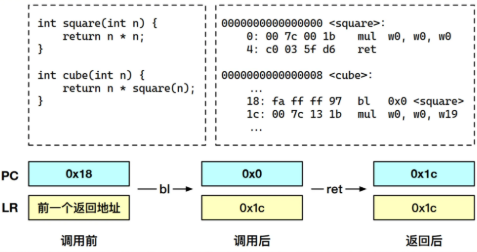

#### **运行时栈：保存函数中的局部状态**

**运行时栈**

*   **定义**：函数调用/返回过程中，用于存放局部状态的内存区域

*   **结构**：按照调用顺序排列在一起，按照先进后出规则（栈规则）

*   **增长方向**：AArch64 中栈从高地址向低地址增长（SP 向低地址移动表示分配栈空间）

*   **栈指针（SP, X31）**：指向栈顶的专用寄存器，是栈内存分配 / 释放的 “基准指针”

    *   地址 > SP：已分
    *   地址 < SP：未分

**帧栈**

*   **定义**：每个函数拥有的连续内存空间称为函数的栈帧（Stack Frame）

*   内容：参数、局部变量、保存的寄存器等

*   **帧指针（FP, X29）**：栈帧在内存中的起始位置称为帧指针(Frame Pointer, FP)

    *   作用：实现栈追踪，即从当前函数开始向前追溯出调用链中每个函数的栈帧，并获取其中的局部状态
    *   注：可以通过禁用FP来提高性能，减少访存开销，此时SP与FP重合

*   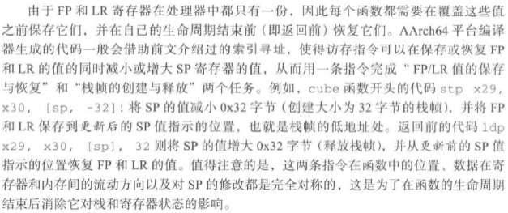

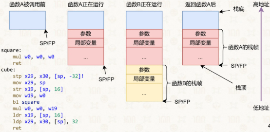

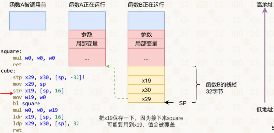

### 3.1.7函数调用准则

**定义**：规定在函数调用过程中寄存器的标准

即寄存器的分配，并在必要的时候对使用的寄存器进行保存与回复

*   调用者：Caller
*   被调用者：Callee

#### 寄存器保存：位置与方式

*   调用者保存： $X9 \sim X15$

*   被调用者保存： $X19 \sim X28$

#### 数据传递

数据交换方式

*   Caller向Callee传递参数
*   Callee 向Caller返回返回值

**保存**（AArch64架构）

*   $X0 \sim X7$  来传递前 8 个参数

*   $X0$  传递返回值

*   参数构造区：更多的参数则被保存到栈上

*   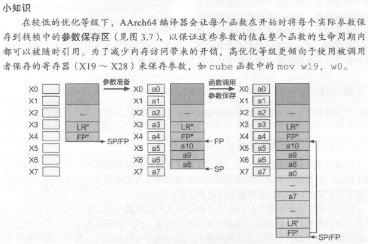

#### 完整寄存器分组与用途

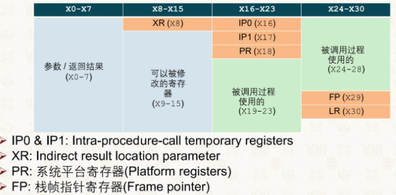

*   **XR (X8)**：间接结果位置参数（Indirect result location parameter），用于存放返回值的间接地址（如返回大结构体时）
*   **IP0 (X16) / IP1 (X17)**：过程调用内部临时寄存器（Intra-procedure-call temporary registers），仅在函数调用过程中临时使用，调用后不保证值不变

#### 完整帧栈结构

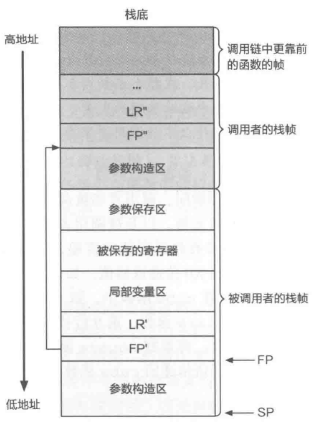

### 3.1.8小结：应用程序依赖的处理器状态

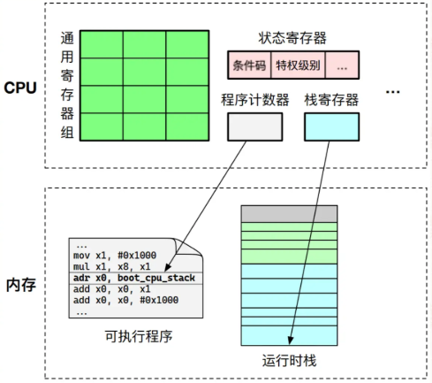

### 3.1.9冯诺依曼架构的统一内存映射

**问题**：冯诺依曼架构中，数据程序均在内存中，且寻址空间相同


*   如何做权限管理？（需要多种权限）
*   如何适应不同的内存空间？
*   如何统一管理数量众多的外存？（将外设映射到内存空间中）

#### 内存权限规则

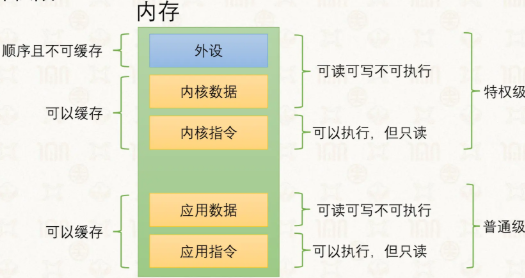  

#### 统一内存映射

*   虚拟地址空间

*   前 $2^{48}$ 字节的地址空间给普通应用

*   操作系统、外设的地址均为0xFFFF开头（高地址到低地址分配）

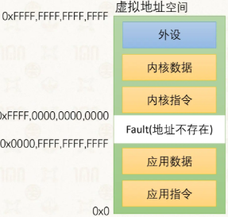

## 3.2操作系统的硬件运行环境

**定义**：<u>基本功能</u>（运算、访存、函数调用 etc.）+<u>操作系统权限执行的功能</u>（对CPU中断的开关、对频率的调整、对内存的配置、对设备的操作 etc.）

**实现**：为了区分操作系统与应用程序的运行环境，CPU提供不同的特权级

### 3.2.1特权级模型、系统ISA

#### 特权级别

*   **包含**：用户态和内核态

*   **作用**：区分应用程序和操作系统的运行权限

*   **对应ISA**

    *   **系统ISA——内核态**

        *   系统状态：当前CPU的特权级别、引发CPU错误的指令地址、程序运行状态etc.
        *   系统寄存器：只能由运行在内核态的软件通过系统指令来访问
        *   系统指令

    *   用户ISA——用户态

#### ARM的特权级别和系统ISA（AArch64）

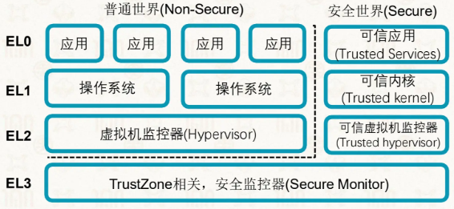

*   特权级状态保存：PSTATE 寄存器

*   **异常级别**\特权级别（Exception level，EL）：共4个，2个与安全相关

    *   EL0：用户态，应用程序
    *   EL1：内核态，操作系统
    *   EL2：虚拟机监控器，用于虚拟化场景
    *   EL3：负责普通世界和安全世界的通信，与安全特性TrustZone相关

*   **寄存器的使用**：为常用的用户态寄存器在不同特权级提供不同的硬件副本（SP→SP\_EL0\SP\_EL1）

    *   高特权级可以读写低特权级的寄存器，这样级别在低高中切换就不用反复保存恢复

    *   特权指令：系统ISA的指令，只能在特权态运行

        *   mrs：读，Move System Register to register
        *   msr：写，Move register to System register

*   **ARM中的特殊寄存器以及系统寄存器**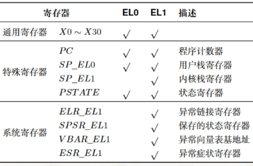

    *   1个PC寄存器
    *   4个栈寄存器（切换时保存SP，SP0123）
    *   3个异常链接寄存器（保存异常的返回地址，ELR\_EL123）
    *   3个程序状态寄存器（切换时保存PSTATE，SPSR\_EL123）

*   **处理器从EL0进入EL1的场景**

    *   执行系统调用，具体指令为特权调用：svc (supervisor call)
    *   应用执行的指令触发了异常
    *   CPU收到了外设发来的中断信息

### 3.2.2异常与中断

#### 轮询

程序\设备周期性地主动查询某个状态或资源，而不是等对方主动通知自己

#### 异常机制（AArch64）

**定义**：用户态和内核态的切换使用

**陷入\下陷**：从用户态切换至内存态

**角度**：从<u>应用程序</u>的角度看，下陷到内核时因为出现了“异常”（如键盘输入、被硬件产生的中断打断等），需要内核处理

**异常处理程序**：在内核处理异常情况的代码

**异常控制流**：不受应用程序控制

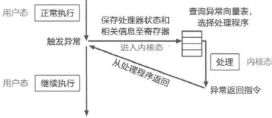

#### 触发CPU异常机制的事件

*   **中断**：来自外部的事件，会强行打断正在运行的程序，使CPU下陷（如硬件时钟会周期性地发出信号）
*   **异常**：程序在执行过程中遇到的自身无法处理的问题，若操作系统无法处理，可强行终止程序甚至触发重启
*   主动触发：程序向操作系统发起特定操作的请求（如系统调用，svc）

#### 中断与异常、异步与同步（通用概念）

*   **中断（Interrupt）**

    *   外部<u>硬件</u>设备所产生的信号

    *   **异步**：产生原因和当前执行指令无关，如程序被磁盘读打断

*   **异常（Exception）**

    *   <u>软件</u>的程序执行而产生的事件

    *   包括系统调用（System Call）：用户程序请求操作系统提供服务

    *   **同步**：产生和当前执行或试图执行的指令相关

#### 不同体系的术语对应（AArch64和x86-64）

| <!-- --> | <!-- --> | <!-- --> | <!-- --> |
| ---- | ---- | -------------- | ------------------- |
| 通用概念 | 产生原因 | AArch64（均称作异常） | x86-64              |
| 中断   | 硬件异步 | 异步异常：重置、中断     | 中断：可屏蔽、不可屏蔽         |
| 异常   | 软件同步 | 同步异常：终止、异常指令   | 异常：Fault、Trap、Abort |


#### AArch64的中断（异步异常）

*   重置（Reset）

    *   最高级别的异常，用以执行代码初始化CPU核心
    *   由系统首次上电或控制软件、看门狗等触发

*   中断（Interrupt）

    *   CPU外部的信号触发，打断当前执行
    *   如计时器中断、键盘中断等

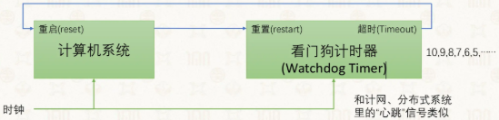

#### AArch64的异常（同步异常）

*   中止（Abort）

    *   失败的指令获取或数据访问
    *   如访问不可读的内存地址等

*   异常产生指令（Exception generating instructions）

    *   SVC (Supervisor Call)：用户程序 -> 操作系统
    *   HVC (Hypervisor Call)：客户系统 -> 虚拟机管理器
    *   SMC (Secure Mode Call)：Normal World -> Secure World

#### x86-64术语

*   中断（设备产生、异步）

    *   可屏蔽：设备产生的信号，通过中断控制器与处理器相连，可被暂时屏蔽（如，键盘、网络事件）
    *   不可屏蔽：一些关键硬件的崩溃（如，内存校验错误）

*   异常（软件产生、同步）

    *   错误（Fault）: 如缺页异常（可恢复）、段错误（不可恢复）等
    *   陷阱（Trap）: 无需恢复，如断点（int 3）、系统调用（int 80）
    *   中止（Abort）: 严重的错误，不可恢复（机器检查）

#### 中断如何产生以及GIC

**AArch64中断的分类**

*   连接CPU的不同针脚，可在中断控制器中配置

    *   IRQ（Interrupt Request）：普通中断，优先级低，处理慢

    *   FIQ（Fast Interrupt Request）

        *   一次只能有一个FIQ
        *   快速中断，优先级高，处理快
        *   常为可信任的中断源预留

*   SError（System Error）

    *   原因难以定位、较难处理的异常，多由异步中止（Abort）导致
    *   如从缓存行（Cacheline）写回至内存时发生的异常

**中断控制器\[GIC]的功能**

分发：管理所有中断、决定优先级、路由

CPU接口：给每个CPU核有对应的接口

**GIC 中断状态**

*   Inactive: 中断源没有被触发
*   Pending: 中断源已经被触发，但CPU还没来得处理
*   Active:中断源已经被触发，CPU正在处理
*   Active and pending: 同一种中断源，其中一个实例正在被处理，而下一个实例已来，处于等待中

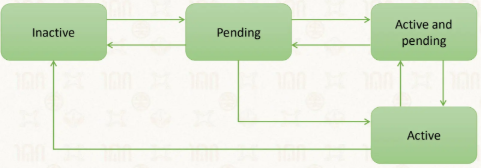

**中断触发**

*   电平触发：通过持续的电平信号

    *   若外设一直保持有效电平，会持续触发中断请求，导致重复

    *   适合需要持续告知系统“有事待处理”的场景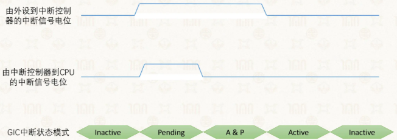

*   边沿触发：通过信号的跳变沿来请求中断，只对信号的变化敏感

    *   每个脉冲只触发1次中断，不会持续触发

    *   适合检测“事件发生”的场景（如按键按下）

    *   抗干扰能力更强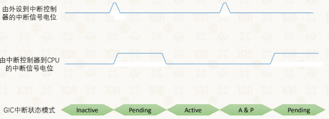

#### 设备的内存映射以及MMIO

**统一内存映射**：将外设寄存器、内核空间、用户空间统一编址
[3.1.9统一内存映射](#319冯诺依曼架构的统一内存映射)

**内存映射的输入输出MMIO（Memory-Mapped I/O)**

*   定义：Memory-Mapped I/O，把外设寄存器映射到物理内存的特殊地址段，CPU 可以像访问普通内存一样读写外设
*   指令复用：复用ldr和str指令

**ARMv8基础平台与物理内存映射**

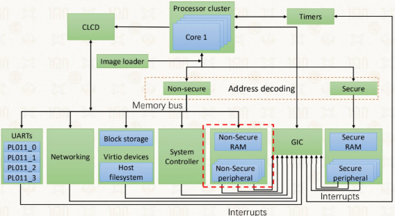

**核心组件**：

*   处理器簇（Processor cluster）：包含多个 Core，负责指令执行
*   GIC（Generic Interrupt Controller）：统一管理中断，分发到对应 CPU 核心
*   外设：UARTs、Networking、Timers、存储设备等，通过内存总线连接
*   安全状态：分为 Secure（安全世界）和 Non-secure（普通世界），通过地址解码隔离

**物理内存映射表**

*   地址区间与设备对应：

    *   低地址段：安全内存（Trust DRAM/ROM）、非安全内存（NOR Flash、VRAM、DRAM）
    *   中段：各类外设寄存器（UART、System Registers、GIC、Timers 等），每个外设占用 64KB/8KB 等固定区间
    *   高地址段：大容量 DRAM，供系统和应用使用

*   安全属性

    *   S：Secure 安全区间，仅安全世界可访问
    *   SNS：Secure/Non-secure 均可访问，根据上下文权限控制

*   GIC 相关地址：

    *   0x08\_2000\_0000 \~ 0x08\_2FFF\_FFFF：GIC Distributor、CPU Interface、Virtual Interface 等寄存器组，用于中断控制

**GIC 路由配置（以启用timer为例）**

*   使用MMIO，设置GIC中寄存器，启用timer

*   使用MMIO，从GIC中的寄存 器里获得中断信息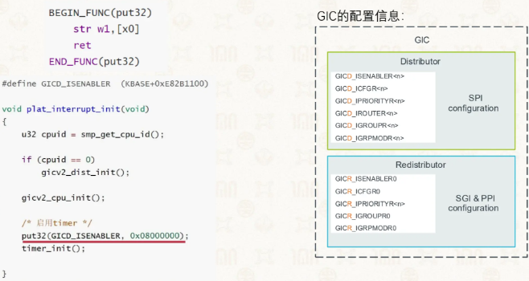

### 3.2.3异常处理与异常向量表

#### 异常向量表

**定义**：是CPU规定的、位于固定内存地址的一组异常处理入口集合（每个异常级别存在独立的异常向量表）

**作用**：当 CPU 发生任何异常时，会自动根据异常类型，跳转到向量表中对应的固定偏移地址，执行预先定义的异常处理程序

**地址**：存储在CPU上的特殊寄存器——异常向量表基地址寄存器（如AArch64的VBAR\_EL1）

**初始化**

1.  定义并编写符合硬件规范的异常向量表
2.  将向量表基地址写入 VBAR\_EL1 寄存器
3.  开启全局中断，使能异常响应

#### 异常处理的基本流程

中断与异常的处理使用同一套机制，差异仅在选择handler中提现

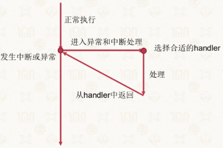

*   进入中断或异常时

    *   需保存处理器状态，方便之后恢复执行
    *   需准备好在高特权级下进行执行的环境
    *   需选择合适的异常处理器代码进行执行
    *   需保证用户态和内核态之间的隔离

*   处理时

    *   需获得关于异常的信息，如系统调用参数、错误原因等

*   返回时

    *   需恢复处理器状态，返回低特权级，继续正常执行流

#### AArch64的中断和异常处理（用户态到内核态的切换）

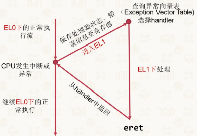

1.  **信息保存**：异常或中断发生后，硬件会将错误码和部分上下文信息存储在寄存器中

    1.  当前指令地址（PC）→ ELR\_EL1（Exception Link Register，异常链接寄存器）
    2.  异常发生的原因 → ESR\_EL1（Exception Syndrome Register，异常症状寄存器）
    3.  处理器状态（PSTATE）→ SPSR\_EL1（Saved Program Status Register）
    4.  保存与特定异常相关的信息，如缺页异常时，将引发异常的内存地址→FAR\_EL1（Fault Address Register，错误地址寄存器）

2.  **进入EL1**：硬件会适当修改处理器状态（PSTATE），进入EL1执行

    1.  进入EL1级别后，栈指针（SP）自动换用SP\_EL1
    2.  如需在EL1下使用SP\_EL0作为栈指针，可配置SPSel寄存器
    3.  修改PSTATE寄存器中的特权级标志位，设置为内核态

3.  **寻找handler代码**：使用异常向量表

    *   表项为异常向量（Exception Vector），是处理异常或跳转

    *   到异常handler的小段汇编代码

    *   地址位于VBAR\_EL1寄存器中

    *   选择表项取决于

        *   异常类型（同步、IRQ、FIQ、Serror）
        *   异常发生的特权级
        *   异常发生时的处理器状态（使用的栈指针/运行状态）

        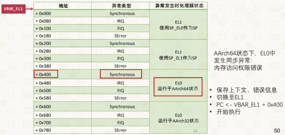

4.  **返回**：eret指令

    1.  SPSR\_EL1 → PSTATE，恢复处理器状态
    2.  降至EL0，硬件自动使用SP\_EL0作为栈指针（SP\_EL1的值不变，下次下陷时依然使用这个内核栈）
    3.  ELR\_EL1 -> PC，恢复PC状态，恢复执行应用程序代码

#### x86-64的中断和异常处理

*   进入异常

    *   硬件会将上下文信息和错误码存储在内核栈上

*   用异常向量表寻找handler

    *   不分级• 异常向量表中存handler的地址

*   iret返回

    *   恢复程序上下文
    *   从内核态返回用户态
    *   继续执行用户程序

#### 处理器上下文（操作系统在特权级切换过程中的任务）

**定义**：应用程序需要保存的运行状态，它时应用程序在完成切换后恢复执行所需的最小处理器状态集合

**位置**：内存

**寄存器**

*   通用寄存器
*   特殊寄存器：只有当操作系统决定切换到另一个应用而不是返回发生下陷的应用才需要保存，主要包括PC、SP、PSTATE，但是PC和PSTATE都有CPU保存在额外寄存器而SP存在多分
*   系统寄存器：同特殊寄存器

### 3.2.4系统调用（svc）

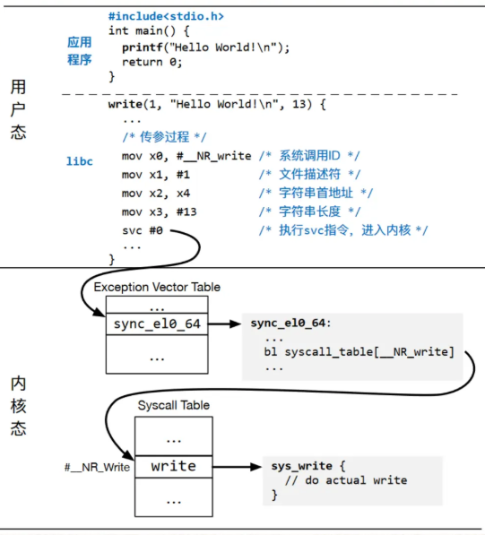

## 3.3操作系统的基本抽象和接口

### 3.3.1分类、抽象和虚拟化

*   进程：对处理器的抽象

    *   线程：允许一个应用程序并行使用多个处理器

*   虚拟内存：对物理内存的抽象（物理内存的虚拟化）

*   文件：对存储、网络、键盘、显示器等外设的抽象

    *   将设备抽象为文件，可使应用程序通过同一套接口来操作不同的设备

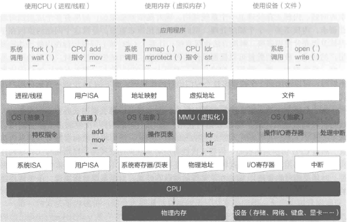

#### 抽象与虚拟化

**抽象**：范围更广，是对底层复杂细节的封装，向上提供一个新的、简化的接口（接口可以是全新的，也可以和旧接口一致）

**虚拟化**：是特殊的抽象—— 当抽象提供的接口与已存在的某个接口完全一致时，这种抽象就叫虚拟化。它的目标是 “伪装” 成原有接口，让上层程序无需修改就能运行

### 3.3.2进程：对处理器的抽象

#### 分时复用

**作用**：让多个应用高效按需地运行在处理器上，不让处理器被浪费

**操作（定义）**：把CPU时间切成许多极短的时间片，轮流分给多个程序使用

*   切换时机：操作系统处理完某个异常或中断后，且在返回用户态之前
*   时间片：每个程序每次最长连续运行时间（ms级）

**效果**：让多个程序从宏观看是“同时”在运行，也使处理器尽可能保持在满负载而不被浪费

**程序不可见**：这种切换是不可见的，程序无需考虑如何与其他程序共享处理器，简化了程序的编写

#### 进程

**目标**：更好地管理多个运行中的程序

**定义**：运行中的程序

**PCB（进程控制块）**：进程的管理载体，操作系统会为每个进程记录以下内容，并存储在进程控制块这个数据结构中（Process Control Block）

*   进程标识号：PID，process ID
*   运行状态
*   所占用的计算资源

**效果**

*   从应用程序员视角：进程让程序感觉自己 “独占” 了处理器和内存，不用关心其他程序在运行，极大简化了编程
*   从操作系统视角：进程是资源分配和调度的基本单位，OS 以进程为单位管理运行状态、分配计算资源

**切换进程的操作**

1.  更新两个进程对应PCB中的运行状态
2.  保存当前进程的处理器上下文到它的PCB中
3.  读取下一进程的PCB并恢复到处理器对于的寄存器中
4.  更换内核栈etc.

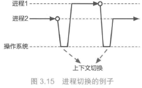

**进程间的管理与组织**

**进程操作接口：**操作系统提供创建、执行、退出等接口，方便用户操作进程

**父子进程关系：**进程通过创建关系形成层次结构，创建者是父进程，被创建的是子进程，所有进程最终可追溯到系统启动的第一个进程（如 Linux 的 init 进程）

**通信与互操作：**操作系统提供进程间通信（IPC）等机制，让进程之间可以交互

### 3.3.3虚拟内存：对内存的抽象

#### 早期多进程内存管理的弊端

*   **方案1（整体换入换出）**：进程切换时将整个内存数据写入磁盘，再加载新进程数据

    *   优点：进程间完全隔离
    *   缺点：切换速度极慢，存储设备速度瓶颈明显

*   **方案2（物理地址分段）**：为不同进程分配不重叠的物理地址范围

    *   优点：切换时无需访问磁盘，性能更好

    *   缺点：

        1.  无法保证内存隔离，进程可能意外/恶意修改其他进程内存
        2.  地址空间不连续，程序编写与编译复杂度高

#### 虚拟内存的核心思想

*   **抽象层**：在应用程序与物理内存之间加入虚拟地址层

*   **访问方式（地址翻译）**：应用程序使用<u>虚拟地址</u>，由处理器与操作系统协同将其翻译为<u>物理地址</u>

    *   处理器：负责在程序运行时将虚拟地址动态翻译为物理地址（机制）
    *   操作系统：负责配置虚拟地址和物理地址间的具体映射规则\[即页表]（策略）
    *   体现了策略与机制分离的思想

*   **地址映射**：

    *   连续的虚拟地址空间 → 可映射到多块不连续的物理内存
    *   未使用的虚拟地址区域 → 可不映射，节省物理内存

    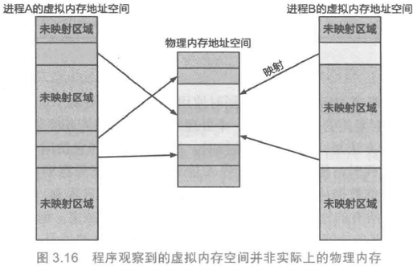

*   **独立性验证**：

    *   不同进程的全局变量地址可相同（虚拟地址），但值不同（映射到不同物理内存）
    *   证明：每个进程拥有独立的虚拟地址空间

    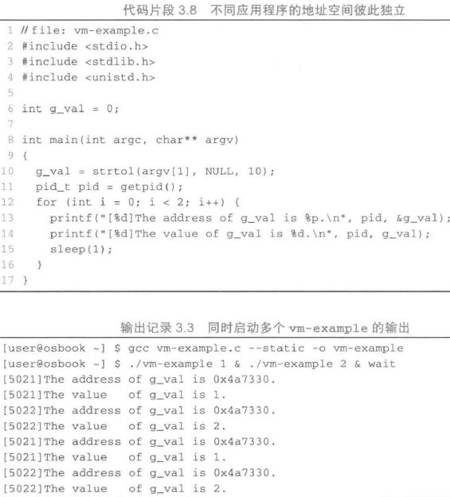

#### 虚拟内存的优势

| 优势       | 具体说明                         |
| -------- | ---------------------------- |
| **简化编程** | 程序员无需关心物理内存分配，可使用连续虚拟地址空间    |
| **内存隔离** | 进程间虚拟地址空间独立，防止内存读写干扰与数据泄露    |
| **高效利用** | 仅映射正在使用的虚拟地址，未使用区域不占用物理内存    |
| **内存扩容** | 可将部分虚拟内存数据暂存磁盘，突破物理内存容量限制    |
| **权限控制** | 可为不同虚拟内存区域设置读写/执行/访问权限，提升安全性 |
| **高级功能** | 支持写时拷贝、内存共享等高级机制             |


### 3.3.4 进程的虚拟内存布局

#### 整体布局（从低地址到高地址）

每个进程拥有独立的虚拟地址空间，典型布局如下：

| 区域            | 位置    | 功能                     | 特点            |
| ------------- | ----- | ---------------------- | ------------- |
| **代码段（Text）** | 低地址   | 存储可执行程序代码              | 只读，共享，进程运行前加载 |
| **数据段（Data）** | 代码段之上 | 存储全局变量、静态变量            | 初始化后大小固定      |
| **用户堆（Heap）** | 数据段之上 | 动态内存分配（`malloc`/`new`） | 自底向上扩展，大小可变   |
| **代码库**       | 用户堆之上 | 加载共享库、文件映射等            | 动态加载，可共享，只读   |
| **栈（Stack）**  | 高地址   | 存储局部变量、函数调用上下文         | 自顶向下扩展，大小有限   |
| **内核空间**      | 最高地址  | 操作系统内核代码与数据            | 仅内核可访问，所有进程共享 |


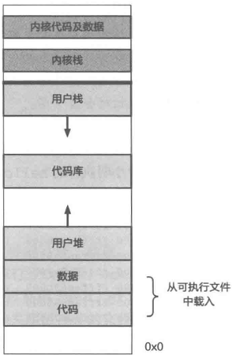

#### 关键区域详解

*   **代码段与数据段**：来自可执行文件，进程启动时加载到虚拟地址空间
*   **堆**：用于动态内存分配，由程序员手动管理（malloc/free）
*   **栈**：自动管理，函数调用时分配，返回时释放，遵循“先进后出”
*   **内核空间**：对用户进程不可见，仅在系统调用时切换访问，保证内核安全

#### Linux 示例（`/proc/[pid]/maps`）

*   可通过 cat /proc/\[pid]/maps 查看进程虚拟内存布局
*   输出包含：地址范围、权限、偏移、设备、inode、路径名（如代码段、数据段、堆、栈、共享库等）
*   内核空间地址不会出现在用户进程的 maps 输出中

### 3.3.5 文件：对存储设备的抽象

#### 1引入背景以及目标

*   内存数据易失性：重启后数据丢失，无法满足用户持久化存储需求（如文档、视频、程序）。

*   存储设备多样性：机械硬盘、SSD、多媒体卡等设备接口与实现差异大，直接访问复杂度高。

*   **抽象目标**：隐藏不同存储设备的底层细节，提供<u>统一、便捷</u>的访问方式。

#### 文件的核心定义

*   **文件本质**：一个<u>有名字的字节序列</u>，由文件名标识，文件名独立于文件的数据存在

*   **目录结构**：

    *   目录可层级嵌套，形成树形结构，根目录用 / 表示。
    *   不同文件名可属于同一目录，路径用于定位文件（如 /home/user/hello）

    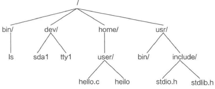

*   示例：执行 ./hello 时，系统会根据路径在目录树中找到文件，加载到内存并执行

#### 标准文件访问接口

操作系统提供一组通用接口，用于文件的生命周期管理：

| 接口    | 功能   | 关键说明                                              |
| ----- | ---- | ------------------------------------------------- |
| open  | 打开文件 | 返回**文件描述符（fd）**，作为后续操作的句柄；可指定读写模式（如 O\_RDONLY 只读） |
| read  | 读取文件 | 从 fd 对应文件中读取字节到缓冲区                                |
| write | 写入文件 | 将缓冲区数据写入 fd 对应文件（如写入标准输出 fd=1）                    |
| close | 关闭文件 | 释放文件描述符，结束对文件的访问                                  |


#### 内存映射（mmap）访问方式

*   **定义**：将文件直接映射到进程的虚拟地址空间，用户程序可像读写内存一样访问文件。

*   **核心流程**：

    1.  用 open 打开文件获取 fd。
    2.  调用 mmap：将文件内容与一段虚拟内存区域关联，返回映射起始地址。
    3.  直接读写该内存区域即可操作文件内容，无需 read/write。

*   **参数示例**：

    *   PROT\_READ：映射区域只读。
    *   MAP\_PRIVATE：映射区域为进程私有，修改不写回原文件

    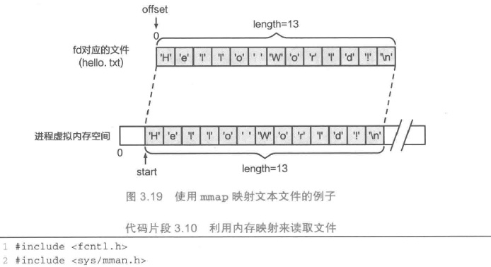

*   **优势**：访问效率高，适合大文件操作；支持进程间内存共享（MAP\_SHARED）。

### 3.3.6 文件：对所有设备的抽象

#### 设计哲学：一切皆文件（Everything is a file）

*   以 Linux/UNIX 为代表，将所有 I/O 设备抽象为文件，提供统一访问接口。

*   设计原因：

    *   用户视角：设备操作与文件操作类似（如串口读写 ↔ 文件读写），学习成本低
    *   实现视角：复用文件系统的大量代码（如 open/read/write/close），简化设备驱动开发

#### 设备文件的实现

*   **设备文件位置**：通常放在 /dev/ 目录下（如 /dev/tty1、/dev/sda1）。

*   **访问方式**：

    1.  应用程序通过 open 打开设备文件，获得 fd。
    2.  用 read/write 对设备进行读写操作，与普通文件完全一致。

*   典型示例：TTY 设备

    *   终端（Terminal）对应 TTY 设备文件（如 /dev/pts/1）。
    *   printf 输出本质是 write 到 TTY 设备文件；fgets 输入本质是 read 从 TTY 设备文件。
    *   打开另一个终端的 TTY 设备文件并写入，可直接在该终端输出内容。

#### 特殊设备与扩展抽象

*   并非所有设备都仅靠读写操作：如音频设备（调节音量、采样率）、显卡（分辨率、刷新率）需要额外控制接口。

*   **扩展抽象**：

    *   对复杂设备，操作系统提供ioctl接口用于发送控制命令。
    *   进一步抽象为套接字（Socket）等，用于网络设备等更复杂的 I/O 场景。

*   **目标**：在统一接口基础上，提供灵活的设备操作能力。

### 3.3.7文件抽象的总结

1.  **文件是存储设备的抽象**：屏蔽硬件差异，以“字节序列+名字”统一访问持久化存储。

2.  **文件是 I/O 设备的抽象**：贯彻“一切皆文件”，让终端、磁盘、串口等设备都能用 open/read/write/close 操作。

3.  **两种访问方式**：

    *   传统 read/write：通用、兼容性强。
    *   mmap 内存映射：高效、适合大文件与共享内存。

4.  **价值**：极大简化了应用程序开发，让程序无需关心底层存储或设备类型。
