# 4章 虚拟内存管理

**以虚拟内存抽象为核心的内存管理**

*   CPU：支持虚拟内存功能，新增了虚拟地址空间
*   操作系统：配置并使能虚拟内存机制
*   所有软件（包括OS）：均使用虚拟地址，无法直接访问物理地址

**虚拟地址**

*   虚拟内存抽象下，程序使用虚拟地址访问主存

    *   虚拟地址会被硬件"自动地"翻译成物理地址

*   每个应用程序拥有独立的虚拟地址空间

    *   应用程序认为自己独占整个内存
    *   应用程序不再看到物理地址
    *   应用加载时不用再为地址增加一个偏移量

## 4.1CPU的职责：内存地址翻译

### 4.1.1地址翻译（设备与步骤）

#### MMU 内存管理单元（Memory Management Unit）

**职责**：负责虚拟地址到物理地址的转换

*   应用进程在CPU核心上运行期间，使用的虚拟地址由MMU进行翻译
*   MMU 翻译出来的物理地址将通过总线传到物理内存，完成物理内存读写请求

**翻译规则**：取决于虚拟内存采用的组织机制

*   [分段机制](#412分段机制)
*   [分页机制](#413分页机制)

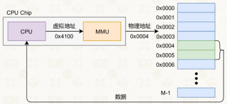

#### TLB 转址旁路缓存（Translation Lookaside Buffeer）

加速地址翻译的部件（MMU内部的硬件单元）

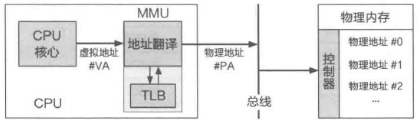

### 4.1.2分段机制

#### 基本概念

**定义**：将虚拟地址空间和物理内存都按 “段”（连续物理内存块，大小可变）为单位进行管理与分配

**虚拟地址结构**：段号 + 段内地址（偏移量）

*   段号：标识该地址属于哪个段
*   段内地址（段内偏移）：相对于本段起始地址的偏移

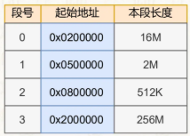

**段表**：存储每个分段的信息，供 MMU 查询，包括：

*   段号
*   本段起始物理地址
*   本段长度 / 段长（用于越界检查）

#### 翻译过程

1.  定位段表：通过<u>段表基址寄存器</u>获取段表的起始地址

2.  查找段表项：用段号作为索引，在段表中找到对应条目，获取该段的起始物理地址

3.  计算物理地址：将段起始地址 + 段内地址（偏移量），得到最终物理地址

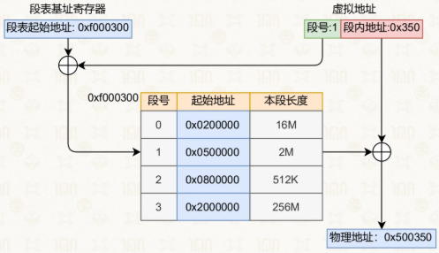

#### 缺陷

*   外部碎片：分配粒度粗，段与段之间会留下无法利用的小碎片空间，降低了主存利用率

    *   例：6GB 内存被分为 4 段，释放 2 段后虽有 2GB 空闲，但因不连续而无法分配新的 2GB 段

*   交换效率低：段大小不固定，换入换出内存时操作复杂，不如分页灵活高效

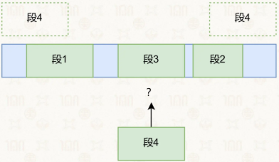

### 4.1.3分页机制

#### 基本概念

**基本思想**

*   虚拟页：将应用进程的虚拟地址空间划分成连续的、等长的虚拟页

*   物理页：物理内存也被划分成连续的、等长的物理页

*   虚拟页和物理页的页长固定且相等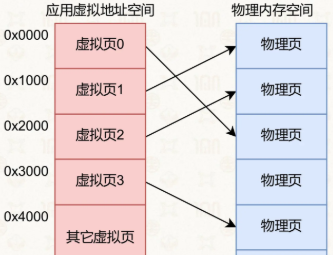

**页表**

*   **定义**：操作系统为每个应用构造的一张记录从虚拟页到物理页的映射关系表

    *   操作上起到一个目录的作用
    *   每个页表本身占了一个物理页

*   **页表基地址寄存器（TTBR）**：存储页表起始地址的在CPU的特殊寄存器（Translation Table Base Register）

*   **结构**：虚拟页号+物理页号

*   **单位**：页表项（PTE）

*   **页表下虚拟地址的结构**：虚拟页号+页内偏移量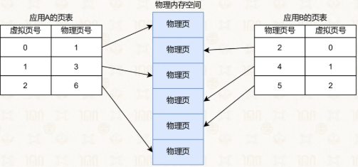

**翻译过程**

1.  解析虚拟地址：MMU 解析得到虚拟地址中的虚拟页号
2.  找到物理页号：在页表中找到对应的条目，取出其对应的物理页号
3.  计算最终地址：对应物理页的起始地址+偏移量

#### 优势

*   虚拟页和物理页可以任意映射

    *   实现了物理内存资源的离散分配
    *   使应用程序可以使用连续的虚拟地址空间而不用依赖物理地址的连续性
    *   能通过不同页表中映射不同的物理页，来保证应用程序内存互不干扰

*   操作系统切换应用程序，通过切换页表基地址寄存器中存储的页表，来完成不同进程的虚拟地址空间切换

### 4.1.4多级页表

#### 单级页表的计算以及问题

**页表大小的计算公式**

$\text{页表大小} = \frac{\text{总虚拟地址空间}}{\text{页面大小}} \times \text{每个 PTE 的大小}$


**问题**：单级页表会消耗大量的空间

*   在单级页表中，即使大部分地址空间是空的（未分配），你仍然需要为这些空地址维护页表项。
*   这就好比写一本书，即使只有第 1 页和第 1000 页有内容，你也必须买一本包含 1000 页纸的厚书

#### 多级页表的虚拟地址结构（AArch64）

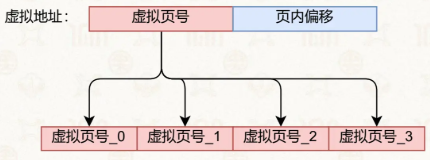

*   虚拟地址48位，页内偏移占12位

    *   高16位为固定值，全0或全1

*   虚拟页号共36位

    *   平均分成4份，每份9位，每份可以指向512个页表项（ $2^9$ ）

    *   每级页表最多512项

#### 多级页表的查询和翻译

1.  查询<u>页表基地址寄存器</u>（Translation Table Base Register)

    *   TTBR0\_EL1 & TTBR1\_EL1

        *   根据虚拟地址第63位选择， 若为0则选择TTBR0\_EL1

    *   通常（以Linux为例）

        *   应用程序使用TTBR0\_EL1
        *   操作系统使用TTBR1\_EL1

    *   页表基地址寄存器指向0级页表的基地址

2.  通过虚拟页号\_0（索引值）从0级页表中查找L0页表项

    *   0级页表只有一个
    *   最多包含512个L0页表项
    *   L0页表项存有对应1级页表的基地址

3.  通过虚拟页号\_1从1级页表中查找L1页表项

    *   系统中最多可能有512个1级页表

4.  通过虚拟页号\_2从2级页表中查找L2页表项

    *   系统中最多可能有 $512^2$ 个2级页表

5.  通过虚拟页号\_3从3级页表中查找L3页表项

    *   系统中最多可能有 $512^3$ 个3级页表

    *   L3页表项存有对应物理页号

6.  根据L3页表项中对应的物理页号和虚拟地址中的偏移量计算到真实地址

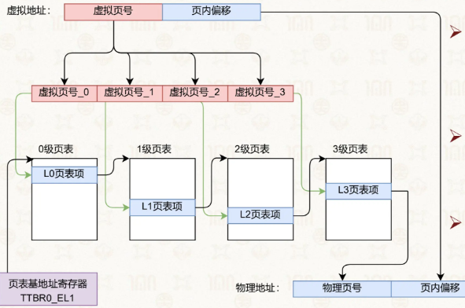

#### 多级页表的优势

1.  节省内存：仅为使用的地址空间分配页表
2.  无需连续物理内存：页表可离散存储
3.  支持大虚拟空间：适配 64 位系统
4.  精细管理：支持灵活的内存权限与属性控制

#### 多级页表的缺陷

**结论**：不一定，多级页表节省内存的前提是：应用进程使用的虚拟地址远小于总虚拟地址空间。若该假设不成立，多级页表可能占用更多内存

反例：Intel PAE 3级页表（32位虚拟地址，36位物理地址）

*   页表项：64位 → 每个4KB页存放512项

*   页表结构：2+9+9+12位

*   场景：应用用满4GB虚拟地址空间

    *   多级页表总内存：

        *   第0级：4KB
        *   第1级：4KB × 4 = 16KB
        *   第2级：4KB × 512 × 4 = 8MB
        *   合计：8MB + 20KB

    *   单级页表总内存：8MB

*   对比：多级页表多了上级页表的20KB开销，此时内存占用更高

### 4.1.5页表项与大页（AArch64）

#### 多级页表和大页映射

*   **大页**：当中间级的页表项直接指向物理页时，其指向的就是大页

    *   原因：中间级页表项（L0/L1/L2）可直接指向物理页，而非仅指向下一级页表
    *   意思：比下一级页表项指向的物理页的大小更大
    *   内容：出来物理页号之外，还有属性位等

*   **映射大小**：

    *   本质是：在某一级页表就终止翻译，把后面几级索引的地址位全部当作 “页内偏移”，所以页大小 =$2^{后续所有位数}$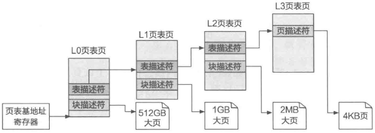

    *   L0：可映射 <u>512GB 大页</u> 或指向 L1 页表

    *   L1：可映射 <u>1GB 大页</u> 或指向 L2 页表

    *   L2：可映射 <u>2MB</u> 大页 或指向 L3 页表

    *   L3：仅映射 <u>4KB</u> 标准页

*   **核心特点**：

    *   中间级页表项（L0/L1/L2）可直接指向物理大页，而非仅指向下一级页表
    *   大页映射与 4KB 页映射可共存于同一页表
    *   `struct process`

        ```c
        struct process {
            // 上下文
            struct context *ctx;
            // 虚拟内存
            struct vmspace *vmspace;
        };
        ```

    *   `struct vmspace`

        ```c
        struct vmspace {
            // 页表基地址
            u64 pgtbl;
            // 若干虚拟内存区域组成的链表
            list vmregions;
        };
        ```

    *   `struct vmregion`：表示单个虚拟内存区域

        ```c
        struct vmregion {
            // 起始虚拟地址
            u64 start;
            // 结束虚拟地址
            u64 end;
            // 访问权限
            u64 perm;
        };
        ```
| 类型位                | 第1位 | 1=表描述符/块描述符；0=页描述符                        |
| PFN/Output address | 高位段 | 物理页号（输出地址），用于地址翻译                         |


#### **页描述符（指向4KB页，L3页表项）**

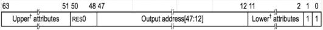

*   Upper attributes

    *   **XN (或UXN，Unprivileged eXecute Never)**：第54位，表示用户态代码是否有可执行权限，0=EL0可执行

    *   **PXN (Privileged eXecute Never)**：第53位，表示内核态代码是否有可执行权限，0=EL1可执行

    *   **DBM**：类似于x86\_64（中的dirty bit）MMU 自动置 1 表示物理页被写入

*   Lower attributes

    *   **AF (Access Flag)**：第10位，若设为0则访问时发生异常

        *   可供软件追踪内存访问情况

    *   **Shareability field**：第9-8位，用于核间、核与设备间的共享

    *   **AP (Access Permission)**：第7-6位，控制读写权限（见下表）

        | AP | 用户态 EL0 | 内核态 EL1 |
        | -- | ------- | ------- |
        | 00 | 不可访问    | 可读可写    |
        | 01 | 可读可写    | 可读可写    |
        | 10 | 不可访问    | 只读      |
        | 11 | 只读      | 只读      |


    *   **AttrIndx\[2:0]**：第4-2位，表示内存类型

        *   Normal：其cacheable属性由TCR\_EL1指定
        *   Device：设为non-cacheable，设备内存，又再细分四种

#### **块描述符（指向大页）**

*   与页描述符共享UXN/PXN/AF/AP/V等属性位
*   仅 PFN 段更长，对应更大物理页（512GB/1GB/2MB）

表描述符（指向下一级页表）

*   仅保留 PFN + 类型位 + V位，无访问权限/执行权限等属性位

#### 异常处理与地址翻译

**地址翻译异常类型**

| 异常类型    | 触发条件                |
| ------- | ------------------- |
| 缺页异常    | 任意一级页表项 V=0（未找到映射）  |
| 访问权限异常  | 实际访问权限与 AP 位设置冲突    |
| 访问标志位异常 | AF=0 且首次访问该页面       |
| 权限执行异常  | 执行权限与 UXN/PXN 位设置冲突 |


**体系结构差异**

*   AArch64：缺页异常复用8号同步异常，通过 ESR/FAR\_EL1 寄存器解析异常信息与虚拟地址
*   x86-64：缺页异常为14号异常（#PF），虚拟地址存于 CR2 寄存器

#### 页表使能

*   CPU启动流程

    *   上电后默认进入物理寻址模式• 系统软件配置控制寄存器，使能页表，进入虚拟寻址模式

*   AARCH64

    *   SCTLR\_EL1 （System Control Register, EL1）
    *   第0位（M位）置1，即在EL0和EL1权限级使能页表

*   对比x86\_64

    *   CR0，第31位（PG位）置1，使能页表

#### 大页映射的优缺点

**优点**：

*   大幅减少页表数量，降低内存开销
*   减少 TLB 缺失，提升地址翻译性能

**缺点**：

*   内存分配粒度变大，易造成内部碎片
*   换页/回收时操作更粗粒度
*   访存次数多，一次翻译可能会甚至访问四次
*   耗时长

### 4.1.6TLB：页表的缓存（翻译加速器）

#### 基本

**TLB**：转址旁路缓存，Translation Lookaside Buffer

*   缓存了虚拟页号和物理页号的映射关系
*   类似于存储着键值对的哈希表

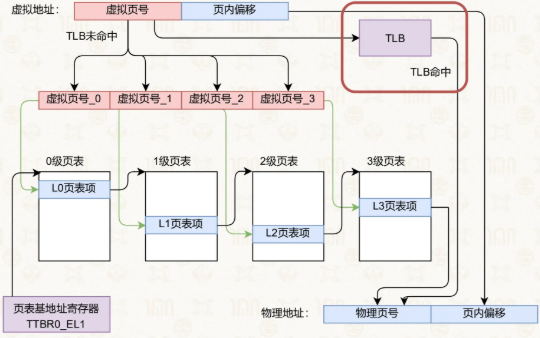

**TLB 命中**：MMU 会先把虚拟页号作为键区查询 TLB 的缓存项

*   TLB命中（TLB Hit）：成功
*   TLB不命中（TLB Miss）：成功

**目的**：减少多级页表下地址翻译过程中的访存次数，加速地址翻译的过程

#### TLB 的结构：分层架构

*   **L1**：数据TLB、指令TLB

    *   数据：缓存数据的地址翻译
    *   指令：缓存指令的地址翻译

*   **L2**：不区分数据和指令（但也存在分离的设计）

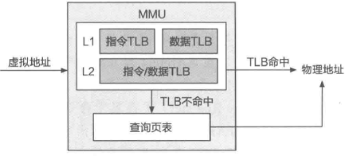

#### TLB管理

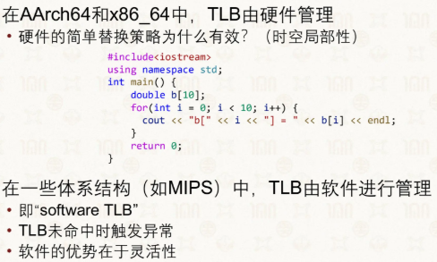

#### TLB需要刷新的原因（TLB Flush）

**原因**：TLB 使用虚拟地址索引，切换页表时需要全部刷新

→不同进程AB可能使用同样的虚拟地址，但是实际上的物理地址不同

#### 降低TLB刷新开销的办法

**系统调用上**

*   AArch64上内核和应用程序使用不同的页表

    *   分别保存在TTBR0\_EL1和TTBR1\_EL1

    *   系统调用过程不用切换

    *   优势：

        *   系统调用时不需要修改页表基地址寄存器，只是特权级切换
        *   TLB 中通过 ASID 区分应用地址空间，内核地址空间也有独立标识
        *   因此系统调用过程完全不需要刷新 TLB，避免了性能开销

*   x86\_64上只有唯一的基地址寄存器（CR3）

    *   内核映射到应用页表的高地址

    *   避免系统调用时TLB刷新的开销

        *   优势：系统调用时不需要切换页表基地址（CR3 不变）

        *   内核与应用共享同一张页表，TLB 中内核部分的映射可以复用

        *   因此系统调用时不需要刷新 TLB，避免了开销

**进程切换上（给缓存打标签）**

*   目标：不刷新全部TLB

*   x86-64：PCID（Process Context ID）

    *   存储在 CR3 低位，用于区分不同进程地址空间

    *   在 KPTI（内核页表隔离）后尤为重要，避免进程切换时全量刷 TLB

        *   KPTI: Kernel Page Table Isolation
        *   即内核与应用不共享页表，防御Meltdown攻击 https\://meltdownattack.com/

*   AArch64：ASID（Address Space ID）

    *   OS 为每个进程分配唯一 ASID，写入 TTBR0\_EL1 高 16 位

    *   TLB 缓存项携带 ASID，MMU 只匹配 ASID 一致的条目

    *   进程切换时只需更新 TTBR0\_EL1，不用清空整个 TLB

    *   ASID有16位，所以一般操作系统最多支持 $2^{16}$ 个应用同时运行

    

## 4.2管理页表映射（操作系统的职责）

### 4.2.1直接映射（操作系统为自己配置页表）

#### 原因

CPU 上电启动后<u>默认使用物理地址</u>，这是因为 MMU（内存管理单元）的地址翻译功能此时未开启，操作系统负责在初始化过程中启用该功能

一旦<u>启用 MMU 地址翻译</u>，CPU 会认定<u>所有指令涉及的地址均为虚拟地址</u>，因此操作系统和应用进程在后续运行中<u>都使用虚拟地址</u>。

操作系统可访问所有物理内存，同时也需要<u>为自身配置页表。</u>

#### 两个特点

*   **使用高虚拟地址**：以 AArch64 架构为例

    *   操作系统使用高 16 位为 1 的虚拟地址
    *   应用进程则使用低虚拟地址，高 16 位为 0 的虚拟地址。

*   **一次性映射全部物理内存**

    *   通常采用<u>直接映射</u>（Direct Mapping）方式

        *   虚拟地址 = 物理地址 + 固定偏移

    *   操作系统使用的虚拟地址空间也称为内核地址空间

#### 直接映射的核心机制

*   **操作系统直接使用连续内存空间**，虚拟地址与物理内存保持简单的线性映射。

*   **MMU 仅保存固定偏移量**：在直接映射场景下，MMU 只需保存虚拟地址低 12 位的固定值（如 0x1234\_00000000），即可与页内偏移拼接得到物理地址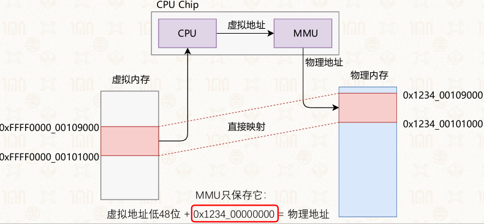

*   **应用程序页表的地址转换逻辑**

    *   应用程序页表里保存的是物理地址，但 CPU 只接收虚拟地址，需通过 MMU 完成转换。
    *   操作系统读页表后需“再翻译”，MMU 则自动完成翻译流程：虚拟地址经多级页表（如 3 级页表）索引，提取物理页号，与低 12 位页内偏移拼接，最终转换为物理地址

    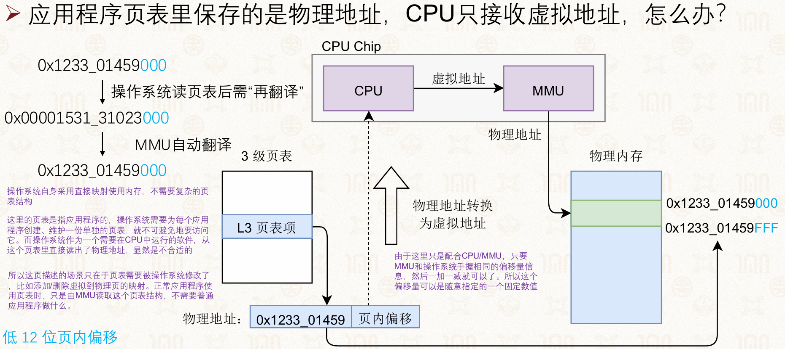

### 4.2.2虚拟内存段分布（如何填写进程页表）

#### 内存区域分布

*   一个应用程序的内存空间包含多个区域

    *   虚拟内存起始与终止地址
    *   区域权限标记
    *   文件偏移量、
    *   动态加载的代码库
    *   ……

*   动态加载的代码库

    *   程序启动或运行时才加载的指令库

        *   Windows中为DLL格式
        *   Linux中为so格式

    *   多个应用程序可共享同一动态链接库，实现代码复用，节省内存空间

    *   虚拟地址空间变化

        *   程序刚启动时仅包含代码、只读数据、用户堆、用户栈
        *   运行后会新增加载的代码库映射

    

#### 可执行文件ELF（大型C/C++工程的编译）

**链接器的作用**

*   用于链接外部库文件

*   补全可执行文件的信息

    *   头部信息
    *   各代码段位置与标签。

*   <u>程序分段编译、分段加载</u>，需要链接器完成各模块整合

#### ELF可执行文件

**基本概念**

*   ELF可执行可链接文件

*   多用于

    *   Linux与Android系统的可执行文件
    *   共享库：.so/.a
    *   目标文件：.o

*   组成

    *   ELF头部

    *   多个程序段

        *   每个段为连续二进制块
        *   由加载器加载到指定地址执行

    *   可选的段头表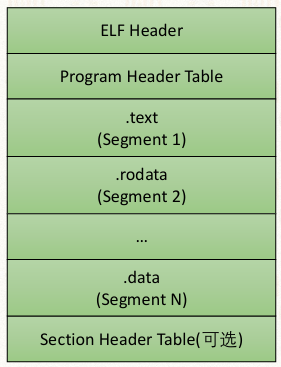

**ELF头部结构**

*   以结构体形式定义

    *   包含魔数、文件类型、目标架构、版本、入口虚拟地址、程序头表偏移、段头表偏移等信息

*   可通过对应命令查看头部信息：readelf-h hello-vm.o

    *   魔数用于标记文件类型
    *   入口地址记录程序起始执行位置
    *   程序头表偏移记录其在文件中的位置

    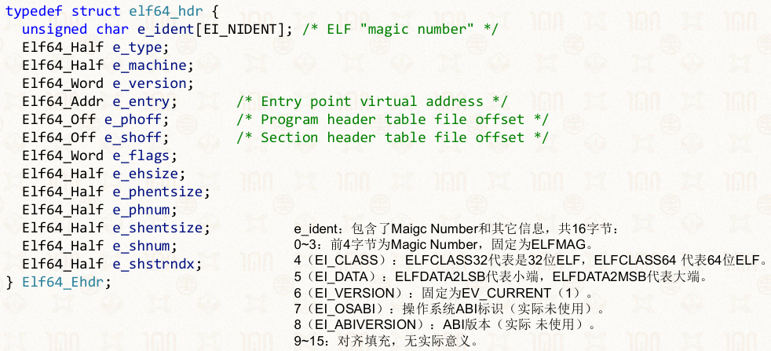

**常见的ELF段信息**

*   <u>.text 代码段</u>

    *   存储程序编译后的机器指令代码。

*   <u>.data 数据段</u>

    *   存储已初始化的全局变量、静态变量
    *   函数内普通局部变量(非静态变量)不存入本段。

*   <u>.rodata 只读数据段</u>

    *   存储程序内只读常量，包括全局常量、字符串常量（如"apple"），运行时不可修改。

*   <u>.bss 零数据段</u>

    *   存储未初始化的全局变量、静态变量（如int a）

    *   文件内不占用实际存储空间，仅记录地址和大小

        *   由于在运行期间未初始化的全局变量被初始化为0

**应用程序的加载与执行**

*   程序启动分为两步

    1.  **加载**：将ELF文件按链接规则从存储器拷贝到内存，按段的加载内存地址写入指定位置

        *   Load Memory Address，LMA

    2.  **执行**

        *   将ELF文件中的段放置到虚拟内存地址（Virtual Memory Address，VMA）
        *   随后执行代码

*   内存区域分布

    *   从可执行文件来
    *   应用程序主要内存段从低地址到高地址，堆自低向高增长，栈自高向低增长
    *   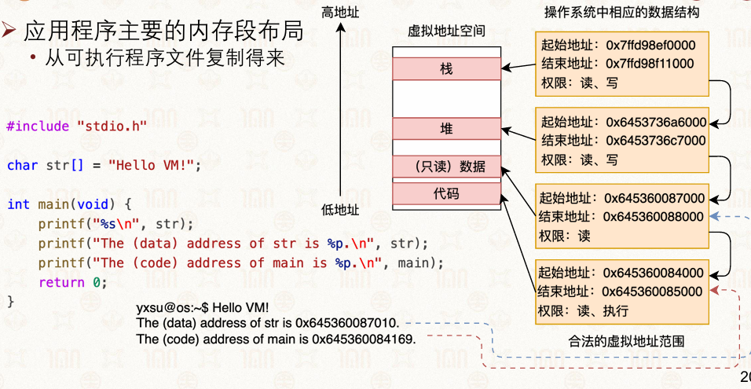

### 4.2.3进程页表配置与管理

#### 基本概念

*   **核心机制**

    *   进程执行时，所有访存的虚拟地址由MMU依据页表翻译为物理地址，页表由操作系统维护，每个进程拥有独立页表，实现地址空间隔离。

*   **关键细节**

    *   页表基地址与页表项均存储物理地址，操作系统读写页表时使用虚拟地址，依靠内核直接映射完成转换。
    *   多级页表只需先分配一级页表页，下级页表页按需分配，有效节省内存。

#### 统一页表框架

*   多级页表层级（Linux内核定义）

    *   **0级页表（L0）**：全全局目录 Page Global Directory, PGD
    *   **1级页表（L1）**：页上层目录 Page Upper Directory, PUD
    *   **2级页表（L2）**：页中间目录 Page Middle Directory, PMG
    *   **3级页表（L3）**：直接页表 Page Table, PT
    *   补充：Linux 4.11版本之后，额外新增**4级目录（P4D）**

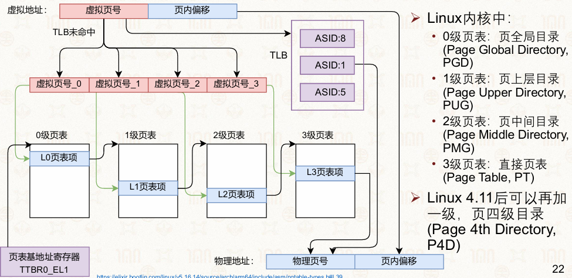

#### 页表管理相关基础代码结构

*   **进程结构体定义**struct process {     // 进程地址空间上下文     struct context \*ctx;     // 页表基地址，存储物理地址     u64 pgtbl;     // 其余进程相关属性     //...... };

    *   进程结构体包含上下文信息与页表基地址成员变量，页表基地址为物理地址

*   **对外暴露核心接口函数**

    *   void add\_mapping(u64 pgtbl, u64 va, u64 pa);

        *   完成虚拟地址到物理地址的页表映射添加

    *   void delete\_mapping(u64 pgtbl, u64 va);

        *   删除指定虚拟地址对应的页表映射

#### 获取下一级页表函数 get\_next\_pgtbl\_page

**函数完整定义**

```
u64 get_next_pgtbl_page(u64 *pgtbl, u32 index) { u64 pgtbl_entry; // 通过传入索引，取出当前页表内对应的页表项 pgtbl_entry = pgtbl[index]; // 判断页表项是否为空（页表空洞） if (pgtbl_entry == 0) { // 无对应页表项时，分配新的页表物理页 pgtbl_entry = alloc_pgtbl_page(); // 写入物理页地址，并附加访问权限位 pgtbl_page[index] = pgtbl_entry | some_permission; } // 关键转换：页表项存储的是物理地址，操作系统运行态使用虚拟地址，执行paddr_to_vaddr完成地址再翻译 return paddr_to_vaddr(pgtbl_entry); }
```

**函数核心细节**

*   入参：当前层级页表基地址指针pgtbl、当前层级对应的索引index

*   页表空洞处理：当前页表项为空时，自动分配新页表内存、填充地址与权限位

*   必须注意的<u>再翻译逻辑</u>：硬件页表项存储物理地址，内核软件寻址使用虚拟地址，返回前必须通过paddr\_to\_vaddr 完成物理地址转内核虚拟地址

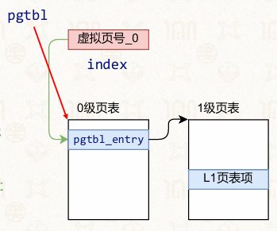

#### 添加页表映射函数 add\_mapping

**函数功能**：在指定进程的页表中，新增<u>虚拟地址va到物理地址pa</u>的完整多级页表映射

**完整执行流程**

1.  传入进程结构体指针、待映射虚拟地址、目标物理地址

2.  获取0级页表基地址：取出进程结构体内存储的<u>物理页表基地址pgtbl，</u>通过paddr\_to\_vaddr转换为内核可用虚拟地址

3.  解析虚拟地址，得到<u>0级页表索引L0_INDEX(va)</u>

4.  调用get\_next\_pgtbl\_page，传入0级页表基地址与索引，获取1级页表基地址

5.  解析虚拟地址，得到1级页表索引L1\_INDEX(va)，再次调用函数获取2级页表基地址

6.  解析虚拟地址，得到2级页表索引L2\_INDEX(va)，再次调用函数获取3级页表基地址

7.  解析虚拟地址，得到3级页表索引L3\_INDEX(va)

8.  在最终3级页表对应索引位置，写入目标物理地址，并附加权限位：pgtbl\_page\[index] = pa | some\_permission;

**流程特点**：严格顺着0→1→2→3级页表逐级向下寻址，每一级都复用get\_next\_pgtbl\_page函数处理页表缺失、地址转换问题

**示例**

```c
void add_mapping(struct process *p, u64 va, u64 pa) {
    u64 *pgtbl_page;
    u32 index;

    // 获取 0 级页表页的起始地址：即为页表基地址
    // 每个页表页占据 4K，包含 512 个页表项
    pgtbl_page = (u64 *)paddr_to_vaddr(p->pgtbl);

    // 获取虚拟地址在 0 级页表页中的页表项索引
    index = L0_INDEX(va);

    // 获取 1 级页表页的起始地址
    pgtbl_page = get_next_pgtbl_page(pgtbl_page, index);

    // 获取虚拟地址在 1 级页表页中的页表项索引
    index = L1_INDEX(va);

    // 获取 2 级页表页的起始地址
    pgtbl_page = get_next_pgtbl_page(pgtbl_page, index);

    // 获取虚拟地址在 2 级页表页中的页表项索引
    index = L2_INDEX(va);

    // 获取 3 级页表页的起始地址
    pgtbl_page = get_next_pgtbl_page(pgtbl_page, index);

    // 获取虚拟地址在 3 级页表页中的页表项索引
    index = L3_INDEX(va);

    // 在 3 级页表页的页表项中填写物理地址
    pgtbl_page[index] = pa | some_permission;
}
```

#### 删除页表映射函数 delete\_mapping

函数入参：页表基地址pgtbl、待删除映射的虚拟地址va

1.  按虚拟地址索引各级页表，定位最后一级页表项。
2.  清空对应页表项并刷新TLB，避免旧映射缓存引发错误。

**完整执行流程**

1.  映射查找逻辑：和add\_mapping流程完全对称，逐级遍历多级页表，查找该虚拟地址对应的最终页表项
2.  页表项清空：若成功定位到对应页表项，将该页表项内容置空，解除虚拟地址到物理地址的映射
3.  TLB同步刷新：调用硬件指令flush\_tlb(pgtbl, va);，精准刷新该虚拟地址对应的TLB缓存项，保证软硬件地址转换信息一致

<!---->

```c
void delete_mapping(u64 pgtbl, u64 va) {
    // 类似 add_mapping，在 pgtbl 页表中，
    // 逐级查找虚拟地址 va 对应的页表项，
    // 若页表项存在，则将该页表项清空
    // ...

    // 利用硬件提供的精准刷新虚拟地址相应 TLB 项的指令
    flush_tlb(pgtbl, va);
}
```

#### 虚拟内存变化（进程的生命周期）

*   **进程创建时**

    *  [ELF程序启动时](#elf可执行文件)
    *   操作系统将应用的二进制文件和动态代码库加载到物理内存，
    *   在应用进程的页表中添加虚拟地址到物理地址的映射（代码和数据），完成初始的虚拟地址空间布局。

*   **进程执行时**：应用进程要求改变虚拟地址空间

    *   进程的栈和堆的空间增加或减少；进程加载或卸载其他代码库
    *   进程通过调用 mmap 接口增加新的虚拟内存区域
    *   通过 munmap 接口删除已有的虚拟内存区域。

*   **进程退出时**：操作系统删除应用进程的页表，即删除整个进程虚拟地址空间

### 4.2.4管理页表映射：立即映射

#### mmap基本概念和代码

**接口定义**：`void *mmap(void *addr, size_t length, int prot, int flags, int fd, off_t offset);`

**功能与使用**：应用进程通过mmap接口向操作系统申请创建新的虚拟内存区域

**参数含义**

*   addr：指定新分配虚拟内存区域的起始虚拟地址
*   length：指定虚拟内存区域的大小
*   prot：指定区域的访问权限（如PROT\_READ、PROT\_WRITE）
*   flags：指定映射类型（如MAP\_ANONYMOUS表示匿名映射、MAP\_PRIVATE表示私有映射）
*   fd和offset：用于文件映射场景，匿名映射可传入-1和0

**应用示例代码**：

```c
#include <stdio.h>
#include <string.h>
#include <sys/mman.h>
// void *mmap(void *addr, size_t length, int prot, int, flags, int fd, off_t offset);
int main(){
    char *buf;
    buf = mmap((void *)0x500000000, 0x2000, PROT_READ | PROT_WRITE, MAP_ANONYMOUS | MAP_PRIVATE, -1, 0 );
    printf("mmap returns %p\n", buf);
    strcpy(buf, "Hello, mmap");
    printf("%s\n", buf);
    return 0;
```

#### 进程虚拟地址空间与页表填写时机

**进程虚拟地址空间布局与变化：**

*   初始状态（程序刚启动）：包含用户栈、代码库、用户堆、（只读）数据段、代码段，由操作系统加载二进制文件和动态库并完成初始映射
*   运行过程变化：栈空间增长、堆空间增长、通过mmap新增虚拟内存区域、新加载代码库

**页表填写的立即映射策略：**

*   核心逻辑：虚拟内存区域声明后，<u>立即分配</u>物理内存并填写页表映射，即马上调用add\_mapping

*   进程创建阶段：为初始虚拟内存区域（代码段、数据段等）直接添加虚拟页到物理页的映射，流程为：alloc\_page分配物理页 → 加载磁盘中的代码/数据到物理页 → add\_mapping更新页表

*   进程运行阶段：接收到mmap请求后，立刻为虚拟内存区域中的每个虚拟页分配物理页并添加映射

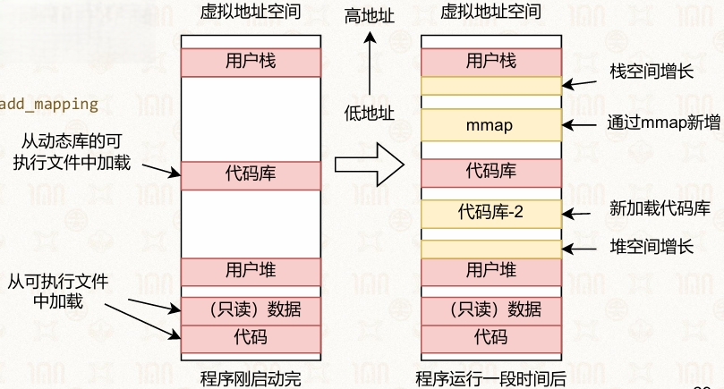

#### 操作系统中mmap的示意实现（立即映射）

```c
// 参数 addr 和 length 分别为虚拟内存区域的起始地址和长度
// 伪代码省略边界检查
void sys_mmap(u64 addr, u64 length, ...)
{
    u64 page_num;
    u64 pa;
    u64 pgtbl;

    // 总共需要映射的页面数量，PAGE_SIZE 是 4K
    page_num = length / PAGE_SIZE;

    // 获取当前进程的页表
    pgtbl = get_current_process_pgtbl();

    // 为每个虚拟页分配物理页，并在页表中添加映射
    while (page_num > 0) {
        pa = alloc_page();
        add_mapping(pgtbl, addr, pa);
        addr += PAGE_SIZE;
        page_num--;
    }
}
```

#### 立即映射策略的优缺点与问题

*   优点：逻辑简单直观，实现直接，无需额外的延迟处理

*   核心问题：

    *   <u>启动时延增加</u>：启动时需为所有内容分配物理内存并加载，而大部分内存实际运行中不会被使用，既浪费物理内存资源，又延长启动时间

    *   <u>内存资源浪费</u>：如应用进程为避免内存不足，调用mmap时设置较大的length参数，若采用立即映射策略，会为整个虚拟内存区域分配物理页，造成大量未使用的物理内存被占用

*   解决方向：引入延迟映射策略，将虚拟内存的分配与物理内存的分配解耦，仅在进程实际访问虚拟页时才分配物理内存并填写页表

### 4.2.5延迟映射

#### 延迟映射的核心逻辑：

*   先声明内存区域，待真正使用时才创建到物理内存页的映射
*   系统为每个程序保存若干内存区域
*   实现了物理内存的节约利用

**缺页处理（如何为虚拟页分配物理页）**

*   应用程序第一次访问虚拟页时会触发缺页异常，操作系统介入处理

*   `page_fault_handler` 流程：

    1.  对异常地址按页大小向下取整 `ROUND_DOWN(fault_va, PAGE_SIZE)`
    2.  遍历当前进程的虚拟内存区域链表，检查地址是否在合法区域内
    3.  检查访问权限是否匹配
    4.  分配物理页 `alloc_page()`，并在页表中添加映射 `add_mapping(pgtbl, addr, pa)`

*   ```c
    void page_fault_handler(u64 fault_va, ...)
    {
        u64 va, pa;
        list vmregions;
        struct vmregion vmr;
        u64 pgtbl;

        va = ROUND_DOWN(fault_va, PAGE_SIZE);
        vmregions = get_current_process_vmregions();

        for_each vmr in vmregions:
            if va in [vmr.start, vmr.end):
                check_perm();
                pa = alloc_page();
                pgtbl = get_current_process_pgtbl();
                add_mapping(pgtbl, va, pa);
    }
    ```

**延迟映射的实现**：

*   进程结构体扩展：

    *   `struct process`

        ```c
        struct process {
            // 上下文
            struct context *ctx;
            // 虚拟内存
            struct vmspace *vmspace;
        };
        ```

    *   `struct vmspace`

        ```c
        struct vmspace {
            // 页表基地址
            u64 pgtbl;
            // 若干虚拟内存区域组成的链表
            list vmregions;
        };
        ```

    *   `struct vmregion`：表示单个虚拟内存区域

        ```c
        struct vmregion {
            // 起始虚拟地址
            u64 start;
            // 结束虚拟地址
            u64 end;
            // 访问权限
            u64 perm;
        };
        ```

*   `mmap` 接口的作用：执行 `mmap` 后，操作系统仅为进程新增一个 `vmregion` 结构体，不分配物理页与页表映射

*   `sys_mmap` 实现：设置 `vmregion` 的起始地址、结束地址、权限，并将其插入当前进程的虚拟内存区域链表

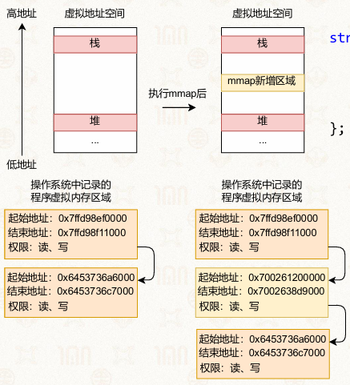

#### 延迟映射的优缺点

*   优点：节约物理内存，仅在实际访问时分配物理页，提升物理内存利用率

*   缺点：首次访问虚拟页会触发缺页异常，操作系统介入处理，<u>降低性能</u>

#### 虚拟地址空间的管理：

*   使用 `mm_struct` 结构体描述进程虚拟地址空间

*   `mm_struct` 包含

    *   `pgd_t *pgd`：指向第一级页表
    *   `struct vm_area_struct *mmap`：虚拟内存区域链表
    *   `struct rb_root mm_rb`：虚拟内存区域红黑树

*   `task_struct` 中包含指向 `mm_struct` 的指针

    *   每个进程通过 `mm_struct` 管理自身虚拟地址空间

*   Linux 中虚拟内存区域（VMA）通过<u>红黑树组织</u>

    *   相比链表更高效地支持地址查找与范围管理

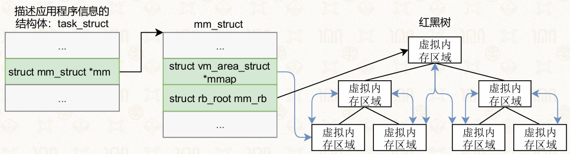

#### Linux 内核缺页异常处理流程：

`__do_user_fault` / `__do_kernel_fault`：根据异常模式调用 `force_sig_info` 向进程发送信号或处理内核异常

`do_translation_fault`：入口函数，接收触发异常的虚拟地址、异常状态寄存器值、被打断进程的寄存器集合

*   用户虚拟地址 → 调用 `do_page_fault`
*   内核虚拟地址或不规范地址 → 调用 `do_bad_area`

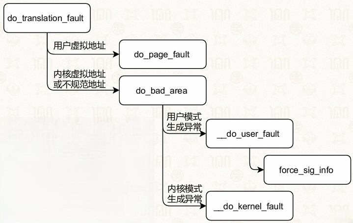

`do_page_fault`：处理缺页异常的核心分支

*   禁止缺页处理/原子上下文/内核线程 → 调用 `__do_kernel_fault`

*   处理应用的缺页异常：

    *   应用地址越界、内核模式下执行用户空间指令、异常表无修正程序 → 调用 `die` 终止进程
    *   处理内核模式的异常 → 调用 `__do_kernel_fault`
    *   内存耗尽 → 调用 `pagefault_out_of_memory`
    *   内存充足 → 调用 `__do_user_fault`

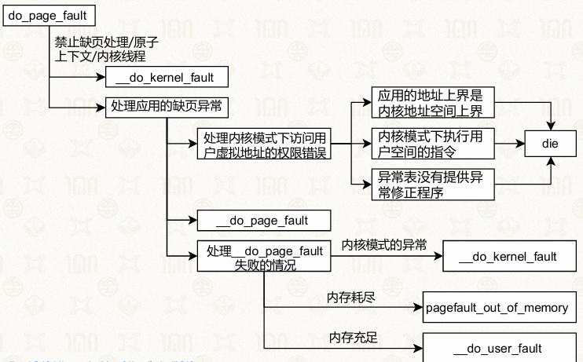

`handle_pte_fault`：页表项级别的缺页处理

*   页表项无效：

    *   私有匿名映射 → 调用 `do_anonymous_page`
    *   文件/共享匿名映射 → 调用 `do_fault`

*   页不在内存中 → 调用 `do_swap_page` 处理换入

*   页在内存中：

    *   处理写访问

        *   页表项无写权限 → 调用 `do_wp_page` 执行写时拷贝
        *   页表项有写权限 → 调用 `pte_mkdirty`

    *   更新页表状态：调用

        *   `pte_mkyoung`

        *   `step_set_access_flags`

            *   页表项发生变化 → 调用 `update_mmu_cache`
            *   未变化 → 调用 `flush_tlb_fix_spurious_fault`

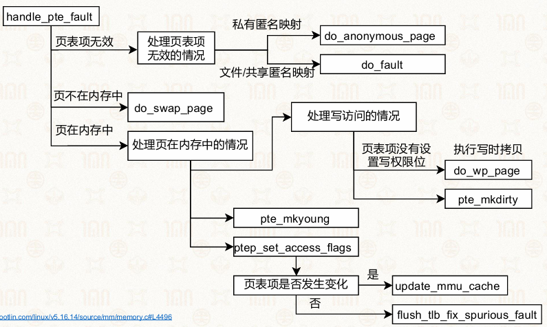

#### 延迟映射与段错误的关系：

*   **虚拟地址需要分配后才能使用：**

    *   分配但未使用，第一次访问时触发缺页异常，操作系统处理后完成映射
    *   未分配也未使用，第一次访问时触发 Segmentation Fault（段错误）

*   缺页异常是 CPU 定义的硬件行为

*   段错误是操作系统定义的错误

    *   当应用访问的虚拟地址不属于进程的合法虚拟内存区域时，操作系统会在缺页异常处理中判定为非法访问，最终报告段错误

### 4.2.6虚拟内存的扩展功能

#### 共享内存、写时拷贝

**实现**

*   修改页表项权限为只读

*   发缺页异常时拷贝物理页、恢复可写权限

*   典型场景：fork（）系统调用

    *   创建子进程时，父子进程共享物理内存
    *   仅在一方执行写操作时拷贝页面
    *   <u>节省内存、提升运行性能</u>

*   执行流程

    1.  多进程共享同一物理页

    2.  某进程发起写操作触发权限异常

        *   只有当某个进程真正要修改这块内存时，才为它单独复制一份副本，修改只作用于副本上，不影响其他进程

    3.  系统为它分配新物理页并复制数据

    4.  更新该进程页表映射并恢复写权限

    5.  原进程保留原有共享页面

#### 内存去重（memory deduplication）

**基本概念**

*   依托写时拷贝机制

*   操作系统扫描合并内容相同的物理页

    *   以只读方式共享
    *   写入操作触发写时拷贝进行页面分离

*   对用户态透明

**典型案例**：Linux内核 KSM 同页合并机制，后台线程扫描匿名页并合并相同页面，写入时自动触发分离

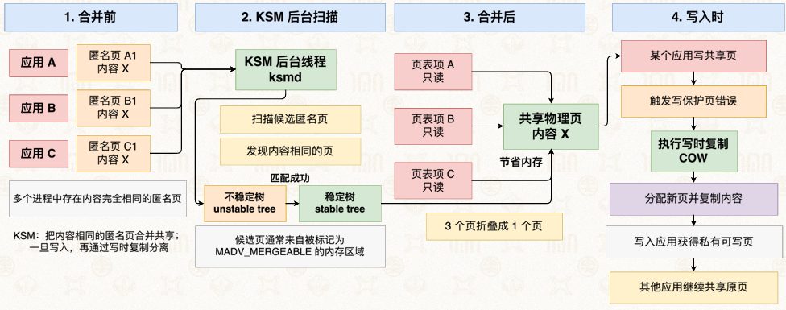

**安全隐患**

*   导致新的测信道攻击（side channel）

    *   合并页面会产生访问延迟差异

*   潜在攻击

    *   可能被攻击者利用推测应用内存状态\目标应用中含有构造数据

#### 内存压缩

**基本思想**：内存资源紧张时，压缩近期低频使用的内存页，释放物理内存空间

**系统案例**

*   Windows

    *   内存压缩将压缩数据<u>留存内存</u>

    *   访问时即时解压

    *   \*全程在内存中操作，避免了磁盘读写，快

*   Linux zswap

    *   作为换页缓存，先压缩待换出数据存入内存区域zswap
    *   若要访问这些数据，先从zswap解压读取
    *   zswap 空间不足才把最老的数据写到Swap分区
    *   \*减少磁盘读写损耗、提升性能与设备寿命

“**传输多个小文件和传输一个大小类似的大文件，哪个快**？”

*   类比压缩的优势

    *   多个小文件（对应未压缩的多个内存页）：读写时会有大量的元数据开销、寻址开销，效率低
    *   一个压缩后的大文件（对应压缩后的连续数据块）：连续写入，开销小，效率高

*   所以，把零散的内存页压缩成连续块，再写入内存或磁盘，效率会高得多。

#### 大页

**原理**：多级页表中，高阶页表项直接指向大容量物理页，减少页表层级与 TLB 占用数量，提高TLB命中率

**例子**：支持 2MB、1GB 等大页规格，简化地址翻译流程

*   在4级页表中，**L2页表项的第1位**用来做判断：

    *   该位为`1`：表示继续指向L3页表，最终映射4KB普通页

    *   该位为`0`：表示跳过L3页表，直接映射一个**2MB**的物理页

    *   为什么是2MB？

        *   页内偏移固定是12位（对应4KB=2¹²字节）
        *   当跳过L3页表时，原来属于L3页表索引的部分，就变成了页内偏移的扩展位
        *   所以总偏移位数 = 原来的12位 + L3索引的9位 = 21位
        *   2²¹ = 2MB，这就是2MB大页的来源

        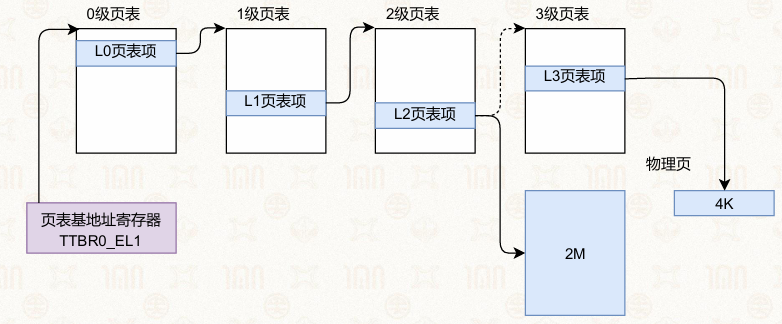

*   类似地，**L1页表项的第1位**也可以做判断：

    *   该位为`1`：继续指向L2、L3页表，最终映射4KB页

    *   该位为`0`：跳过L2、L3页表，直接映射一个**1GB**的物理页

    *   为什么是1GB？

        *   页内偏移 = 原来的12位 + L3索引9位 + L2索引9位 = 30位
        *   2³⁰ = 1GB，这就是1GB大页的来源

        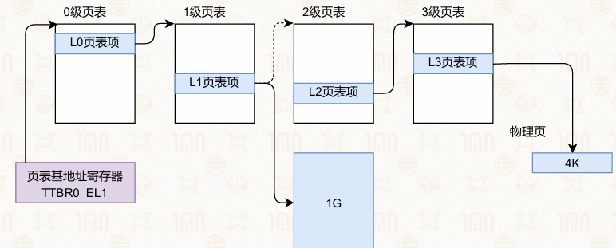

**优点**

*   降低地址翻译开销（缓存项）
*   提升 TLB 命中率
*   减少页表的级数，提升遍历页表的效率

**缺点**

*   存在内存碎片浪费（未使用整个大页造成）
*   增加内存管理复杂度的问题

**实现方式（案例）**

*   应用可手动显式分配大页（提供API）
*   Linux 支持透明大页机制，自动合并普通页面为大页使用

**题目**
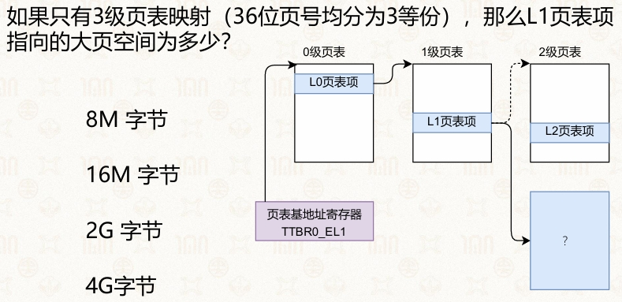
- 对应大页的L1页表项管辖位数=L2页表项12位+页大小4kb（12位）=24位
- $ 2^{24}位=2^4×2^{10}×2^{10}=16MB$