# 5章 物理内存管理
[TOC]
## 5.1管理物理内存资源（操作系统的职责）

### 5.1.1目标与评价维度

#### 目标

为操作系统提供了易用的物理内存抽象

*   逐字节可寻址的“大数组”
*   屏蔽了硬件细节
*   操作系统的物理内存管理变得简单

#### 物理内存管理的碎片问题

**外部碎片**：空闲的但不连续，无法被使用（如分段机制）


**内部碎片**：分配大小大于实际需要


#### 评价指标

*   **内存资源利用率**

    *   外部碎片
    *   内部碎片
    *   利用率越高，说明碎片越少，内存被有效利用的比例越高

*   **分配速度**：指内存分配与回收操作本身的性能

    *   复杂算法：有效减少碎片、提升长期利用率。
    *   但这类算法需要更多计算和查找时间，会拖慢分配/释放速度，甚至成为性能瓶颈

*   **Tradeoff**（权衡关系） 这是内存管理设计的核心思想：

    *   利用率与分配速度存在天然矛盾，无法同时做到极致

### 5.1.2基于位图的连续物理页分配

#### 基于位图的物理内存池结构


*   用一个二进制数组（位图）来管理所有物理页的状态：

    *   每一位对应一个物理页，`0` 表示空闲，`1` 表示已分配
    *   位图本身独立于真实内存空间，记录物理页的分配情况

#### 初始化

*   定义：`bit bitmap[N];`，`N` 是物理页的总数，每一位对应一个4KB物理页

*   初始化函数 `init_allocator()`：

    *   遍历所有位，全部设为 `0`，表示初始状态所有页都是空闲的
    *   作用：为后续分配/释放操作建立统一的状态基准

#### 分配n个连续的物理页

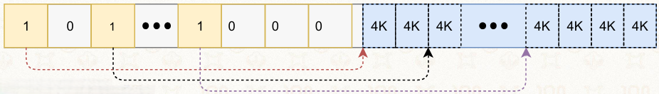

```c
u64 alloc_pages(u64 n) {
    int i, j, find;
    for (i = 0; i < N; ++i) {
        find = 1;
        // 检查从第i页开始，是否有连续n个空闲页
        for (j = 0; j < n; ++j) {
            if (bitmap[i+j] != 0) {
                find = 0;
                break;
            }
        }
        if (find) { // 找到连续n个页，标记为已分配
            for (j = i; j < i + n; ++j)
                bitmap[j] = 1;
            // 返回物理地址：起始地址 + 页索引 × 页大小(4K)
            return FREE_MEM_START + i * 4K;
        }
    }
    return -1; // 分配失败，无足够连续页
}
```

*   步骤拆解：

    1.  遍历位图，从第 `i` 个页开始，检查后续 `n` 个页是否都为 `0`（空闲）
    2.  找到连续空闲块后，将这些页对应的位全部设为 `1`（标记已分配）
    3.  根据页索引计算物理地址并返回；找不到则返回 `-1`

#### 释放n个连续的物理页

```c
void free_pages(u64 addr, u64 n) {
    int page_idx;
    int i;
    // 计算起始页索引：(物理地址 - 内存起始地址) / 页大小
    page_idx = (addr - FREE_MEM_START) / 4K;
    for (i = 0; i < n; ++i) {
        bitmap[page_idx + i] = 0; // 标记为空闲
    }
}
```

*   步骤拆解：

    1.  根据释放的物理地址，计算对应的起始页索引
    2.  从该索引开始，将 `n` 个页对应的位图位全部设为 `0`（标记为空闲）
    3.  注意：需要保证释放的地址和数量与分配时一致，否则会出现状态不一致

#### 优缺点

*   优点：

    *   实现简单，逻辑清晰，容易理解和调试
    *   分配/释放的时间复杂度可预测，最坏情况为 O(N)

*   缺点：

    *   分配连续页时，需要遍历查找，时间开销大，尤其是碎片多的时候

    *   位图本身会占用一定内存

    *   容易产生外部碎片

        *   随着分配/释放次数增加，连续空闲块会被分割成小块，难以满足大连续页的分配需求

### 5.1.3伙伴系统

#### 核心概念

**定义：**以块为单位分配连续物理内存页，块的大小固定为 $ 2^k×页大小$（如4KB页，则块大小为4KB、8KB、16KB、32KB…）

**核心目标**：在保证分配连续内存的同时，通过「分裂」和「合并」机制，减少外部碎片

**核心规则**

*   两个大小相同、地址相邻的空闲块互为<u>伙伴，</u>可以合并成一个更大的块

    *   <u>伙伴判定</u>：相邻的两块，只有一位不同（块大小那一位）

        *   块大小的位数必须为0，高一位才不同
        *   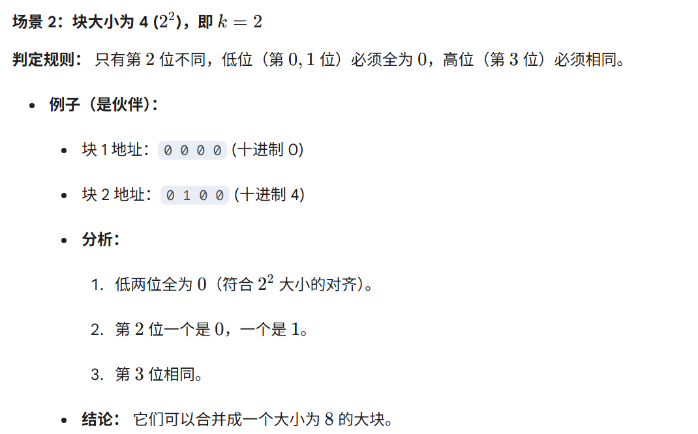

*   大块也可以分裂为两个大小相等的伙伴块

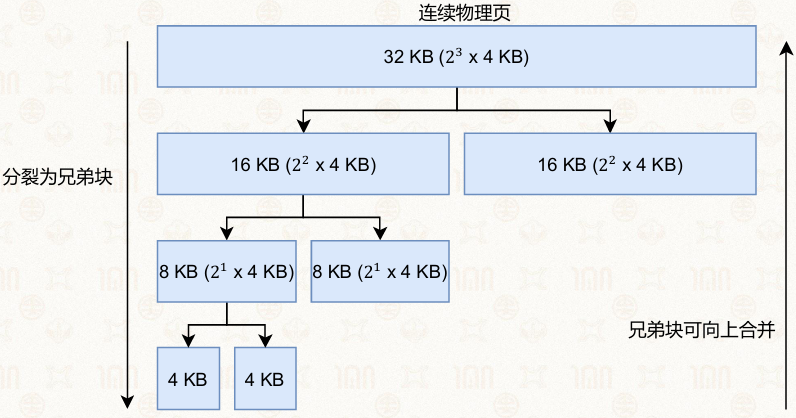

#### 分配流程（以需要15KB为例）

*   15KB的需求向上取整为最小的  $2^k$  块大小：16KB（ $2^2 × 4KB$ ）

*   从空闲链表数组中查找16KB的块：

    *   如果有直接分配；如果没有，则向上找更大的块（如32KB）

    *   将32KB块分裂为两个16KB的伙伴块，分配其中一个给程序，另一个留在空闲链表中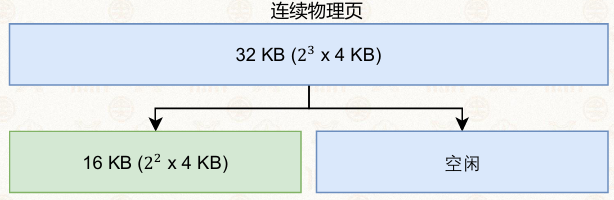

#### 判断示例

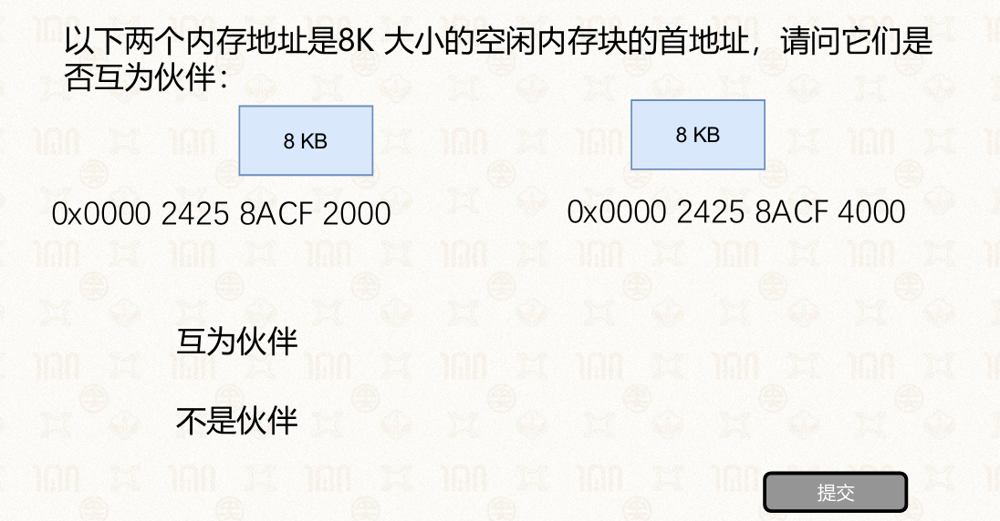

**步骤：**

1.  转换成二进制

2.  看是否在块大小+1位只有一位不同

    *   比如块大小 $8KB=2^{13}$ 看第14位

3.  或者说，两块的异或结果是否等于块大小

    *   如：块大小 $8KB=2^{13}$

    *   异或：0100 0000 0000 0000 ^ 0110 0000 0000=0010 0000 0000= $2^{13}$

#### 空闲块管理：链表数组

*   用一个数组管理不同大小的空闲块：

    *   数组下标对应块的阶数 $k$  ，每个下标对应一个链表，存储所有  $2^k × 页大小$  的空闲块

    *   例如：下标 $0$ 对应4KB块，下标 $1$ 对应8KB块，下标 $2$ 对应16KB块，以此类推

*   分配时，直接到对应阶数的链表中取块；没有则向上分裂更大的块

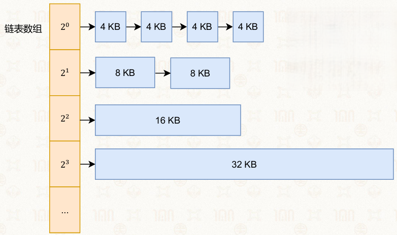

#### 释放与合并流程

*   释放块时，先将块放回对应阶数的空闲链表

*   检查伙伴块是否空闲

    *   如果伙伴块空闲，则将两个块合并为一个更大的块，再检查这个大块的伙伴是否空闲，<u>递归合并</u>，直到无法合并为止

    *   如果伙伴块已被占用，则直接结束释放流程

#### 优缺点总结

*   优点：

    *   分配/释放速度快，合并操作高效，能有效减少外部碎片
    *   链表数组管理简单，适合内核等需要连续物理内存的场景

*   缺点：

    *   会产生**内部碎片**：比如分配16KB块给15KB的程序，浪费1KB空间
    *   块大小必须是2的幂，灵活性有限，不适合分配任意大小的内存

### 5.1.4SLAB分配器

#### SLAB分配器的背景与目标

**伙伴系统的局限**

*   最小分配单位是4KB物理页

    *   内核结构体大多只有几十到几百字节
    *   直接分配会产生严重的内部碎片

**SLAB分配器的目标**：快速分配小内存对象，<u>避免内部碎片</u>

Linux中的SLAB家族：

*   SLAB：原始设计，逻辑复杂
*   SLUB：简化版SLAB，Linux 2.6.23+的默认分配器
*   SLOB：针对内存稀缺场景的极简实现

**发展历史**

*   SLAB分配器历史

    *   上世纪90 年代，Jeff Bonwick 在Solaris 2.4中首创<u>SLAB</u>

    *   07年左右，Christoph Lameter 在Linux中提出<u>SLUB</u>

        *   SLAB的设计过于复杂
        *   在Linux-2.6.23及之后的版本中，成为默认分配器

*   发展过程中，针对内存稀缺场景又提出了<u>SLOB</u>

#### 基本思想

> 观察到操作系统频繁分配的对象大小相对固定，因此采用「预分块+池化」思路

*   从伙伴系统获取大块连续内存

*   将其细分为固定大小的小块，进行管理

    *   通常为 $2^n$ 字节， $3≤n<12$ ，如32/64/128字节

    *   额外优化：可增加特殊大小（如198字节），进一步降低内部碎片

*   为每种大小维护<u>独立</u>的资源池，采用 $best fit$ 策略快速定位


#### SLUB 数据结构与资源池管理

*   每个固定大小的资源池，都由三类链表管理slab（从伙伴系统获取的物理内存块）：

    *   current：仅指向一个slab，当前优先分配的slab
    *   partial：未满的slab链表，存储有空闲对象的slab
    *   full：全满的slab链表，所有对象都已分配

*   slab内部结构：内部组织为空闲链表

    *   每个slab被划分为多个固定大小的对象，用空闲链表组织未分配的对象

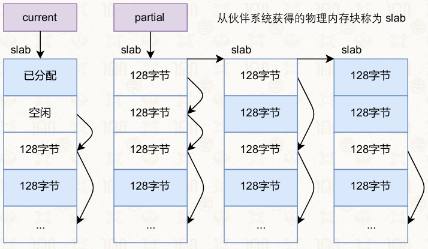

#### SLUB 的分配与释放流程

**分配流程**：

1.  优先从current指向的slab中分配对象

2.  如果current满了，则

    1.  从partial链表中取一个slab作为新的current
    2.  原current移入full链表

**释放流程**：

1.  将对象归还到对应的slab中
2.  如果该slab之前在full链表中，则移回partial链表
3.  若释放后slab完全空闲，且partial链表为空，则将整块内存还给伙伴系统

#### SLUB 的优势与设计本质

**优势**：

*   解决了伙伴系统分配小对象的内部碎片问题
*   分配/释放操作高效，适合内核高频、固定大小的对象分配
*   结构简单，比原始SLAB更易维护

**本质**： SLUB 是伙伴系统之上的二级分配器，它用伙伴系统分配大块连续内存，再自己切分成小块管理，兼顾了连续内存需求和小对象分配效率

### 5.1.5Linux内核内存管理架构

#### Linux架构分层

*   **用户空间**

    *   应用程序
    *   用户态内存分配器

*   **内核空间**

    *   虚拟内存管理
    *   物理内存分配器
    *   内存控制组件

*   **硬件层**

    *   处理器：MMU、缓存
    *   物理内存

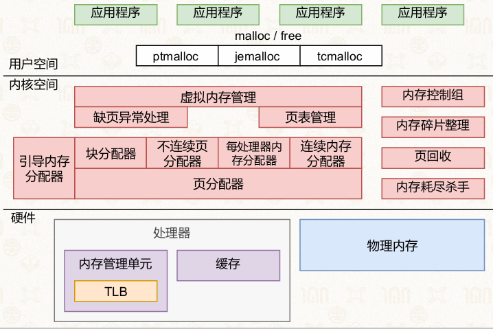

#### 用户空间内存管理

应用程序通过malloc/free接口分配内存，底层由不同的用户态分配器实现：

*   ptmalloc：glibc 默认分配器，通过 brk/mmap 向内核申请页，再划分为小块分配给应用

*   其他内存分配器

    *   tcmalloc：Google开发的高性能分配器，多线程场景下性能更优
    *   jemalloc：FreeBSD衍生的分配器，适合高并发场景

**核心特点**：用户态分配器只负责虚拟内存的管理，物理内存的分配与映射由内核完成


#### 内核空间基本功能

**虚拟内存管理**

*   <u>系统调用接口</u>

    *   sys\_brk：调整堆的大小，用于分配/释放小内存
    *   sys\_mmap：内存映射区域分配虚拟页
    *   sys\_munmap：释放虚拟页

*   <u>延迟分配策略</u>：第一次访问虚拟页时触发<u>缺页异常</u>，再分配物理内存，降低内存浪费

*   <u>核心组件</u>

    *   缺页异常处理：响应缺页中断，完成物理页分配与映射
    *   页表管理：维护虚拟地址到物理地址的映射关系

    

**物理内存分配器**

*   <u>页分配器</u>：基于伙伴系统，以页为单位分配连续物理内存

*   <u>块分配器</u>：基于SLUB/SLAB，为内核小对象分配内存（避免伙伴系统的内部碎片）

*   其他专用分配器：

    *   不连续页分配器：管理vmalloc区域的非连续物理页
    *   每处理器内存分配器：为CPU本地分配缓存对象
    *   连续内存分配器（CMA）：为驱动预留连续物理内存，空闲时可给应用使用

    

**内存控制组件**

*   <u>内存碎片整理</u>：减少外部碎片，提高大连续内存分配成功率

*   <u>页回收</u>：当内存不足时，回收不常用的页（如文件页、匿名页）

*   <u>内存耗尽杀手（OOM killer）</u>：内存严重不足且页回收失败时，终止占用内存过高的进程

*   <u>内存控制器组</u>：限制应用的内存资源使用，防止单个进程耗尽系统内存

*   <u>连续内存分配器(Contiguous Memory Allocator, CMA)</u>

    *   给驱动程序预留连续空间
    *   如果驱动不用，留给应用程序

#### 物理页

见：<https://elixir.bootlin.com/linux/v5.16.14/source/include/linux/mm_types.h#L71>

**struct page**：描述单个物理页的结构体

*   Linux中物理页数量庞大，尽量避免结构体新增成员导致占用过多内存
*   使用联合体优化内存占用，量减少结构体体page的大小

#### slab缓存

见：<https://elixir.bootlin.com/linux/v5.16.14/source/include/linux/slub_def.h#L90>

## 5.2操作系统如何获得更多物理内存资源

### 5.2.1换页机制

#### 背景：物理内存超售与按需分配

**超售（Over-commit）**：应用程序申请的虚拟内存总量，可以远大于物理内存的实际容量

*   情景1：两个应用各需3GB，物理内存只有4GB，通过虚拟内存+换页机制实现“超售”
*   情景2：应用预分配了大量虚拟内存，但大部分页面实际不会被访问，物理内存无需提前分配

**按需分配**：物理页只在应用第一次访问虚拟页时，才真正分配并建立映射

#### 虚拟页与物理页的共享映射

*   多个应用的虚拟页，可以映射到同一个物理页（如共享库、只读数据页）
*   这种共享机制进一步提升了物理内存的利用率，减少了冗余数据

#### 缺页异常（Page Fault）

*   触发场景：

    1.  虚拟页已分配，但物理页尚未分配（按需分配导致）
    2.  物理页已分配，但找不到（物理页已被换出到磁盘）

*   处理方式：操作系统需要分配/换入物理页，并更新页表映射

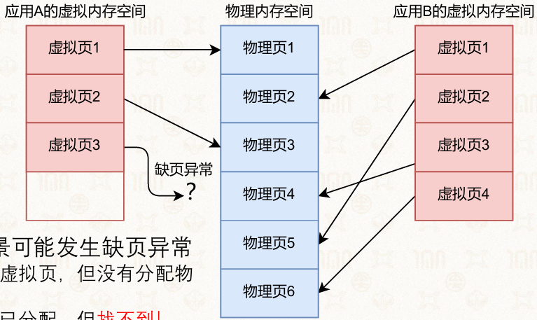

#### 换页机制（Swapping）核心流程

**基本思想**

*   将物理内存中不常用的页，换到磁盘上的Swap分区/文件
*   当需要时再换入物理内存
*   虚拟内存使用,不受物理内存大小限制

**实现方式**

*   磁盘上划分专门的Swap分区
*   缺页异常触发时，执行换入/换出操作

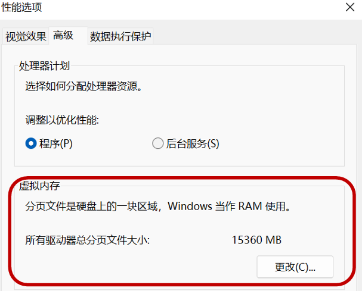

**换出流程**

*   选择一个不常用的物理页
*   将其内容写入磁盘Swap分区
*   回收该物理页，标记为空闲

**换入流程**

*   应用访问的虚拟页，发现已被换出到磁盘
*   触发缺页异常，从磁盘Swap分区读取数据
*   将数据写入空闲物理页，更新页表映射

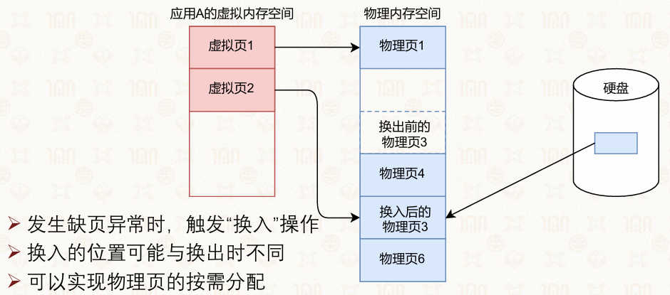

#### 要点

**换入**

*   并不是等物理内存耗尽时才进行换入操作
*   内存快满时就开始了
*   可以腾出更多物理内存空间

**换出**

*   换入的物理页位置可以和换出时不同
*   实现按需分配

**按需分配的优缺点**

*   优势：大幅节约物理内存资源，支持更多应用运行。
*   劣势：缺页异常会导致访问延迟增加（磁盘I/O开销）。

**优化手段**：

*   利用程序的时空局部性，在缺页处理时采用预取（Prefetching），一次性换入相邻页，减少缺页次数
*   精心设计换出策略（如LRU），优先换出最不常用的页，降低缺页概率。

### 5.2.2页替换策略

#### 背景和目标

当物理内存已满，发生缺页异常时，需要选择一个物理页换出到磁盘，腾出空间给新页。

**目标**：最小化缺页次数，从而降低磁盘I/O开销，提升系统性能

#### 最优替换算法（OPT）\[或MIN]

**思想**：选择未来最久才会被访问（或永远不会被访问）的页换出

**特点**：理论上缺页率最低，是所有算法的性能上限，但无法在实际系统中实现（无法预知未来访问序列）

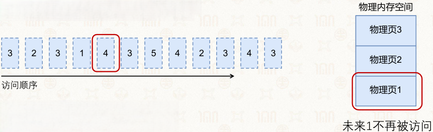

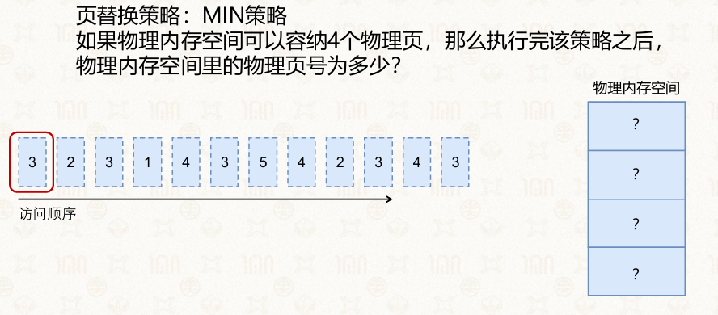

3214

3245

#### 先进先出（FIFO）

**思想**：按页进入物理内存的顺序，淘汰最早进入的页（queue记录访问顺序）

**特点**：实现简单，无需记录访问信息

**Belady异常**：增加物理页帧数，缺页次数反而增加

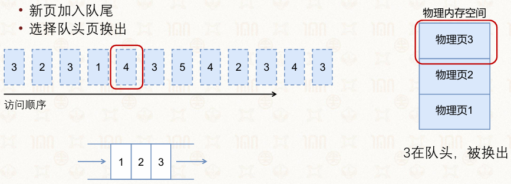


3214

2145

1453

4532

#### FIFO改进版：second chance策略

**思路：**

*   如果要访问的页已经队列中，加一个标记

*   需要换页时

    *   如果队头有标记，清除标记，移至队尾
    *   如果队头没有标记，换出队头

**特点**

*   大幅减少 Belady 异常，缺页率比普通 FIFO 更低
*   实现简单，只需要一位标记，开销小
*   本质偏向近似 LRU，性能介于 FIFO 和 LRU 之间
*   淘汰逻辑温和，常用页面更容易留在内存

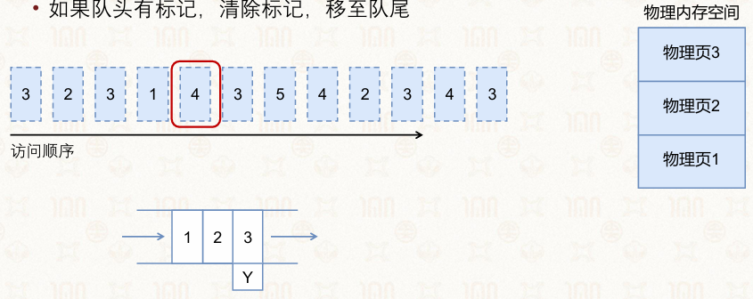

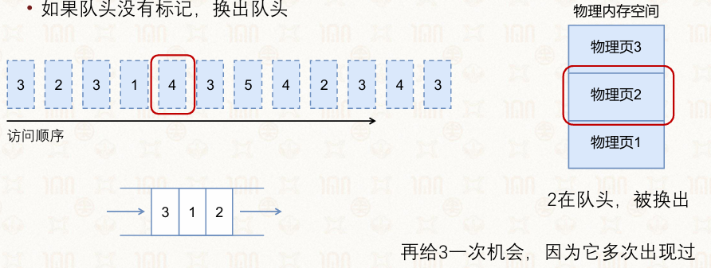


32

3\*2

3\*214

2143

1435

14\*35

4\*352

4\*3\*52

#### ⭐最近最少使用（LRU）\[面试高频]

**思想**：淘汰过去最久没有被访问的页，利用程序的时间局部性（用链表）

*   链表记录访问过程，新访问的移到尾端，换出首端页

**特点**

*   性能接近OPT，是实际系统中最常用的策略
*   但实现成本高，需要记录每个页的访问时间

**实现**

哈希+双向链表

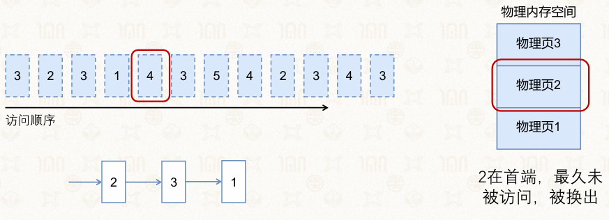


32

23

2314

2143

1435

1354

3542

5423

5234

5243

#### 最近最常使用（MRU）

**思想**：淘汰<u>最近被访问的页</u>（假设程序不会重复访问相同地址，最近访问过的页短期内不会再被访问）

**特点**：实现简单，可视为LRU的反向策略，适用于特定访问模式（如单次访问地址序列）

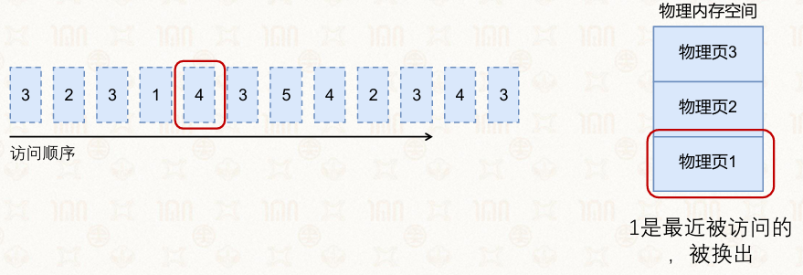


32

23

2314

2143

2145

2154

1542

1543

1534

1543

#### 最近未使用（NRU）/时钟算法（Clock）\*

**思想**：用访问位和修改位近似模拟LRU，降低实现成本

*   访问位：页被访问时置1，定期清零
*   时钟算法：用循环链表模拟时钟指针，扫描时优先选择访问位为0的页

**特点**：性能接近LRU，且实现简单，Linux等系统广泛采用

#### 最常使用（MFU）与最不常使用（LFU）\*

MFU：淘汰访问次数最多的页（认为它已经被充分使用，未来不会再频繁访问）

LFU：淘汰访问次数最少的页

缺点：LFU对“冷启动”页不公平，且难以应对访问模式变化

#### 颠簸（Thrashing）现象

**成因**：页替换策略选择不当，或物理内存不足，导致页频繁换入换出

**表现**：

*   系统大部分时间都在处理缺页异常和磁盘I/O。
*   CPU利用率急剧下降，几乎无法执行用户程序

**危害**：系统响应缓慢，甚至陷入“死亡循环”，只能通过增加物理内存或调整工作集解决

*   等待磁盘I/O导致CPU利用率下降
*   调度器载入更多的进程以期提高CPU利用率
*   触发更多的缺页异常、进一步降低CPU利用率、导致连锁反应

#### 机器学习辅助的动态替换策略\*    

*   背景：传统静态算法难以应对复杂多变的程序访问模式。
*   思路：利用机器学习（如强化学习、多臂赌博机）预测未来访问模式，动态选择最优替换策略。
*   优势：相比固定算法，能更自适应地优化缺页率，在复杂负载下表现更优。

### 5.2.3工作集模型🌶（现阶段主流）

#### 核心概念

**定义**：进程在最近 $x$ 个时间单位内（即 $[t-x, t]$ 时间窗口），频繁访问的所有物理页的集合，记为 $W(t, x)$

**核心假设**（程序局部性）：进程过去一段时间使用的页，在未来短时间内大概率还会被访问

**目的**：避免颠簸（Thrashing）现象，确保进程的工作集能全部装入物理内存，大幅降低缺页率

#### 工作集模型的实现流程

**硬件支持：访问位（Access Bit）**

*   页表项中包含一个访问位，CPU访问该页时，硬件会自动将其置为1
*   操作系统定期扫描所有物理页，利用访问位判断页是否活跃

**周期性扫描与标记**

*   在时刻 $t₁$ 扫描所有页：

    *   若访问位为1，说明该页在过去被访问过，记录当前时间戳 $t₁$ ，并将访问位重置为0

    *   若访问位为0，说明该页未被访问，保留上次的时间戳

    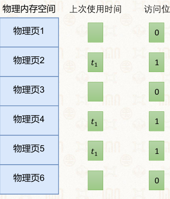

*   在时刻 $t₂$ 再次扫描：

    *   计算页的未访问时长  $t₂ - t₁$

    *   若 $t₂ - t₁ > x$（超过工作集窗口），说明该页已不属于工作集，可以被换出

**页换出规则**

*   换出的是那些**长期未被访问、已脱离工作集**的页，而不是刚使用过的页。

*   示例中，物理页2、4、5的上次访问时间戳仍为$t₁$，且访问位为0，说明它们已经有一段时间未被访问，可作为换出候选

#### 优势与应用

优势：

*   基于程序局部性，换出决策更科学，能有效避免颠簸
*   无需记录完整的访问历史，仅需时间戳和访问位，实现成本低
*   是现代操作系统（如Windows、Linux）常用的内存管理优化手段

应用

*   动态调整进程的物理内存配额，确保每个进程的工作集都能被容纳
*   物理内存不足时，优先换出已脱离工作集的页，而不是盲目淘汰页

#### 进阶：用机器学习预测工作集大小\*

*   传统工作集模型依赖固定时间窗口，难以适应动态变化的程序访问模式

*   现代优化思路：

    1.  用eBPF高效收集缺页异常次数、内存访问行为等数据
    2.  用LightGBM等回归模型，拟合缺页次数与工作集大小的关系
    3.  实现实时预测，动态调整工作集窗口，进一步降低缺页率和颠簸风险  


