# 6章 进程与线程
[TOC]
## 6.1 进程

### 6.1.1进程的概念与诞生

#### 引子：从Hello World理解进程

**定义**：同一个程序可以同时运行多个实例（如./hello & ./hello），操作系统需要为每个实例创建独立的管理单元，这就是<u>进程</u>

**核心问题**：操作系统如何抽象和管理多个并行运行的程序？进程就是这个抽象的核心。

#### 进程的诞生：从单任务到多任务

**早期单任务系统**

*   一次只能执行一个任务，任务结束后才能执行下一个，CPU和外设资源利用率低。
*   随着程序类型增多（文本编辑、网络服务等），以及外设种类增加，程序等待I/O的时间越来越长，CPU空闲浪费严重

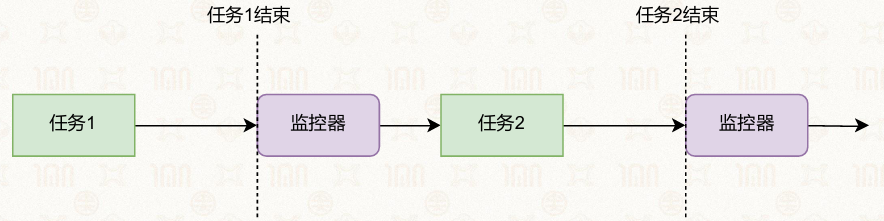

**分时（Time-sharing）操作系统**

*   核心思路：当一个任务需要等待时，操作系统暂停它，切换到其他任务执行。

*   关键技术：

    *   任务抽象为<span style="color: rgb(5, 162, 239);">进程</span>，每个进程有独立的执行状态，进程的执行状态不断更新

    *   上下文切换：保存当前进程的状态，加载新进程的状态，实现CPU时间的复用

    *   进程调度：由操作系统决定下一个执行哪个进程

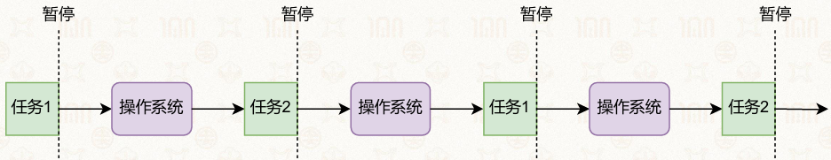

#### 进程的定义：运行中的程序

*   进程是**程序运行时的抽象**，由两部分组成：

    *   **静态部分**：程序运行需要的代码和数据，从可执行文件中加载（如代码段、数据段）
    *   **动态部分**：程序运行期间的状态，包括程序计数器、堆、栈、寄存器值等，随执行过程不断变化

*   每个进程都拥有**独立的虚拟地址空间**

    *   仿佛独占了全部内存资源

    *   内核中同样包含内核栈和内核代码、数据

        *   进程需要在内核中保存自己的执行上下文（比如寄存器、返回地址）

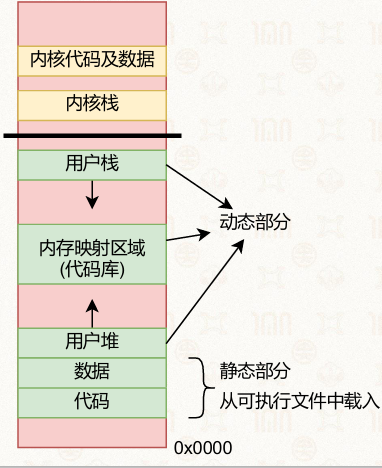

#### 进程的内存空间布局

**典型结构**（从低地址到高地址）：

*   代码段：程序的机器指令，只读
*   数据段：全局变量和静态变量，可读可写
*   用户堆：动态内存分配区域（malloc/free），向上增长
*   内存映射区域：加载共享库、文件映射等
*   用户栈：保存函数调用帧、局部变量，向下增长
*   内核部分：内核代码、数据和内核栈，用户进程无法直接访问

**查看方式**：

*   cat /proc/PID/maps：查看指定进程的内存布局
*   ps -aux：查看系统中所有进程的信息

### 6.1.2进程的状态

#### 进程的五种核心状态

**新生状态（New）**

*   进程刚被创建，正在初始化数据结构、分配资源。
*   示例：执行./hello-name时，操作系统创建进程并加载程序。

**就绪状态（Ready）**

*   进程已初始化完成，等待CPU调度，随时可以运行。
*   此时进程在就绪队列中，尚未获得CPU时间片。

**运行状态（Running）**

*   进程正在CPU上执行指令，从main函数开始运行。
*   若时间片用完或被更高优先级进程抢占，会回到就绪状态。

**※阻塞状态（Blocked）**

*   进程因等待外部事件（如用户输入、I/O操作）而暂停执行，不在运行队列中。
*   示例：fgets()等待用户输入时，进程进入阻塞状态

**终止状态（Terminated）**

*   进程执行完毕或被终止，操作系统回收相关资源。
*   示例：return 0后，进程退出，内核清理其PCB和内存

#### 进程状态转换规则

进程会不断进行状态切换


**阻塞不能直接变为运行**

#### Linux系统中的进程状态扩展

Linux在经典五状态基础上，扩展了更细粒度的状态：

*   **运行态（TASK\_RUNNING）**：包含传统的就绪和运行状态。
*   **轻/中/深度睡眠（TASK\_INTERRUPTIBLE/TASK\_UNINTERRUPTIBLE）**：对应阻塞状态，分别支持/不支持信号唤醒。
*   **僵死状态（TASK\_ZOMBIE）**：进程已退出，但父进程未回收其PCB，保留退出状态供父进程查询

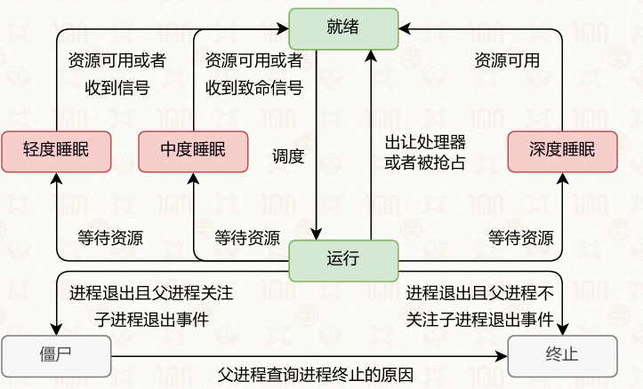

### 6.1.3数据结构

#### 应用程序的原始形态：ELF可执行文件

**常见于**：Linux与安卓系统里，可执行文件、共享库、目标文件通用标准格式。

**组成**：

*   ELF头部，记录文件类型架构入口地址等整体信息

*   程序段，负责映射进内存，包含代码段只读数据段、数据段未初始化数据段

    *   每个程序段都是一个连续的二进制块
    *   作用：（硬件或软件）加载器将它们作为代码或 数据加载到指定地址的内存中并开始执行

*   节头表，存放符号表与调试相关信息

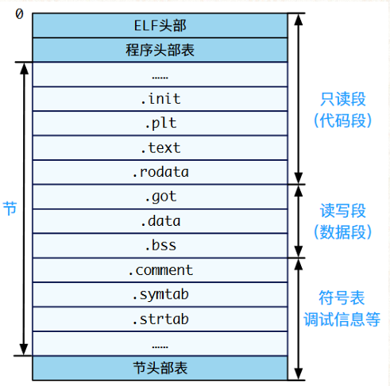

#### 进程控制块PCB：进程核心数据结构

**作用**：操作系统为每一个进程单独创建的数据结构，统一管控进程全部信息

**存放内容**

*   进程编号运行状态调度优先级
*   虚拟内存与页表信息
*   CPU各类寄存器运行上下文
*   已打开文件与占用各类资源

**Linux实际结构**：称为task，采用结构体任务结构体实现，内置内存管理结构体、线程上下文结构体等子结构

```c
struct process_v1 {
    // 上下文
    struct context *ctx;
    // 虚拟地址空间
    //（包含页表基地址）
    struct vmspace *vmspace;
    // 内核栈
    void *stack;
};
```

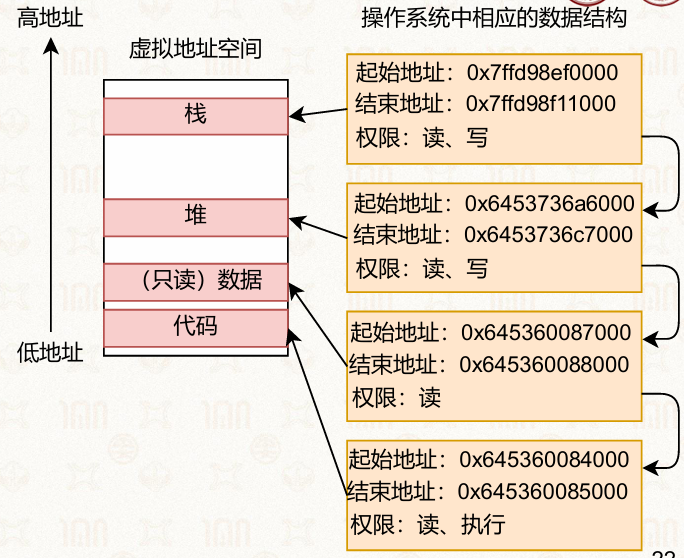

#### 进程创建

1.  申请分配全新进程控制块，完成基础初始化
2.  搭建专属虚拟地址空间，分配页表管理内存
3.  初始化进程对应的内核栈区域
4.  读取解析ELF可执行文件，将有效程序段映射至内存
5.  分配用户栈空间，传入运行参数与环境变量
6.  完整初始化进程运行上下文，等待系统调度执行


```c
int process_create(char *path, char *argv[], char *envp[]) {
	// 创建一个新的 PCB，用于管理新进程
	struct process *new_proc = alloc_process();
	// 虚拟内存初始化：初始化虚拟地址空间及页表基地址
	init_vmspace(new_proc->vmspace);
	new_proc->vmspace->pgdir = alloc_new_page(); 
	// 内核栈初始化
	init_kern_stack(new_proc->stack);
	// 加载可执行文件
	struct file *file = load_elf_file(path);
	for loadable_seg in file.segs
	vmspace_map(new_proc->vmspace, loadable_seg);
	// 准备运行环境：创建并映射用户栈
	void *stack = alloc_stack(STACKSIZE);
	vmspace_map(cur_proc->vmspace, stack);
	// 准备运行环境：将参数和环境变量放到栈上
	prepare_env(stack, argv, envp);
	// 上下文初始化
	init_process_ctx(new_proc->ctx);
	// 返回
	... 
}
```

#### 进程上下文切换

**触发条件**

*   进程时间片耗尽
*   出现系统调用
*   发生硬件中断
*   高优先级进程抢占资源

**完整切换流程**

1.  由用户态转入内核态，进入系统内核，把程序当前的pc等存入寄存器

2.  保存当前运行进程所有寄存器数据，存入自身PCB（进程控制块）中的context结构体中（以下简称ctx）

    *   ```c
        // 进程处理器上下文内部包含的内容
        struct context {
        	// 通用寄存器
        	u64 x0, x1, ..., x30; 
        	// 特殊寄存器
        	u64 sp_el0;
        	// 系统寄存器
        	u64 elr_el1, spsr_el1;
        };
        ```

3.  替换页表地址，完成两个进程虚拟内存空间切换

4.  切换使用新进程专属内核栈

5.  从新进程进程控制块读取数据，恢复全部运行寄存器状态

6.  切回用户态，新进程正式开始运行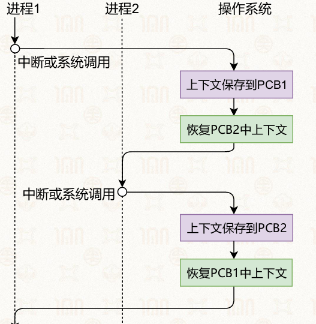

**核心要点**：上下文专门用来存储所有CPU运行寄存器数据，保障切换后程序无缝继续执行

### 6.1.4进程的基本操作

#### 进程创建：fork (spawn, vfork, clone)

#### 进程执行：exec

#### 进程间同步：wait

#### 进程退出：exit/abort

### 6.1.5进程创建：fork (spawn, vfork, clone)

#### 核心创建接口：fork

**基本语义与返回值**

*   语义：为调用进程（父进程）创建一个几乎一模一样的子进程，代码段、数据段、栈、寄存器状态完全复制

    *   调用进程为父进程，新进程为子进程
    *   接口简单，无需任何参数

*   <span style="color: rgb(5, 162, 239);">返回值</span>：

    *   父进程：返回子进程的PID（>0）
    *   子进程：返回0
    *   失败：返回-1

**关键特性**

*   拥有不同的进程id

*   可以并行执行，互不干扰（除非使用特定的接口）

*   父进程和子进程会共享部分数据结构（内存、文件等）

    *   写时复制（COW）：父子进程的内存页初始共享，仅当一方修改时才复制副本，避免不必要的内存开销
    *   文件描述符共享：fork后，父子进程共享文件描述符表，指向同一个文件对象，共享文件偏移量

*   <span style="color: rgb(5, 162, 239);">进程复制后，子进程直接进行下一行代码而不是从头重新运行</span>

关于文件：

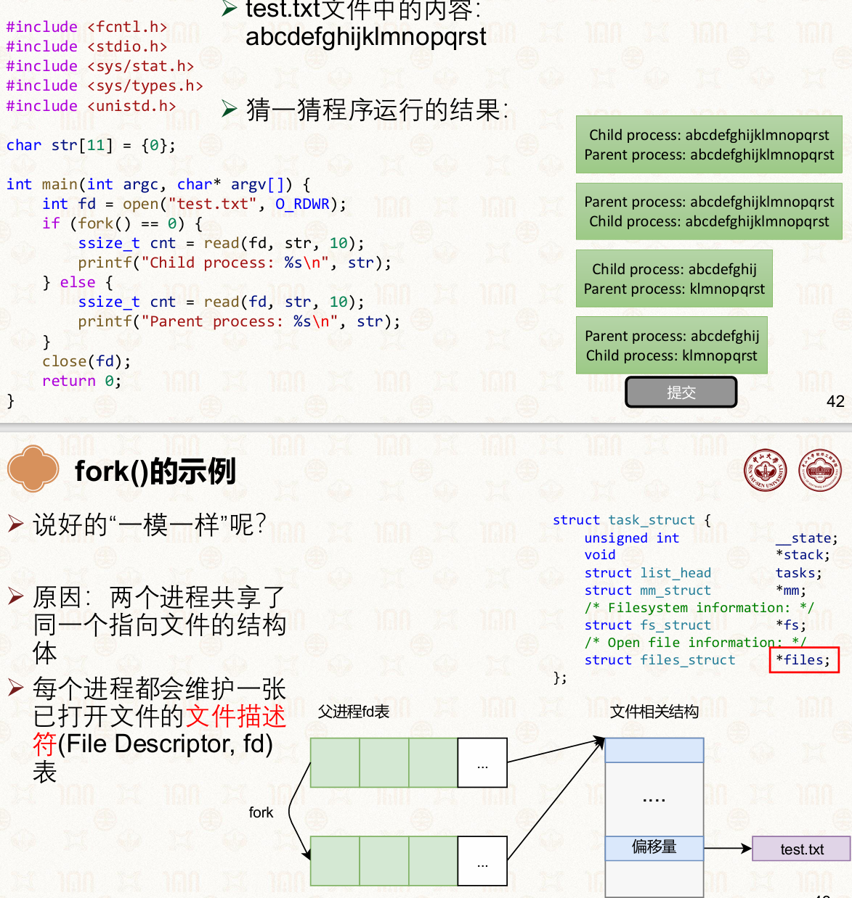

示例代码：

```c
int main() {
    int x = 42;
    int rc = fork();
    if (rc < 0) {
        fprintf(stderr, "Fork failed\n");
    } else if (rc == 0) {
        printf("Child process: rc=%d, x=%d\n", rc, x);
    } else {
        printf("Parent process: rc=%d, x=%d\n", rc, x);
    }
}
```

**示例题解析（填空题）**

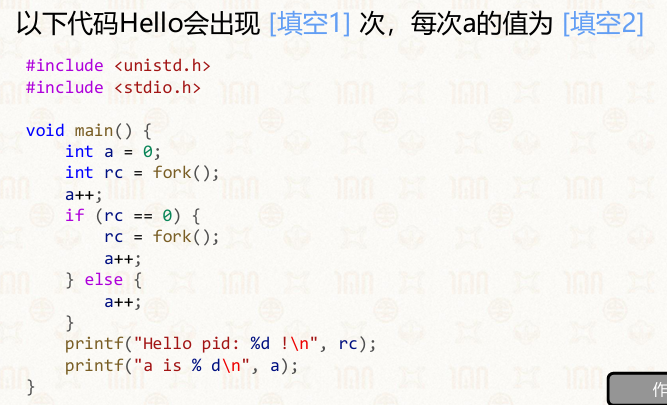

*   **Hello出现次数**：4次（进程总数：1→2→4）

*   **每次a的值**：均为2

    *   父进程：a++（主进程）+ a++（else分支）= 2
    *   第一层子进程：a++（主进程）→ 进入if分支，再fork一次，子进程再a++，最终2
    *   第二层子进程：a++（主进程）+ a++（if分支）= 2

**参考实现**

```c
int fork(void) { 
    // 创建一个新的 PCB，用于管理新进程
    struct process *new_proc = alloc_process();
    // 虚拟内存初始化：初始化页表基地址
    new_proc->vmspace->pgdir = alloc_new_page();
    // 虚拟内存初始化：将当前进程（父进程）PCB 中页表完整拷贝一份
    copy_vmspace(new_proc->vmspace, cur_proc->vmspace);
    // 上下文初始化：将父进程 PCB 中的上下文完整拷贝一份
    copy_context(new_proc->ctx, old_proc->ctx);
    // 内核栈初始化
    copy_stack(new_proc->stack, old_proc->stack); 
    // 返回 ... 
}
```

#### fork的优缺点

**优点**

*   接口简洁，无需额外参数
*   将“创建”和“执行（exec）”解耦，灵活性高
*   自然构建进程树、进程组关系

**缺点**

*   完全拷贝父进程内存，开销大（即使有COW，也存在页表复制成本）（不如clone）
*   性能与可扩展性差，不适合大内存进程（不如vfork和spawn）
*   不可组合，无法直接与多线程场景兼容（例如：fork() + pthread()）

#### fork的替代接口

1.  **vfork**

    *   核心特点：父子进程共享同一地址空间，子进程直接复用父进程页表，无需复制

    *   限制：

        *   仅用于fork+exec场景，子进程必须立刻调用exec或exit
        *   地址空间共享存在安全风险，父进程会被阻塞直到子进程调用exec/exit
        *   ```c
            #include <stdio.h>
            #include <stdlib.h>
            #include <unistd.h>
            int tmp = 3;
            int main() {
            	pid_t res = vfork();
            	if (res < 0) {
            		printf("vfork failed");
            		exit(-1);
            	} else if (res == 0) {
            		tmp = 10;
            		printf("Child process: res = %d\n", tmp);
            	} else {
            		printf("Parent process: res = %d\n", tmp);
            	}
            	return 0;
            }
            ```

    *   参考实现关键：不执行copy\_vmspace，直接复用父进程页表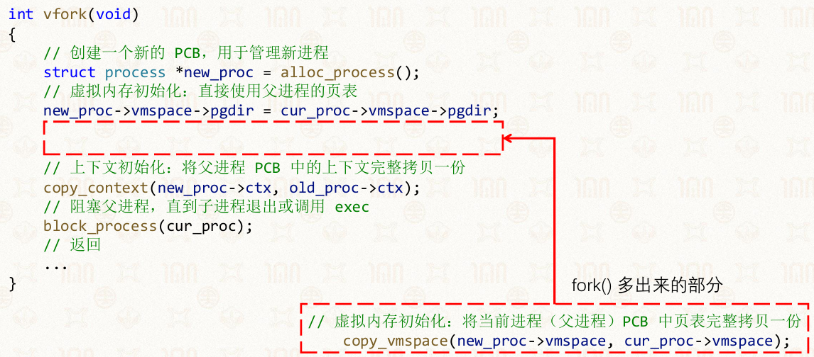

2.  **posix\_spawn**

    *   核心特点：相当于fork+exec的组合接口，一次性完成创建与执行

    *   优点：可扩展性强、性能较好，适合现代系统

    *   缺点：不如fork灵活，无法在创建后、exec前执行额外操作

    *   示例：

        ```c
        #include <spawn.h>   // 引入posix_spawn函数的头文件
        #include <stdio.h>   // 标准输入输出库，用于printf等
        #include <stdlib.h>  // 提供EXIT_FAILURE等宏定义
        #include <string.h>  // 提供strerror函数，用于获取错误信息

        // posix_spawn函数原型
        int posix_spawn(pid_t *restrict pid, const char *restrict path,
                        const posix_spawn_file_actions_t *file_actions,
                        const posix_spawnattr_t *restrict attrp,
                        char *const argv[restrict], char *const envp[restrict]);

        pid_t child_pid;  // 存储子进程PID的变量
        int ret;           // 存储函数返回值的变量

        int main(void) {
            // 调用posix_spawn创建并执行新进程
            // 参数说明：
            // &child_pid：输出参数，用于接收新创建进程的PID
            // "/home/yxsu/process/a.out"：要执行的可执行文件路径
            // NULL：文件操作集，这里不做额外文件操作
            // NULL：进程属性，使用默认属性
            // NULL：命令行参数列表，这里不传递参数
            // NULL：环境变量列表，这里使用父进程环境
            ret = posix_spawn(&child_pid, "/home/yxsu/process/a.out", NULL, NULL, NULL, NULL);
            
            // 检查posix_spawn是否执行成功
            if (ret != EOK) {
                // 失败时打印错误信息，strerror将错误码转为字符串描述
                printf("posix_spawn() failed: %s\n", strerror(ret));
                // 程序异常退出，返回失败状态码
                return EXIT_FAILURE;
            }
            // 成功时打印子进程的PID
            printf("Child pid: %d\n\n", child_pid);

            return 0;
        }
        ```

    *   实现

        ```c
        int posix_spawn(pid_t *pid, const char *path,
                        ...,
                        const posix_spawnattr_t *attrp,
                        char *const argv[], char *const envp[]) {
            // 先执行 vfork 创建一个新进程
            int ret = vfork();
            if (ret == 0) {
                // 子进程：在 exec 之前，根据参数对其进行配置
                prepare_exec(attrp, ...);
                // 执行 exec
                exec(path, argv, envp);
            } else {
                // 父进程：将子进程的 pid 设置到传入的参数中
                *pid = ret;
                return 0;
            }
        }
        ```

3.  **clone**

    *   核心特点：fork的进阶版，可通过标志位选择性复制内存、文件描述符等

    *   应用：Linux线程的底层实现，支持轻量级进程创建

    *   优点：高度可控，可依照需求调整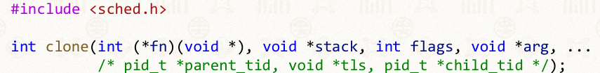

    *   缺点：接口复杂，使用不当易出错

    *   实现

        ```c
        int clone(..., int flags, ...) {
            // 创建一个新的 PCB，用于管理新进程
            struct process *new_proc = alloc_process();
            // 如果设置了 CLONE_VM 则直接使用父进程的页表，否则拷贝一份
            if (flags & CLONE_VM) {
                new_proc->vmspace->pgdir = cur_proc->vmspace->pgdir;
            } else {
                new_proc->vmspace->pgdir = alloc_new_page();
                copy_vmspace(new_proc->vmspace, cur_proc->vmspace);
            }
            // 上下文初始化：将父进程 PCB 中的上下文完整拷贝一份
            copy_context(new_proc->ctx, old_proc->ctx);
            // 如果设置了 CLONE_VFORK 则阻塞父进程
            if (flags & CLONE_VFORK) {
                block_process(cur_proc);
            }
            // 返回
            ...
        }
        ```

#### Windows进程创建：CreateProcess

**核心特点**

*   从头创建进程，而非复制父进程
*   指定要运行的二进制程序
*   需指定可执行程序路径、运行参数、安全属性等多个配置项

**示例代码**

```c
#include <windows.h>  // Windows 系统核心API头文件，包含CreateProcess等函数
#include <stdio.h>    // C标准输入输出库，printf、GetLastError等
#include <tchar.h>    // 提供TCHAR宏，兼容ANSI和Unicode字符集

// Windows 平台兼容 main 的入口函数
void _tmain( int argc, TCHAR *argv[] ) {

    // 定义进程启动信息结构体 和 进程信息结构体
    STARTUPINFO si;
    PROCESS_INFORMATION pi;

    // 清空结构体，避免垃圾数据导致异常
    ZeroMemory( &si, sizeof(si) );
    si.cb = sizeof(si);  // Windows API 标准要求：标识结构体大小
    ZeroMemory( &pi, sizeof(pi) );

    // 核心：创建新进程
    if( !CreateProcess(
        NULL,               // 不指定模块名，通过命令行参数启动程序
        argv[1],            // 要启动的程序路径（来自命令行参数）
        NULL,               // 进程安全属性：默认
        NULL,               // 线程安全属性：默认
        FALSE,              // 不继承父进程句柄（安全隔离）
        0,                  // 无特殊创建标志
        NULL,               // 使用父进程环境变量
        NULL,               // 使用父进程当前目录
        &si,                // 进程启动信息
        &pi                 // 接收创建后的进程信息
    )) {
        // 创建失败，打印错误码
        printf( "CreateProcess failed (%d).\n", GetLastError() );
        return;
    }

    // 等待子进程执行结束（无限等待）
    WaitForSingleObject( pi.hProcess, INFINITE );

    // 关闭进程句柄和线程句柄，释放系统资源
    CloseHandle( pi.hProcess );
    CloseHandle( pi.hThread );
}
```

#### 进程树与进程组

**进程树**：fork为进程建立父子关系

*   进程之间是树结构

*   Linux可通过pstree命令查看

    *   pstree 以树状结构 表示进程树的关系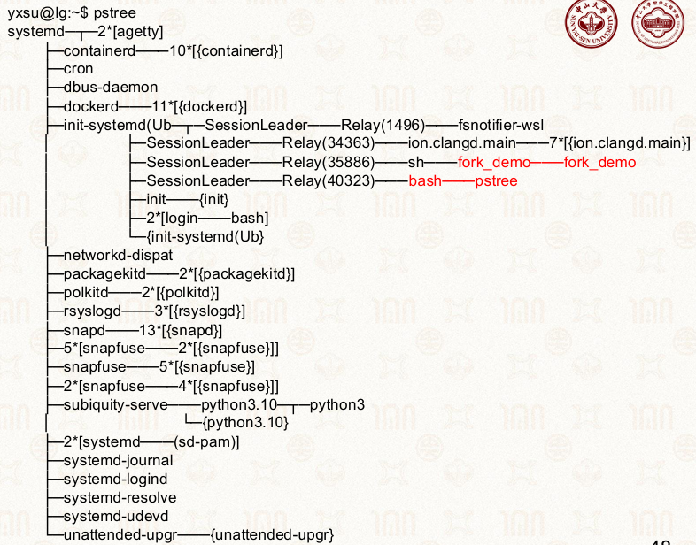

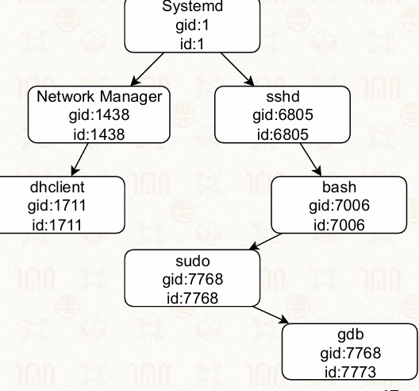

*   根进程是systemd（PID=1，也是系统的init进程），它是所有用户进程的祖先。

*   每个子进程只有一个父进程（PPID），父进程可以有多个子进程。

*   示例中：

    *   systemd生成了NetworkManager和sshd两个子进程
    *   NetworkManager又生成了dhclient
    *   sshd生成了bash，bash又生成了sudo，sudo再生成了gdb

**进程组**：多个进程可属于同一进程组

*   进程组的组长（Group Leader）是组内第一个进程，它的PID = PGID

*   子进程默认与父进程属于同一个进程组

    *   子进程会继承父进程的进程组ID

*   可以向组内所有进程发送信号

*   常用于Shell命令管道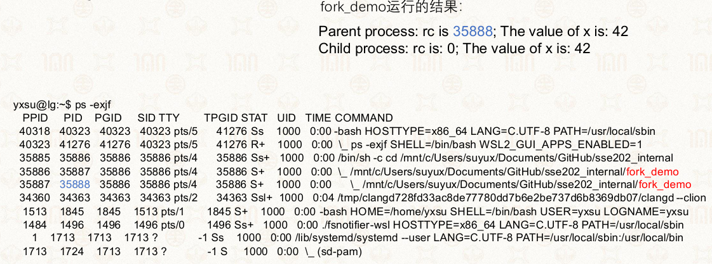

#### 现代视角：fork的争议和spork模拟

*   观点：fork设计于1970年代，历史包袱重，不适合现代多线程、大内存场景
*   趋势：posix\_spawn、clone等接口逐渐成为更优选择，部分系统甚至提出“删除fork”的提议

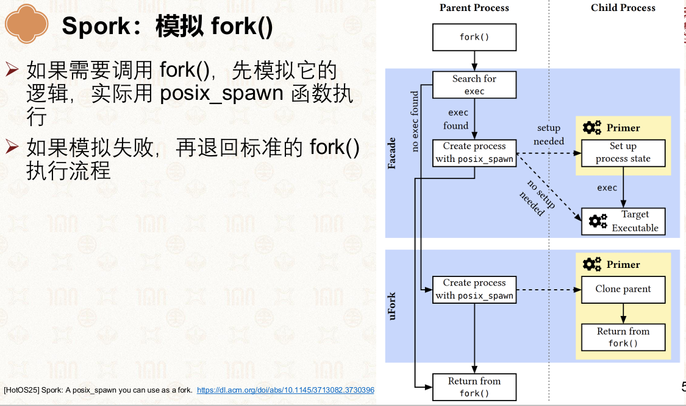

### 6.1.6进程执行：exec

#### 核心接口 execve

**函数原型**

```c
#include <unistd.h>
int execve(const char *pathname, char *const argv[], char *const envp[]);
```

**参数说明**

*   pathname：待执行可执行文件路径
*   argv：命令行参数数组，末尾以空指针收尾
*   envp：环境变量数组，末尾以空指针收尾

**核心作用**：替换当前进程地址空间，加载运行新程序

#### exec 核心特性

**常用调用场景**：fork 创建子进程后，子进程调用该函数执行新程序

**运行特点**

1.  加载新程序后，会重置地址空间，原有代码段、数据段、栈、堆全部被替换
2.  调用成功无返回值，原程序后续代码不再运行；调用失败返回-1
3.  进程PID保持不变，仅程序内容发生更换

#### 示例代码解析

**目标程序 myecho.c**

```c
#include <stdio.h>
#include <stdlib.h>
int main(int argc, char *argv[]) {
    for (int j = 0; j < argc; j++) {
        printf("argv[%d]: %s\n", j, argv[j]);
    }
    exit(EXIT_SUCCESS);
}
```

功能：遍历打印接收的命令行参数

**调用程序 execve\_demo.c**

```c
#include <stdio.h>
#include <stdlib.h>
#include <unistd.h>
int main(int argc, char *argv[]) {
    char *newargv[] = { NULL, "hello", "world", NULL };
    char *newenviron[] = { NULL };
    if (argc != 2) {
        exit(EXIT_FAILURE);
    }
    newargv[0] = argv[1];
    execve(argv[1], newargv, newenviron);
    perror("execve()");
    exit(EXIT_FAILURE);
}
```

执行步骤

1.  编译指令：gcc execve\_demo.c -o execve\_demo、gcc myecho.c -o myecho
2.  运行指令：./execve\_demo ./myecho
3.  最终输出 argv\[0]: ./myecho argv\[1]: hello argv\[2]: world

#### exec 与 fork 搭配逻辑

*   执行流程：fork生成子进程，子进程调用execve加载新程序
*   设计意义：拆分进程创建与程序执行动作，父子进程可各自独立处理业务

#### 使用注意要点

*   函数调用成功后不会回落执行后续代码，错误处理逻辑仅失败时触发
*   命令行参数数组必须空指针结尾，避免程序异常
*   环境变量数组同样需空指针收尾，传空指针则沿用父进程环境变量

### 6.1.7进程间同步：wait

#### 核心作用

*   父进程用来等待并回收子进程，防止产生僵尸进程
*   可以获取子进程的退出状态，保证父子进程按预期顺序执行
*   实现进程同步，父进程可以控制执行顺序，确保子进程先完成关键任务，父进程再继续执行后续逻辑

#### 函数原型与基本用法

```c
#include <sys/types.h>
#include <sys/wait.h>
pid_t waitpid(pid_t pid, int *wstatus, int options);
```

**参数解析：**

*   pid：指定要等待的子进程PID（-1表示等待任意子进程）
*   wstatus：指向保存子进程退出状态的变量指针
*   options：控制等待行为（如0表示阻塞等待，WNOHANG表示非阻塞）

**返回值：**

*   成功：返回退出的子进程PID
*   失败：返回-1

#### 完整示例代码解析

```c
#include <stdio.h>
#include <stdlib.h>
#include <sys/types.h>
#include <sys/wait.h>
#include <unistd.h>

int main(int argc, char* argv[]) {
    int rc = fork();
    if (rc < 0) {
        fprintf(stderr, "Fork failed\n");
    } else if (rc == 0) {
        // 子进程：先执行
        printf("Child process: existing\n");
    } else {
        // 父进程：等待子进程退出
        int status = 0;
        if (waitpid(rc, &status, 0) < 0) {
            fprintf(stderr, "Parent process: waitpid failed\n");
            exit(-1);
        }
        // 检查子进程是否正常退出
        if (WIFEXITED(status)) {
            printf("Parent process: my child has exited\n");
        } else {
            fprintf(stderr, "Parent processes: waitpid returns for unknown reasons\n");
        }
    }
}
```

**执行逻辑**

1.  fork() 创建子进程
2.  子进程先打印信息
3.  父进程调用 waitpid(rc, \&status, 0) 阻塞等待子进程退出
4.  子进程退出后，父进程通过 WIFEXITED(status) 检查退出状态并回收

#### 退出状态检查宏

*   WIFEXITED(status)：判断子进程是否正常退出（exit/return）
*   WEXITSTATUS(status)：获取子进程的退出码（exit的参数）
*   WIFSIGNALED(status)：判断子进程是否被信号终止
*   WTERMSIG(status)：获取终止子进程的信号编号

#### waitpid 的简化实现逻辑

```c
void process_waitpid_v3(int id) {
    // 没有子进程，直接返回
    if (!cur_proc->children) return;

    while (TRUE) {
        bool not_exit = FALSE;
        // 扫描内核进程列表，查找对应进程
        for (proc in all_processes) {
            if (proc->pid == id) {
                if (proc->is_exit) {
                    // 子进程已退出，记录状态并回收
                    *status = proc->exit_status;
                    destroy_process(proc); // 回收PCB
                    return;
                } else {
                    // 子进程未退出，标记为未退出
                    not_exit = TRUE;
                }
            }
        }
        if (!not_exit) return; // 进程不存在，直接返回
        wait_in_kernel(); // 陷入内核等待，避免忙等
    }
}
```

**核心逻辑：**

1.  循环扫描进程列表，检查目标子进程是否退出
2.  若子进程已退出：读取退出状态、回收PCB并返回
3.  若子进程未退出：调用wait\_in\_kernel()让父进程阻塞等待，避免CPU空转

## 6.2 线程

### 6.2.1线程的概念

#### 核心定义

线程是**进程内部的基本执行单元**，也是操作系统**CPU调度的最小单位**，也被称作**轻量级进程（LWP）**。

*   线程依附于进程存在，一个进程可包含一到多个线程

    *   至少有一个线程

*   线程只保留运行必需的私有执行资源，共享所属进程的全部系统资源

*   线程依附于进程存在

*   线程只包含运行时的状态

    *   静态部分由进程提供
    *   包括了执行所需的最小状态（主要是寄存器和栈）

*   一个进程的多线程可以在不同处理器上同时执行

    *   调度的基本单元由进程变为了线程

    *   每个线程都有<u>状态</u>

    *   上下文切换的单位变为了线程

#### 引入线程的原因

*   创造进程的开销较大：包括了数据、代码、堆、栈等

*   并发粒度粗：以进程为单位并发，资源利用率低，无法高效实现进程内多任务

*   资源浪费：多进程并发会重复分配独立资源，内存与I/O资源冗余

*   进程的隔离性过强

    *   进程间交互：可以通过进程间通信（IPC），但开销较大

*   进程内部无法支持并行

#### 线程与进程的核心区别

| 对比维度 | 线程                      | 进程                  |
| ---- | ----------------------- | ------------------- |
| 核心定位 | 操作系统**CPU调度的最小单位**      | 操作系统**资源分配的最小单位**   |
| 资源归属 | 共享进程地址空间与资源，仅私有栈、寄存器、PC | 拥有独立地址空间、文件、信号等全套资源 |
| 执行开销 | 创建/切换/销毁开销极小            | 创建/切换/销毁开销大         |
| 通信方式 | 直接读写共享数据，通信成本低          | 需IPC机制（管道、消息队列等）    |
| 稳定性  | 一个线程崩溃可能导致整个进程崩溃        | 进程间相互隔离，互不影响        |
| 并发粒度 | 进程内多线程可并发/并行，粒度更细       | 进程间并发               |


#### 线程的基本组成

每个线程拥有自己的栈，内核中也有为线程准备的内核栈

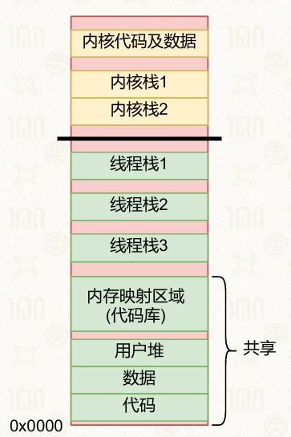

线程的独立执行上下文由以下部分构成：

*   线程ID（TID）：唯一标识线程
*   程序计数器（PC）：记录下一条待执行指令地址
*   寄存器集合：存储线程执行的临时数据
*   私有栈空间：维护函数调用与局部变量
*   线程控制块（TCB）：保存线程状态、优先级、所属进程等信息

#### 线程的分类

按管理与调度主体分为两类：

*   **用户态线程（ULT）**

    *   纤程
    *   由用户态线程库管理，内核不可见
    *   一个线程阻塞会导致整个进程阻塞
    *   在应用态创建，线程相关信息主要存放在应用数 据中

*   **内核态线程（KLT）**

    *   由操作系统内核直接管理、调度
    *   由内核创建，线程相关信息存放在内核中

#### 线程的特性

1.  **共享性**：同进程内所有线程共享代码段、数据段、打开文件、信号处理等进程资源
2.  **独立性**：每个线程有独立执行流，可独立调度、独立阻塞
3.  **轻量级**：无需分配独立地址空间，切换时无需刷新全量CPU缓存
4.  **依附性**：线程不能脱离进程独立存在，进程退出则所有线程终止
5.  **并发性**：单进程内多线程可在多核CPU并行，或单核CPU并发执行

#### 引入线程的核心优势

*   **降低并发开销**：线程创建与切换成本远低于进程，提升系统并发效率
*   **提升资源利用率**：多线程共享进程资源，减少资源冗余占用
*   **细化并发粒度**：实现单进程内多任务并发，适配IO密集型场景
*   **充分利用多核**：多线程可并行运行在多核处理器，提升程序吞吐率

### 6.2.2线程模型

#### 作用

线程模型描述了用户态线程与内核态线程之间的**映射关系**

决定线程的调度方式、性能开销与多核支持能力

#### 多对一模型（Many-to-One）

**映射关系：** 多个用户态线程映射到**一个内核态线程**，所有用户线程共享一个内核调度单元

**核心特点：**

*   **优点**

    *   内核管理逻辑简单
    *   线程创建、切换完全在用户态完成
    *   无需系统调用，开销低

*   **缺点**：

    *   可扩展性差：无法利用多核，同一进程内的多线程无法真正并行执行
    *   阻塞风险：任意用户线程发起系统调用阻塞时，进程的所有线程都会阻塞

**应用场景**

*   主流操作系统已基本弃用该模型
*   用户态线程库，或无需并行的轻量级并发场景

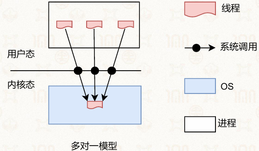

#### 一对一模型（One-to-One）

**映射关系：** 每个用户态线程直接映射到独立的内核态线程，用户线程与内核线程**一一对应**

**核心特点：**

*   **优点**：

    *   解决了多对一模型的扩展性问题
    *   线程间阻塞互不影响：一个线程的系统调用阻塞，不会影响同进程内其他线程的执行

    **缺点**：内核线程数量大创建、管理内核线程的开销较大

**应用场景：**

*   主流操作系统的默认实现，如 Windows、Linux（NPTL）、macOS（OS X） 均采用该模型

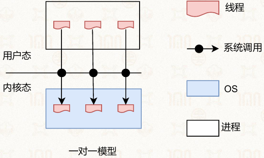

#### 多对多模型（Many-to-Many，又称Scheduler Activation）

**映射关系：** N个用户态线程映射到M个内核态线程（$N＞M$），由用户线程库和内核协同管理调度

**核心特点：**

*   **优点**：

    *   结合了前两种模型的优势

        *   解决了多对一模型的扩展性问题
        *   缓解了一对一模型内核线程过多的开销问题

    *   可根据系统负载动态调整内核线程数量，平衡并行性能与调度开销。

*   **缺点**：实现难度高，容易出现调度策略冲突，管理更为复杂

**应用场景：**

*   典型系统：Solaris 9 之前的版本使用该模型，9之后改为一对一模型
*   现代应用：在虚拟化、协程（Coroutine）等场景中仍有广泛应用

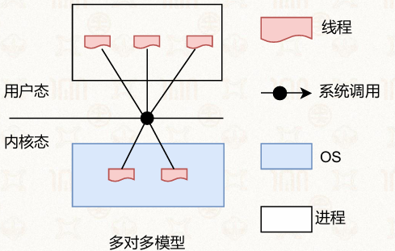

#### 三种模型对比总结

| 模型  | 映射关系 | 并行能力 | 阻塞影响  | 线程创建开销  | 实现复杂度 | 典型应用                |
| --- | ---- | ---- | ----- | ------- | ----- | ------------------- |
| 多对一 | N:1  | 无    | 全局阻塞  | 极低（用户态） | 低     | 早期用户态线程库            |
| 一对一 | 1:1  | 可    | 线程级隔离 | 较高（内核态） | 中     | Windows、Linux、macOS |
| 多对多 | N:M  | 可    | 可控隔离  | 中等（混合态） | 高     | Solaris 9前、Go语言调度器  |


### 6.2.3相关数据结构

#### 线程控制块（TCB）

**定义：** 线程控制块（Thread Control Block, TCB）是操作系统与用户态线程库管理线程的核心数据结构，存储线程的状态信息、上下文数据与管理信息，是线程调度、切换与管理的基础

※一对一线程模型中，TCB 分为**内核态TCB**与**应用态TCB**两部分

**内核态TCB：** 与进程的PCB结构类似

*   Linux系统中，进程与线程统一使用 task\_struct 数据结构管理，内核不区分进程与线程，仅通过资源共享关系区分两者

*   在上下文切换时使用

    *   结构存储线程的寄存器状态、栈指针、程序计数器、调度优先级等关键上下文信息

**应用态TCB：** 由用户态线程库定义，是内核TCB的扩展，存储用户态线程的额外管理信息

*   Linux系统中，对应 pthread 线程库的 pthread 结构体
*   Windows系统中，对应 TIB（Thread Information Block，线程信息块）

#### 线程本地存储（TLS）

**核义：** 线程本地存储（Thread Local Storage, TLS）是一种为每个线程分配独立私有存储区域的机制，允许线程拥有仅自身可访问的私有数据，解决多线程环境下共享全局变量的数据竞争问题

**引入背景：多线程共享全局变量的冲突问题**

*   同一进程内的所有线程共享地址空间与代码段，当多个线程执行相同代码时，对全局变量的并发读写会产生竞争条件，导致数据不一致
*   典型案例：系统调用错误标识变量 errno，多线程同时发起系统调用时，会互相覆盖 errno 的值，导致错误信息混乱。

**实现**

*   **线程私有变量：** TLS 允许定义线程独有的变量副本

*   **结构与索引：** 每个线程的TLS结构格式相似

    *   可通过TCB中的索引快速定位自身的TLS区域

*   **寻址模式：** 采用「基地址 + 偏移量」的方式访问TLS数据，不同CPU架构通过专用寄存器实现快速寻址

    *   X86架构：使用 fs 段寄存器保存TLS基地址，通过段寻址访问
    *   AArch64架构：使用特殊寄存器 tpidr\_el0 保存TLS基地址，实现无锁快速访问

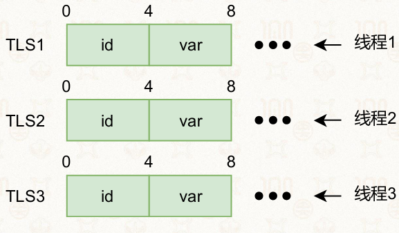

### 6.2.4基本操作

#### 线程创建：pthread\_create

**作用：** 创建新线程，完成内核态与用户态的初始化工作。

*   **内核态：** 创建对应的内核态线程及内核栈
*   **应用态：** 创建TCB、应用栈与TLS

**函数原型：**

```c
int pthread_create(pthread_t *thread, const pthread_attr_t *attr, 
                   void *(*start_routine) (void *), void *arg);
```

*   thread：输出参数，存储新线程ID

*   attr：线程属性（如栈大小、优先级），NULL表示默认属性

*   start\_routine：线程执行的<u>函数</u>入口

*   arg：传递给线程函数的参数

应用

```c
int iret1 = pthread_create( &thread1, NULL, 
		print_message_function, (void*) message1)
```

#### 线程合并：pthread\_join

**作用：** 等待指定线程执行完成，并获取其返回值，可理解为 fork 的“逆向操作”

*   调用线程会阻塞，直到目标线程退出。
*   支持获取线程的退出状态码，常用于主线程回收子线程资源

**函数原型：**

```c
int pthread_join(pthread_t thread, void **retval);
```

*   thread：要等待的线程ID。
*   retval：输出参数，存储线程的返回值，NULL表示不关心返回值。

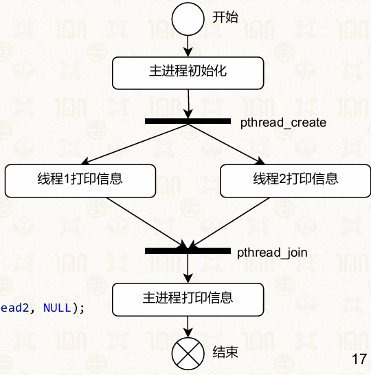

**基础示例：**

```c
#include <stdio.h>
#include <stdlib.h>
#include <pthread.h>

void *print_message_function(void *ptr) {
    char *message = (char *) ptr;
    printf("%s \n", message);
    return NULL;
}

int main() {
    pthread_t thread1, thread2;
    char *message1 = "Thread 1";
    char *message2 = "Thread 2";
    int iret1, iret2;

    iret1 = pthread_create(&thread1, NULL, print_message_function, (void*) message1);
    iret2 = pthread_create(&thread2, NULL, print_message_function, (void*) message2);

    pthread_join(thread1, NULL);
    pthread_join(thread2, NULL);

    printf("Thread 1 returns: %d\n", iret1);
    printf("Thread 2 returns: %d\n", iret2);
    exit(0);
}
```

#### 线程退出：pthread\_exit

**作用：** 主动终止当前线程，并设置返回值，该值可被 pthread\_join 获取

*   线程退出后，其资源（栈、TCB）由 pthread\_join 回收。

*   主线程调用 pthread\_exit 不会导致整个进程退出，其他线程可继续执行

    *   若主线程直接 return 或调用 exit()，则进程终止，所有线程随之结束

**函数原型：**

```
void pthread_exit(void *retval);
```

*   retval：线程的返回值，将传递给等待它的 pthread\_join。

#### 线程暂停：pthread\_yield

**作用：** 主动放弃CPU时间片，让出CPU资源给其他线程执行

*   可以帮助调度器做出更优的决策

    *   提示调度器优先调度其他线程

*   常用于CPU密集型任务，避免单线程长期占用CPU导致其他线程饥饿

**函数原型：**

```c
int pthread_yield(void);
```

**示例：主动让出CPU**

*   循环每执行一次，就主动换其它线程执行
*   主进程过1秒之后会结束，同时终止所有线程

<!---->

```c
#include <pthread.h>
#include <stdio.h>
#include <unistd.h>

void *thread(void *arg) {
    while (1) {
        puts((char *)arg);
        pthread_yield(); // 每次执行后主动让出CPU
    }
}

int main() {
    pthread_t t1, t2, t3;
    pthread_create(&t1, NULL, thread, "thread 1");
    pthread_create(&t2, NULL, thread, "thread 2");
    pthread_create(&t3, NULL, thread, "thread 3");
    sleep(1); // 主线程休眠1秒，让子线程执行
    exit(1); // 主线程退出，进程终止所有线程
}
```

#### 线程安全问题示例（代码分析）

**场景1：串行执行的线程**

```c
volatile int balance = 0;

void *mythread(void *arg) {
    int i;
    for (i = 0; i < 200; i++) {
        balance++;
    }
    printf("Balance is %d\n", balance);
    return NULL;
}

int main() {
    pthread_t p1, p2, p3;
    pthread_create(&p1, NULL, mythread, (void *)"A");
    pthread_join(p1, NULL);
    pthread_create(&p2, NULL, mythread, (void *)"B");
    pthread_join(p2, NULL);
    pthread_create(&p3, NULL, mythread, (void *)"C");
    pthread_join(p3, NULL);
    printf("Final Balance is %d\n", balance);
}
```

*   **结果分析：** 线程串行执行，每次线程执行完成后再创建下一个，无并发冲突

    *   p1 输出：Balance is 200
    *   p2 输出：Balance is 400
    *   p3 输出：Balance is 600
    *   最终输出：Final Balance is 600

**场景2：并发执行的线程**

```c
volatile int balance = 0;

void *mythread(void *arg) {
    int i;
    for (i = 0; i < 20000; i++) {
        balance++;
    }
    printf("Balance is %d\n", balance);
}

int main() {
    pthread_t p1, p2, p3;
    pthread_create(&p1, NULL, mythread, (void *)"A");
    pthread_create(&p2, NULL, mythread, (void *)"B");
    pthread_create(&p3, NULL, mythread, (void *)"C");
    pthread_join(p1, NULL);
    pthread_join(p2, NULL);
    pthread_join(p3, NULL);
    printf("Final Balance is %d\n", balance);
}
```

*   **结果分析：** 线程并发执行，balance++ 不是原子操作，存在数据竞争。

    *   线程输出与最终结果均为不确定值，可能小于预期的 60000，具体取决于调度顺序

### 6.2.5上下文切换（以ChCore为例）

#### 定义

是线程运行时的关键状态集合，保存了线程恢复执行所需的全部<span style="color: rgb(5, 162, 239);">寄存器信息</span>

*   通用寄存器：x0\~x30（常规数据寄存器）
*   程序计数器（PC）：elr\_el1（保存下一条要执行的指令地址）
*   栈指针：sp\_el0（用户态栈指针）
*   CPU状态寄存器：spsr\_el1（保存处理器状态，如条件码、特权级）

#### ChCore的TCB结构与上下文存储

TCB（线程控制块）结构：分为上下两部分

*   上半部分：线程相关信息
*   下半部分：线程上下文

内核栈：TCB下方为线程的内核栈

*   刚进入内核时为空
*   sp\_el1指向栈顶，
*   上下文切换时会在此栈上保存/恢复线程状态

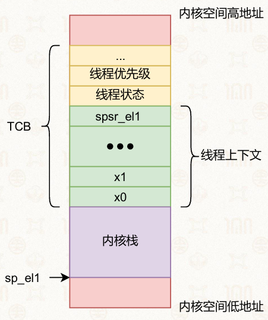

#### 线程上下文切换的完整流程

##### 第一步：进入内核态，保存上下文

应用线程通过异常、中断或系统调用进入内核态（EL1），由硬件自动完成以下操作：

*   切换特权级，进入内核态（EL1）

*   栈指针从用户态栈（sp\_el0）切换为内核态栈（sp\_el1）

*   硬件自动保存关键寄存器

    *   PC（elr\_el1）
    *   CPU状态（spsr\_el1）

随后内核通过汇编指令手动保存所有通用寄存器：

```nasm
sub sp, sp, #ARCH_EXEC_CONT_SIZE

; 保存常规寄存器(x0-x29)
stp x0, x1, [sp, #16 * 0]
stp x2, x3, [sp, #16 * 1]
stp x4, x5, [sp, #16 * 2]
// ... 依次保存x6-x29
stp x28, x29, [sp, #16 * 14]

; 保存x30和三个特殊寄存器：sp_el0, elr_el1, spsr_el1
mrs x21, sp_el0
mrs x22, elr_el1
mrs x23, spsr_el1
stp x30, x21, [sp, #16 * 15]
stp x22, x23, [sp, #16 * 16]
```

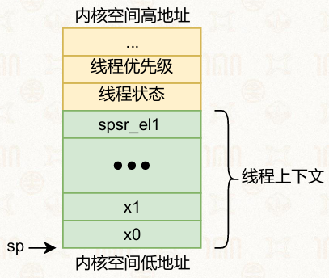

##### 第二步：切换页表和内核栈v  

操作系统调度器确定下一个要执行的目标线程，完成切换操作：

*   切换页表

    *   将页表基地址寄存器设置为目标线程的页表基地址

*   切换内核栈

    *   找到目标线程TCB对应的内核栈栈顶
    *   修改sp\_el1指向目标内核栈
    *   ※这是线程切换的“分界点”，切换后内核将执行目标线程的上下文恢复流程

##### 第三步：恢复上下文，返回用户态

从目标线程的内核栈中取出上下文，恢复寄存器状态，随后返回用户态：

```nasm
; 恢复三个特殊寄存器
ldp x22, x23, [sp, #16 * 16]
ldp x30, x21, [sp, #16 * 15]
msr sp_el0, x21
msr elr_el1, x22
msr spsr_el1, x23

; 恢复常规寄存器x0-x29
ldp x0, x1, [sp, #16 * 0]
; ... 依次恢复x2-x29
ldp x28, x29, [sp, #16 * 14]

add sp, sp, #ARCH_EXEC_CONT_SIZE
```

最后调用eret指令，由硬件完成用户态返回：

*   将elr\_el1中的返回地址写入PC，恢复程序计数器
*   将栈指针切换为用户态栈（sp\_el0）
*   将CPU状态恢复为spsr\_el1中的值
*   特权级切换回用户态（EL0），目标线程开始执行

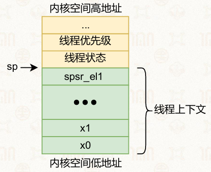

#### 总结

*   两次特权级切换

    *   用户态→内核态（切换前）
    *   内核态→用户态（切换后）。

*   三次栈切换

    *   用户态栈→当前线程内核栈（进入内核）
    *   当前内核栈→目标线程内核栈（切换分界点）
    *   目标内核栈→目标线程用户态栈（返回用户态）

*   分界点

    *   内核栈的切换是线程切换的分界

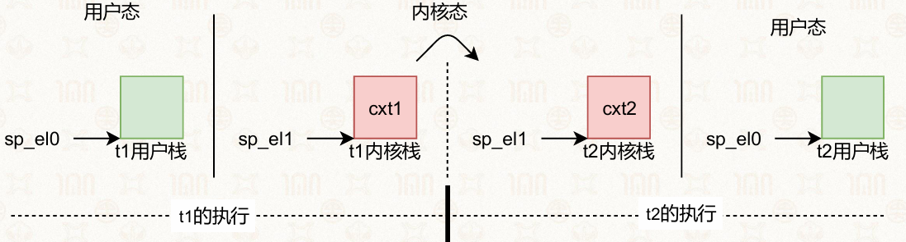

## 6.3 纤程🌶

### 6.3.1 纤程的概念

**纤程（用户态线程）** 是比内核线程更轻量的运行时抽象，是完全运行在用户态的执行单元，内核不可见且不受内核直接管理

*   映射关系：采用**多对一模型**，一个内核线程可对应多个纤程
*   特征：仅保留用户态执行状态，无内核态资源创建与管理开销
*   设计初衷：解决一对一线程模型的局限，适配短生命周期、高频繁切换的任务场景

#### 优势：

1.  **创建开销极低**：无需创建内核线程，省去内核态资源分配成本
2.  **上下文切换更快**：切换全程在用户态完成，无需陷入内核
3.  **用户态自主调度**：应用可自定义调度策略，有助于做出更优的调度决策

### 6.3.2 纤程的编程模型

纤程的编程围绕**上下文保存与切换**展开，核心操作包含创建纤程、保存上下文、切换上下文、调度执行。

*   **实践**：生产者-消费者模型

    1.  主纤程创建生产者、消费者两个纤程上下文

    2.  生产者完成数据生产后，直接在用户态切换到消费者纤程

    3.  消费者处理完成后，切回生产者纤程循环执行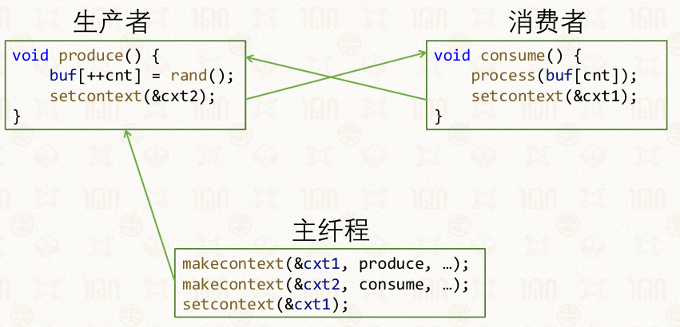

*   调度优势：无需内核调度器参与，可实现任务的最优即时调度，大幅提升高频切换场景的效率

### 6.3.3 操作系统对纤程的支持

#### Linux：ucontext

Linux通过**ucontext**组件实现用户态纤程，每个`ucontext_t`结构体对应一个独立纤程。

*   **接口**：

    *   makecontext：创建新的纤程上下文
    *   getcontext：保存当前纤程的执行上下文
    *   setcontext：切换到目标纤程上下文执行

*   **代码示例**：
    ```c
    #include <stdio.h>
    #include <ucontext.h>
    int x = 0;
    ucontext_t context, *cp = &context;
    void func(void) {
       x++;
       setcontext(cp);
    }
    int main(void) {
       getcontext(cp);
       if (!x) {
           printf("getcontext has been called\n");
       } else {
           printf("setcontext has been called\n");
           func();
       }
    }
    ```

进入 main 函数，调用 getcontext(cp)，保存当前执行上下文到 context 变量中。

此时程序的执行流会在这里 “记录一个书签”，后续 setcontext 调用会跳回这里继续执行。

#### Windows：Fiber库

Windows通过原生**Fiber库**提供纤程支持，编程模型与Linux ucontext相似

*   核心接口：

    *   CreateFiber：创建新纤程
    *   SwitchToFiber：纤程上下文切换

*   纤程本地存储（FLS）：

    *   单纤程对应内核线程时，FLS与线程本地存储（TLS）结构一致
    *   多纤程共享内核线程时，TLS可分裂为多个独立FLS，存储纤程私有数据

### 6.3.4 编程语言对纤程的支持：协程

**定义：** 是高级语言对纤程的封装，是语言层面的轻量级并发单元，屏蔽了底层操作系统接口差异

*   支持语言：Go、Python、Lua、C++20及以上版本

*   协程状态：新生、执行、暂停、终止

*   核心操作：

    *   yield：暂停当前协程，让出执行权
    *   resume：恢复暂停的协程继续执行

*   状态流转：新生→执行（resume）→暂停（yield）→执行（resume）→终止（执行完毕）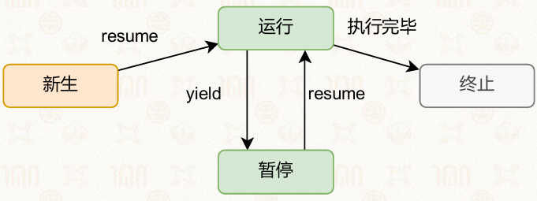

### 6.3.5 Go语言与协程

#### Go语言基础特性

*   静态强类型语言，语法贴近C/C++，支持自动类型推断
*   面向接口编程，而非传统面向对象编程
*   内置原生并发支持，协程是其核心并发特性

#### Go协程的使用

Go通过**go关键字**启动协程，语法极简、创建开销极低。

*   代码示例：
    ```go
    package main
    import (
       "fmt"
       "time"
    )
    func asyncTask() {
       fmt.Printf("This is an asynchronized task")
    }
    func syncTask() {
       fmt.Printf("This is a synchronized task")
    }
    func main() {
       go asyncTask() // 启动协程，异步执行
       syncTask()     // 同步执行主线任务
       go asyncTask()
       time.Sleep(time.Second * 1)
    }
    ```

#### Go协程通信：管道（Channel）

**定义：** 是Go协程间通信的核心机制，实现协程同步与数据传递，避免并发安全问题

*   核心特性：支持阻塞式通信，保证数据收发有序
*   代码示例：
    ```go
    package main
    import (
       "fmt"
       "time"
    )
    func longTask(signal chan int) {
       time.Sleep(3 * time.Second)
       signal <- 1 // 向管道发送结束信号
    }
    func main() {
       sig := make(chan int) // 创建整型管道
       go longTask(sig)
       for {
           fmt.Println("longTask is running")
           time.Sleep(1 * time.Second)
           v := <-sig // 阻塞接收管道信号
           if v == 1 {
               break
           }
       }
       fmt.Println("longTask is finished")
    }
    ```

#### Go协程典型应用

1.  网络请求处理：并发处理TCP连接，单程序支撑海量客户端
2.  定时任务：基于协程实现高精度计时器
3.  并发模型：乒乓通信、多生产者-单消费者模型
4.  算法实现：协程配合管道实现质数筛选（埃拉托斯特尼筛法）

网络处理代码示例：
```go
func handler(c net.Conn) {
    c.Write([]byte("ok"))
    c.Close()
}
func main() {
    l, err := net.Listen("tcp", ":8000")
    if err != nil {
        panic(err)
    }
    for {
        c, err := l.Accept()
        if err != nil {
            continue
        }
        go handler(c) // 为每个连接启动独立协程处理
    }
}
```
