# 7章 调度

## 7.1 调度的含义

### 7.1.1 调度的基本定义

#### 核心

**协调请求对于资源的使用**

*   由调度器统一管控资源分配与任务执行顺序
*   解决系统中任务数量远多于处理器/硬件资源的核心矛盾

#### 三项核心决策

在处理器调度场景下，调度器需要

*   确定下一个执行的任务
*   指定执行该任务的CPU
*   设定任务的执行时长

### 7.1.2 调度的适用场景

调度是计算机系统的基础机制，并非仅局限于CPU管理，核心适用场景包括：

*   处理器调度：进程/线程的执行顺序管理
*   I/O设备调度：磁盘、打印机等外设的资源分配
*   内存调度：物理内存与虚拟内存的分配、换页控制
*   网络调度：网络数据包的传输与处理排序

### 7.1.3 不同系统的调度目标

#### 不同场景专用目标

| 系统类型  | 目标    | 说明          |
| ----- | ----- | ----------- |
| 批处理系统 | 高吞吐量  | 单位时间完成更多任务  |
| 交互式系统 | 低响应时间 | 快速响应用户操作    |
| 网络服务器 | 可扩展性  | 适配高并发请求     |
| 移动设备  | 低能耗   | 平衡性能与设备续航   |
| 实时系统  | 实时性   | 任务需在截止时间内完成 |


#### 调度通用目标

*   高资源利用率：CPU、I/O等硬件资源持续高效工作
*   多任务公平性：所有任务均可获得执行机会，无资源垄断
*   低调度开销：调度逻辑不产生额外性能损耗

### 7.1.4 调度器的目标

*   **降低周转时间**：任务从进入系统到执行结束的总耗时
*   **降低响应时间**：任务从进入系统到首次输出结果的耗时
*   **实时性**：在任务的截止时间内完成任务
*   **公平性**：任务不会出现饥饿现象，均能获取执行资源
*   **低开销**：调度流程简洁高效，不成为系统性能瓶颈，制造性能bug
*   **可扩展性**：任务数量增加时，调度器仍稳定运行

### 7.1.5 调度的挑战

*   **信息缺失**：无法预知任务执行时长、I/O频率等关键信息，无绝对最优调度方案

*   **场景动态变化**：任务负载、资源状态实时变动，调度策略需自适应调整

*   **任务间交互复杂**：进程/线程间存在同步、互斥、依赖等复杂关联关系

*   **调度目标多样性**：不同系统侧重不同调度指标，难以同时满足所有需求

*   **多维度取舍**：需要优化

    *   调度开销与调度效果
    *   优先级与公平性
    *   能耗与性能等存在天然矛盾

我已按照你的要求，**移除了所有非代码块内容中的反引号**，并保持原文格式、知识点、加粗和排版完全不变，直接给你整理好的干净版本：

## 7.2 调度的机制

### 7.2.1 调度策略与调度机制区分

#### 策略与机制的区分

| 分类 | 核心作用 | 释义          |
| -- | ---- | ----------- |
| 策略 | 做什么  | 从上层去分析、解决问题 |
| 机制 | 怎么做  | 实现某一策略、功能   |


#### 实例

| 主题 | 对应调度策略（做什么） | 落地实现机制（怎么做）          |
| -- | ----------- | -------------------- |
| 上课 | 讲授操作系统调度课程  | 线下课堂、线上网课            |
| 上课 | 完成课程交作业     | 坚果云提交、纸质版上交          |
| 科研 | 编写C++代码     | VSCode、Clion开发工具     |
| 科研 | 使用Latex撰写论文 | VSCode、Overleaf在线编辑器 |


### 7.2.3 三类调度机制：长、短、中

#### 长期调度（作业调度）

**范围**：管控「新生→就绪」的进程准入环节

**作用**：

*   限制最终能进入就绪队列、被短期调度的进程总数量
*   从宏观管控系统资源利用率

**特点**：站在系统全局角度筛选进程，不是所有新建进程都能立刻进入就绪队列

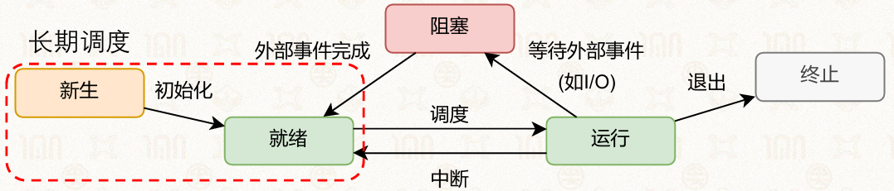

#### 短期调度（CPU调度）

**范围**：负责和运行状态相关的调度，管控就绪、运行、阻塞间的状态切换（就绪↔运行、运行→阻塞）

**作用**：直接负责CPU分配，决定就绪队列中哪个进程占用处理器运行

**触发时机**：

*   进程时间片用完中断
*   进程阻塞放弃CPU
*   阻塞进程事件完成重回就绪后

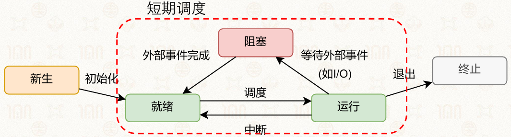

#### 中期调度（挂起调度）

**场景**：系统物理内存资源不足时启动

**目标**：挑选性能损耗类进程换出内存至磁盘，缓解内存压力

**优先挂起对象**

*   频繁缺页异常
*   长时间无响应
*   占用资源过高的进程

**挂起状态**

*   **挂起就绪**：进程被换到磁盘，内存空余后可被激活回普通就绪队列
*   **挂起阻塞**：进程在磁盘等待事件，事件完成后变为挂起就绪

**流转规则**：普通就绪/阻塞进程→被中期调度挂起→对应挂起状态；系统内存空闲后激活→回归原有就绪/阻塞队列

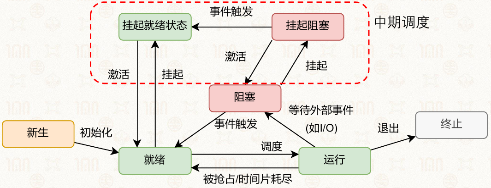

### 7.2.3全流程进程调度总览

1.  批处理任务进入系统

    *   先存入批处理队列
    *   经长期调度创建进程送入就绪队列
    *   交互式、实时任务直接创建进程进入就绪队列

2.  就绪队列进程经短期调度选中进入CPU运行

3.  运行进程分三种去向：

    *   时间片耗尽→重回就绪队列
    *   等待I/O等事件→进入阻塞队列
    *   执行完毕→进程终止、资源回收

4.  内存紧缺触发中期调度

    *   就绪/阻塞队列进程被挂起
    *   移入挂起就绪队列、挂起阻塞队列

5.  挂起进程满足条件

    *   事件触发/内存空闲
    *   被激活，重新回归普通就绪/阻塞队列

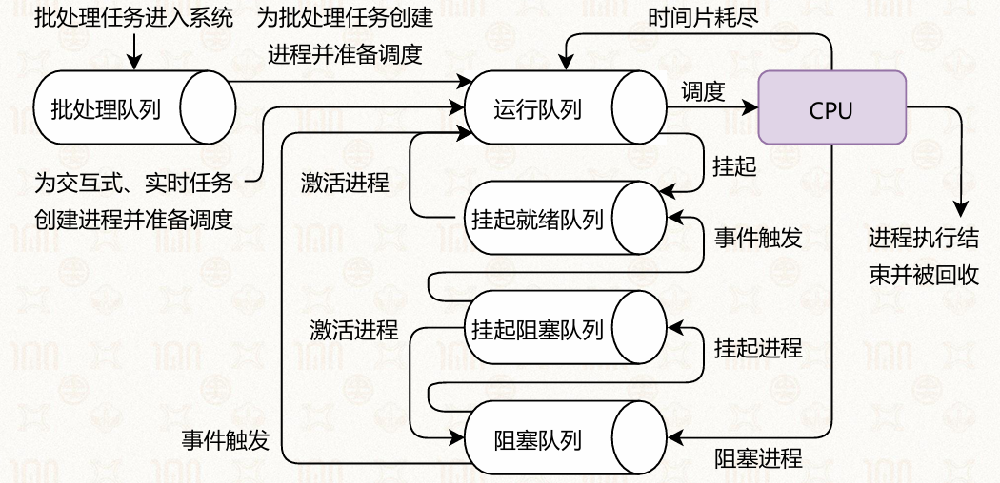

### 7.2.4Linux系统调度机制落地实现

Linux依托两套调度器实现不同调度策略，分别对应公平调度、实时调度两大类：

#### CFS公平调度器（完全公平调度）

**对应调度策略**

*   SCHED\_OTHER：普通分时进程调度
*   SCHED\_BATCH：批量后台任务调度
*   SCHED\_IDLE：低优先级空闲进程调度

**底层运行队列实现**

1.  以struct rq作为每个CPU的总运行队列结构体，内部拆分cfs普通任务队列、rt实时任务队列
2.  CFS子队列struct cfs\_rq依靠红黑树组织调度实体struct sched\_entity
3.  任务基础信息、优先级存放在struct task\_struct进程控制块中，调度实体关联进程PCB

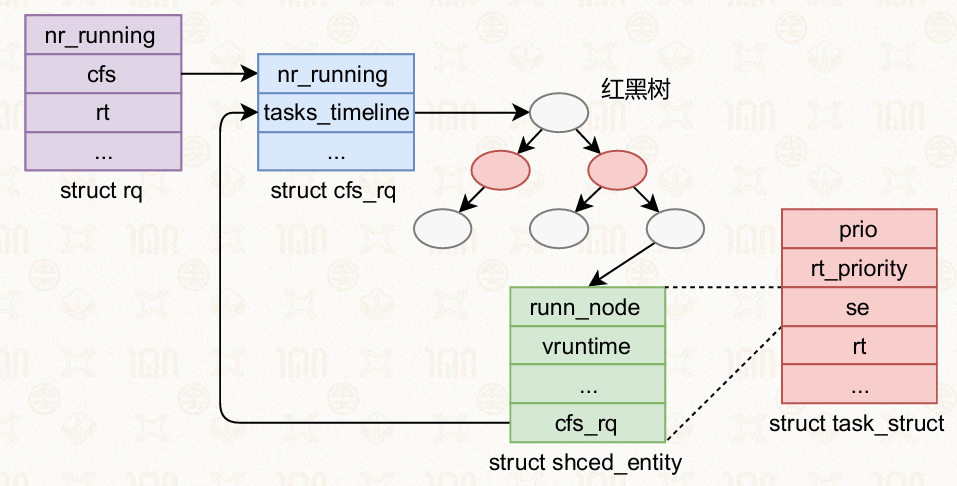

#### RT实时调度器

**对应调度策略**

*   SCHED\_FIFO：先进先出实时调度；
*   SCHED\_RR：时间片轮转实时调度；

**底层运行队列实现**

1.  同归属struct rq的rt子队列struct rt\_rq；
2.  采用**位图+多级优先级链表**架构：用bitmap标记非空优先级队列，不同优先级对应独立run\_list链表；
3.  实时调度实体struct sched\_rt\_entity挂载链表，关联task\_struct，附带时间片run\_slice参数

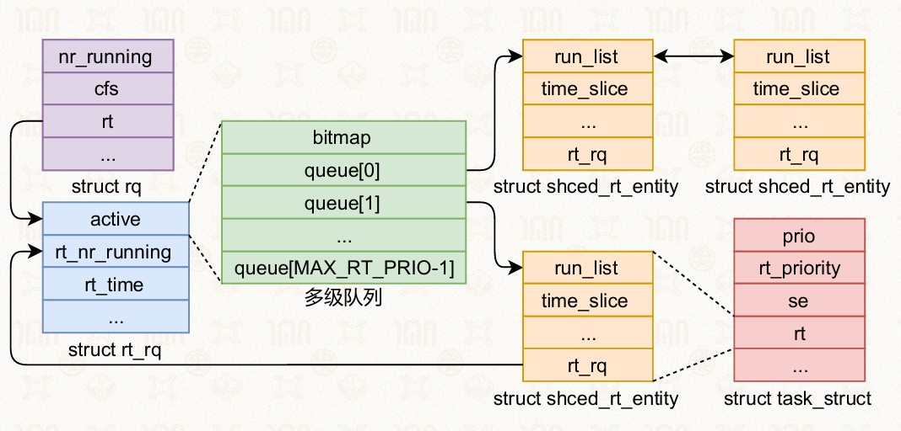

#### Linux调度器设计逻辑

上层通过调度策略区分进程类型，下层依靠rq运行队列、红黑树/多级链表等数据结构作为机制，完成策略落地，实现三类调度（长/短/中期）全流程管控

## 7.3 单核调度策略

### 7.3.1 调度场景类比

以**老师答疑、学生排队提问**类比单核CPU调度：

*   老师 = 单核CPU（同一时刻只能处理一项任务）
*   学生提问 = 用户提交任务
*   排队等候 = 任务进入就绪队列等待调度 通过该生活化案例，具象理解各类经典单核调度算法的调度逻辑

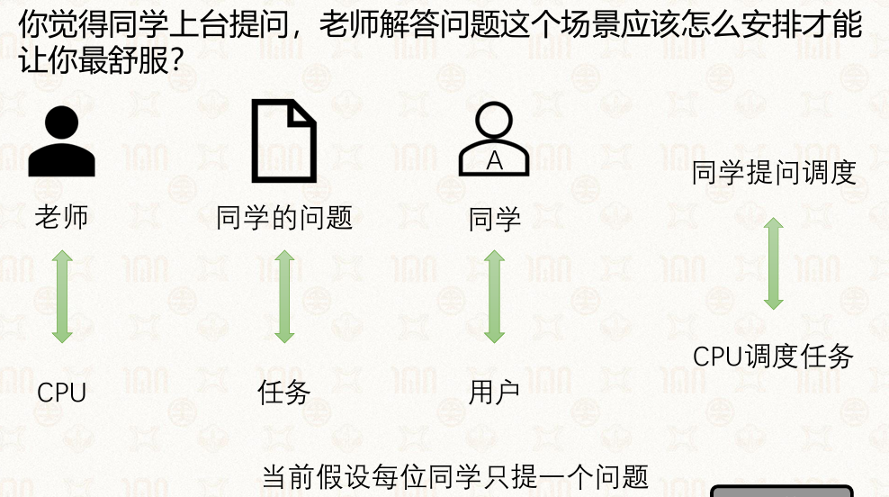

### 7.3.2 经典调度算法

#### 先来先服务 FCFS（First Come First Served）

**调度规则**：严格按照任务到达先后顺序依次执行，先抵达就绪队列的进程优先占用CPU，进程一旦开始运行就持续执行至结束，不可被抢占

**示例数据**

执行先后：A→B→C

| 任务 | 到达时间 | 工作量 |
| -- | ---- | --- |
| A  | 0    | 4   |
| B  | 1    | 7   |
| C  | 2    | 2   |


**优点**：逻辑简单直观、实现开销小

**缺点**：

*   存在饥饿隐患（长任务阻塞短任务）

    *   短任务晚到却要排队等待长任务执行完毕
    *   系统平均周转时间、响应时间偏高
    *   资源利用率差

*   对I/O密集型任务不友好

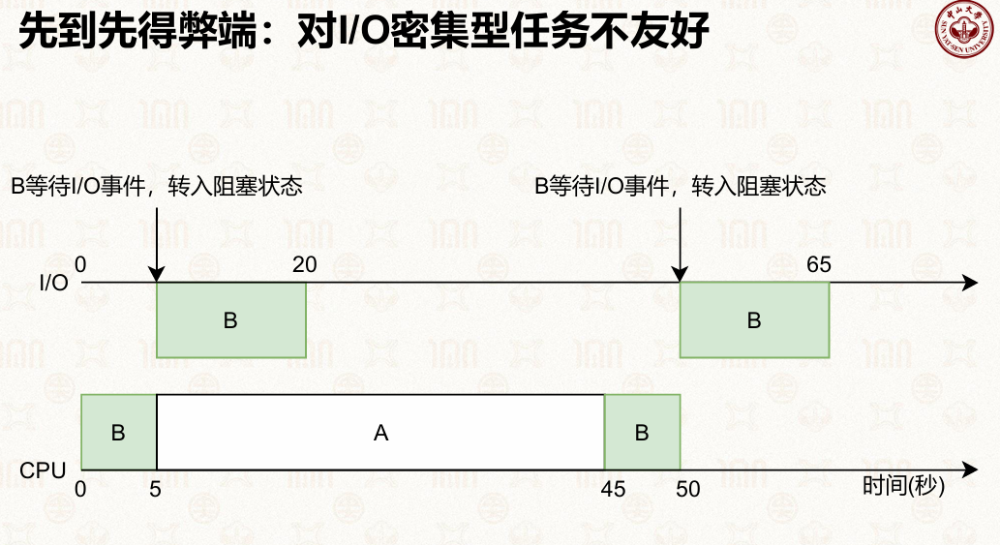

#### 最短任务优先 SJF（Shortest Job First）

**调度规则**：就绪队列中，预估运行时长最短的任务优先调度执行

**分类**

*   非抢占式

    *   一定是前一个任务执行完毕再执行下一个
    *   执行先后：A→C→B

*   抢占式（<u>最短完成时间</u>）

    *   每次任务执行一定时间后会被切换到下一任务，而非执行至终止
    *   通过定时触发的时钟中断实现
    *   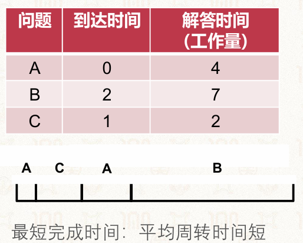

**优点**：同等任务条件下，平均周转时间理论最优，短任务能快速完成。

**缺点**：

*   饥饿问题：源源不断的超短任务持续到达时，长任务永久得不到调度；
*   信息依赖：调度需要提前预知任务完整运行时长，实际操作系统无法精准预判，落地实现受限
*   可能会打断正在运行的任务

#### 时间片轮转 RR（Round-Robin）

**调度规则**

*   分时系统专用算法，给所有就绪任务分配固定时间片
*   CPU按就绪队列顺序循环分配时间片
*   任务用完时间片后立刻让出CPU，排至就绪队列队尾，等待下一轮调度
*   任务中途完成则直接退出调度

**适用场景**：交互式桌面操作系统（Windows、Linux桌面），保障多用户交互任务快速轮转响应

**特性**：

*   无饥饿，兼顾公平性与响应速度

*   时间片大小影响性能

    *   片过大退化为FCFS
    *   过小提升频繁切换的调度开销

**问题**：牺牲周转时间

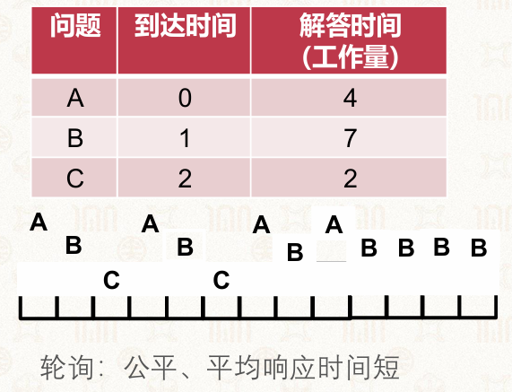

### 7.3.3 优先级调度

#### 基础概念

**调度规则**：为每个任务预先设置优先级数值，<u>优先级数值越高任务越优先占用CPU</u>

**分类**

*   非抢占式

*   抢占式

    *   高优先级新任务抵达就绪队列可直接抢占当前CPU

**任务优先级分配通用原则**

1.  实时任务（带截止时间约束）：优先级最高
2.  交互式前台任务：优先级较高，保障用户操作响应
3.  批处理后台任务：优先级低
4.  I/O密集型任务：通常设置高优先级，提升外设与CPU资源协同利用率。

**队列实现方式**：采用多级优先级队列

*   不同优先级对应独立就绪链表
*   调度器永远从最高优先级非空队列取任务执行
*   同优先级内使用时间片轮转

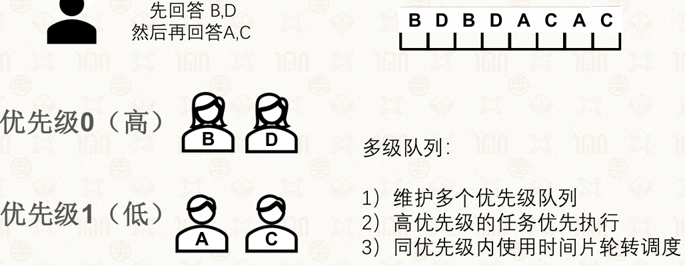

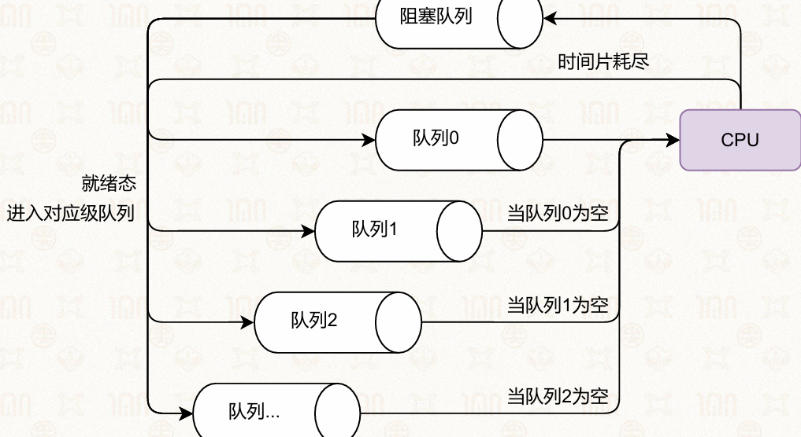

#### 三大问题与解决方案

**低资源利用率**：如IO设备和CPU没有同时利用起来

*   **结果**：为了更高的资源利用率，I/O绑定的任务高优先级
*   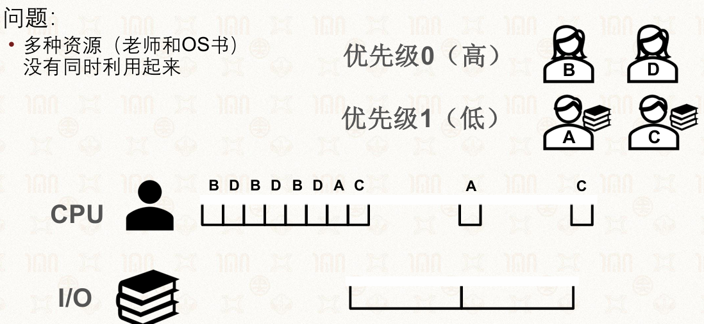

**优先级反转**：高优先级任务被低优先级任务阻塞，系统运行时序颠倒

*   举例：低 C 占资源→高 A 堵等→中 B 抢 C→A 被低级任务连环拖累

    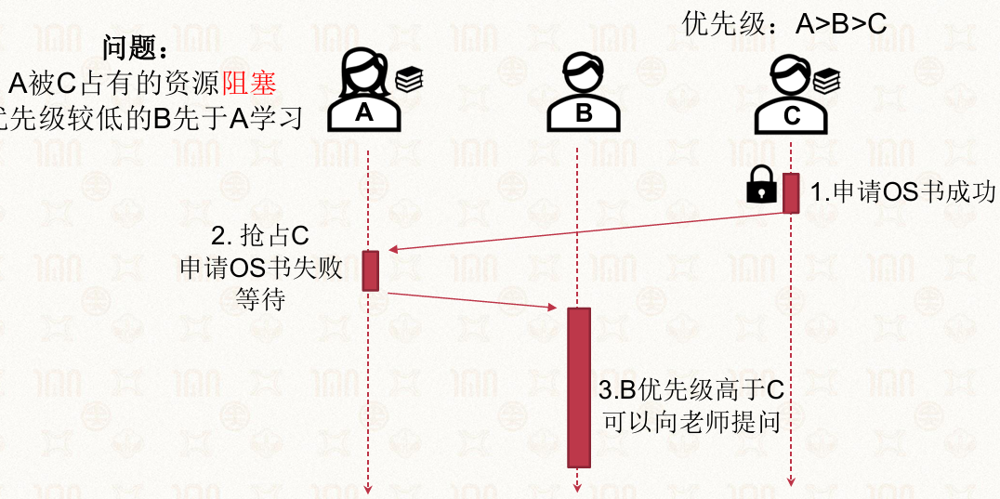

*   **解决：优先级继承**

    *   占用临界资源的低优先级进程，临时继承等待该资源的高优先级任务的优先级

    *   避免被中间优先级进程抢占，直至释放资源后恢复原有优先级
        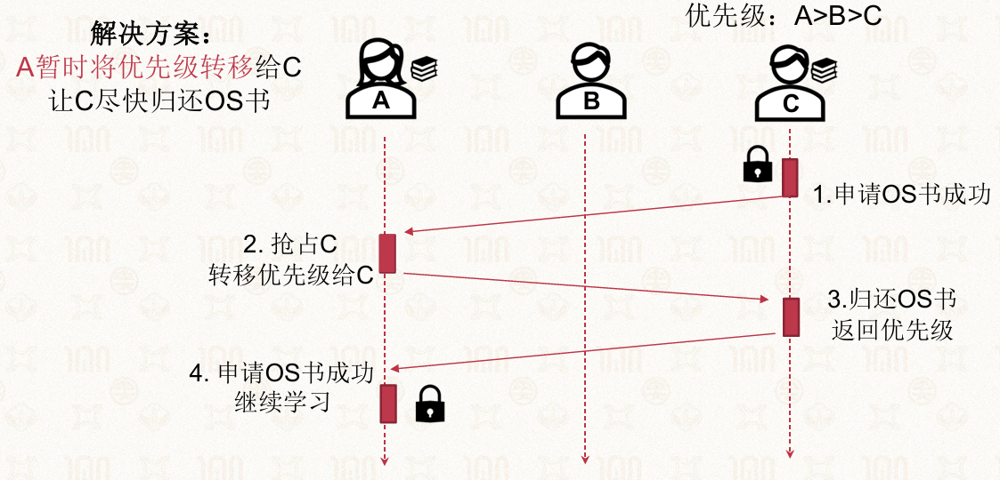

**低优先级进程饥饿：**持续不断的高优先级任务涌入系统，低优先级任务永久无法被调度执行

*   **解决：多级反馈队列**(Multi-Level Feedback Queue, MLFQ)

    *   初始默认都是短任务，短任务拥有更高优先级

    *   低优先级的任务采用更长的时间片

    *   定时将所有任务的优先级提升至最高
        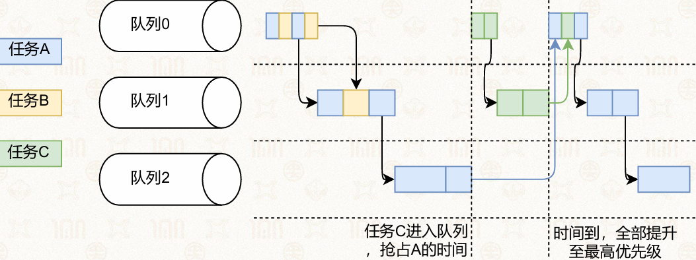

### 7.3.4 公平共享调度（彩票调度）

#### **场景**

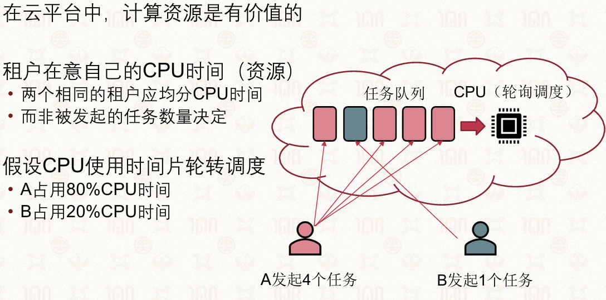

#### 公平共享

*   每个用户占用的资源是成比例的

    *   而非被任务的数量决定

*   每个用户占用的资源是可以被计算的

    *   设定"权重值"以确定相对比例（绝对值不重要）
    *   例：权重为4的用户使用资源，是权重为2的用户的2倍

#### 原理

用**彩票（ticket）数量代表任务权重**

*   系统总彩票数为所有任务彩票之和

*   每次CPU调度时随机抽取一张彩票，抽到对应彩票的任务获得CPU使用权

    *   任务持有的彩票越多，被选中的概率越高

*   以此实现按权重公平分配CPU时间

**计算**

*   任务彩票占比 = 该任务能占用CPU时间的理论占比
*   例：任务A持有50张票、任务B持有30张、任务C持有20张，总票100，则A约占用50%CPU时间、B30%、C20%

#### 算法

**调度步骤**

1.  统计所有任务总彩票 $T$   

2.  生成随机数 $\boldsymbol{R \in [0,T)}$

3.  从头遍历任务累加`sum += task.ticket`，第一个满足 $\boldsymbol{R<sum}$ 的任务获得CPU

    *   示例

        *   累加： $A1(20)\to sum=20$ 、 $A2(30)\to sum=50$ ， $51>50$

        *   再加 $B1(50)\to sum=100$ ， $51<100$  → 调度B1

**存储结构**：任务用链表串联，遍历链表累加票数匹配随机值

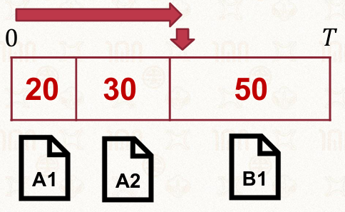

##### **跳表生成节点层数函数**

```c
int SkipList::randomLevel() {
    float r = (float)rand()/RAND_MAX; // 随机生成[0,1]小数
    int lvl = 0;
    while(r < P && lvl < MAXLVL) { // 满足概率P且没到最大层高
        lvl++;
        r = (float)rand()/RAND_MAX; // 再抽一次随机数
    }
    return lvl;
}
```

**作用**：新建跳表节点时，随机决定这个节点拥有几层索引

1.  **P：升级概率（跳表约定常用P=0.5）**

    *   第一层(lvl=0)：必然生成

    *   第一次随机 $r<P$  → 升到2层(lvl=1)

    *   再随机，再次 $r<P$  → 继续升3层，直到随机失败/达到最大层级`MAXLVL`停止

2.  概率规律：

    *   lvl=0：概率100%

    *   lvl=1：概率 $P$

    *   lvl=2：概率 $P^2$ ……层级越高出现概率越低，保证跳表稀疏高层索引，实现 $O(logn)$ 查找。

> **和彩票调度关系**：彩票调度原本用普通链表遍历找R（$O(n)$），改用跳表存储彩票区间，查找随机数R的任务从线性查找变对数查找，优化效率

##### 伪代码：彩票调度的任务选择逻辑

```c
R = random(0, T)    // 生成0~99随机数，示例R=51
sum = 0
foreach(task in task_list){
    sum += task->ticket
    if(R < sum){
        schedule() // 调度当前任务运行
        break
    }
}
```

**分步举例**（R=51）

1.  第一轮：`sum +=20 → sum=20`， $51<20$ 不成立，跳过A1

2.  第二轮：`sum +=30 → sum=50`， $51<50$ 不成立，跳过A2

3.  第三轮：`sum +=50 → sum=100`， $51<100$ 成立 → **调度B1**

**核心逻辑**

1.  所有任务彩票在数轴上分段： $[0,20)→A1，[20,50)→A2，[50,100)→B1$

2.  随机数落在哪个区间，对应任务获得CPU

3.  **票数=区间长度，票数越多区间越大，被随机选中概率越高，实现按权重公平调度**

#### 拓展机制：彩票转让（第56页）

**使用场景**：客户端-服务端同步阻塞

1.  客户端发起RPC请求后阻塞等待服务端结果，客户端把自己全部ticket临时转给服务端

2.  服务端拥有更多彩票、更容易被调度选中，加快处理请求

    *   确保服务端可以尽可能使用更多资源，迅速处理

3.  请求处理完毕、客户端被唤醒，服务端返还全部ticket

**作用**：规避进程阻塞空耗权重，提升同步场景资源利用率。

#### 优势

1.  实现简单
2.  动态调整简便：修改任务彩票数量即可实时变更权重，无需改动调度器核心逻辑
3.  天然规避饥饿：再少彩票的任务仍有被随机抽中的概率

#### 缺陷

随机带来的问题是？

*   不精确——伪随机非真随机
*   各个任务对CPU时间的占比会有误差
*   存在不确定性

### 7.3.5 公平共享调度（步幅调度）

#### 步幅调度定位：彩票调度的确定性实现

**定义：**是确定性版本的彩票调度

*   沿用ticket权重思想
*   舍弃彩票调度随机摇号逻辑
*   依靠固定数学计算实现精准权重公平分配
*   消除随机带来的调度不确定性

#### 三大参数定义

**Ticket（权重票）** 继承彩票调度的权重概念，Ticket数值代表任务权重大小，数值越高任务权重越大=

**Stride（步长/步幅）**

计算公式： $\boldsymbol{Stride=\dfrac{MaxStride}{Ticket}}$

1.  MaxStride：设定为系统所有任务Ticket取值的最小公倍数（一个足够大的整数）
    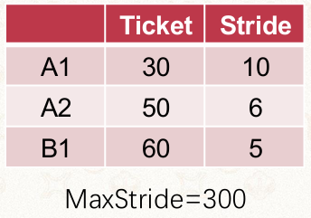

2.  规律：<u>Ticket（权重）越大，Stride步长数值越小</u>，任务每次运行后Pass增长越慢，更容易持续被调度选中

**Pass（累计虚拟运行时间）**

1.  所有任务初始化Pass数值为0

2.  任务每被调度运行一次，执行更新： $\boldsymbol{Pass=Pass+Stride}$

3.  Pass代表任务累计占用的虚拟时间，是调度选择的核心依据

#### 调度规则

1.  **选任务规则**：就绪队列中，挑选<u>当前Pass数值最小</u>的任务投入CPU运行

    1.  当pass相等时优先权重高的

2.  **任务回收规则**：任务用完时间片后，更新自身Pass（Pass += Stride），重新放回就绪队列参与下一轮调度

3.  重复循环上述两步，长期运行下<u>各任务占用CPU时间比例 = Ticket权重占比</u>

**调度实例推演（A1：Ticket30/Stride10；B1：Ticket60/Stride5，MaxStride=300）** 初始状态：Pass\_A1=0，Pass\_B1=0

1.  两者Pass相同，优先选中B1运行 → Pass\_B1 = 0+5 =5；
2.  当前Pass\_A1=0 < Pass\_B1=5，选中A1运行 → Pass\_A1 =0+10=10；
3.  当前Pass\_B1=5 < Pass\_A1=10，选中B1运行 → Pass\_B1=5+5=10；
4.  两者Pass再次持平，继续调度B1 → Pass\_B1=10+5=15；
5.  当前Pass\_A1=10 < Pass\_B1=15，调度A1 → Pass\_A1=10+10=20； **长期统计结果：A1与B1的CPU占用比例 =30:60=1:2，每3次调度B1运行2次、A1运行1次，严格匹配权重。**

#### 步幅调度和彩票调度对比

| 调度算法 | 调度实现逻辑 | 与实际差距        |
| ---- | ------ | ------------ |
| 彩票调度 | 随机     | 长期统计公平，短期波动大 |
| 步幅调度 | 确定性计算  | 小            |


#### 工程落地：Linux CFS完全公平调度（基于步幅调度思想）

Linux CFS是步幅调度在操作系统中的工程化改良实现：

1.  CFS中的vruntime（虚拟运行时间）等价于步幅调度的Pass；
2.  CFS采用红黑树管理所有就绪任务，每次调度选取vruntime数值最小的进程，和步幅「选最小Pass」规则完全一致；
3.  进程nice优先级映射权重：权重越高，进程每次运行后vruntime上涨速率越慢，等效Stride更小，更容易被调度，复刻步幅调度权重逻辑；
4.  CFS取消固定MaxStride设定，改用动态虚拟时间，适配Linux多任务动态创建销毁场景

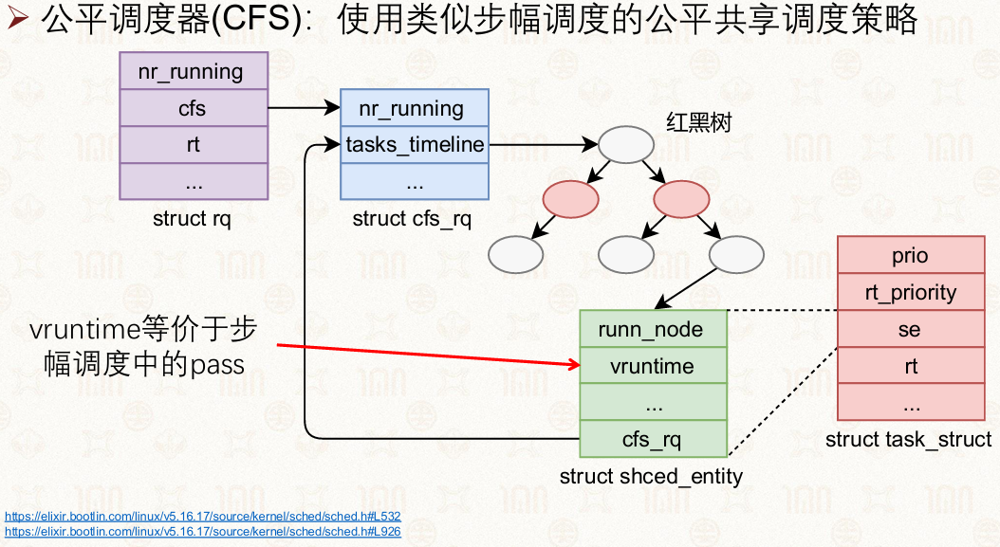

#### 优缺点

**优点**

1.  精准公平：CPU分配严格跟随Ticket权重，无随机误差，不会出现进程饥饿
2.  调度可预期：任务执行顺序可通过Pass、Stride数学计算预判
3.  兼容彩票调度原有特性：可沿用彩票转让机制，支持客户端阻塞时向服务端转交权重

**缺点**

1.  需要持续维护每个任务的Pass、Stride参数，存在少量计算开销
2.  新增任务时需要重新核算MaxStride（原生步幅），动态任务场景适配性弱，因此Linux CFS做了优化去掉固定MaxStride

### 7.3.6 实时调度

#### 基本概念

**定义**：是面向<u>实时任务</u>的处理器调度机制

**目标：**保证任务在规定截止时间内完成执行

**作用：**操作系统调度在实时场景的关键分支

**代表算法：**最早截止时间优先（EDF）

#### 背景

实时任务对执行时间有严格约束，按可靠性要求分为两类：

*   **硬实时任务**：必须绝对满足截止时间，超时会引发系统故障、安全事故等严重后果
*   **软实时任务**：允许偶尔超时，不会导致系统级失效，仅影响服务质量

※普通系统很难做到确定性时延

#### 实时操作系统的特点

**确定性**

*   完成时间有明确上界
*   调度时延可以被准确预测

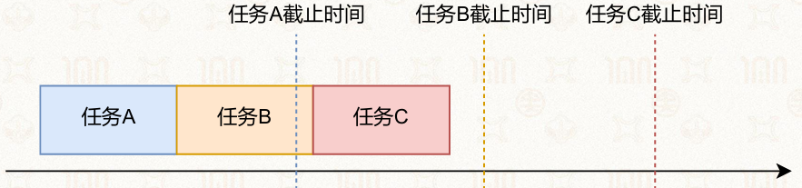

#### CPU利用率计算与可调度基础条件

##### 利用率计算公式

仅针对无依赖关系的周期性任务，单任务利用率 $U_i=\frac{C_i}{T_i}$

*   $C_i$ ：任务单次运行耗时

*   $T_i$ ：任务运行周期（默认周期等价于截止时间）

系统总CPU利用率： $\boldsymbol{U = \sum_{i=1}^{m} U_i = \sum_{i=1}^{m} \frac{C_i}{T_i}}$

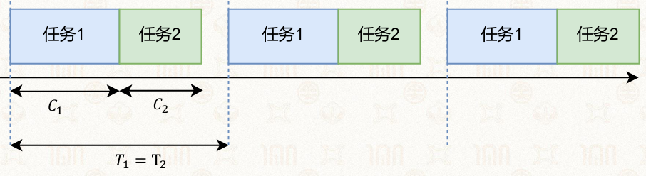

##### 可调度必要条件

系统总利用率 $U\le1$

若 $U>1$，CPU算力不足以承载全部任务，必然出现任务无法在截止时间内完成的情况

*   举例

    *   任务1： $C_1=1、T_1=2$ （ $U_1=\frac12$ ）

    *   任务2： $C_2=3、T_2=4$ （ $U_2=\frac34$ ）

    *   总 $U=\frac54>1$ ，超出CPU负载上限，无法实现实时调度

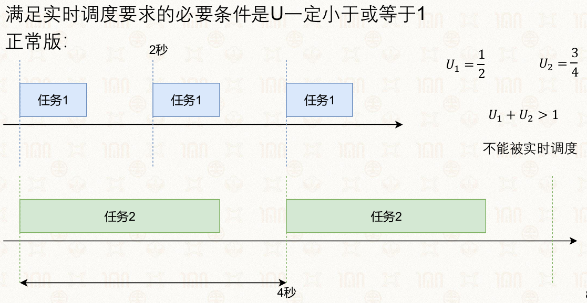

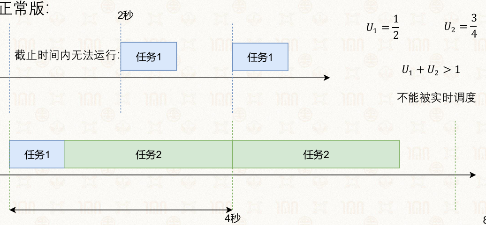

#### RM速率单调调度（Rate-Monotonic，静态优先级调度）

**调度规则**：静态分配优先级

*   任务运行周期越短，优先级数值越高
*   属于抢占式实时调度
*   系统运行全程优先级固定不变，任务参数提前确定

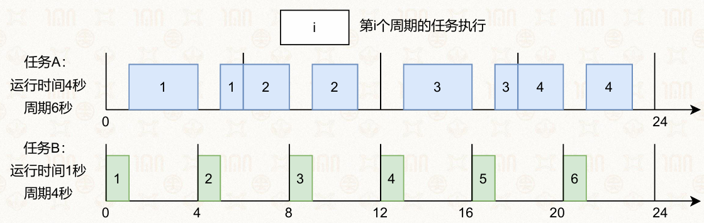

**可调度上限**：多任务场景下RM算法CPU利用率上限约$n(\sqrt[n]{2}-1)$，两任务上限约82.8%，整体利用率上限低于1

**短板案例**：RM满足U≤1不代表一定可调度

*   任务A( $C=5,T=13$ )

*   任务B( $C=3,T=5$ )

*   总利用率 $U=\frac{5}{13}+\frac35=\frac{64}{65}<1$ ，

*   满足总利用率≤1，使用RM调度时任务A仍会错过截止时间

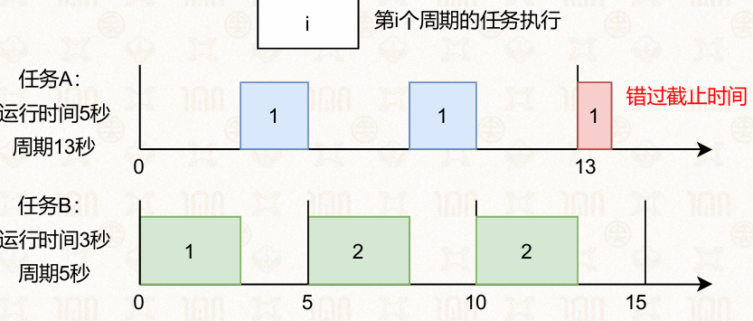

#### EDF最早截止时间优先（Earliest Deadline First，动态优先级调度）

**调度规则**：动态优先级调度，每次调度选中距离截止时间最近的就绪任务抢占CPU

*   任务优先级随剩余截止时间动态变化
*   无需提前预知任务运行时长

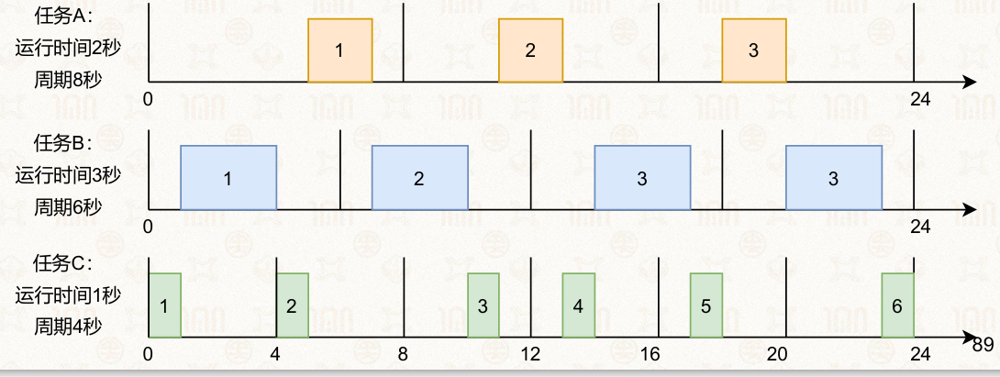

**特点（优点）**

*   理论最优：只要系统总利用率 $U\leq 1$ ，EDF算法一定可以实现全部任务按时调度完成，单核场景CPU利用率上限可达100%。

**缺陷**：**多米诺效应**：

*   当系统$U>1$超出负载上限时，一旦某个任务超时，会连锁导致后续大量任务接连错过截止时间，批量调度失败
    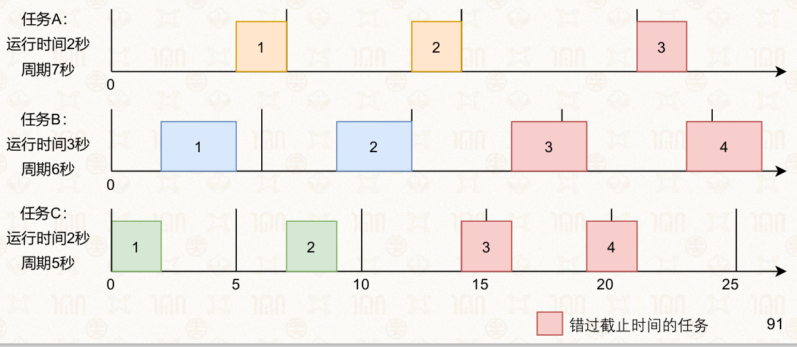

#### 实时调度的关键要求

1.  **时间确定性**：任务执行流程与完成时间可预测，严格遵守截止时间约束
2.  **抢占必要性**：高优先级实时任务必须具备抢占能力，避免因低优先级任务阻塞导致超时
3.  **低调度开销**：算法逻辑简洁，调度决策速度快，适配实时性要求

## 7.4 多核调度

### 7.4.1 多核调度的问题

#### **任务依赖问题**

同一个进程的线程通常存在依赖关系

*   例如GCC编译时需所有.c文件生成.o后才能链接为可执行文件，分散调度会导致等待与效率降低

#### **缓存效率问题**

任务在CPU核心间频繁迁移，会导致缓存命中率下降，破坏缓存局部性（负载分担）

#### **负载均衡问题**

各核心负载不均，出现忙闲差异，影响整体吞吐与响应

### 7.4.2 面向依赖的调度策略

#### **协同调度（整体同步）**

**基础：**整体同步并行模型

**规则**

*   无依赖任务并行执行
*   有依赖任务同步等待、统一交换数据后再进入下一轮

**场景：**常见于机器学习、图计算、分布式数据处理平台

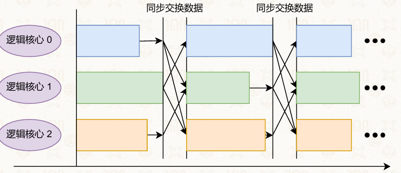

#### **群组调度（Gang Scheduling）**

**规则**

*   将有关联的任务划分为同一组
*   以组为单位整体调度
*   保证组内任务同时在不同核心运行，避免因部分任务未调度导致的阻塞

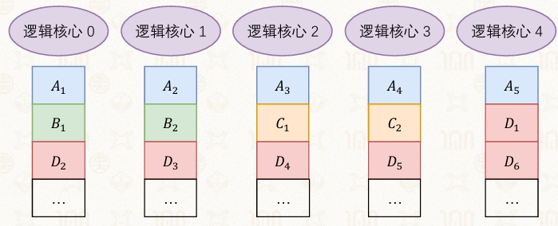

### 7.4.3 多核调度的额外因素

*   同一进程的多线程可在不同CPU核心并行执行，充分利用多核硬件
*   多核架构包含多级缓存（L1/L2/L3），调度需兼顾缓存亲和性，减少核心间迁移带来的缓存失效开销（问题二，缓存效率）

### 7.4.4 两级调度架构

#### **设计思想**

全局调度器负责任务分配与宏观均衡，每个CPU核心配备本地调度器与独立运行队列，兼顾缓存友好与调度效率

#### **执行流程**

1.  任务进入全局调度器
2.  全局调度器将任务分发至各核心的本地就绪队列
3.  本地调度器从自身队列选取任务在对应核心运行

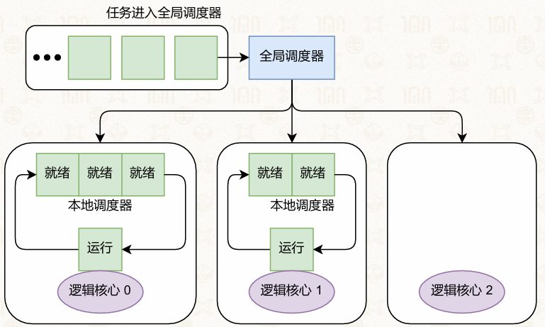

#### 问题（负载不均衡）

指定线程在某个CPU上运行容易负载不均衡，如上图

#### **典型实现-Linux**

Linux标准多核调度采用两级架构，每个逻辑CPU拥有独立的struct rq运行队列，包含CFS（完全公平调度）与RT（实时调度）队列

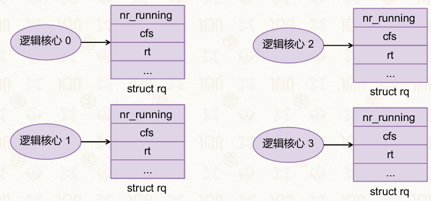

### 7.4.5 负载均衡（Load Balance）

#### 背景和目标

**背景**

*   每个任务特点不同，不能用任务数量代表真实负载
*   需要追踪CPU的负载情况

**目标**：将任务从高负载CPU迁移至低负载CPU，避免核心忙闲不均

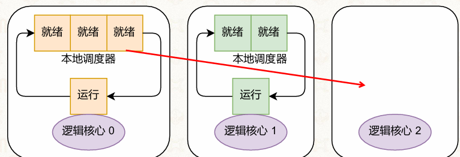

#### **难点**

任务计算、IO特性差异大，任务数量不能代表真实负载，需精准追踪负载

### 7.4.6 负载追踪机制

#### **以运行队列为粒度**

通过队列长度判断负载高低，实现简单但无法确定迁移任务，精度不足。

#### **以调度实体为粒度（PELT）**

**实例：**Linux 3.8引入Per Entity Load Tracking，以单个任务为粒度记录负载

**规则：**记录每个调度实体对负载的贡献

**计算**

*   周期：每1024μs统计一次任务可运行时间  $x$

*   线程𝑡在第𝑖个周期内的负载： $L(t,i) = \frac{x}{1024} \times \text{CpuScaleFactor}$

*   CpuScaleFactor 的作用

    *   统一标准，使不同性能CPU的负载标准化
    *   高性能的CPU，Factor也更高

##### 任务总负载的计算

**问题：**逐个相加不合适，任务负载是变化的，近期负载权重更高

**方法：**采用加权衰减，近期负载权重更高，Linux设定 $\gamma^{32}=0.5$，任务负载32个周期后减半

*   完整公式： $\text{Load}t = L{t,i}+\gamma\cdot L_{t,i-1}+\gamma^2\cdot L_{t,i-2}+\dots+\gamma^i L_{t,0}$

*   递推公式： $\text{Load}(t) = L(t,i) + \gamma \times \text{Load}(t)$

## 7.5 处理器亲和性（Processor Affinity）

**定义**：允许应用程序主动指定绑定到特定逻辑核心，由用户态程序自主控制调度，比内核更贴合业务特性。

**核心作用**：减少任务跨核心迁移，提升缓存命中率，降低调度开销。

**代码示例**

```c
#include <sched.h>
#include <sys/sysinfo.h>
#include <stdio.h>

int main() {
    cpu_set_t mask;
    // 初始化CPU集合为空
    CPU_ZERO(&mask);
    // 将逻辑核心0、2加入集合
    CPU_SET(0, &mask);
    CPU_SET(2, &mask);
    // 设置当前进程的CPU亲和性
    sched_setaffinity(0, sizeof(mask), &mask);
    return 0;
}
```

## 7.6 Linux能耗感知调度

**背景**：现代处理器采用**大小核架构**（高性能大核+高能效小核），如苹果A15、Intel 12代酷睿。

### 7.6.1 功耗模型

数字电路功率： $W=\frac{1}{2}Vf^2$

*   CPU固定电压，通过调节频率控制功耗与性能
*   性能标准化：0\~1024区间。
*   大核：高性能、高功耗；小核：低功耗、中等性能。

### 7.6.2 调度策略

根据任务负载与功耗需求，将轻量任务分配至小核，密集计算任务分配至大核，在性能与功耗间取得平衡。
