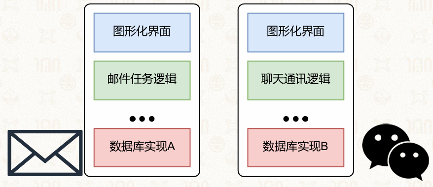
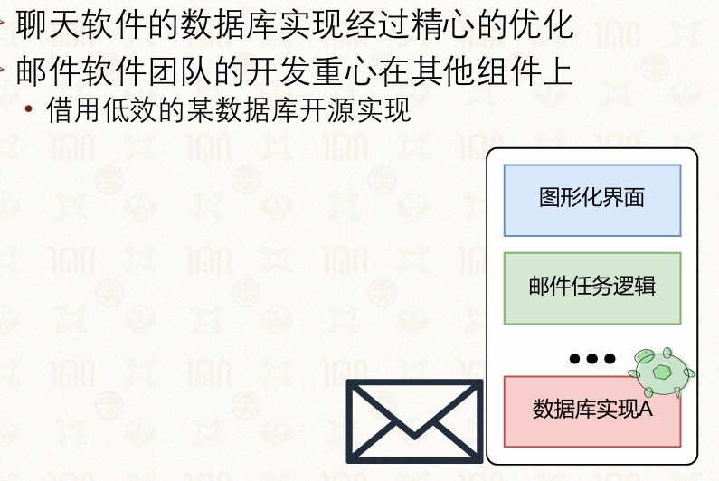
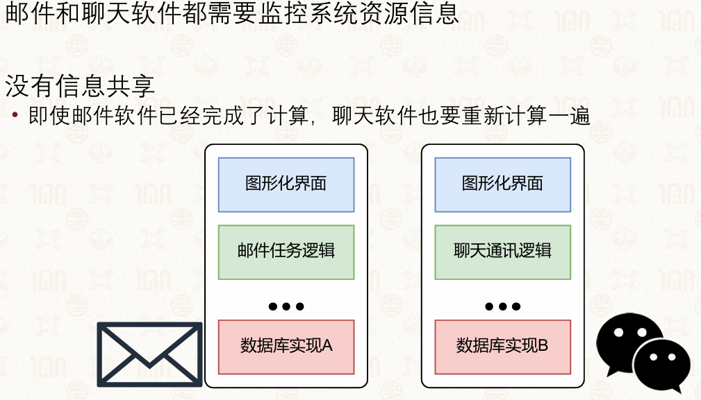
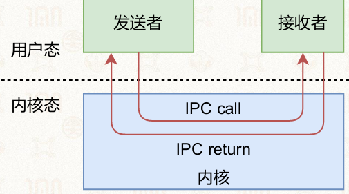
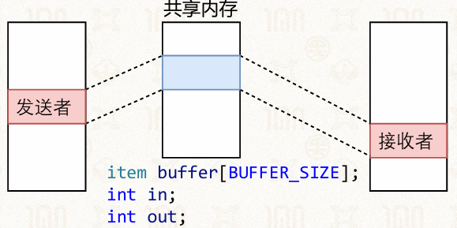
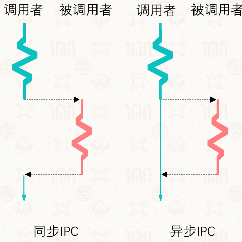
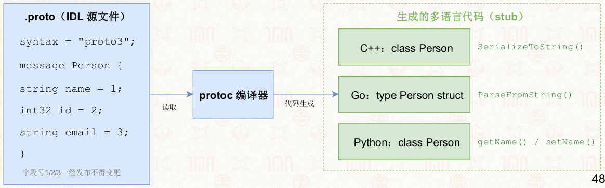
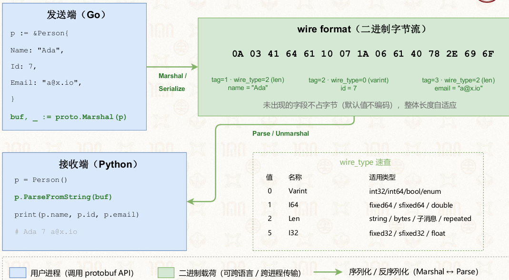

# 8章 进程间通信

## 8.1 通信基础

### 8.1.1 进程的基本概念

进程是运行中程序的抽象，包含静态部分与动态部分

#### 部分

**静态部分**：程序代码、数据，从可执行文件载入

**动态部分**：程序计数器、堆、栈、进程状态等

#### 拥有独立虚拟地址空间

*   每个进程都具有“独占全部内存”的假象
*   内核中同样包含内核栈和内核代码、数据

### 8.1.2 独立进程的核心问题

#### 背景

独立进程互不影响、独立执行，无法满足复杂应用需求

#### 大量重复实现

不同应用重复开发相同功能模块（如数据库）

  

#### 低效实现

非专业模块采用开源低效方案，性能差



#### 无信息共享

相同数据需重复计算，资源浪费严重



### 8.1.3 协作进程的优势

协作进程可相互影响、协同工作，解决独立进程的缺陷：

*   **模块化**：功能模块独立成进程，可被复用
*   **加速计算**：多进程分工执行，提升整体性能
*   **信息共享**：直接共享计算结果，避免重复计算


### 8.1.4 进程间通信（IPC）定义

**定义**：是不同进程通过内核或共享资源传递控制信息与数据的机制，是进程协作的基础

*   通信角色：发送者/接收者、客户端/服务端、调用者/被调用者
*   通信载体：内容
*   通信流程：用户态发起IPC调用→内核态处理→返回结果至用户态



## 8.2 共享内存通信

### 8.2.1 共享内存原理

#### 定义

系统内核为多个进程映射同一块物理内存区域，进程直接访问共享内存完成数据交互，是效率最高的IPC方式

#### 实现核心

通过修改页表项，将不同进程的虚拟地址映射到同一物理内存地址

#### 挑战：同步

*   发送者不能覆盖掉未读取的数据
*   接收者不能读别的数据

### 8.2.2 共享内存基础实现

以环形缓冲区为例，定义共享数据结构：

```c
#define BUFFER_SIZE 10
typedef struct {
    //……
} item;
item buffer[BUFFER_SIZE];//共享数据区域，容量为10
int in = 0;  // 写入位置
int out = 0; // 读取位置
```

*   **发送者流程**：判断缓冲区未满→写入数据→更新in指针

    *   当没有空间时，发送者盲目等待

        ```c
        while(new_package) {
        	// 产生一个item
        	while (((in + 1) % BUFFER_SIZE) == out);
        	// 什么也不干，干等着，因为没有多余的空间
        	buffer[in] = item;
        	in = (in + 1) % BUFFER_SIZE;
        }
        ```

*   **接收者流程**：判断缓冲区有数据→读取数据→更新out指针

    *   没有新消息时，接收者盲目等待

        ```c
        while (wait_package) {
        	while (in == out); // 什么也不干，没有新item可以被消费的
        	// 从buffer中删除一个item
        	item = buffer[out];
        	out = (out + 1) % BUFFER_SIZE;
        	return item;
        }
        ```



### 8.2.3 共享内存的问题

1.  **同步问题**：需避免发送者覆盖未读数据、接收者读取空数据
2.  **轮询浪费**：发送/接收者盲目循环等待，占用CPU资源，时延不可控
3.  **无同步机制**：基础实现依赖忙等，效率极低
4.  **时延长**：固定一个检查时长，时延长

## 8.3 消息传递

### 8.3.1 消息传递基础

#### 消息系统

消息传递通过中间层完成通信，仍可以利用共享内存传递数据

#### 基本操作

*   发送：`Send(message)`
*   接收：`Recv(message)`

#### 通信流程

建立连接→通过Send/Recv传递消息

### 8.3.2 直接通信

#### 规则

进程通过唯一标识直接通信

#### 接口

*   `Send(P, message)` 发消息给进程P
*   `Recv(Q, message)` 从进程Q收消息

#### 特点

*   连接自动建立
*   一对一
*   单向/双向
*   一对进程之间只有一个链接
*   接收者会阻塞，直到发送者发送消息

#### 实现

**发送者代码**

```c
while (new_package) {
    /* Produce an item */
    while (((in + 1) % BUFFER_SIZE) == out)
        ; /* nothing, no free buffers */
    buffer[in] = item;
    in = (in + 1) % BUFFER_SIZE;
    Send(XiaoMing, "Package");
}
```

**接收者代码**

```c
while (wait package) {
    Recv(Expressman, Msg);//阻塞直到send发送消息过来
    item = buffer[out];
    out = (out + 1) % BUFFER_SIZE;
    return item;
}
```

##### 说明

1.  同步逻辑：`Send/Recv`为阻塞式消息传递，`Recv`调用处阻塞休眠，直到发送方执行`Send`发来消息，解除阻塞
2.  缓冲区：环形缓冲区，生产者通过`(in+1)%BUFFER_SIZE==out`判断缓冲区满，空缓冲区由消息同步机制控制

### 8.3.3 间接通信（信箱/端口）

#### 规则

消息通过信箱（Mailbox）中转，解决直接通信的接收者不可达问题：

*   信箱：唯一标识的消息容器，类似聊天群号
*   聊天群：所有群内的人可以接收消息
*   发送者往“信箱”发送消息，接收者从“信箱”读取消息

#### 操作

*   创建信箱

*   通过信箱发送和接收消息

    *   Send(M, message)发至信箱M
    *   Recv(M, message)从信箱M收消息

*   销毁信箱

#### 特点

*   单向/双向

*   进程间连接的建立发生在共享一个信箱时

*   多对多，可共享多个信箱

    *   每对进程可以有多个连接

#### 实现

**发送者（快递员）代码**

```c
while (new_package) {
    /* Produce an item */
    // 环形缓冲区满则忙等阻塞
    while (((in + 1) % BUFFER_SIZE) == out)
        ; /* nothing, no free buffers */
    // 写入数据到环形共享缓冲区
    buffer[in] = item;
    in = (in + 1) % BUFFER_SIZE;
    // 向公共信箱Mailbox发送消息（间接通信：信箱机制）
    Send(Mailbox, "Package");
}
```

**接收者1（小明）代码**

```c
// 阻塞等待信箱消息
Recv(Mailbox, Msg);
item = buffer[out];
out = (out + 1) % BUFFER_SIZE;
```

**接收者2（小明妈妈）代码**

```c
// 同一个信箱阻塞等待消息
Recv(Mailbox, Msg);
item = buffer[out];
out = (out + 1) % BUFFER_SIZE;
```

##### **说明**

*   **数据分层**

    *   共享内存`buffer`存放真实包裹数据
    *   `Send/Recv`信箱消息仅做同步通知，用来唤醒阻塞的接收进程，解决裸共享内存轮询忙等浪费CPU的问题

*   **缓冲区规则**

    *   生产者用`(in+1)%BUFFER_SIZE == out`判断环形缓冲区已满，满时原地忙等，无法继续放入数据。

#### 信箱共享挑战

**问题**：接收时，需解决消息归属问题

*   进程P1、P2和P3共享一个信箱M
*   P1负责发送消息，P2、P3负责接收消息
*   当一个消息发出的时候，谁会接收到最新的消息呢？

**解决方案**：

1.  一个信箱仅允许两个进程共享
2.  同一时间仅一个进程执行接收操作
3.  系统随机选择接收者并通知发送者

### 8.3.4 消息传递的同步与异步

#### 阻塞（同步）

*   **阻塞的发送/接收**:

    *   发送者/接收者一直处于阻塞状态，直到消息发出/到来

*   **优点**

    *   低时延
    *   易用的编程模型(不会被投诉)

#### 非阻塞（异步）

*   **阻塞的发送/接收**:

    *   发送者/接收者不等待操作结果，直接返回

*   **优点**

    *   带宽一般更高 (快递员可以送更多的快递)



### 8.3.5 超时机制

#### 原因

为同步通信添加超时限制，避免永久阻塞

#### 接口

`Send(A, message, Time-out)`

*   超过Time-out限定的时间就返回错误信息

#### 特殊选项

*   一直等待（纯阻塞）
*   不等待（纯非阻塞）

#### 作用

防止通信阻塞导致的拒绝服务攻击

#### 实现

发送者（快递员）代码

```c
while (new_package) {
    /* Produce an item */
    while (((in + 1) % BUFFER_SIZE) == out)
        ; /* nothing, no free buffers */
    buffer[in] = item;
    in = (in + 1) % BUFFER_SIZE;
    if(Send(Mailbox, "Package", "15min") == error)
        goto retry;
}
```

接收者1（小明）代码

```c
Recv(Mailbox, Msg, Time-out);
```

接收者2（小明妈妈）代码

```c
Recv(Mailbox, Msg, Time-out);
```

##### 补充说明

1.  **超时机制**：`Send`、`Recv` 第三个参数为超时时间，发送方限定15分钟超时，接收方配置通用超时，超时后函数返回错误码`error`
2.  **异常重试**：发送超时失败时通过`goto retry`重试本次发送
3.  **信箱多接收**：同一`Mailbox`信箱绑定两个接收进程，带超时的阻塞接收，避免永久死等。

### 8.3.6 通信连接的缓冲

#### 作用

缓冲用于暂存未处理消息

#### 分类

1.  **零容量**：无缓冲，发送者必须等待接收者
2.  **有限容量**：固定大小缓冲，满则发送者阻塞
3.  **无限容量**：系统资源允许下无上限，发送者几乎无需等待

## 8.4 管道

### 8.4.1 协程间管道（Go语言示例）

管道是协程/进程间的通信通道，Go语言通过channel实现协程间通信：

```go
package main
import (
    "fmt"
    "time"
)
func longTask(signal chan int) {
    for {
        fmt.Println("longTask is running")
        v := <-signal
        if v == 1 {
            break
        }
        time.Sleep(1 * time.Second)
    }
    fmt.Println("longTask is finished")
}
func main() {
    sig := make(chan int)
    go longTask(sig)
    time.Sleep(3 * time.Second)
    sig <- 1
    time.Sleep(1 * time.Second)
}
```

### 8.4.2 Unix管道

#### 基本概念

**定义**

管道是Unix宏内核系统的经典IPC机制，属于间接消息传递

**管道**：两个进程间的一根通信通道

*   一端向里投递，另一端接收
*   管道是间接消息传递方式，通过共享一个管道来建立连接

**典型用法**：shell命令 `ls | grep`，前一个命令输出作为后一个输入

#### 特点

*   单向通信

*   当缓冲区满时阻塞

*   字节流传输

*   基于Unix文件描述符

*   一个管道有且只能有两个端口

    *   一个负责输入(发送数据)
    *   一个负责输出(接收数据)

#### 基础结构

`int fd[2]`，`fd[0]` 读端，`fd[1]` 写端

```go
int fd[2];
pipe(fd);
fd[0]; // 读
fd[1]; // 写
```

### 8.4.3 Xv6管道实现

**管道数据结构**：

```go
struct pipe {
    struct spinlock lock;
    char data[PIPESIZE]; // 固定大小缓冲区
    uint nread;          // 已读字节数
    uint nwrite;         // 已写字节数
    int readopen;        // 读端是否开启
    int writeopen;       // 写端是否开启
};
```

#### 写操作

加锁→判断缓冲区满→满则阻塞等待读→写入数据→唤醒读进程

```go
// 管道写接口：向管道p写入n字节数据，数据源addr，成功返回n，异常返回-1
int pipewrite(struct pipe *p, char *addr, int n) {
    int i;
    acquire(&p->lock);          // 获取管道互斥锁，保护管道缓冲区并发访问
    for(i = 0; i < n; i++) {    // 循环逐个字节写入n个数据
        // 【检查缓冲区区域是否满：写指针追上读指针+缓冲区大小，环形缓存满】
        while(p->nwrite == p->nread + PIPESIZE) {
            // 如果读者已经全部关闭 或 当前进程被杀死，写操作报错退出
            if(p->readopen == 0 || proc->killed) {
                release(&p->lock);  // 释放锁
                return -1;          // 返回写入失败
            }
            wakeup(&p->nread);   // 尝试唤醒阻塞等待数据的读进程
            // 【自己阻塞休眠，等待读进程取走数据腾出缓冲区，休眠时释放锁、被唤醒后重新拿锁】
            sleep(&p->nwrite, &p->lock);
        }
        // 【往环形缓冲放置单个字节消息，写指针自增，取模实现环形下标】
        p->data[p->nwrite++ % PIPESIZE] = addr[i];
    }
    wakeup(&p->nread);          // 写完一批数据，唤醒阻塞的读进程来读取
    release(&p->lock);          // 释放管道锁
    return n;                   // 全部n字节写入成功，返回n
}
```

#### 读操作

加锁→判断无数据则阻塞等待写→读取数据→唤醒写进程

```go
// 管道读接口：从管道p读取数据到addr缓冲区，最多读n字节，返回实际读取字节数，异常返回-1
int piperead(struct pipe *p, char *addr, int n) {
    int i;
    acquire(&p->lock);          // 获取管道互斥锁
    // 【检查是否无消息：读写指针相等(缓冲区空) 且 写端还处于打开状态，需要阻塞等待写入】
    while(p->nread == p->nwrite && p->writeopen) {
        if(proc->killed) {     // 当前进程被杀死，读失败
            release(&p->lock);
            return -1;
        }
        // 【阻塞休眠等待写进程写入数据，休眠期间释放锁，被唤醒后重新竞争锁】
        sleep(&p->nread, &p->lock);
    }
    // 【循环读取消息：逐个取字节，读到n个或缓冲区空就停止】
    for(i = 0; i < n; i++) {
        if(p->nread == p->nwrite) { // 缓冲区空，提前跳出读循环
            break;
        }
        addr[i] = p->data[p->nread++ % PIPESIZE]; // 取出环形缓冲区数据，读指针后移
    }
    wakeup(&p->nwrite);         // 读完部分数据腾出空间，唤醒阻塞的写进程继续写入
    release(&p->lock);          // 释放锁
    return i;                   // 返回实际读到的字节数量
}
```

### 8.4.4 管道的优缺点

#### 优点

*   设计和实现简单
*   针对简单通信场景十分有效

#### 缺点\问题

*   缺少消息的类型，接收者需要对消息内容进行解析
*   缓冲区大小预先分配且固定
*   只能支持单向通信
*   只能支持最多两个进程间通信

## 8.5 消息队列

### 8.5.1 消息队列基础

#### 定义

消息队列是带类型的链表式间接通信机制

*   任何有权限的进程都可以访问队列，写入或者读取
*   支持异步通信

#### 组织、格式、api

*   组织形式：消息以链表形式存储，遵循FIFO原则

*   消息格式：类型（整型）+ 数据

    *   类型：由一个整型表示，含义由用户自定义

*   核心API：`ftok()`、`msgget()`、`msgsnd()`、`msgrcv()`、`msgctl()`

*   **特点**

    *   多进程可读写
    *   支持按类型筛选消息
    *   是间接消息传递方式，通过共享一个队列来建立连接

### 8.5.2 Protobuf 序列化

Protobuf 是跨语言消息序列化方案，配合消息队列使用

#### 特点

1.  编写`.proto`文件定义消息结构
2.  编译器生成多语言代码，封装get/set与序列化API
3.  发送端序列化（Marshal），接收端反序列化（Parse）

#### 优势

跨语言兼容、体积小、速度快、字段可扩展





### 8.5.3 消息队列读取规则

#### 组织

*   默认：读取队首消息（FIFO）
*   消息队列的写入：增加在队列尾部
*   消息队列的读取：默认从队首获取消息

#### 按照类型查询

*   按类型读取：`Recv(A, type, message)`

    *   type=0：返回第一个消息

    *   type≠0：按照类型查询消息

        *   type＞0：返回第一个匹配该类型的消息

### 8.5.4 消息队列与管道对比

| 对比维度  | 消息队列       | 管道      |
| ----- | ---------- | ------- |
| 缓冲区设计 | 链表动态分配     | 固定大小缓冲区 |
| 消息格式  | 带类型的数据     | 无类型字节流  |
| 通信进程数 | 多发送者、多接收者  | 最多两个进程  |
| 消息管理  | FIFO+按类型查询 | 仅FIFO   |
