# 9章 同步原语

## 9.1 同步问题的背景

### 9.1.0 什么是同步问题

**同步问题**：发送者不能覆盖未读取的数据，接收者不能读取空数据或错误数据

随着计算机系统向多核架构演进，同步问题的复杂度与重要性急剧提升。

### 9.1.1 多核场景

#### 多核架构的兴起

*   单核性能提升遭遇瓶颈

    *   无法通过一味提升CPU频率获得更好的性能
    *   频率提升会带来功耗与散热的指数级增长

*   行业转向多核路线

    *   通过增加CPU核心数来提升软件整体性能
    *   桌面、服务器、移动平台均已全面进入多核时代

#### 多核带来的问题

多核并非"免费的午餐"，多核心并行执行会引发两类根本性问题：

##### **正确性问题**

多个线程同时访问共享资源时，会因执行顺序不确定导致结果错误，即出现竞争条件

*   对共享资源的竞争导致错误
*   操作系统提供同步原语供开发者使用
*   使用同步原语带来新的问题

##### **性能可扩展性问题**

多线程间的同步开销、资源竞争会导致系统性能无法随核心数线性增长，甚至出现性能断崖

*   多核多处理器硬件与特性
*   可扩展性问题导致性能断崖
*   系统软件设计如何利用硬件特性

#### 多线程计数器的正确性示例

以多线程累加共享变量`balance`为例，直观展示竞争条件的产生：

```
volatile int balance = 0;
void *mythread(void *arg) {
    int i;
    for (i = 0; i < 20000; i++) {
        balance++;
    }
    printf("Balance is %d\n", balance);
    return NULL;
}
int main(int argc, char *argv[]) {
    pthread_t p1, p2, p3;
    pthread_create(&p1, NULL, mythread, (void *)"A");
    pthread_create(&p2, NULL, mythread, (void *)"B");
    pthread_create(&p3, NULL, mythread, (void *)"C");
    pthread_join(p1, NULL);
    pthread_join(p2, NULL);
    pthread_join(p3, NULL);
    printf("Final Balance is %d\n", balance);
}
```

**预期结果**：3个线程各累加20000次，最终`balance`应为60000。

**实际结果**：最终值总是小于60000，且每次运行结果不同。

#### 错误原因分析

C语言中的`balance++`并非原子操作，会被编译为三条汇编指令：

```
ldr r3, [r2]    // 从内存加载balance到寄存器r3
adds r3, r3, #1 // 寄存器值加1
str r3, [r2]    // 将结果写回内存
```

**错误场景分类**

1.  **单核抢占式调度场景**：线程1执行完加载指令后被调度器抢占，线程2完整执行完三条指令后，线程1恢复执行，将旧值写回内存，导致两次累加实际只生效一次。
2.  **多核并行执行场景**：两个核心上的线程同时加载`balance`的相同值，各自加1后写回，同样导致两次累加只生效一次。

### 9.1.2 生产者消费者模型

生产者消费者模型是最经典的同步问题抽象，描述了两类进程/线程的协作关系：生产者负责生产数据并放入缓冲区，消费者负责从缓冲区取出数据并消费。

#### 模型基本组成

*   **有限容量缓冲区**：用于暂存生产的数据，采用先进先出（FIFO）的队列结构

*   **同步信号量**：

    *   空槽计数信号量`empty`：初值为缓冲区容量N，表示可用空槽数量
    *   满槽计数信号量`full`：初值为0，表示已填充数据的槽位数量

*   **生产者逻辑**：缓冲区未满时放入产品，否则等待

*   **消费者逻辑**：缓冲区非空时取出产品，否则等待

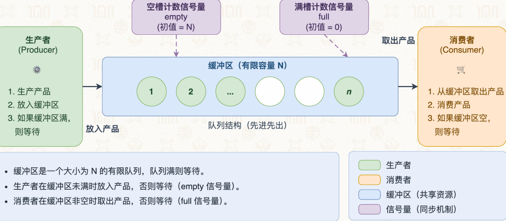

#### 单生产者单消费者实现

**共享变量定义**（都是共享的）

```
// 缓冲区状态计数
volatile int empty_slot = 5;   // 空槽数量，缓冲区容量为5
volatile int filled_slot = 0;  // 满槽数量

// 环形缓冲区指针
volatile int buffer_write_cnt = 0; // 写入位置指针
volatile int buffer_read_cnt = 0;  // 读取位置指针

// 环形缓冲区指针
int buffer[5];                 // 共享缓冲区
```

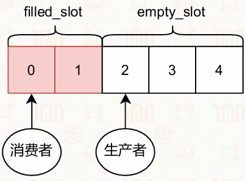

**缓冲区操作函数**：

```
void buffer_add(int msg) {
    buffer[buffer_write_cnt] = msg;
    buffer_write_cnt = (buffer_write_cnt + 1) % 5;
}
int buffer_remove(void) {
    int ret = buffer[buffer_read_cnt];// 先读当前指针位置的数据
    buffer_read_cnt = (buffer_read_cnt + 1) % 5;// 再后移读指针
    return ret;
}
```

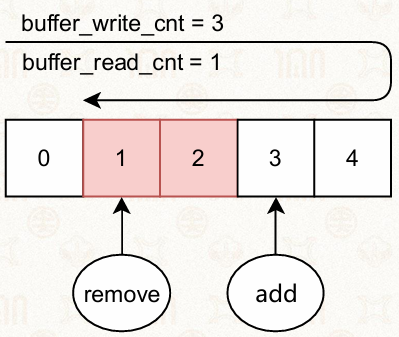

**生产者与消费者逻辑**：

```
void producer(void) {
    int new_msg;
    while (TRUE) {
        new_msg = produce_new();
        while (empty_slot == 0); // 缓冲区满，忙等
        empty_slot--;            // 空槽数减1
        buffer_add(new_msg);
        filled_slot++;
    }
}
void consumer(void) {
    int cur_msg;
    while(TRUE) {
        while(filled_slot == 0); // 缓冲区空，忙等
        filled_slot--;           // 满槽数减1
        cur_msg = buffer_remove();
        consume_msg(cur_msg);
        empty_slot++;            // 空槽数加1
    }
}
```

单生产者单消费者场景下，上述代码可正确运行。

#### 多生产者单消费者的竞争条件

当存在多个生产者时，上述代码会出现严重错误

**核心问题：**是多个生产者同时访问共享的写入指针`buffer_write_cnt`

1.  **数据覆盖**：两个生产者同时读取相同的`buffer_write_cnt`值，将数据写入同一个缓冲区位置，后写入的数据会覆盖先写入的数据
    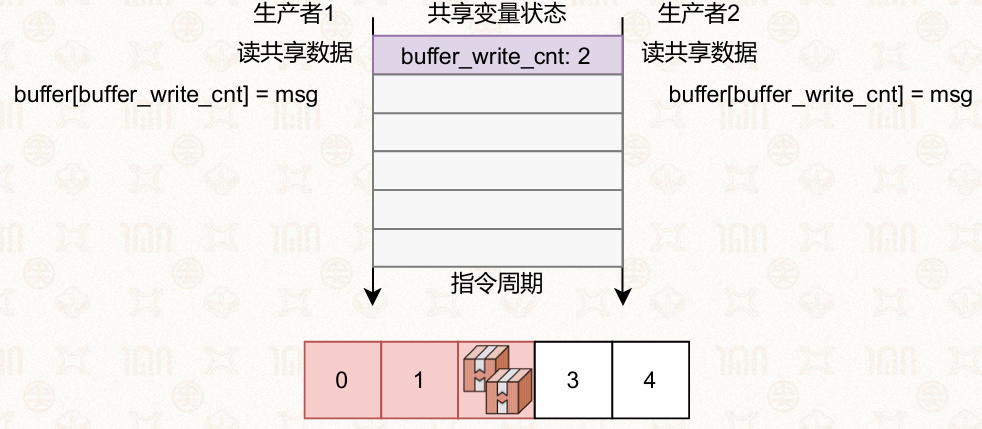

2.  **计数错误**：两个生产者各自将读取到的旧值加1后写回，导致`buffer_write_cnt`只增加了1，而非预期的2
    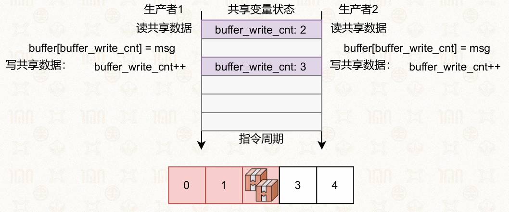

即使两个生产者的执行存在轻微时间差，只要其中一个生产者在读取`buffer_write_cnt`后、写回前被另一个生产者打断，错误就会发生

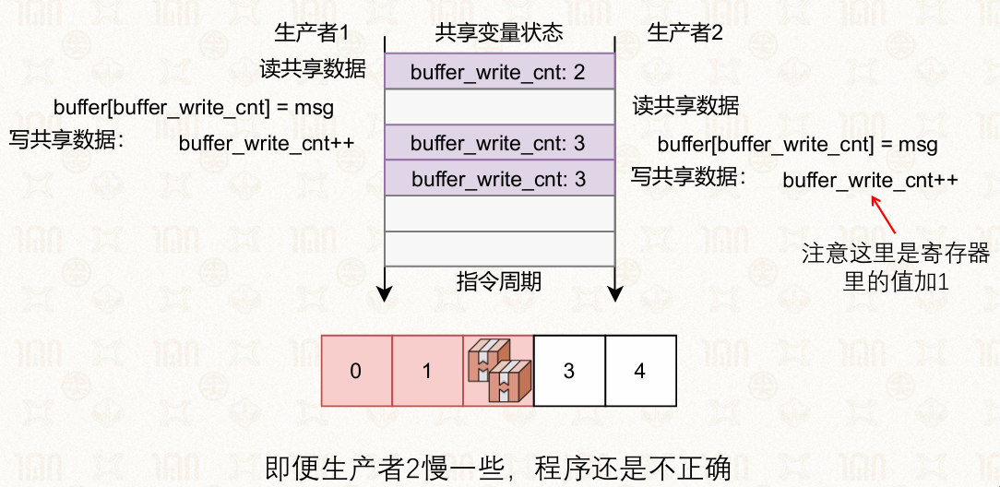

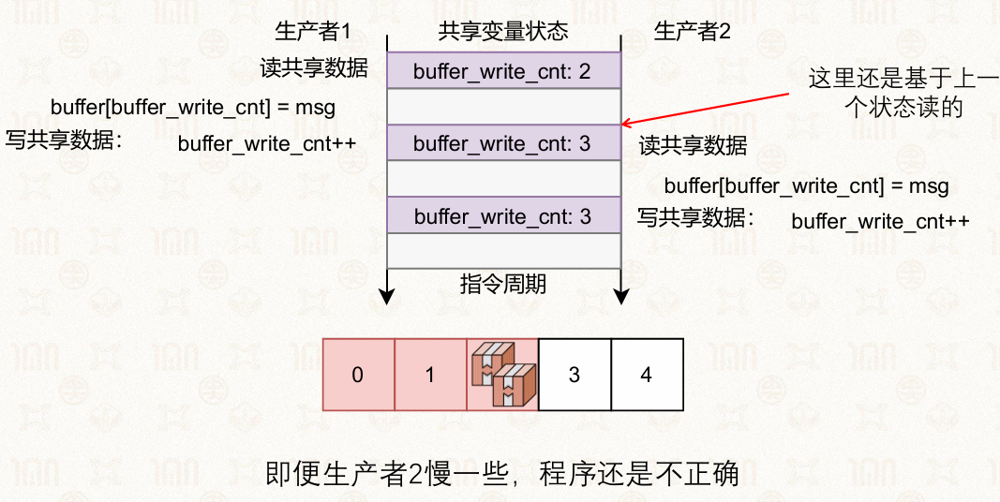

只有当两个生产者的操作完全串行执行时，结果才正确

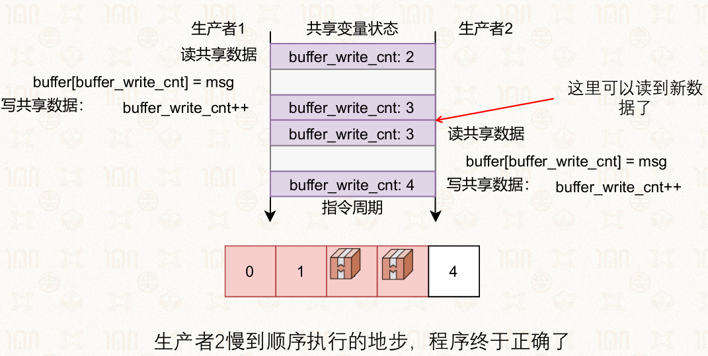

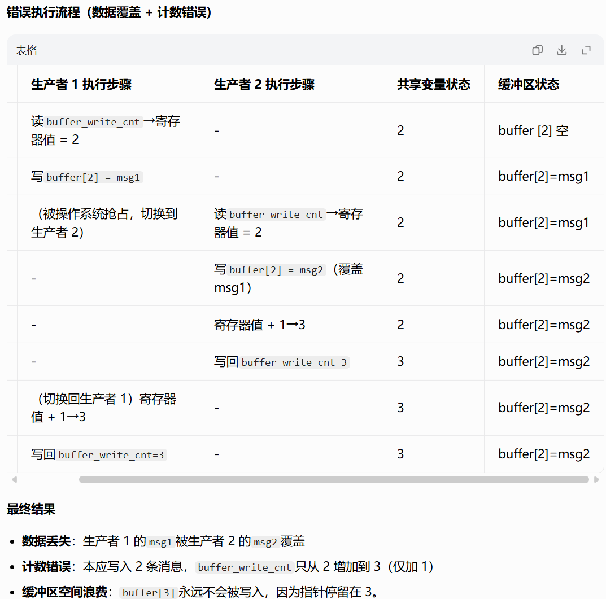

#### 竞争条件的定义

**竞争条件（Race Condition）**，又称竞争冒险、竞态条件，指当多个线程同时对共享数据进行操作时，共享数据的最终结果依赖于这些线程特定的执行顺序

执行顺序的不确定性会导致结果的不确定性，是同步问题的根源。

### 9.1.3 临界区问题

#### 定义

是解决竞争条件的核心抽象，指多个进程/线程访问共享资源的代码片段，必须保证同一时刻最多只有一个进程/线程进入该片段执行

确保他们不会将新产生的数据放入到同一个缓冲区中，造成数据覆盖

#### 临界区的生活化类比

以考试时多人申请使用卫生间为例：

*   **申请进入临界区**：同学举手向老师申请使用卫生间
*   **临界区**：卫生间内部，同一时刻只能有一个人使用
*   **标示退出临界区**：同学使用完毕返回教室，告知老师卫生间已空闲
*   **老师的角色**：相当于操作系统的同步机制，负责裁决谁可以进入临界区


#### 解决临界区问题的三个核心要求

**互斥访问**：同一时刻，最多只有一个线程能够进入临界区。这是解决竞争条件的最基本要求

**空闲让进**：当没有线程在临界区中执行时，必须选择一个申请进入临界区的线程允许其进入，不能无限期拒绝

**有限等待**：当线程申请进入临界区时，必须在有限的时间内获得进入许可，不能出现永久饥饿的情况

#### 关闭硬件中断的解决方案

**基本原理**：在单核系统中，线程的切换依赖于时钟中断。如果在进入临界区前关闭所有硬件中断，操作系统就无法进行线程调度，从而保证临界区代码的原子性执行。

```
while (TRUE) {
    申请进入临界区
    关闭中断
    临界区部分
    标示退出临界区
    开启中断
    其它代码
}
```

**局限性**：

*   仅适用于单核系统，在多核系统中，关闭一个核心的中断无法阻止其他核心的线程同时进入临界区
*   长时间关闭中断会导致系统无法响应硬件事件，引发系统稳定性问题

## 9.2 互斥锁

### 9.2.0 基本概念

**互斥锁：**是解决临界区问题最基础、应用最广泛的同步原语

**核心目标：**是保证同一时刻最多只有一个线程进入临界区执行，从根本上消除竞争条件

### 9.2.1 皮特森算法

皮特森算法是经典的纯软件互斥算法，无需硬件原子操作支持，仅通过共享内存变量即可实现两个线程间的临界区互斥访问

#### 算法核心变量

*   **flag数组**：长度为2的布尔数组，`flag[i]`为`TRUE`表示线程`i`申请进入临界区。

*   **turn变量**：整型变量，取值为0或1，用于裁决同时申请临界区时哪个线程可以进入

    *   `turn=1`表示允许线程1进入
    *   `turn=0`表示允许线程0进入。

#### 算法实现代码

```
// 全局共享变量
volatile int flag[2] = {FALSE, FALSE};
volatile int turn = 0;

// 线程0执行逻辑
while (TRUE) {
    flag[0] = TRUE;
    turn = 1;
    while (flag[1] == TRUE && turn == 1);
    // 临界区部分
    flag[0] = FALSE;
    // 非临界区其它代码
}

// 线程1执行逻辑
while (TRUE) {
    flag[1] = TRUE;
    turn = 0;
    while (flag[0] == TRUE && turn == 0);
    // 临界区部分
    flag[1] = FALSE;
    // 非临界区其它代码
}
```

#### 算法正确性证明

##### **互斥访问保证**

算法通过"互相谦让"的逻辑避免两个线程同时进入临界区

*   当两个线程同时申请临界区时，`turn`变量最终只会取0或1中的一个值
*   其中一个线程的循环条件成立而等待，另一个线程进入临界区

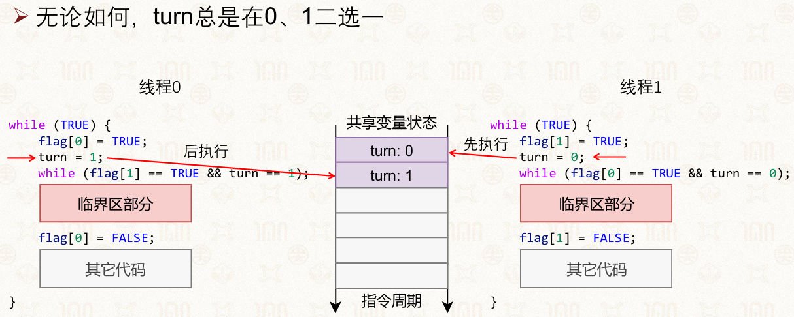

*0、1谁先都有可能*

##### **红线交叉问题排除**

不会出现两个线程都认为自己可以进入临界区的情况

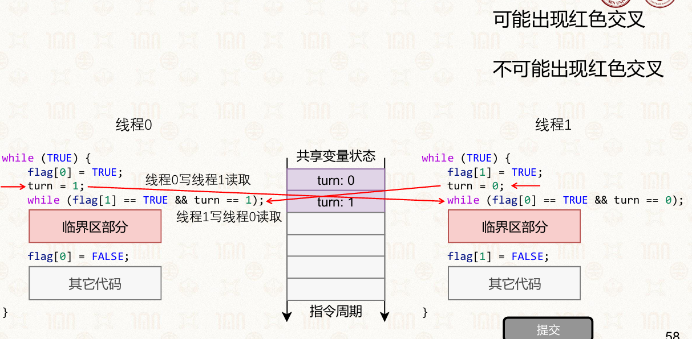

*   线程内部的读写顺序是严格的

    *   先设置自己的`flag`，再设置`turn`

    *   最后检查对方的`flag`和`turn`
        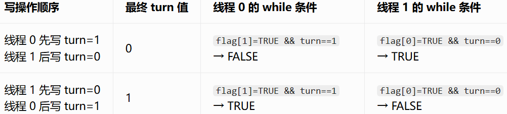

*   后设置`turn`的线程会覆盖先设置的`turn`值，导致先设置的线程进入等待状态

#### 优点：空闲让进与有限等待

flag与turn结合，实现了有限等待和空闲让进

*   当没有线程在临界区时，申请线程会立即进入
*   由于`turn`变量的裁决机制，不会出现某个线程永久等待的情况

#### 算法特点与局限性

*   原始算法仅适用于两个线程，后续有扩展版本可支持任意多线程
*   要求CPU严格按程序顺序执行读写操作，现代CPU的乱序执行机制会导致算法失效
*   依赖忙等机制，等待线程会持续占用CPU资源，调度开销较大

### 9.2.2 原子操作

#### 基本概念

纯软件互斥算法存在效率低、对CPU执行顺序敏感等缺陷

现代操作系统采用**软硬结合**的方式，通过硬件提供的原子操作实现高效同步。

#### 原子操作的定义

原子操作是不可被打断的一个或一系列操作

*   具有"全有或全无"的特性

    *   操作要么全部执行完成，要么完全不执行
    *   其他CPU核心无法看到操作的中间状态

#### 常见硬件原子操作

##### 比较与置换（Compare-And-Swap, CAS）

CAS是最常用的原子操作，由一条汇编指令完成，其逻辑等价于以下C代码（注意：C代码仅表示逻辑，本身不是原子操作）：

```
int CAS(int *addr, int expected, int new_value) {
    int tmp = *addr;
    if (*addr == expected) {
        *addr = new_value;
    }
    return tmp;
}
```

**加锁实现**：利用CAS可以实现简单的互斥锁：

```
volatile int lock = 0; // 0表示锁空闲，1表示锁已被占用
while (CAS(&lock, 0, 1) != 0); // 死循环忙等，直到获取锁
// 临界区代码
lock = 0; // 释放锁
```

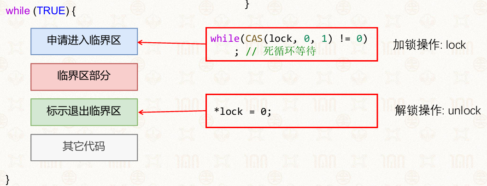

##### 拿取并累加（Fetch-And-Add, FAA）

FAA原子操作将指定内存地址的值加上一个增量，并返回操作前的原始值，其逻辑等价于：

```
int FAA(int *addr, int add_value) {
    int tmp = *addr;
    *addr = tmp + add_value;
    return tmp;
}
```

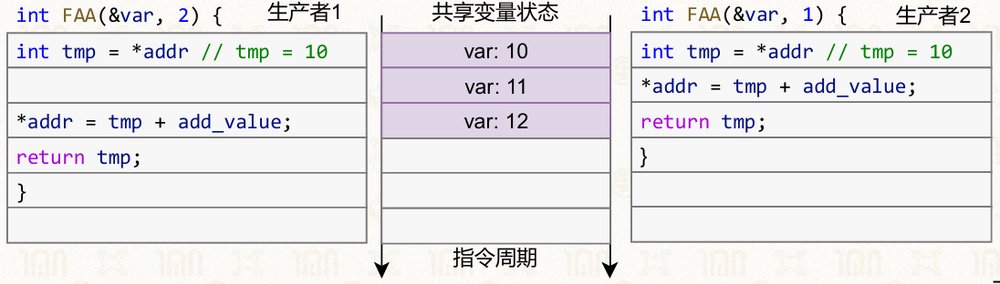

FAA常用于实现计数器、排号锁等需要顺序分配序号的场景

#### 原子操作的硬件实现

不同架构的CPU采用不同的硬件机制实现原子操作：

##### Intel x86架构：锁总线机制

*   系统中所有CPU核心通过共享总线访问内存，对任意内存地址的修改都需要经过总线。
*   当一个CPU执行原子操作时，会向总线发送`LOCK#`信号，独占总线使用权。
*   其他CPU在总线被锁定期间无法访问内存，从而保证原子操作的执行不会被打断

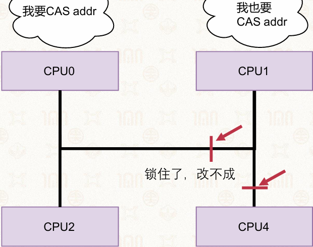

##### ARM架构：加载链接/存储条件（LL/SC）机制

ARM采用更高效的LL/SC机制实现原子操作，分为两步：

1.  **加载链接（LL）**：从指定内存地址加载数据，并启动该地址的监视器，监视该地址是否被其他CPU修改。
2.  **存储条件（SC）**：尝试将新值写入该内存地址。如果监视器检测到地址在LL和SC之间没有被修改，则写入成功；否则写入失败，需要重试。

ARM架构下CAS操作的汇编实现逻辑：

```
retry:
    ldxr x0, addr        // LL：加载addr的值到x0，启动地址监视器
    cmp x0, expected     // 比较加载值与预期值
    bne out              // 不相等则直接退出
    stxr x1, new_value, addr // SC：尝试写入新值
    cbnz x1, retry       // 写入失败则回到retry重试
out:
```

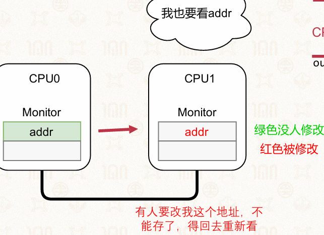

### 9.2.3 互斥锁抽象

为了简化同步编程，操作系统将底层的原子操作封装成统一的互斥锁抽象接口，开发者只需调用标准的`lock`和`unlock`函数，无需关心底层的硬件实现细节。

#### 互斥锁的标准接口

*   **lock\_init**：初始化互斥锁，设置锁的初始状态为空闲。
*   **lock**：申请获取互斥锁，如果锁已被占用则阻塞等待。
*   **unlock**：释放互斥锁，唤醒等待该锁的线程。

#### 互斥锁解决多生产者缓冲区问题

使用互斥锁保护共享的缓冲区指针，彻底解决多生产者场景下的数据覆盖和计数错误问题：

```
volatile int buffer_write_cnt = 0;
volatile int buffer_read_cnt = 0;
int buffer[5];
lock_t buffer_lock; // 全局互斥锁

void buffer_init(void) {
    lock_init(&buffer_lock);
}

void buffer_add_safe(int msg) {
    lock(&buffer_lock);       // 进入临界区前加锁
    buffer[buffer_write_cnt] = msg;   // 临界区操作
    buffer_write_cnt = (buffer_write_cnt + 1) % 5;// 临界区操作
    unlock(&buffer_lock);     // 退出临界区后解锁
}

int buffer_remove_safe(void) {
    lock(&buffer_lock);       // 进入临界区前加锁
    int ret = buffer[buffer_read_cnt];
    buffer_read_cnt = (buffer_read_cnt + 1) % 5;
    unlock(&buffer_lock);     // 退出临界区后解锁
    return ret;
}
```

### 9.2.4 自旋锁

#### 基本概念

自旋锁是最基础的互斥锁实现，基于CAS原子操作，等待线程会**持续循环**检查锁的状态，直到获取锁为止

#### 自旋锁的实现

```
// 自旋锁初始化
void lock_init(int *lock) {
    *lock = 0; // 0表示锁空闲，1表示锁已被占用
}

// 加锁操作
void lock(int *lock) {
    while (atomic_CAS(lock, 0, 1) != 0); // 死循环忙等，直到成功获取锁
}

// 解锁操作
void unlock(int *lock) {
    *lock = 0;
}
```

#### 自旋锁的优缺点

**优点**：

*   实现简单，无需操作系统内核干预。
*   响应速度快，锁空闲时可以立即获取。
*   适用于临界区执行时间极短的场景，避免线程上下文切换的开销。

**缺点**：

*   等待线程持续占用CPU资源，忙等会浪费CPU算力。
*   不保证公平性，线程获取锁的顺序是随机的，运气差的线程可能永久无法获取锁，出现饥饿现象。
*   不能保证有限等待，违反临界区问题的第三个核心要求。

### 9.2.5 排号自旋锁

#### 基本概念

排号自旋锁是为了解决普通自旋锁的公平性问题而提出的改进版本，采用"先到先得"的排队机制，保证所有线程都能在有限时间内获取锁。

#### 排号自旋锁的数据结构与实现

```
struct lock {
    volatile int owner; // 当前正在持有锁的线程的序号
    volatile int next;  // 下一个可分配的排队序号
};

// 初始化排号自旋锁
void lock_init(struct lock *lock) {
    lock->owner = 0;
    lock->next = 0;
}

// 加锁操作
void lock(struct lock *lock) {
    // 原子获取自己的排队序号
    volatile int my_ticket = atomic_FAA(&lock->next, 1);
    // 循环等待，直到叫到自己的序号
    while (lock->owner != my_ticket);
}

// 解锁操作
void unlock(struct lock *lock) {
    // 叫下一个序号的线程进入临界区
    lock->owner++;
}
```

#### 生活化类比：海底捞排队

排号自旋锁的逻辑与餐厅排队叫号完全一致：

*   **owner**：当前正在用餐的顾客的号数。
*   **next**：前台当前发放的最新号数。
*   **my\_ticket**：顾客拿到的排队号。
*   新顾客到达时，前台通过FAA原子操作分配一个唯一的号数。
*   顾客等待叫号，直到叫到自己的号数才能进入餐厅用餐。
*   顾客用餐完毕后，前台叫下一个号数的顾客进入。

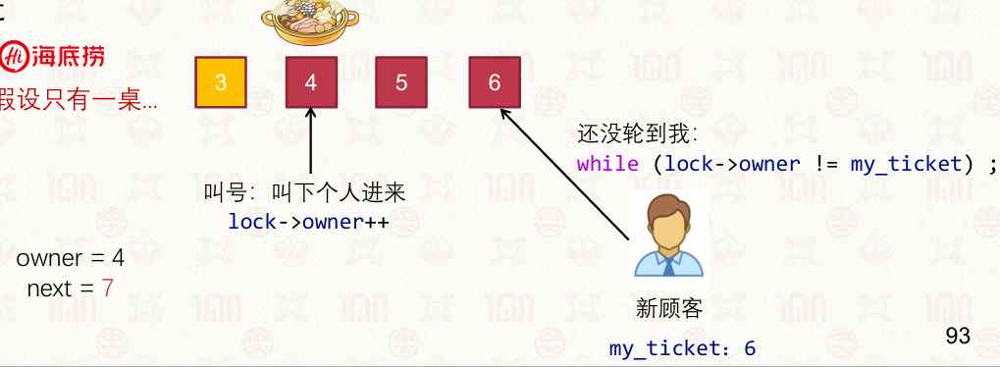

#### 核心要求满足情况

排号自旋锁完全满足临界区问题的三个核心要求：

1.  **互斥访问**：同一时刻只有一个线程的序号等于`owner`，保证只有一个线程进入临界区。
2.  **有限等待**：线程按照排队顺序获取锁，只要前序线程在有限时间内释放锁，后续线程必然能在有限时间内获取锁，不会出现饥饿。
3.  **空闲让进**：当锁空闲时（`owner`等于`next`），第一个申请锁的线程会立即获取锁

## 9.3 条件变量

### 9.3.1 条件变量的核心思想

#### 基本概念

通过线程状态切换机制解决忙等问题：当条件不满足时，线程主动进入阻塞态并让出CPU；当条件满足时，由其他线程唤醒阻塞的线程，使其继续执行。

#### 线程状态切换机制

条件变量的本质是实现线程在**运行态**与**阻塞态**之间的可控切换：

*   **cond\_wait()**：线程主动调用该接口，将自身从运行态转为阻塞态，加入条件变量的等待队列，同时释放持有的互斥锁。
*   **cond\_signal()**：由其他线程调用，当条件满足时，唤醒条件变量等待队列中的一个阻塞线程，使其从阻塞态转为就绪态，等待调度器调度。


**核心区别**

*   **最本质区别：**条件变量`signal`接口一定不是自己调用
*   互斥锁的`lock`和`unlock`在同一个线程内成对出现，而条件变量永远是"一个线程等待，另一个线程唤醒"
*   条件变量的`wait`和`signal`接口分属两个不同的线程

、

#### 线程执行时序示例

| 线程1（等待方）        | 线程2（唤醒方）          |
| --------------- | ----------------- |
| 正常运行            | 正常运行              |
| 调用`cond_wait()` | -                 |
| 进入阻塞态           | -                 |
| 阻塞中...          | 检测到条件满足           |
| 阻塞中...          | 调用`cond_signal()` |
| 被唤醒，进入就绪态       | 继续运行              |
| 重新获得互斥锁         | -                 |
| 继续执行临界区代码       | -                 |


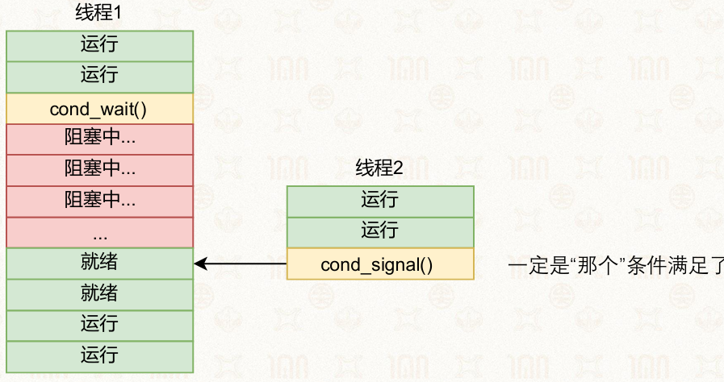

### 9.3.2 条件变量的标准接口

#### **cond\_wait(cond, mutex)**

**功能**：原子地释放互斥锁`mutex`，并将当前线程阻塞在条件变量`cond`的等待队列上。

**原子性保证**：释放锁和阻塞线程是不可分割的操作，避免出现"释放锁后、阻塞前"的窗口，导致唤醒信号丢失。

**唤醒后行为**：线程被唤醒后，会重新获取互斥锁`mutex`，然后从`cond_wait`调用处返回。

#### **cond\_signal(cond)**

**功能**：唤醒条件变量`cond`等待队列中的**一个**阻塞线程。

**特性**：如果等待队列为空，该调用不产生任何效果。

#### **cond\_broadcast(cond)**

**功能**：唤醒条件变量`cond`等待队列中的**所有**阻塞线程。

**适用场景**：当一个条件满足可以让多个线程继续执行时使用。

### 9.3.3 条件变量解决生产者消费者问题

使用条件变量重构生产者消费者模型，消除忙等带来的CPU资源浪费

```
// 共享变量定义
int empty_slot = 5;       // 空槽数量
int filled_slot = 0;      // 满槽数量
struct lock empty_cnt_lock;  // 保护empty_slot的互斥锁
struct lock filled_cnt_lock; // 保护filled_slot的互斥锁
struct cond empty_cond;   // 缓冲区非空条件
struct cond filled_cond;  // 缓冲区非满条件

// 生产者逻辑
void producer(void) {
    int new_msg;
    while (TRUE) {
        new_msg = produce_new();
        
        // 等待缓冲区非满
        lock(&empty_cnt_lock);
        while (empty_slot == 0) {
            cond_wait(&empty_cond, &empty_cnt_lock);
        }
        empty_slot--;
        unlock(&empty_cnt_lock);
        
        // 安全写入缓冲区
        buffer_add_safe(new_msg);
        
        // 通知消费者缓冲区有数据
        lock(&filled_cnt_lock);
        filled_slot++;
        cond_signal(&filled_cond);
        unlock(&filled_cnt_lock);
    }
}

// 消费者逻辑
void consumer(void) {
    int cur_msg;
    while (TRUE) {
        // 等待缓冲区非空
        lock(&filled_cnt_lock);
        while (filled_slot == 0) {
            cond_wait(&filled_cond, &filled_cnt_lock);
        }
        filled_slot--;
        unlock(&filled_cnt_lock);
        
        // 安全读取缓冲区
        cur_msg = buffer_remove_safe();
        
        // 通知生产者缓冲区有空位
        lock(&empty_cnt_lock);
        empty_slot++;
        cond_signal(&empty_cond);
        unlock(&empty_cnt_lock);
        
        consume_msg(cur_msg);
    }
}
```

#### 说明

**while循环检查条件**：`cond_wait`必须放在`while`循环中，而不是`if`语句中。这是为了防止虚假唤醒（线程被意外唤醒，但条件实际上并未满足）

**互斥锁保护共享变量**：对`empty_slot`和`filled_slot`的所有访问都必须在互斥锁的保护下进行，避免出现竞争条件

**条件与锁的绑定**：每个条件变量都与一个互斥锁绑定，`cond_wait`会自动处理锁的释放和重新获取

### 9.3.4 条件变量的底层实现

条件变量的核心是维护一个等待线程的链表，操作系统内核负责管理线程的阻塞与唤醒：

```
// 条件变量的底层数据结构
struct cond {
    struct thread *wait_list; // 阻塞线程的链表头
};
```

#### cond\_wait的实现逻辑

```
void cond_wait(struct cond *cond, struct lock *mutex) {
    // 1. 将当前线程加入等待队列
    list_append(cond->wait_list, thread_self());
    
    // 2. 原子地释放互斥锁并阻塞当前线程
    atomic_block_unlock(mutex);
    
    // 3. 被唤醒后，重新获取互斥锁
    lock(mutex);
}
```

#### cond\_signal的实现逻辑

```
void cond_signal(struct cond *cond) {
    // 如果等待队列非空，唤醒第一个等待线程
    if (!list_empty(cond->wait_list)) {
        wakeup(list_remove_head(cond->wait_list));
    }
}
```

#### cond\_broadcast的实现逻辑

```
void cond_broadcast(struct cond *cond) {
    // 唤醒等待队列中的所有线程
    while (!list_empty(cond->wait_list)) {
        wakeup(list_remove_head(cond->wait_list));
    }
}
```

**内核支持**：`wakeup`是操作系统内核提供的系统调用，负责将指定线程从阻塞态转为就绪态，加入系统的就绪队列等待调度。

### 9.3.5 条件变量的局限性

条件变量虽然解决了忙等问题，但存在设计上的缺陷：

*   **条件与变量分离**：条件变量本身只是一个"记号"，不包含任何条件逻辑。程序员需要在代码中显式维护条件变量与实际条件（如`empty_slot == 0`）的对应关系。
*   **可读性差**：从条件变量的定义无法直接看出它对应的条件是什么，新开发者容易搞错对应关系。
*   **易出错**：如果不小心将`cond_signal`发送到错误的条件变量，会导致等待线程永远无法被唤醒，引发死锁。

这些局限性推动了更高级同步原语——信号量的出现。

### 9.3.6 条件变量与互斥锁的对比

| 对比维度   | 互斥锁                 | 条件变量                          |
| ------ | ------------------- | ----------------------------- |
| 解决的问题  | 保证临界区的互斥访问          | 解决线程等待条件时的忙等问题                |
| 核心接口   | `lock()`、`unlock()` | `cond_wait()`、`cond_signal()` |
| 接口调用关系 | 同一线程内成对调用           | 不同线程间配合调用                     |
| 线程状态   | 不改变线程状态（自旋锁忙等）      | 实现运行态与阻塞态的切换                  |
| 依赖关系   | 可独立使用               | 必须与互斥锁配合使用                    |


## 9.4 信号量

### 9.4.1 信号量的核心思想

#### 设计动机

**条件变量的问题**：条件与变量分离

*   条件变量本身不包含任何逻辑
*   程序员需要手动维护条件变量与实际条件的对应关系
*   容易出错且可读性差

**解决**

信号量通过将资源计数与同步机制绑定，实现了"条件即变量"的设计理念。

#### 核心概念

信号量是一个非负整数变量，代表系统中可用共享资源的数量：

*   **正值**：表示当前可用的资源数量
*   **负值**：绝对值表示正在等待该资源的线程数量

#### 适用场景

*   信号量：适用于多个线程访问有限数量共享资源的场景
*   互斥锁：主要面向两个线程的互斥访问场景。

### 9.4.2 PV原语

信号量通过两个不可分割的原子操作（PV原语）实现所有功能，这两个操作由操作系统内核保证原子性。

#### P操作（wait）

P是荷兰语"Proberen"（检验）的缩写，用于申请资源：

1.  将信号量的值减1
2.  如果减1后的值≥0，表示有可用资源，线程继续执行
3.  如果减1后的值<0，表示没有可用资源，线程进入阻塞态，加入该信号量的等待队列

**原始逻辑（仅示意，实际实现无忙等）**：

```
void wait(int *S) {
    while (*S <= 0); // 循环忙等（实际实现会替换为阻塞）
    *S = *S - 1;
}
```

#### V操作（signal）

V是荷兰语"Verhogen"（自增）的缩写，用于释放资源：

1.  将信号量的值加1
2.  如果加1后的值≤0，表示有线程正在等待该资源，唤醒等待队列中的一个线程
3.  如果加1后的值>0，表示没有等待线程，直接返回

**原始逻辑（仅示意）**：

```
void signal(int *S) {
    *S = *S + 1;
}
```

### 9.4.3 信号量解决生产者消费者问题

使用信号量重构生产者消费者模型，代码变得极其简洁，无需手动维护条件判断和互斥锁的复杂配合：

```
// 信号量定义
sem_t empty_slot;  // 空槽资源，初值为5（缓冲区容量）
sem_t filled_slot; // 满槽资源，初值为0

// 生产者逻辑
void producer(void) {
    int new_msg;
    while (TRUE) {
        new_msg = produce_new();
        wait(&empty_slot);  // P操作：申请一个空槽
        buffer_add_safe(new_msg);
        signal(&filled_slot); // V操作：释放一个满槽
    }
}

// 消费者逻辑
void consumer(void) {
    int cur_msg;
    while (TRUE) {
        wait(&filled_slot); // P操作：申请一个满槽
        cur_msg = buffer_remove_safe();
        signal(&empty_slot);  // V操作：释放一个空槽
        consume_msg(cur_msg);
    }
}
```

**代码简化分析**：

*   信号量`empty_slot`同时承担了"空槽计数"和"缓冲区非满条件"的功能
*   信号量`filled_slot`同时承担了"满槽计数"和"缓冲区非空条件"的功能
*   无需额外的互斥锁保护计数器，PV原语的原子性保证了操作的正确性
*   彻底消除了条件变量版本中繁琐的条件检查和锁操作

### 9.4.4 信号量的底层实现

实际操作系统中的信号量基于**互斥锁+条件变量**实现，避免了原始PV原语中的忙等问题，同时解决了虚假唤醒和唤醒过多线程的问题。

#### 信号量的数据结构

```
struct sem {
    int value;          // 资源计数：正=可用资源数，负=等待线程数
    int wakeup;         // 应当唤醒的线程数量（用于匹配V操作的资源释放）
    struct lock sem_lock;   // 保护信号量内部状态的互斥锁
    struct cond sem_cond;   // 用于阻塞等待线程的条件变量
};
```

**wakeup变量的作用**：

*   当多个线程等待信号量时，一次V操作只能释放一个资源，因此只能唤醒一个线程

*   `wakeup `变量用于记录已经释放但尚未被线程获取的资源数量，确保唤醒的线程数与可用资源数严格匹配

    *   例如：5个线程在等待，执行2次V操作释放2个资源，只能唤醒2个线程，剩余3个线程继续等待。

#### P操作（wait）的实现

```
void wait(struct sem *S) {
    lock(&S->sem_lock);
    S->value--; // 先申请资源
    
    // 如果没有可用资源，进入等待
    if (S->value < 0) {
        do {
            // 等待直到有可用资源被释放
            while (S->wakeup == 0) {
                cond_wait(&S->sem_cond, &S->sem_lock);
            }
            S->wakeup--; // 获取一个可用资源
        } while (0);
    }
    
    unlock(&S->sem_lock);
}
```

#### V操作（signal）的实现

```
void signal(struct sem *S) {
    lock(&S->sem_lock);
    S->value++; // 释放一个资源
    
    // 如果有线程在等待，记录一个可唤醒名额
    if (S->value <= 0) {
        S->wakeup++;
        cond_signal(&S->sem_cond); // 唤醒一个等待线程
    }
    
    unlock(&S->sem_lock);
}
```

### 9.4.5 信号量的分类与应用场景

信号量根据初始值的不同，可分为两类：

#### 二元信号量（互斥信号量）

*   初始值为1
*   同一时刻最多只有一个线程能获取信号量
*   功能等价于互斥锁，用于实现临界区的互斥访问

**示例**：

```
sem_t mutex;
sem_init(&mutex, 1); // 初始值为1

// 临界区保护
wait(&mutex);
// 临界区代码
signal(&mutex);
```

#### 计数信号量

*   初始值为N（N>1）
*   最多允许N个线程同时访问共享资源
*   用于实现资源池、连接池、缓冲区等有限资源的访问控制

**典型应用**：

*   生产者消费者模型中的缓冲区计数
*   数据库连接池的连接管理
*   线程池的任务队列计数

## 9.5 读写锁

### 9.5.1 公告栏问题（读写锁引入）

读写锁的设计灵感来源于生活中的公告栏场景：

*   **写者**：负责更新或撤走公告栏内容的工作人员。
*   **读者**：查看公告栏内容的学生。

**核心问题**：

1.  多个读者同时查看公告栏是否需要互斥？

    *   不需要。多个读者可以同时阅读同一公告栏内容，互不干扰。

2.  如何避免读者看到一半时公告栏被写者撤走？

    *   必须保证读者与写者之间互斥：当有读者在阅读时，写者不能修改或撤走公告栏；当有写者在修改时，读者不能进入阅读。

3.  多个写者同时修改公告栏是否需要互斥？

    *   需要。多个写者同时修改会导致内容混乱，必须保证写者之间互斥。

互斥锁会强制所有读者和写者都互斥，导致同一时刻只能有一个人查看公告栏，效率极低。读写锁正是为了解决这个问题而提出的。

### 9.5.2 读写锁的核心思想

#### 概念（原因）

互斥锁的设计对于<u>读多写少</u>的场景过于严厉，因为多个线程同时读取共享数据不会引发竞争条件，强制互斥会严重降低系统的并行性

**读写锁**（Reader-Writer Lock）：为优化读多写少场景而设计的同步原语

*   它区分读者和写者两种角色

    *   允许读者之间并行访问

*   仅在读者与写者、写者与写者之间保持互斥。

#### 规则

*   **读者-读者并行**：多个读者可以同时进入临界区读取共享数据。
*   **读者-写者互斥**：当有读者在临界区时，写者不能进入；当有写者在临界区时，读者不能进入。
*   **写者-写者互斥**：同一时刻最多只能有一个写者进入临界区修改共享数据

### 9.5.3 读写锁的偏向性

#### 原因\问题

读写锁存在一个关键的设计权衡：当有读者正在临界区执行，同时有写者在等待时，新到达的读者能否直接进入临界区？根据这个问题的不同回答，读写锁分为两种类型：

#### 偏向读者的读写锁（并行好）

*   **规则**：只要有读者在临界区，新到达的读者可以直接进入，无需等待写者。
*   **优点**：读者并行度高，读操作性能好。
*   **缺点**：写者可能会被源源不断的新读者无限期阻塞，出现**写者饥饿**现象。

#### 偏向写者的读写锁（更公平）

*   **规则**：一旦有写者开始等待，后续所有新到达的读者都必须等待写者完成后才能进入。
*   **优点**：公平性好，写者不会出现饥饿，保证写操作的响应时间。
*   **缺点**：读者并行度稍低，读操作性能略差于偏向读者的实现。

### 9.4.6 信号量与条件变量的对比

| 对比维度  | 条件变量             | 信号量           |
| ----- | ---------------- | ------------- |
| 设计理念  | 条件与变量分离          | 条件与变量统一封装     |
| 核心功能  | 解决线程等待条件时的忙等问题   | 同时解决互斥和同步问题   |
| 代码复杂度 | 较高，需要手动维护条件和锁    | 较低，接口简洁，逻辑清晰  |
| 灵活性   | 高，可实现任意复杂的条件判断   | 中等，适用于资源计数类场景 |
| 错误率   | 高，容易搞错条件与变量的对应关系 | 低，封装性好，减少人为错误 |
| 底层依赖  | 依赖互斥锁            | 依赖互斥锁+条件变量    |


### 9.5.4 偏向读者的读写锁实现

偏向读者的读写锁通过一个读者计数器和两个互斥锁实现，核心逻辑是：第一个进入的读者加写锁阻塞写者，最后一个离开的读者释放写锁允许写者进入。

#### 数据结构定义

```
struct rwlock {
    int reader_cnt;          // 当前在临界区的读者数量
    struct lock reader_lock; // 保护reader_cnt的互斥锁
    struct lock writer_lock; // 实现读者与写者、写者与写者互斥的锁
};
```

#### 读者锁操作

```
void lock_reader(struct rwlock *lock) {
    lock(&lock->reader_lock);    // 保护读者计数器
    lock->reader_cnt++;
    
    // 第一个读者：加写锁，阻塞所有写者
    if (lock->reader_cnt == 1) {
        lock(&lock->writer_lock);
    }
    
    unlock(&lock->reader_lock);  // 释放计数器锁
}

void unlock_reader(struct rwlock *lock) {
    lock(&lock->reader_lock);    // 保护读者计数器
    lock->reader_cnt--;
    
    // 最后一个读者：释放写锁，允许写者进入
    if (lock->reader_cnt == 0) {
        unlock(&lock->writer_lock);
    }
    
    unlock(&lock->reader_lock);  // 释放计数器锁
}
```

#### 写者锁操作

```
void lock_writer(struct rwlock *lock) {
    lock(&lock->writer_lock); // 直接加写锁，阻塞所有读者和其他写者
}

void unlock_writer(struct rwlock *lock) {
    unlock(&lock->writer_lock); // 释放写锁
}
```

#### 执行流程详解

1.  **第一个读者进入**：

    *   加`reader_lock`，将`reader_cnt`从0增加到1。
    *   加`writer_lock`，阻塞所有后续写者。
    *   释放`reader_lock`，进入临界区读取数据。

2.  **后续读者进入**：

    *   加`reader_lock`，将`reader_cnt`加1（大于1）。
    *   无需加`writer_lock`，直接释放`reader_lock`，进入临界区。

3.  **写者尝试进入**：

    *   尝试加`writer_lock`，由于已被读者持有，阻塞等待。

4.  **读者离开**：

    *   加`reader_lock`，将`reader_cnt`减1。
    *   如果不是最后一个读者，直接释放`reader_lock`。
    *   如果是最后一个读者，释放`writer_lock`，唤醒等待的写者。

5.  **写者进入**：

    *   获取`writer_lock`，进入临界区修改数据。
    *   此时所有新到达的读者都会在加`writer_lock`时阻塞。

6.  **写者离开**：

    *   释放`writer_lock`，唤醒所有等待的读者和写者


### 9.5.5 偏向写者的读写锁实现

偏向写者的读写锁通过增加一个`has_writer`标志位实现，当有写者等待时，新读者会被阻塞，保证写者优先执行。

#### 数据结构定义

```
struct rwlock {
    volatile int reader_cnt;     // 当前在临界区的读者数量
    volatile bool has_writer;    // 是否有写者正在等待或执行
    struct lock lock;            // 保护内部状态的互斥锁
    struct cond reader_cond;     // 读者等待的条件变量
    struct cond writer_cond;     // 写者等待的条件变量
};
```

#### 读者锁操作

```
void lock_reader(struct rwlock *rwlock) {
    lock(&rwlock->lock);
    
    // 如果有写者正在等待或执行，阻塞等待
    while (rwlock->has_writer == TRUE) {
        cond_wait(&rwlock->writer_cond, &rwlock->lock);
    }
    
    rwlock->reader_cnt++; // 增加读者计数
    unlock(&rwlock->lock);
}

void unlock_reader(struct rwlock *rwlock) {
    lock(&rwlock->lock);
    rwlock->reader_cnt--;
    
    // 最后一个读者离开，唤醒等待的写者
    if (rwlock->reader_cnt == 0) {
        cond_signal(&rwlock->reader_cond);
    }
    
    unlock(&rwlock->lock);
}
```

#### 写者锁操作

```
void lock_writer(struct rwlock *rwlock) {
    lock(&rwlock->lock);
    
    // 如果已有写者在执行或等待，阻塞等待
    while (rwlock->has_writer == TRUE) {
        cond_wait(&rwlock->writer_cond, &rwlock->lock);
    }
    
    rwlock->has_writer = TRUE; // 标记有写者正在执行
    
    // 等待所有已进入的读者离开
    while (rwlock->reader_cnt > 0) {
        cond_wait(&rwlock->reader_cond, &rwlock->lock);
    }
    
    unlock(&rwlock->lock);
}

void unlock_writer(struct rwlock *rwlock) {
    lock(&rwlock->lock);
    rwlock->has_writer = FALSE; // 清除写者标记
    
    // 唤醒所有等待的读者和写者
    cond_broadcast(&rwlock->writer_cond);
    unlock(&rwlock->lock);
}
```

#### 偏向性体现

偏向写者的核心逻辑在`lock_reader`函数中：**只要**`has_writer`为TRUE，所有新到达的读者都会被阻塞

*   这保证了一旦有写者开始等待，后续读者无法继续进入
*   写者只需等待已在临界区的读者离开即可执行，不会出现写者饥饿

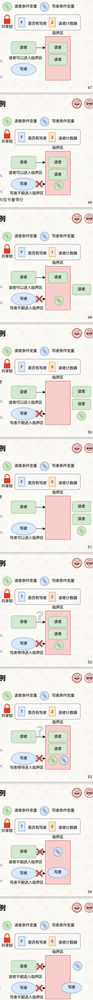

### 9.5.6 不同偏向的读写锁的适用场景与对比

| 读写锁类型 | 核心规则          | 优点          | 缺点      | 适用场景                               |
| ----- | ------------- | ----------- | ------- | ---------------------------------- |
| 偏向读者  | 有读者时新读者可直接进入  | 读者并行度高，读性能好 | 写者可能饥饿  | 读操作极多、写操作极少且允许写延迟的场景（如配置文件读取、缓存查询） |
| 偏向写者  | 有写者等待时新读者必须阻塞 | 公平性好，写者无饥饿  | 读者并行度稍低 | 读写频率相当、或写操作响应时间要求高的场景（如数据库读写、日志系统） |


## 9.6 RCU锁

### 9.6.1 RCU锁的核心思想

#### 设计背景

读写锁虽然实现了读者之间的并行，但读者仍然需要执行加锁和解锁操作，这些操作涉及原子指令和缓存一致性协议，在大规模多核系统中会产生显著的性能开销

RCU 消除了读者端的同步开销

*   将所有同步代价转移到写者端
*   适用于读操作占比99%以上的场景。

#### 基本概念

RCU（Read-Copy-Update，读-复制-更新）是一种专门为*极端读多写少*场景优化的高性能同步原语

*   与读写锁相比，RCU实现了读者完全无锁，读操作几乎零开销，同时保证写操作的正确性

*   **RCU的核心思想**

    *   读者直接读取共享数据，无需加锁
    *   写者通过"复制修改+原子发布"的方式更新数据，等待所有旧读者退出临界区后再安全释放旧版本数据

#### 核心设计理念

RCU 将数据更新过程拆分为三个独立的阶段，通过"*新旧版本共存*"的方式实现读者无锁：

1.  **Read（读）**：读者无锁直接读取共享指针，访问当前版本的数据。
2.  **Copy（复制）**：写者拷贝旧版本数据，在副本上进行修改，不影响正在访问旧版本的读者。
3.  **Update（更新）**：写者原子地将共享指针指向修改后的新版本，然后等待一个"宽限期"，确保所有访问旧版本的读者都已退出临界区，最后安全释放旧版本数据

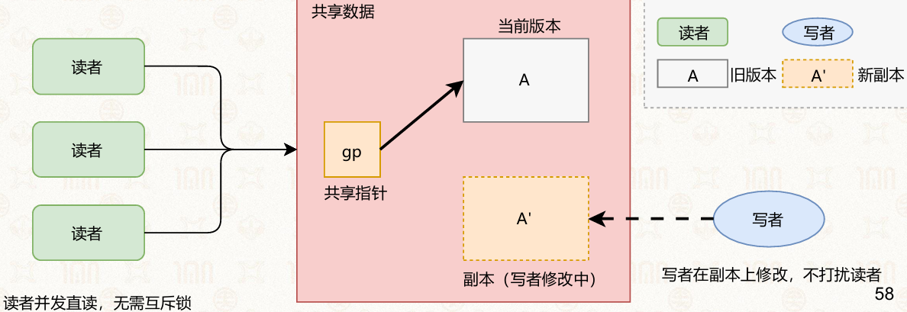

### 9.6.2 RCU锁的三个核心阶段

#### 阶段1：读者无锁读取

读者通过共享指针访问数据，整个过程不需要加任何锁：

*   读者看到的要么是完整的旧版本数据，要么是完整的新版本数据，不会看到中间状态。
*   写者在副本上的修改对读者完全透明，不会干扰读者的读取操作。

#### 阶段2：写者复制修改

当需要更新数据时，写者不会直接修改原数据，而是：

1.  分配一块新的内存空间。
2.  将旧版本数据完整复制到新内存中。
3.  在副本上进行所需的修改操作。

这个过程中，所有读者仍然正常访问旧版本数据，不会受到任何影响。

#### 阶段3：原子发布与旧版本回收

写者完成副本修改后，执行以下操作：

1.  **原子发布**：通过原子指针赋值操作，将共享指针从旧版本指向新版本。这个操作是原子的，保证读者要么看到旧指针，要么看到新指针，不会出现指针撕裂。
2.  **等待宽限期**：调用`synchronize_rcu()`阻塞，等待所有在发布新指针之前进入临界区的旧读者全部退出。
3.  **安全释放**：宽限期结束后，旧版本数据上不可能再有任何读者，写者可以安全地释放旧版本占用的内存

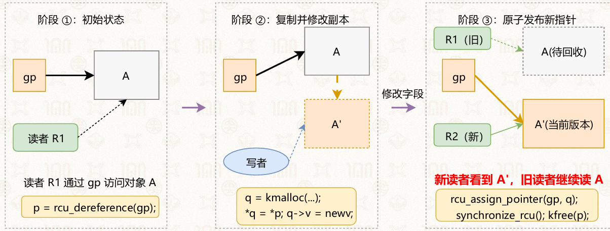

### 9.6.3 宽限期（Grace Period）

#### 概念

宽限期是RCU最核心、最独特的概念，它是写者发布新指针后，等待所有旧读者退出临界区的时间段

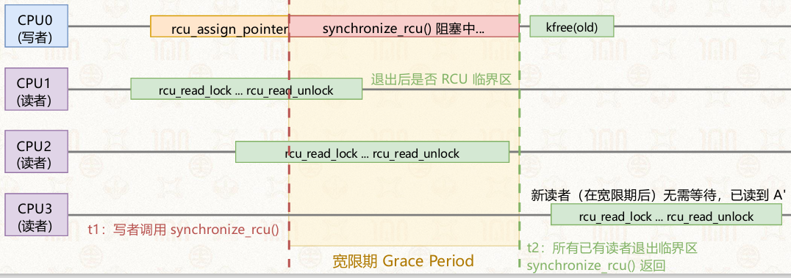

#### 宽限期的必要性

写者发布新指针后，新的读者会直接访问新版本数据，但可能还有一些读者在发布新指针之前就已经进入临界区，正在访问旧版本数据。

如果写者立即释放旧版本数据，这些旧读者会访问已释放的内存，导致系统崩溃。

#### 宽限期的时间线示例

| 时间点 | CPU0（写者）                | CPU1（读者）  | CPU2（读者）  | CPU3（读者）         |
| --- | ----------------------- | --------- | --------- | ---------------- |
| t0  | -                       | 进入RCU读临界区 | -         | -                |
| t1  | 原子发布新指针                 | 访问旧版本数据   | 进入RCU读临界区 | -                |
| t2  | 调用`synchronize_rcu()`阻塞 | 访问旧版本数据   | 访问旧版本数据   | 进入RCU读临界区（访问新版本） |
| t3  | 阻塞中                     | 退出临界区     | 访问旧版本数据   | 退出临界区            |
| t4  | 阻塞中                     | -         | 退出临界区     | -                |
| t5  | 宽限期结束，唤醒写者              | -         | -         | -                |
| t6  | 释放旧版本数据                 | -         | -         | -                |


**关键说明**：

*   宽限期内，CPU1/CPU2 上的旧读者继续访问A，写者必须等待它们全部退出
*   CPU3在t1之后才进入临界区，它看到的是新版本数据，不会访问旧版本，因此不需要等待它退出。
*   宽限期只需要等待所有在t1之前进入临界区的读者（CPU1和CPU2）退出即可。
*   宽限期结束后，旧版本数据上不可能再有任何读者，可以安全释放。

### 9.6.4 RCU 锁的读者使用方法

#### 特点

*   **几乎零开销**：读端只是关/开抢占，没有原子操作
*   **无饥饿**：写者不会阻塞读者，读者也永远不会被写者强制等待
*   **强约束**：读临界区内严禁睡眠/调度，否则可能让宽限期被无限拉长
*   **内存序**：必须用`rcu_dereference`，否则编译器/CPU 重排会破坏写者的发布次序

#### 核心接口

```
// 进入RCU读临界区
void rcu_read_lock(void);

// 退出RCU读临界区
void rcu_read_unlock(void);

// 安全读取共享指针
#define rcu_dereference(p) ...

// 原子发布新指针
#define rcu_assign_pointer(p, v) ...
```

#### 读者代码示例

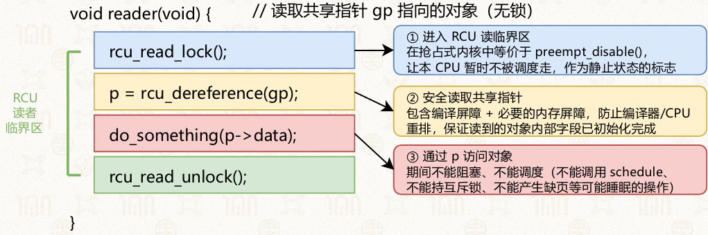

#### 读者的强约束

RCU读临界区有极其严格的限制，违反任何一条都会导致系统崩溃：

*   **严禁睡眠或调度**：不能调用`schedule()`、`msleep()`等可能导致线程切换的函数。
*   **严禁持有互斥锁**：互斥锁可能导致睡眠，拉长宽限期。
*   **严禁产生缺页异常**：缺页异常会触发内核调度，导致宽限期无限延长。
*   **临界区尽可能短**：长临界区会导致宽限期变长，增加内存占用和写者延迟。

### 9.6.5 RCU锁的写者使用方法

写者需要处理复制、发布和回收三个步骤，多个写者之间需要通过自旋锁保证互斥。

#### 写者代码示例（替换链表节点）

```
void replace_node(struct node *prev, struct node *old, int newv) {
    // ① 加自旋锁：保证多个写者之间互斥
    spin_lock(&list_lock);
    
    // ② 分配新节点内存
    struct node *new = kmalloc(sizeof(*new), GFP_KERNEL);
    
    // ③ 复制旧节点的全部内容到新节点
    *new = *old;
    
    // ④ 在副本上修改数据
    new->v = newv;
    
    // ⑤ 原子发布新指针：将prev->next指向新节点
    // 靠指针赋值的原子性保证读者看到完整的对象状态
    rcu_assign_pointer(prev->next, new);
    
    // ⑥ 释放自旋锁：允许其他写者进入
    spin_unlock(&list_lock);
    
    // ⑦ 等待宽限期：确保所有旧读者退出临界区
    synchronize_rcu();
    
    // ⑧ 安全释放旧节点
    kfree(old);
}
```

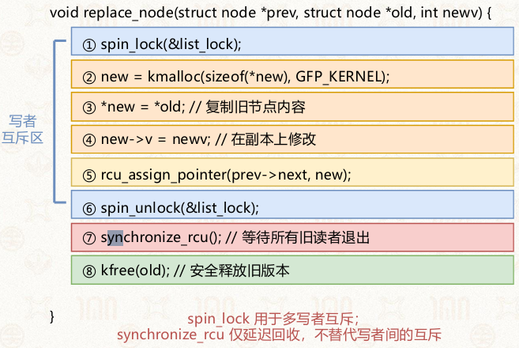

#### 关键说明

*   **自旋锁的作用**：仅用于保证多个写者之间的互斥，不影响读者。多个写者同时修改时，自旋锁保证同一时刻只有一个写者在修改。

*   `synchronize_rcu()`的作用：仅用于延迟旧版本的回收，不替代写者之间的互斥。

*   **链表状态变化**：

    1.  发布前：`prev -> old -> next`

    2.  发布后：`prev -> new -> next`，`old`仍然存在，旧读者可以继续访问

    3.  宽限期结束后：`old`被释放，只有`prev -> new -> next`
        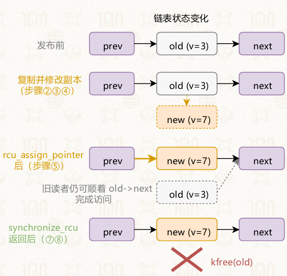

### 9.6.6 RCU锁的优缺点

#### 优点

1.  **读者几乎零开销**：读端仅需关/开抢占，没有原子操作、没有缓存一致性开销，性能远超读写锁。
2.  **无饥饿**：写者永远不会阻塞读者，读者也永远不会被写者强制等待。
3.  **高并行性**：支持任意数量的读者同时访问，性能随核心数线性增长。
4.  **死锁免疫**：读者不需要加锁，不会出现读者与写者之间的死锁。

#### 缺点

1.  **写者开销大**：写者需要复制数据、等待宽限期，内存占用和延迟都较高。
2.  **内存回收延迟**：旧版本数据需要等到宽限期结束才能释放，会占用额外的内存。
3.  **使用约束严格**：读者临界区有严格限制，使用不当容易导致系统崩溃。
4.  **适用场景有限**：仅适用于读多写少的场景，写操作频繁时性能会急剧下降。

### 9.6.7 RCU锁与读写锁的对比

| 对比维度  | 读写锁            | RCU锁               |
| ----- | -------------- | ------------------ |
| 读者开销  | 低（加解锁）         | 极低（仅关开抢占）          |
| 写者开销  | 中              | 高（复制+等待宽限期）        |
| 读者并行度 | 高              | 极高（无限制）            |
| 写者饥饿  | 偏向读者实现可能出现     | 不会出现               |
| 使用约束  | 较少             | 极严格                |
| 适用场景  | 读多写少（读占比90%以下） | 极端读多写少（读占比99%以上）   |
| 典型应用  | 数据库读写、缓存更新     | 内核路由表、文件系统缓存、网络协议栈 |


## 9.7 同步原语产生的问题

导致系统卡死、性能下降甚至崩溃

### 9.7.1 死锁

死锁是同步原语最严重的问题，指两个或多个线程/进程互相等待对方持有的资源，导致所有线程都无法继续执行，永久阻塞的状态。

#### 经典死锁示例

##### 哲学家就餐问题

*   **场景**：5位哲学家围坐在圆桌旁，每人面前有一份食物，左右手边各放着一支筷子。哲学家只能思考或进食，进食必须同时拿到左右两支筷子。
*   **死锁触发**：当所有哲学家同时感到饥饿，都先拿起了左手边的筷子，此时每个人都在等待右手边的哲学家放下筷子，形成循环等待，所有人都无法进食

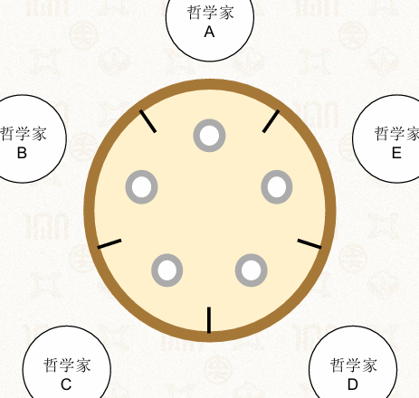

##### 十字路口死锁

*   **场景**：四个方向的车辆同时到达十字路口，每个方向的车辆都想直行通过路口。
*   **死锁触发**：每辆车都占据了自己所在方向的路口资源，同时等待其他方向的车辆让出资源，形成循环等待，所有车辆都无法前进


##### 代码死锁示例

两个线程以相反的顺序申请两把互斥锁：

```
void proc_A(void) {
    lock(A);       // 先申请锁A
    lock(B);       // 再申请锁B
    // 临界区代码
    unlock(B);
    unlock(A);
}

void proc_B(void) {
    lock(B);       // 先申请锁B
    lock(A);       // 再申请锁A
    // 临界区代码
    unlock(A);
    unlock(B);
}
```

*   **死锁触发**：T1时刻，proc\_A成功获取锁A，proc\_B成功获取锁B；随后proc\_A等待锁B，proc\_B等待锁A，两个线程永久阻塞。

#### 死锁产生的四个必要条件

死锁的产生必须同时满足以下四个条件，破坏其中任意一个即可避免死锁：

1.  **互斥访问**：资源同一时刻只能被一个线程持有。
2.  **持有并等待**：线程已经持有至少一个资源，同时又申请其他线程持有的资源。
3.  **资源非抢占**：资源只能由持有者主动释放，不能被其他线程强行抢占。
4.  **循环等待**：存在一个线程-资源的循环链，每个线程都在等待下一个线程持有的资源。

#### 死锁的解决策略

##### 死锁的检测与恢复（**出问题再处理**）

**核心思想**：允许系统进入死锁状态，定期检测死锁是否发生，一旦检测到死锁，采取措施打破死锁。

**检测方法**：通过**资源分配图**检测死锁

*   如果资源分配图中存在环，则说明发生了死锁

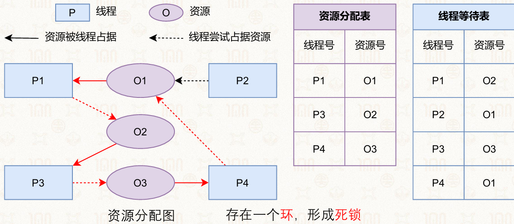

**恢复方法**：

*   终止所有死锁线程：最简单但代价最高的方法。
*   逐个终止死锁线程：每次终止一个线程，直到环被打破。
*   回滚：将死锁线程回滚到之前的某个安全状态，重新执行。

##### 死锁预防（**设计时避免）**

**核心思想**：在系统设计阶段，破坏死锁产生的四个必要条件之一，从根本上杜绝死锁的发生。

**具体方法**

*   **破坏的必要条件**：避免互斥访问

    *   **实现方法**：代理执行（TCLocks）

    *   **说明**：将临界区代码交给专门的代理线程执行，其他线程通过发送请求的方式访问临界区，无需直接加锁

        *   TCLocks实现了透明代理，用户无需修改代码即可使用
            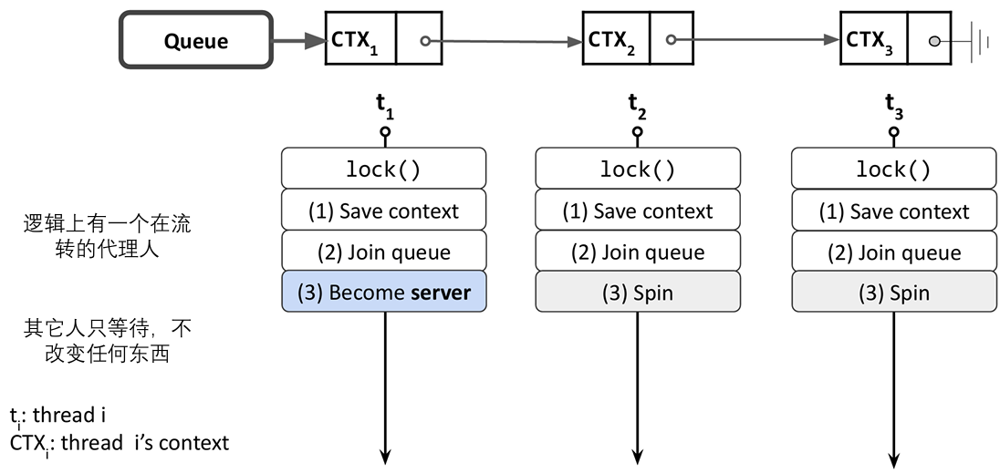
            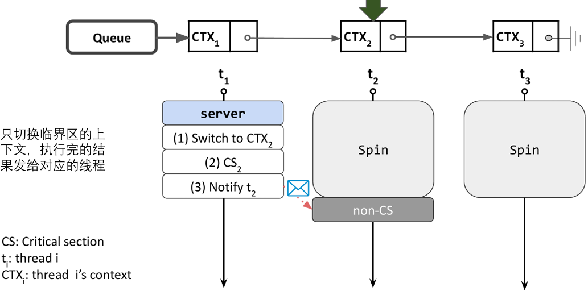
            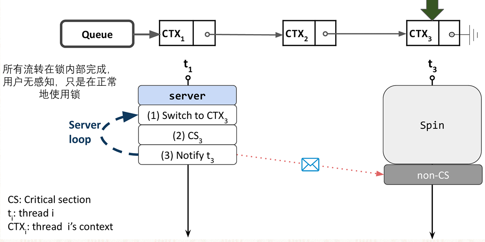

    *   **缺点**：大部分程序都不太容易修改为这种模式

*   **破坏的必要条件**：不允许持有并等待

    *   **实现方法**：一次性申请所有资源

    *   **说明**：线程在执行前一次性申请所有需要的资源，要么全部申请成功，要么一个都不申请

        *   使用`trylock`非阻塞尝试获取所有锁，失败则释放已获取的锁并重试

    *   **问题**：运气很差时可能出现如此往复，但运气不会一直这么差

    *   代码

        ```
        while(true) {
            if(trylock(A) == SUCC) {    // trylock非阻塞，立即返回成功或失败
                if(trylock(B) == SUCC) {
                    // 临界区代码
                    // ...
                    unlock(B);
                    unlock(A);
                    break;
                } else {
                    unlock(A); // 无法获取B，那么释放A
                }
            }
        }
        ```

*   **破坏的必要条件**：资源允许抢占

    *   **实现方法**：支持资源抢占与回滚

    *   **说明**：当线程申请的资源被其他线程持有时，可以强行抢占该资源，同时让持有资源的线程回滚到之前的状态

        *   适用于易于保存和恢复的场景

*   **破坏的必要条件**：打破循环等待

    *   **实现方法**：按固定顺序获取资源

    *   **说明**：对所有资源进行全局编号，要求所有线程必须按照编号递增的顺序申请资源

        *   任意时刻，持有最大编号资源的线程可以继续执行，不会出现循环等待

##### 死锁避免（**运行时避免）**

*   **核心思想**：在运行时动态检查资源分配请求是否会导致系统进入不安全状态，如果会则拒绝该请求，保证系统始终处于安全状态。
*   **安全状态**：存在一个线程执行序列（安全序列），按照该序列执行，所有线程都能顺利完成。
*   **经典算法**：银行家算法。

### 9.7.2 银行家算法

#### 基本概念

银行家算法是最经典的死锁避免算法

**核心思想**：模拟银行贷款的审批流程

*   银行家拥有一定数量的资金

*   客户申请贷款：银行家预演如果批准贷款是否会导致自己无法收回所有资金

    *   如果会则拒绝贷款

#### 算法核心数据结构

银行家算法需要维护以下四个核心数据结构：

1.  **最大需求量矩阵**：每个线程对各类资源的最大需求数量。
2.  **已分配资源矩阵**：每个线程已经持有的各类资源数量。
3.  **剩余需求矩阵**：每个线程还需要的各类资源数量（最大需求量 - 已分配资源）。
4.  **全局可用资源向量**：系统当前剩余的各类资源数量。

#### 安全性检查步骤

安全性检查是银行家算法的核心，用于判断当前系统状态是否安全：

1.  创建临时可用资源向量，初始值等于全局可用资源向量。
2.  找到一个未执行且剩余需求小于等于临时可用资源的线程。
3.  模拟执行该线程，执行完成后释放其持有的所有资源，更新临时可用资源向量。
4.  重复步骤2-3，直到所有线程都被执行（系统安全）或找不到可执行的线程（系统不安全）。

#### 算法示例

**初始状态**：系统有A、B两类资源，各有3个和11个；有P1、P2、P3三个线程

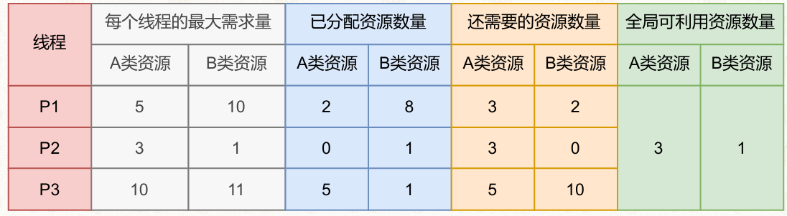

**安全性检查过程**：

1.  临时可用资源：A=3，B=1。

2.  检查线程：P1需要A=3、B=2（B不够）；P3需要A=5、B=10（都不够）；P2需要A=3、B=0（足够）。

3.  模拟执行P2，完成后释放资源：临时可用资源变为A=3+0=3，B=1+1=2
    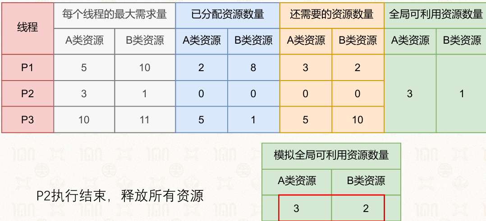

4.  检查剩余线程：P1需要A=3、B=2（足够）；P3需要A=5、B=10（不够）

5.  模拟执行P1，完成后释放资源：临时可用资源变为A=3+2=5，B=2+8=10

6.  检查剩余线程：P3需要A=5、B=10（足够）

7.  模拟执行P3，完成后释放资源：临时可用资源变为A=5+5=10，B=10+1=11

8.  所有线程执行完毕，系统安全，安全序列为P2→P1→P3

#### 不安全状态示例

如果强行将A类资源分配给P1：

*   P1已分配资源变为A=5、B=8，剩余需求变为A=0、B=2
*   全局可用资源变为A=0、B=1
*   此时没有任何线程的剩余需求小于等于可用资源，系统进入不安全状态，可能发生死锁

### 9.7.3 活锁

活锁是指线程没有被阻塞，一直在运行，但始终无法推进自己的任务，不断重复相同的操作

#### 活锁的产生原因

活锁通常由"不允许持有并等待"的死锁预防方法导致：

```
// proc_A的逻辑
while(true) {
    if(trylock(A) == SUCC) {
        if(trylock(B) == SUCC) {
            // 临界区代码
            unlock(B);
            unlock(A);
            break;
        } else {
            unlock(A); // 无法获取B，释放A并重试
        }
    }
}

// proc_B的逻辑
while(true) {
    if(trylock(B) == SUCC) {
        if(trylock(A) == SUCC) {
            // 临界区代码
            unlock(A);
            unlock(B);
            break;
        } else {
            unlock(B); // 无法获取A，释放B并重试
        }
    }
}
```

*   **活锁触发**

    *   proc\_A成功获取A，同时proc\_B成功获取B
    *   proc\_A尝试获取B失败，释放A
    *   proc\_B尝试获取A失败，释放B
    *   ※下一轮循环，proc\_A再次获取A，proc\_B再次获取B，重复上述过程。

#### 活锁与死锁的区别

| 对比维度  | 死锁     | 活锁                      |
| ----- | ------ | ----------------------- |
| 线程状态  | 永久阻塞   | 持续运行                    |
| CPU占用 | 不占用CPU | 占用大量CPU                 |
| 自行恢复  | 不能     | 大概率可以（运气好时某个线程能同时获取两个锁） |


### 9.7.4 优先级反转

优先级反转是实时系统中常见的问题，指高优先级线程被低优先级线程阻塞，导致高优先级线程的执行时间无法保证。

#### 优先级反转的产生过程

假设系统有三个线程，优先级P1 > P2 > P3

1.  t1时刻：低优先级线程P3开始执行，成功获取共享资源I
2.  t2时刻：高优先级线程P1开始执行，抢占P3的CPU
3.  t3时刻：P1尝试获取资源I，但I已被P3持有，P1阻塞等待
4.  t4时刻：中优先级线程P2开始执行，抢占P3的CPU
5.  t5时刻：P2执行完毕，P3恢复执行，释放资源I
6.  t6时刻：P1获取资源I，继续执行

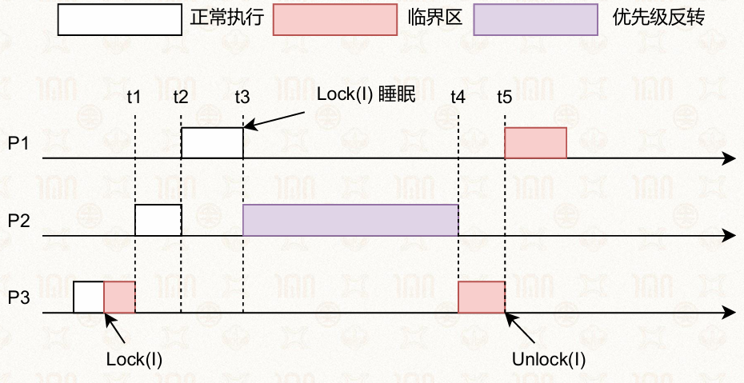

**问题**：高优先级线程P1的执行被中优先级线程P2延迟，P1的实际优先级相当于降到了P2的水平

#### 解决方案：优先级继承协议

优先级继承协议是解决优先级反转的标准方法：

*   当低优先级线程持有高优先级线程需要的资源时，临时将低优先级线程的优先级提升到等待该资源的最高优先级线程的优先级
*   低优先级线程释放资源后，恢复其原来的优先级

**执行过程**：

1.  t1时刻：P3执行，获取资源I。
2.  t2时刻：P1执行，尝试获取资源I失败，阻塞
3.  t3时刻：P3继承P1的优先级，变为高优先级
4.  t4时刻：P2开始执行，但优先级低于继承后的P3，无法抢占CPU
5.  t5时刻：P3执行完毕，释放资源I，恢复原来的优先级
6.  t6时刻：P1被唤醒，获取资源I，继续执行

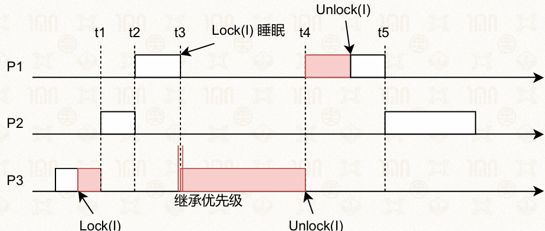

**优点**

优先级继承协议保证了高优先级线程不会被中优先级线程阻塞，确保了实时任务的执行时间
