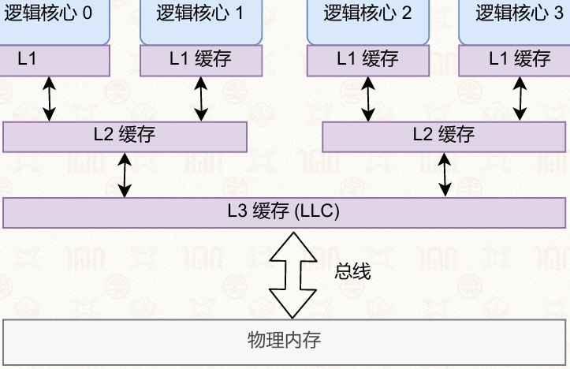
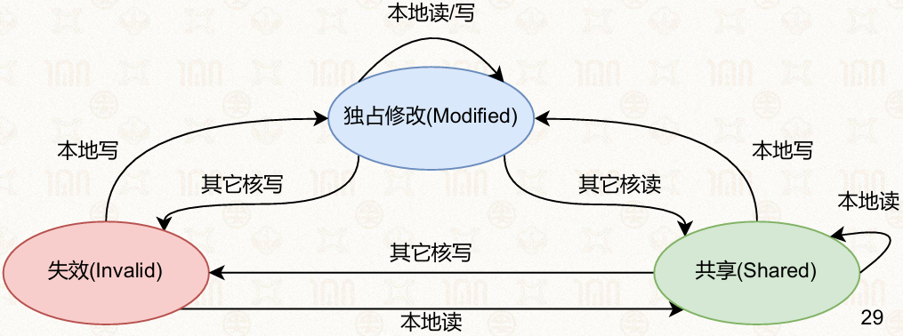

# 10章 多核与多处理器
## 10.1 多核性能问题
### 10.1.1 多核系统的两类核心挑战
#### 正确性保证
- 多核心并行访问共享资源产生竞争条件
- 需同步原语保证数据一致性
- 同步原语引入死锁、活锁、优先级反转等问题
#### 性能保证
- 多核硬件存在缓存一致性、非一致内存访问特性
- 同步原语与数据布局设计影响系统可扩展性
- 糟糕实现导致性能随核心数增加断崖式下跌
### 10.1.2 并行加速比的理论上限：阿姆达尔定律
#### 核心公式
$$
加速比 S = \frac{1}{(1-p) + \frac{p}{n}}
$$
- $p$：可并行执行代码占比
- $n$：CPU核心数量
- 极限情况： $n\to\infty$ 时，$S_{max} = \frac{1}{1-p}$，串行部分决定性能天花板
#### 场景示例
- 高并行场景：数组元素独立计算，加速比接近核心数
- 低并行场景：递推计算依赖前序结果，加速比接近1
### 10.1.3 自旋锁的可扩展性断崖
#### 概念
- 普通自旋锁存在可扩展性断崖：核心数增加到一定程度，系统吞吐量不升反降
#### 微基准测试场景
- 多线程竞争同一全局自旋锁，对共享计数器执行加1操作
#### 问题本质
- 根源：单一缓存行的高频竞争
- 所有核心访问锁变量所在的同一缓存行
- CAS原子操作触发缓存一致性协议，使其他核心缓存行失效
- 多核心同时自旋产生大量缓存失效请求，占用总线带宽
- 核心越多竞争越激烈，总线通信开销指数级增长

## 10.2 缓存一致性
### 10.2.1 多核缓存架构与一致性挑战
#### 多核多级缓存结构
- 分层缓存设计：距离CPU越近速度越快、容量越小
- 读操作：逐层向下查找，未命中则从内存读取并缓存
- 写操作：直写/写回策略，写入高速缓存，替换时写回
#### 多核的简单解决方案和问题
- 简单方案：共享缓存设计
- 问题：高速缓存成为瓶颈、单点竞争；硬件分布困难，访问速度慢
#### 多级缓存的结构
- 每个核心私有L1 Cache
- 多个核心共享L2 Cache
- 所有核心共享末级高速缓存（LLC）

#### 非一致缓存访问（NUCA）
- 不同核心访问同一LLC不同物理区域延迟不同，距离越近速度越快
#### 缓存一致性问题的产生
- 同一内存地址数据被多个核心私有缓存同时缓存，某核心修改后其他副本失效
- 无一致性保证会导致不同核心读取同一地址得到不同值
#### 缓存一致性协议核心思路
- 为每个缓存行标记状态
- 核心间通过通信协调状态迁移
- 所有读写操作遵循协议流程
#### 主流的缓存一致性协议
- 窥探式协议：所有核心监听总线广播
- 目录式协议：通过全局目录统一管理
### 10.2.2 MSI缓存一致性协议
#### 原理
以缓存行三种核心状态命名，通过状态动态迁移保证数据一致性

#### 独占修改（Modified, M）
- 含义：核心独占缓存行，数据已修改，与物理内存不一致
- 本地权限：可读可写，无需通知其他核心
- 状态迁移：其他CPU读→写回内存，自身转共享；其他CPU写→自身转失效
#### 共享（Shared, S）
- 含义：多核心同时持有有效副本，数据与物理内存一致
- 本地权限：仅可读，不可直接写入
- 状态迁移：本地CPU写→通知其他核心副本失效，自身转独占修改；其他CPU写→自身转失效
#### 失效（Invalid, I）
- 含义：本地缓存行失效，内容不可信，不能直接访问
- 本地权限：不可直接读写，需先获取最新数据
- 状态迁移：本地CPU读→获取最新数据，转共享；本地CPU写→获取数据并通知其他核心失效，转独占修改
#### 关键点
- M状态是唯一允许写且不通知其他核的状态
- M→S需将修改写回内存
- S写升级到M必须先让所有其他核拷贝失效
### 10.2.3 目录式缓存一致性
#### 概念
- 窥探式协议依赖总线广播，核心增多时通信开销急剧上升
- 目录式协议通过全局共享目录统一管理缓存行状态，适用于大规模多核系统
#### 全局目录项结构
- 脏位：1位，标记缓存行是否被修改
- 向量位：二进制位向量，记录缓存行拥有者，每一位对应一个CPU核心
#### 写操作完整流程（示例：3个CPU，CPU0修改变量X）
- 初始状态：CPU0/1/2均缓存X，状态共享；目录脏位0，向量位111
1. CPU0发起写请求，向全局目录申请独占权限
2. 目录查询向量位，得知CPU1、CPU2持有副本
3. 目录向CPU1、CPU2发送失效指令
4. CPU1、CPU2执行失效并回复确认
5. 目录收到所有确认后，脏位置1，向量位更新为100，回复CPU0可独占修改
6. CPU0将缓存行改为独占修改，执行写入
#### 读操作完整流程（示例：3个CPU，CPU0读取变量X，本地缓存已失效）
- 初始状态：CPU1独占持有X，状态独占修改；CPU0、CPU2缓存失效；目录脏位1，向量位010
1. CPU0发起读请求，向全局目录申请数据
2. 目录查询向量位，得知CPU1为唯一持有者且数据为脏
3. 目录向CPU1发送降级指令，要求转共享并发送最新数据
4. CPU1将数据发送给CPU0，自身转共享，向目录回复确认
5. 目录更新向量位为110，脏位清零；CPU0转共享
#### 目录式协议的特点
- 避免全总线广播，核心数越多通信效率优势越明显
- 全局目录本身为性能瓶颈，高并发下目录访问竞争限制扩展性
- 一致性过程对上层软件透明，但缓存行竞争的性能开销真实存在

## 10.3 多核性能可扩展性
### 10.3.1 可扩展性低下的硬件根源
#### 自旋锁的竞争模型
- 普通自旋锁所有操作围绕全局锁变量展开，竞争线程持续对该变量所在缓存行执行写操作
- 每次CAS原子写触发缓存一致性协议，使其他核心对应缓存行失效
- 等待线程持续循环CAS，持续发送缓存失效请求，塞满系统互联网络
### 10.3.2 回退锁（Back-off Lock）
#### 核心思路：降低锁的竞争频率
- 线程获取锁失败后主动等待一段时间再重试，减少单位时间CAS操作次数
#### 基础实现
- 获取锁失败时调用back_off等待指定时间后重试
#### 固定回退的缺陷
- 所有线程固定等待时间，出现“同步重试”问题，再次引发集中竞争
#### 优化的回退策略
1. 随机回退：等待时间随机取值，打散竞争峰值
2. 指数回退：失败后等待时间翻倍，自适应降低竞争频率
#### 优缺点
- 优点：实现简单，低竞争场景开销极小
- 局限性：未从根本解决全局缓存行竞争，高并发下优化效果饱和
### 10.3.3 MCS锁
#### 核心设计思想：将全局单点竞争转化为分布式队列等待
- 关键路径避免单一缓存行高度竞争，消除高频自旋竞争
#### 核心设计思路
- 每个申请锁的线程维护私有队列节点，按缓存行对齐，各自占据独立缓存行
- 等待节点通过链表组成FIFO等待队列，全局锁仅维护队尾指针
- 等待线程自旋在本地节点标志位，等待前一个线程释放锁时唤醒
- 锁传递沿队列依次进行，仅涉及两个节点缓存行操作，不触发全局缓存失效
#### 数据结构定义
- MCS_node：私有等待节点，含next指针、flag标志位，按缓存行对齐
- MCS_lock：全局锁结构，仅维护tail队尾指针
- 常量：WAITING（等待中）、GRANTED（已授权）
#### 加锁操作
- 通过atomic_XCHG原子交换更新队尾，获取旧队尾节点
- 队列非空：链接到旧队尾后，自旋等待本地flag变为GRANTED
- 队列为空：直接获取锁成功
#### 解锁操作
- 无后继节点：尝试CAS将队尾从自己置为空，成功则返回；失败则等待后继指针设置完成
- 有后继节点：将锁授权传递给下一个节点，置其flag为GRANTED
#### 性能分析
- 核心优势：等待线程多数时间仅读写本地节点变量，各自独立缓存行自旋，消除缓存失效风暴
- 仅存竞争点：加入队列时的atomic_XCHG操作竞争全局队尾指针缓存行，且每个线程仅执行一次
- 可扩展性表现：核心数增长时吞吐量下降平缓，无断崖式下跌，大规模系统性能远超普通自旋锁
### 10.3.4 工业界实践：Linux QSpinlock
- 双路径设计：低竞争时用类普通自旋锁（快速路径，低延迟）；高竞争时切换为类MCS队列模式（慢速路径，高可扩展性）
- 优点：兼顾低延迟与高可扩展性
### 10.3.5 对程序员的启发
1. 避免单一缓存行高频写入竞争，将集中式竞争拆解为分布式、本地化数据结构
2. 主动规避虚假共享，频繁修改字段注意缓存行对齐
3. 数据结构设计适配硬件特性，分散频繁写字段到不同缓存行
4. 同步原语按需选择：低竞争短临界区用普通自旋锁；高并发多核心用可扩展锁

## 10.4 虚假共享
### 10.4.1 基本定义
- 虚假共享：多核心分别修改逻辑独立变量，但变量处于同一缓存行内，导致缓存一致性协议频繁介入，引发缓存行失效重载，造成性能损耗与总线拥堵
- 核心矛盾：共享的不是变量本身，而是变量所在的缓存行存储空间
### 10.4.2 产生原因
#### 硬件基础
- 缓存以缓存行为最小传输单位，通常64字节
- 同页表内连续分配内存，导致逻辑独立变量物理地址相邻
#### 典型场景示意
- 连续数组元素、连续定义的整型变量易处于同一缓存行
- 不同核心修改同缓存行内不同地址时，触发缓存一致性同步开销
### 10.4.3 致命危害
#### 无谓的缓存一致性同步通讯
- 大量CPU时间浪费在总线仲裁和缓存同步内耗，而非有效计算
#### 可能发生写覆盖（数据竞争）
- 无原子操作或锁保护时，频繁缓存行失效导致数据可见性问题，出现逻辑写覆盖异常

## 10.6 内存一致性模型
### 10.6.1 问题引入：纯软件互斥算法的失效
- LockOne算法在真实硬件中失效：CPU允许无依赖访存操作乱序执行，线程可能先读对方flag再写自己的flag，导致同时进入临界区
- 缓存一致性≠内存一致性：前者保证同一地址共识，后者保证不同地址访存顺序
### 10.6.2 内存一致性模型的分类
| 模型              | 保证强度 | 典型硬件               |
| ----------------- | -------- | ---------------------- |
| 严格一致性        | 最强     | 理想化，实际不存在     |
| 顺序一致性        | 强       | 理论基准，部分早期多核 |
| TSO（总存储顺序） | 中等     | x86/64（Intel/AMD）    |
| 弱序一致性        | 最弱     | ARM、PowerPC、移动端   |
#### 性能与实现复杂度
- 保证越强，硬件实现成本越高、性能越低
- 保证越弱，硬件越简单、性能越高，编程复杂度上升
#### 代码
```c
// 线程0
while (TRUE) {
    flag[0] = TRUE;
    while (flag[1] == TRUE); // 等待对方释放
    // 临界区
    flag[0] = FALSE;
}

// 线程1
while (TRUE) {
    flag[1] = TRUE;
    while (flag[0] == TRUE); // 等待对方释放
    // 临界区
    flag[1] = FALSE;
}
```
### 10.6.3 严格一致性模型
#### 核心规则
- 任意内存地址读操作都能读到最近一次写入的值
- 所有访存操作全局执行顺序与真实物理时间完全一致
#### 行为特点
- 所有核心对所有写操作可见性完全同步，无延迟
#### 示例
- 两线程分别写各自flag再读对方flag，唯一结果为A=1, B=1
#### 优缺点
- 优点：编程模型直观
- 缺点：硬件实现代价极高，抵消乱序执行收益，无商用CPU采用
### 10.6.4 顺序一致性模型（Sequential Consistency）
#### 核心规则
- 不要求操作按真实时间全局可见
- 所有核心执行结果等价于某个全局顺序执行的结果
- 全局顺序中，每个核心自身读写顺序与程序顺序一致
#### 特点
- 不要求全局全序与真实物理时间对应，只要存在合法全序即可
#### 读写顺序保证
- 保证所有地址的读-读、读-写、写-写、写-读顺序
#### 示例
- flag读写场景存在三种合法结果：A=0,B=1；A=1,B=1；A=1,B=0
- 禁止结果：A=0,B=0（违反程序读写顺序）
#### 优缺点
- 优点：编程模型简单直观，全局访存顺序一致
- 缺点：限制CPU乱序优化能力，主流CPU未采用
### 10.6.5 TSO 一致性模型（Total Store Ordering，全存储排序）
#### 核心规则
- 保证读读、读写、写写三类操作顺序与程序一致
- 仅允许写-读操作重排：写操作延迟提交，后续读操作可越过前面的写提前执行
#### 读写顺序保证
- 保证：读读、读写、写写
- 不保证：写读
#### TSO写读重排的硬件原理
- 来源于存储缓冲区：写操作先写入存储缓冲区，异步刷入缓存；读操作绕过缓冲区直接读缓存
- 写操作在缓冲区内部保持顺序，因此写写顺序得到保证
#### 示例：写读重排的效果
- flag读写场景允许出现A=0, B=0的结果，导致互斥失效
#### 典型应用
- x86/64架构采用，平衡性能与易用性
### 10.6.6 弱序一致性模型
#### 核心规则
- 不保证任何不同地址访存操作的执行顺序，所有读写都可能被硬件乱序重排
- 仅显式内存屏障能强制保证访存顺序
#### 设计逻辑
- 顺序保证成本从硬件转移到软件
- 硬件逻辑简化，并行性能更高；软件需手动插入内存屏障，编程负担上升
#### 典型失效场景：数据与标志位分离
- proc_A先写数据再写就绪标志，弱序下可能标志先提交、数据未提交
- proc_B读到标志就绪后读取数据，得到过期值，引发逻辑错误
- 该场景在TSO下安全（TSO保证写写顺序）
#### 为什么要弱序一致性模型
- 硬件逻辑更简单，处理器复杂度、工艺、成本、功耗更低
- 是ARM架构的权衡结果
### 10.6.7 内存屏障（Memory Barrier / Fence）
#### 概念与作用
- 定义：解决弱内存模型下顺序问题的硬件原语
- 作用：屏障之前所有访存操作全部完成并全局可见后，屏障之后的访存操作才能开始
#### 常见类型与适用场景
1. 写屏障：保证屏障前后写操作顺序
2. 读屏障：保证屏障前后读操作顺序
3. 全屏障：同时保证所有读写操作顺序
#### 修复示例
- 数据-标志场景：写端加写屏障保证数据先于标志提交；读端加读屏障保证读到标志后再读数据
#### 补充说明
- 仅针对无显式依赖的访存操作；有依赖操作硬件自动保证顺序
- 性能开销大，仅在必要同步点使用
### 10.6.8 系统软件开发者视角
1. 内存模型不透明，不了解内存模型编写的并发代码会出现偶发错误
2. 标准同步原语内部已实现内存屏障：加锁相当于进入屏障，解锁相当于退出屏障
3. 实践原则：常规业务优先使用封装完善的同步原语；仅实现底层同步原语、高性能无锁数据结构时才手动处理内存一致性

## 10.7 非一致内存访问
### 10.7.1 NUMA 的起源与定义
#### 问题
- UMA架构瓶颈：单内存控制器竞争激烈；多插槽物理距离差异导致访问延迟不同
#### NUMA（非一致内存访问，Non-Uniform Memory Access）
- 核心思想：将物理内存划分为多个节点，每个节点含CPU核心和本地内存控制器
- CPU访问本地内存最快，访问远程内存较慢，跳数越多延迟越高、带宽越低
- 常见场景：多插槽服务器；部分单处理器众核系统
### 10.7.2 NUMA 访存时延差异
#### 跳数（Hop）
| 访问类型     | Intel Xeon（80 核）延迟（Cycles） | AMD Opteron（64 核）延迟（Cycles） |
| ------------ | --------------------------------- | ---------------------------------- |
| 0 跳（本地） | Load: 117 / Store: 108            | Load: 228 / Store: 256             |
| 1 跳（远程） | Load: 271 / Store: 304            | Load: 419 / Store: 463             |
| 2 跳（更远） | Load: 372 / Store: 409            | Load: 498 / Store: 544             |
- 结论：跳数越多延迟越高，远程访问延迟为本地2~3倍以上
### 10.7.3 系统视角下的 NUMA 拓扑
- 操作系统可感知NUMA拓扑，通过numactl --hardware查看节点CPU分配与距离矩阵
- 距离矩阵数值越小代表访问延迟越低
### 10.7.4 NUMA 感知的锁设计（以cohort锁为例）
#### 核心思路
- 一段时间内将锁的竞争和传递限制在同一NUMA节点内部，减少跨节点缓存一致性流量和访存延迟
#### 工作流程
1. 获取本地锁：线程先尝试获取所在NUMA节点的本地锁
2. 获取全局锁：成功获取本地锁后，才能竞争全局锁
3. 锁持有与传递：
   - 成功获取全局锁的线程进入临界区
   - 释放锁时，全局锁先传递给当前节点内下一个本地等待者
   - 当前节点无等待者时，才传递给其他节点等待者
- 策略优势：局部性优先，减少跨节点通信；减少远程缓存行访问
### 10.7.5 系统软件开发者视角下的 NUMA
- NUMA拓扑暴露给操作系统，操作系统可暴露给软件
- 软件可通过libnuma等接口分配本地内存
- 远程访问带来严重时延/带宽瓶颈
- 进程调度避免跨NUMA结点迁移
- 无NUMA感知的应用，尽可能保证内存分配的本地性

